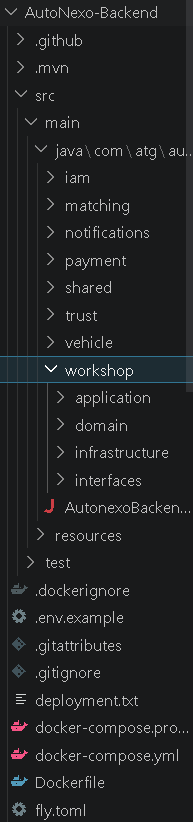
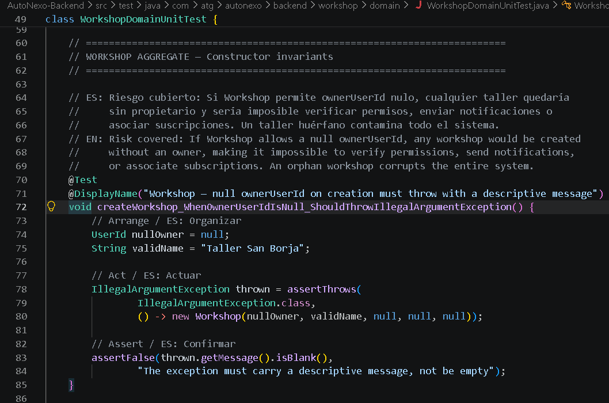
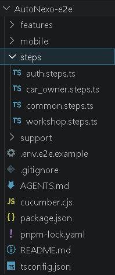
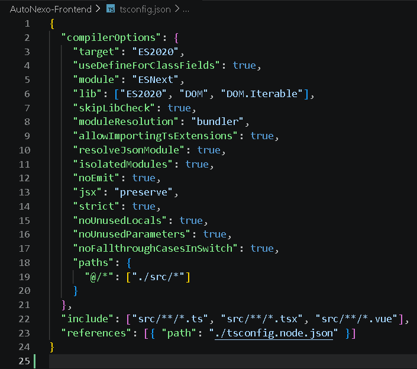
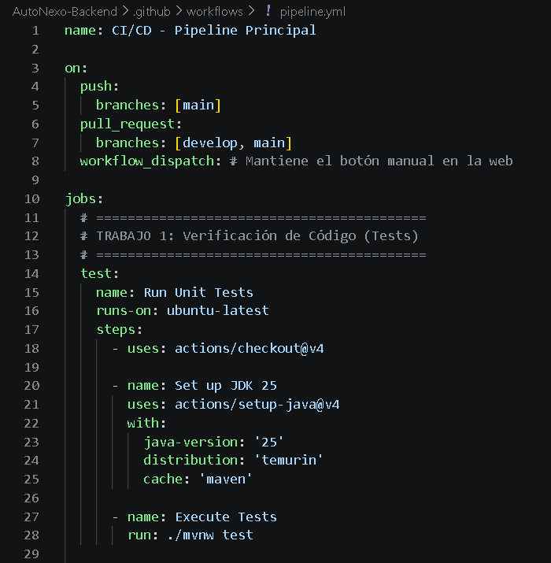
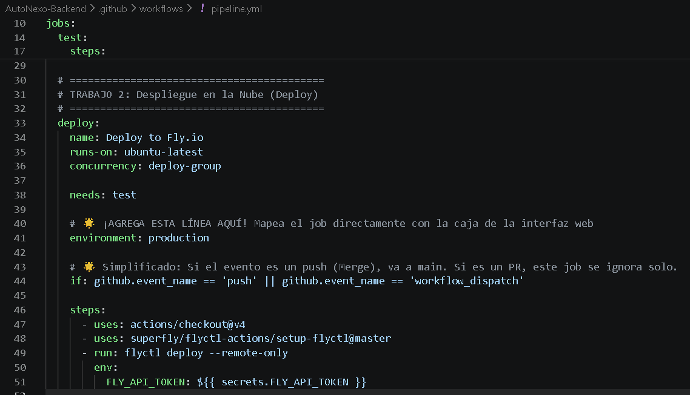
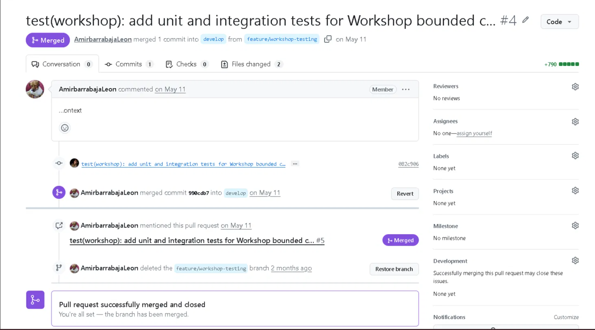
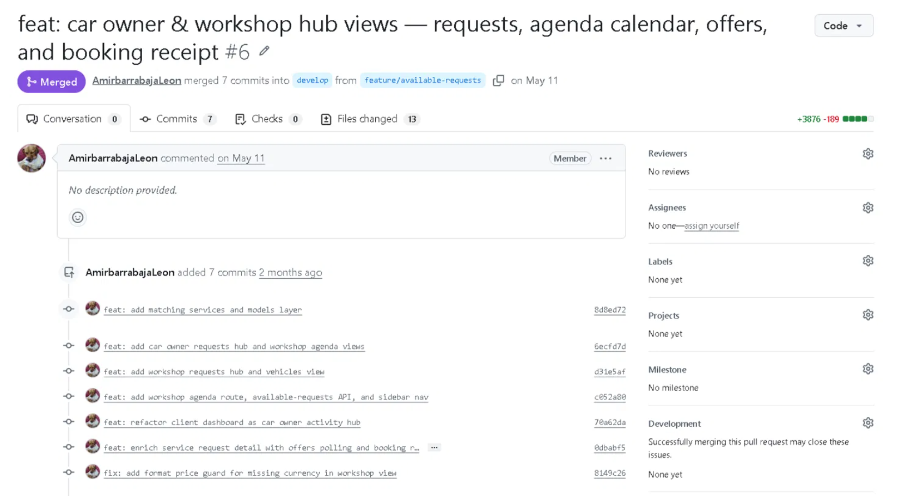
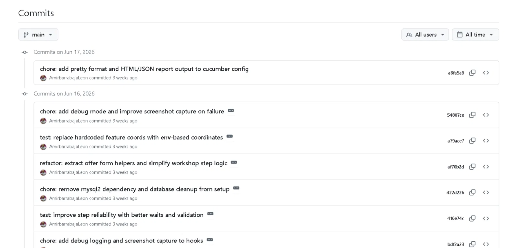
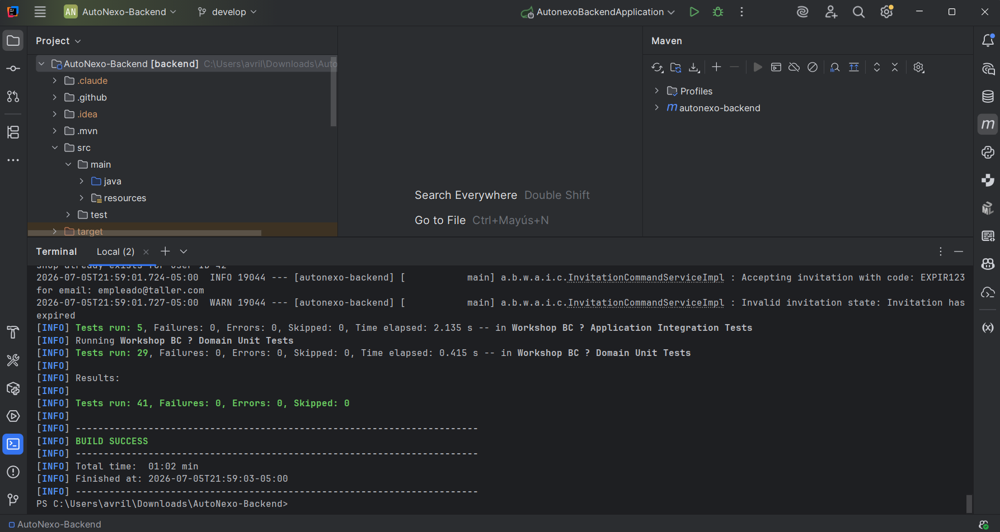

# INFORME DE TRABAJO FINAL

## Carátula

<p align="center">
    </img><br>
    <strong style="font-size: 1.7em;">Universidad Peruana de Ciencias Aplicadas</strong><br>
    <strong style="font-size: 1.7em;">Ingeniería de Software</strong><br>
    <strong>Periodo: 2026-10</strong>
    <strong>1ASI0732 |  Diseño de Experimentos de Ingeniería de Software</strong><br>
    <strong>NRC : 16879</strong>
    <strong>Docente: Alex Humberto Sánchez Ponce</strong><br>
    <br><strong>Informe del Trabajo Final</strong>
</p>

<p align="center">
    <strong>Startup: ATG</strong><br>
    <strong>Producto: Autonexo</strong>
</p>

<div style="text-align:center;">
    <h3>Team Members:</h3>
    <table align="center">
        <tr>
            <th style="text-align:center;">Member</th>
            <th style="text-align:center;">Code</th>
        </tr>
       <tr>
    <td>Cruz Ibarra, Victor Andres</td>
    <td>u202311053</td>
</tr>
<tr>
    <td>Solis Chang, Santiago Valentino</td>
    <td>u20231b475</td>
</tr>
<tr>
    <td>Navarro Chang, Alicia Avril</td>
    <td>u20231d637</td>
</tr>
<tr>
    <td>Vidal Castro, Miguel Angel</td>
    <td>u202314186</td>
</tr>
<tr>
    <td>Castro Sanchez, Amir Gabriel</td>
    <td>u202310680</td>
</tr>
    </table>
</div>

<p align="center">
    <strong>Mayo, 2026</strong>
</p>
<br>

<div style="page-break-after: always;"></div>

## Registro de Versiones del Informe

| Versión | Fecha | Autor | Descripción |
|---------|-------|-------|-------------|
| 1.0 | 11 de mayo | Cruz, V.; Solis, S.; Navarro, A.; Vidal, M.; Castro, A. | • Estructura y esqueleto del informe<br>• Definición de capítulos principales (3 partes)<br>• Carátula con información de startup y equipo<br>• Student Outcome y ABET SO 4<br>• Capítulo I: Introducción, Startup Profile, Solution Profile, Lean UX<br>• Capítulo II: Requirements Elicitation & Analysis<br>• Capítulo III: Requirements Specification<br>• Capítulo IV: Product Design<br>• Capítulo V: Product Implementation<br>• Capítulo VI: Product Verification & Validation<br>• Capítulo VII: DevOps Practices |

<div style="page-break-after: always;"></div>

## Project Report Collaboration Insights

[Insertar insights de colaboración]

<div style="page-break-after: always;"></div>

## Contenido

- [INFORME DE TRABAJO FINAL](#informe-de-trabajo-final)
  - [Carátula](#carátula)
  - [Registro de Versiones del Informe](#registro-de-versiones-del-informe)
  - [Project Report Collaboration Insights](#project-report-collaboration-insights)
  - [Contenido](#contenido)
  - [Student Outcome](#student-outcome)
- [PARTE I: AS-IS SOFTWARE PROJECT](#parte-i-as-is-software-project)
  - [Capítulo I: Introducción](#capítulo-i-introducción)
    - [1.1. Startup Profile](#11-startup-profile)
      - [1.1.1. Descripción de la Startup](#111-descripción-de-la-startup)
      - [1.1.2. Perfiles de Integrantes del Equipo](#112-perfiles-de-integrantes-del-equipo)
    - [1.2. Solution Profile](#12-solution-profile)
      - [1.2.1. Antecedentes y Problemática](#121-antecedentes-y-problemática)
      - [**Who (¿Quién?)**](#who-quién)
      - [**What (¿Qué?)**](#what-qué)
      - [**Where (¿Dónde?)**](#where-dónde)
      - [**When (¿Cuándo?)**](#when-cuándo)
      - [**Why (¿Por qué?)**](#why-por-qué)
      - [**How (¿Cómo?)**](#how-cómo)
      - [**How Much (¿Cuánto?)**](#how-much-cuánto)
      - [1.2.2. Lean UX Process](#122-lean-ux-process)
        - [1.2.2.1. Lean UX Problem Statements](#1221-lean-ux-problem-statements)
        - [1.2.2.2. Lean UX Assumptions](#1222-lean-ux-assumptions)
    - [**Business Assumptions**](#business-assumptions)
    - [**User Assumptions**](#user-assumptions)
        - [1.2.2.3. Lean UX Hypothesis Statements](#1223-lean-ux-hypothesis-statements)
    - [**Hypothesis 01**](#hypothesis-01)
    - [**Hypothesis 02**](#hypothesis-02)
    - [**Hypothesis 03**](#hypothesis-03)
    - [**Hypothesis 04**](#hypothesis-04)
        - [1.2.2.4. Lean UX Canvas](#1224-lean-ux-canvas)
    - [1.3. Segmentos Objetivo](#13-segmentos-objetivo)
    - [**Segmento objetivo #1: Propietarios**](#segmento-objetivo-1-propietarios)
    - [**Segmento objetivo #2: Mecánicos**](#segmento-objetivo-2-mecánicos)
  - [Capítulo II: Requirements Elicitation \& Analysis](#capítulo-ii-requirements-elicitation--analysis)
    - [2.1. Competidores](#21-competidores)
      - [2.1.1. Análisis Competitivo](#211-análisis-competitivo)
      - [2.1.2. Estrategias y Tácticas Frente a Competidores](#212-estrategias-y-tácticas-frente-a-competidores)
    - [2.2. Entrevistas](#22-entrevistas)
      - [2.2.1. Diseño de Entrevistas](#221-diseño-de-entrevistas)
      - [2.2.2. Registro de Entrevistas](#222-registro-de-entrevistas)
      - [2.2.3. Análisis de Entrevistas](#223-análisis-de-entrevistas)
    - [2.3. Needfinding](#23-needfinding)
      - [2.3.1. User Personas](#231-user-personas)
      - [2.3.2. User Task Matrix](#232-user-task-matrix)
      - [2.3.3. User Journey Mapping](#233-user-journey-mapping)
      - [2.3.4. Empathy Mapping](#234-empathy-mapping)
      - [2.3.5. As-is Scenario Mapping](#235-as-is-scenario-mapping)
    - [2.4. Ubiquitous Language](#24-ubiquitous-language)
  - [Capítulo III: Requirements Specification](#capítulo-iii-requirements-specification)
    - [3.1. To-Be Scenario Mapping](#31-to-be-scenario-mapping)
    - [3.2. User Stories](#32-user-stories)
    - [3.3. Product Backlog](#33-product-backlog)
    - [3.4. Impact Mapping](#34-impact-mapping)
  - [Capítulo IV: Product Design](#capítulo-iv-product-design)
    - [4.1. Style Guidelines](#41-style-guidelines)
      - [4.1.1. General Style Guidelines](#411-general-style-guidelines)
      - [4.1.2. Web Style Guidelines](#412-web-style-guidelines)
      - [4.1.3. Mobile Style Guidelines](#413-mobile-style-guidelines)
        - [4.1.3.1. iOS Mobile Style Guidelines](#4131-ios-mobile-style-guidelines)
        - [4.1.3.2. Android Mobile Style Guidelines](#4132-android-mobile-style-guidelines)
    - [4.2. Information Architecture](#42-information-architecture)
      - [4.2.1. Organization Systems](#421-organization-systems)
      - [4.2.2. Labeling Systems](#422-labeling-systems)
      - [4.2.3. SEO Tags and Meta Tags](#423-seo-tags-and-meta-tags)
      - [4.2.4. Searching Systems](#424-searching-systems)
      - [4.2.5. Navigation Systems](#425-navigation-systems)
    - [4.3. Landing Page UI Design](#43-landing-page-ui-design)
      - [4.3.1. Landing Page Wireframe](#431-landing-page-wireframe)
      - [4.3.2. Landing Page Mock-up](#432-landing-page-mock-up)
    - [4.4. Mobile Applications UX/UI Design](#44-mobile-applications-uxui-design)
      - [4.4.1. Mobile Applications Wireframes](#441-mobile-applications-wireframes)
      - [4.4.2. Mobile Applications Wireflow Diagrams](#442-mobile-applications-wireflow-diagrams)
      - [4.4.3. Mobile Applications Mock-ups](#443-mobile-applications-mock-ups)
      - [4.4.4. Mobile Applications User Flow Diagrams](#444-mobile-applications-user-flow-diagrams)
    - [4.5. Mobile Applications Prototyping](#45-mobile-applications-prototyping)
      - [4.5.1. Android Mobile Applications Prototyping](#451-android-mobile-applications-prototyping)
      - [4.5.2. iOS Mobile Applications Prototyping](#452-ios-mobile-applications-prototyping)
    - [4.6. Web Applications UX/UI Design](#46-web-applications-uxui-design)
      - [4.6.1. Web Applications Wireframes](#461-web-applications-wireframes)
      - [4.6.2. Web Applications Wireflow Diagrams](#462-web-applications-wireflow-diagrams)
      - [4.6.3. Web Applications Mock-ups](#463-web-applications-mock-ups)
      - [4.6.4. Web Applications User Flow Diagrams](#464-web-applications-user-flow-diagrams)
    - [4.7. Web Applications Prototyping](#47-web-applications-prototyping)
    - [4.8. Domain-Driven Software Architecture](#48-domain-driven-software-architecture)
      - [4.8.1. Software Architecture Context Diagram](#481-software-architecture-context-diagram)
      - [4.8.2. Software Architecture Container Diagrams](#482-software-architecture-container-diagrams)
      - [4.8.3. Software Architecture Components Diagrams](#483-software-architecture-components-diagrams)
    - [4.9. Software Object-Oriented Design](#49-software-object-oriented-design)
      - [4.9.1. Class Diagrams](#491-class-diagrams)
      - [4.9.2. Class Dictionary](#492-class-dictionary)
    - [4.10. Database Design](#410-database-design)
      - [4.10.1. Relational/Non-Relational Database Diagram](#4101-relationalnon-relational-database-diagram)
  - [Capítulo V: Product Implementation](#capítulo-v-product-implementation)
    - [5.1. Software Configuration Management](#51-software-configuration-management)
      - [5.1.1. Software Development Environment Configuration](#511-software-development-environment-configuration)
      - [5.1.2. Source Code Management](#512-source-code-management)
      - [5.1.3. Source Code Style Guide \& Conventions](#513-source-code-style-guide--conventions)
      - [5.1.4. Software Deployment Configuration](#514-software-deployment-configuration)
    - [5.2. Product Implementation \& Deployment](#52-product-implementation--deployment)
      - [5.2.1. Sprint Backlogs](#521-sprint-backlogs)
      - [5.2.2. Implemented Landing Page Evidence](#522-implemented-landing-page-evidence)
      - [5.2.3. Implemented Frontend-Web Application Evidence](#523-implemented-frontend-web-application-evidence)
      - [5.2.4. Acuerdo de Servicio - SaaS](#524-acuerdo-de-servicio---saas)
      - [5.2.5. Implemented Native-Mobile Application Evidence](#525-implemented-native-mobile-application-evidence)
      - [5.2.6. Implemented RESTful API and/or Serverless Backend Evidence](#526-implemented-restful-api-andor-serverless-backend-evidence)
      - [5.2.7. RESTful API Documentation](#527-restful-api-documentation)
      - [5.2.8. Team Collaboration Insights](#528-team-collaboration-insights)
    - [5.3. Video About-the-Product](#53-video-about-the-product)
- [PARTE II: VERIFICATION, VALIDATION \& PIPELINE](#parte-ii-verification-validation--pipeline)
  - [Capítulo VI: Product Verification \& Validation](#capítulo-vi-product-verification--validation)
    - [6.1. Testing Suites \& Validation](#61-testing-suites--validation)
  - [6.1.1 Core Entities Unit Tests](#611-core-entities-unit-tests)
    - [Relación de Unit Tests](#relación-de-unit-tests)
    - [Evidencia de ejecución](#evidencia-de-ejecución)
    - [Testing Suite Evidence for Sprint Review](#testing-suite-evidence-for-sprint-review)
  - [6.1.2 Core Integration Tests](#612-core-integration-tests)
    - [Relación de Integration Tests](#relación-de-integration-tests)
    - [Evidencia de ejecución](#evidencia-de-ejecución-1)
    - [Testing Suite Evidence for Sprint Review](#testing-suite-evidence-for-sprint-review-1)
      - [6.1.3. Core Behavior-Driven Development](#613-core-behavior-driven-development)
    - [Features implementados](#features-implementados)
    - [Escenarios en Gherkin](#escenarios-en-gherkin)
    - [Step Definitions implementados](#step-definitions-implementados)
    - [Evidencia de BDD](#evidencia-de-bdd)
    - [Testing Suite Evidence for Sprint Review](#testing-suite-evidence-for-sprint-review-2)
      - [6.1.4. Core System Tests](#614-core-system-tests)
    - [Alcance de las pruebas de sistema](#alcance-de-las-pruebas-de-sistema)
    - [Preparación automatizada del entorno](#preparación-automatizada-del-entorno)
    - [Testing Suite Evidence for Sprint Review](#testing-suite-evidence-for-sprint-review-3)
    - [6.2. Static Testing \& Verification](#62-static-testing--verification)
      - [6.2.1. Static Code Analysis](#621-static-code-analysis)
        - [6.2.1.1. Coding Standard \& Code Conventions](#6211-coding-standard--code-conventions)
    - [Convenciones generales](#convenciones-generales)
    - [Backend — Java + Spring Boot + DDD](#backend--java--spring-boot--ddd)
    - [Frontend — Vue + TypeScript](#frontend--vue--typescript)
    - [E2E — Cucumber + Playwright](#e2e--cucumber--playwright)
        - [6.2.1.2. Code Quality \& Code Security](#6212-code-quality--code-security)
    - [Calidad de código](#calidad-de-código)
    - [Seguridad de código](#seguridad-de-código)
    - [Evidencia sugerida](#evidencia-sugerida)
      - [6.2.2. Reviews](#622-reviews)
    - [Estrategia de revisión aplicada](#estrategia-de-revisión-aplicada)
    - [Evidencia de Pull Requests y colaboración](#evidencia-de-pull-requests-y-colaboración)
    - [Evidencia de revisión](#evidencia-de-revisión)
    - [6.2. Static Testing \& Verification](#62-static-testing--verification-1)
      - [6.2.1. Static Code Analysis](#621-static-code-analysis-1)
        - [Evidencia técnica del backend](#evidencia-técnica-del-backend)
        - [Evidencia técnica del frontend](#evidencia-técnica-del-frontend)
        - [Evidencia técnica del pipeline](#evidencia-técnica-del-pipeline)
        - [Capturas recomendadas](#capturas-recomendadas)
        - [6.2.1.1. Coding Standard \& Code Conventions](#6211-coding-standard--code-conventions-1)
        - [Convenciones generales del proyecto](#convenciones-generales-del-proyecto)
        - [Backend: Java + Spring Boot + DDD](#backend-java--spring-boot--ddd)
        - [Frontend: Vue + TypeScript](#frontend-vue--typescript)
        - [BDD/E2E: Cucumber + Playwright](#bdde2e-cucumber--playwright)
        - [Evidencias](#evidencias)
        - [6.2.1.2. Code Quality \& Code Security](#6212-code-quality--code-security-1)
        - [Code Quality](#code-quality)
        - [Code Security](#code-security)
        - [Seguridad en pruebas E2E](#seguridad-en-pruebas-e2e)
        - [Capturas recomendadas](#capturas-recomendadas-1)
      - [6.2.2. Reviews](#622-reviews-1)
        - [Estrategia de revisión](#estrategia-de-revisión)
        - [Pull Requests y commits relevantes](#pull-requests-y-commits-relevantes)
        - [Evidencias](#evidencias-1)
        - [Conclusión de reviews](#conclusión-de-reviews)
    - [6.3. Validation Interviews](#63-validation-interviews)
      - [6.3.1. Diseño de Entrevistas](#631-diseño-de-entrevistas)
        - [Objetivo general](#objetivo-general)
        - [Objetivos específicos](#objetivos-específicos)
        - [Perfil de entrevistados buscados](#perfil-de-entrevistados-buscados)
        - [Modalidad de entrevista](#modalidad-de-entrevista)
        - [Preguntas para propietarios de vehículos](#preguntas-para-propietarios-de-vehículos)
        - [Preguntas para mecánicos / representantes de talleres](#preguntas-para-mecánicos--representantes-de-talleres)
        - [Escala de evaluación sugerida](#escala-de-evaluación-sugerida)
      - [6.3.2. Registro de Entrevistas](#632-registro-de-entrevistas)
      - [6.3.3. Evaluaciones Según Heurísticas](#633-evaluaciones-según-heurísticas)
        - [Escala de severidad](#escala-de-severidad)
        - [Matriz de evaluación heurística](#matriz-de-evaluación-heurística)
        - [Resultado esperado de la evaluación](#resultado-esperado-de-la-evaluación)
    - [6.4. Auditoría de Experiencias de Usuario](#64-auditoría-de-experiencias-de-usuario)
      - [6.4.1. Auditoría Realizada](#641-auditoría-realizada)
        - [6.4.1.1. Información del Grupo Auditado](#6411-información-del-grupo-auditado)
        - [6.4.1.2. Cronograma de Auditoría Realizada](#6412-cronograma-de-auditoría-realizada)
        - [6.4.1.3. Contenido de Auditoría Realizada](#6413-contenido-de-auditoría-realizada)
        - [Criterios de evaluación utilizados](#criterios-de-evaluación-utilizados)
        - [Registro de hallazgos](#registro-de-hallazgos)
        - [Escala de severidad utilizada](#escala-de-severidad-utilizada)
      - [6.4.2. Auditoría Recibida](#642-auditoría-recibida)
        - [6.4.2.1. Información del Grupo Auditor](#6421-información-del-grupo-auditor)
        - [6.4.2.2. Cronograma de Auditoría Recibida](#6422-cronograma-de-auditoría-recibida)
        - [6.4.2.3. Contenido de Auditoría Recibida](#6423-contenido-de-auditoría-recibida)
        - [Categorías de hallazgos recibidos](#categorías-de-hallazgos-recibidos)
        - [6.4.2.4. Resumen de Modificaciones para Subsanar Hallazgos](#6424-resumen-de-modificaciones-para-subsanar-hallazgos)
        - [Tipos de acciones de subsanación](#tipos-de-acciones-de-subsanación)
        - [Conclusión de la auditoría UX](#conclusión-de-la-auditoría-ux)
  - [Capítulo VII: DevOps Practices](#capítulo-vii-devops-practices)
    - [7.1. Continuous Integration](#71-continuous-integration)
      - [7.1.1. Tools and Practices](#711-tools-and-practices)
      - [7.1.2. Build \& Test Suite Pipeline Components](#712-build--test-suite-pipeline-components)
    - [7.2. Continuous Delivery](#72-continuous-delivery)
      - [7.2.1. Tools and Practices](#721-tools-and-practices)
      - [7.2.2. Stages Deployment Pipeline Components](#722-stages-deployment-pipeline-components)
    - [7.3. Continuous Deployment](#73-continuous-deployment)
      - [7.3.1. Tools and Practices](#731-tools-and-practices)
      - [7.3.2. Production Deployment Pipeline Components](#732-production-deployment-pipeline-components)
    - [7.4. Continuous Monitoring](#74-continuous-monitoring)
      - [7.4.1. Tools and Practices](#741-tools-and-practices)
      - [7.4.2. Monitoring Pipeline Components](#742-monitoring-pipeline-components)
      - [7.4.3. Alerting Pipeline Components](#743-alerting-pipeline-components)
      - [7.4.4. Notification Pipeline Components](#744-notification-pipeline-components)
- [PARTE III: EXPERIMENT-DRIVEN LIFECYCLE](#parte-iii-experiment-driven-lifecycle)
  - [Capítulo VIII: Experiment-Driven Development](#capítulo-viii-experiment-driven-development)
    - [8.1. Experiment Planning](#81-experiment-planning)
      - [8.1.1. As-Is Summary](#811-as-is-summary)
      - [8.1.2. Raw Material: Assumptions, Knowledge Gaps, Ideas, Claims](#812-raw-material-assumptions-knowledge-gaps-ideas-claims)
      - [8.1.3. Experiment-Ready Questions](#813-experiment-ready-questions)
      - [8.1.4. Question Backlog](#814-question-backlog)
      - [8.1.5. Experiment Cards](#815-experiment-cards)
    - [8.2. Experiment Design](#82-experiment-design)
      - [8.2.1. Hypotheses](#821-hypotheses)
      - [8.2.2. Domain Business Metrics](#822-domain-business-metrics)
      - [8.2.3. Measures](#823-measures)
      - [8.2.4. Conditions](#824-conditions)
      - [8.2.5. Scale Calculations and Decisions](#825-scale-calculations-and-decisions)
      - [8.2.6. Methods Selection](#826-methods-selection)
      - [8.2.7. Data Analytics: Goals, KPIs and Metrics Selection](#827-data-analytics-goals-kpis-and-metrics-selection)
      - [8.2.8. Web and Mobile Tracking Plan](#828-web-and-mobile-tracking-plan)
    - [8.3. Experimentation](#83-experimentation)
      - [8.3.1. To-Be User Stories](#831-to-be-user-stories)
      - [8.3.2. To-Be Product Backlog](#832-to-be-product-backlog)
      - [8.3.3. Pipeline-supported, Experiment-Driven To-Be Software Platform Lifecycle](#833-pipeline-supported-experiment-driven-to-be-software-platform-lifecycle)
        - [8.3.3.1. To-Be Sprint Backlogs](#8331-to-be-sprint-backlogs)
        - [8.3.3.2. Implemented To-Be Landing Page Evidence](#8332-implemented-to-be-landing-page-evidence)
        - [8.3.3.3. Implemented To-Be Frontend-Web Application Evidence](#8333-implemented-to-be-frontend-web-application-evidence)
        - [8.3.3.4. Implemented To-Be Native-Mobile Application Evidence](#8334-implemented-to-be-native-mobile-application-evidence)
        - [8.3.3.5. Implemented To-Be RESTful API and/or Serverless Backend Evidence](#8335-implemented-to-be-restful-api-andor-serverless-backend-evidence)
        - [8.3.3.6. Team Collaboration Insights](#8336-team-collaboration-insights)
      - [8.3.4. To-Be Validation Interviews](#834-to-be-validation-interviews)
        - [8.3.4.1. Diseño de Entrevistas](#8341-diseño-de-entrevistas)
        - [8.3.4.2. Registro de Entrevistas](#8342-registro-de-entrevistas)
      - [8.3.4. Experiment Aftermath \& Analysis](#834-experiment-aftermath--analysis)
    - [8.4. Experiment Aftermath \& Analysis](#84-experiment-aftermath--analysis)
      - [8.4.1. Analysis and Interpretation of Results](#841-analysis-and-interpretation-of-results)
      - [8.4.2. Re-scored and Re-prioritized Question Backlog](#842-re-scored-and-re-prioritized-question-backlog)
    - [8.5. Continuous Learning](#85-continuous-learning)
      - [8.5.1. Shareback Session Artifacts: Learning Workflow](#851-shareback-session-artifacts-learning-workflow)
    - [8.6. To-Be Software Platform Pre-launch](#86-to-be-software-platform-pre-launch)
      - [8.6.1. About-the-Product Intro Video](#861-about-the-product-intro-video)
  - [Conclusiones](#conclusiones)
    - [Conclusiones y Recomendaciones](#conclusiones-y-recomendaciones)
    - [Video App Validation](#video-app-validation)
    - [Video About-the-Team](#video-about-the-team)
  - [Bibliografía](#bibliografía)
  - [Anexos](#anexos)

<div style="page-break-after: always;"></div>

## Student Outcome

**ABET – EAC - Student Outcome 4**
**Criterio:** La capacidad de reconocer responsabilidades éticas y profesionales en situaciones de ingeniería y hacer juicios informados, que deben considerar el impacto de las soluciones de ingeniería en contextos globales, económicos, ambientales y sociales.

En el siguiente cuadro se describe las acciones realizadas y enunciados de conclusiones por parte del grupo, que permiten sustentar el haber alcanzado el logro del ABET – EAC - Student Outcome 4.

| Criterio específico | Acciones realizadas | Conclusiones |
|---|---|---|
| 4.c.1 Reconoce responsabilidad ética y profesional en situaciones de ingeniería de software | <i>Cruz Ibarra, Victor Andres</i><br><i>TB1</i><br>Participó en la definición del problema y el alcance inicial del proyecto.<br><i>TP1</i><br>Apoyó la validación de requerimientos y la documentación del avance.<br><br><i>Solis Chang, Santiago Valentino</i><br><i>TB1</i><br>Colaboró en el análisis inicial y en la redacción de artefactos base.<br><i>TP1</i><br>Apoyó la mejora de evidencias y la revisión de entregables.<br><br><i>Navarro Chang, Alicia Avril</i><br><i>TB1</i><br>Contribuyó con el levantamiento de información y la organización de materiales.<br><i>TP1</i><br>Participó en la actualización de contenidos y la consolidación de evidencias.<br><br><i>Vidal Castro, Miguel Angel</i><br><i>TB1</i><br>Apoyó la estructuración del informe y la revisión de secciones clave.<br><i>TP1</i><br>Colaboró en la integración de resultados y la verificación de avances.<br><br><i>Castro Sanchez, Amir Gabriel</i><br><i>TB1</i><br>Participó en la organización del contenido y en la síntesis de avances.<br><i>TP1</i><br>Apoyó la consolidación final de capítulos y la revisión de consistencia. | <i>TB1</i><br>El grupo mostró responsabilidad al organizar el trabajo y respetar criterios profesionales.<br><br><i>TP1</i><br>El grupo consolidó una ejecución más ordenada y ética del trabajo técnico. |
| 4.c.2 Emite juicios informados considerando el impacto de las soluciones de ingeniería de software en contextos globales, económicos, ambientales y sociales | <i>Cruz Ibarra, Victor Andres</i><br><i>TB1</i><br>Analizó el contexto de la startup y su impacto inicial en el entorno.<br><i>TP1</i><br>Participó en el análisis de mejoras con enfoque en valor, uso y viabilidad.<br><br><i>Solis Chang, Santiago Valentino</i><br><i>TB1</i><br>Apoyó la identificación de oportunidades y restricciones del proyecto.<br><i>TP1</i><br>Contribuyó a evaluar ajustes del producto según alcance y beneficio.<br><br><i>Navarro Chang, Alicia Avril</i><br><i>TB1</i><br>Revisó información del dominio para sustentar decisiones del equipo.<br><i>TP1</i><br>Colaboró en la valoración de entregables y mejoras del producto.<br><br><i>Vidal Castro, Miguel Angel</i><br><i>TB1</i><br>Apoyó el análisis de viabilidad y coherencia de los entregables.<br><i>TP1</i><br>Participó en la revisión de resultados y su impacto en la propuesta.<br><br><i>Castro Sanchez, Amir Gabriel</i><br><i>TB1</i><br>Sintetizó aportes para sustentar decisiones del informe.<br><i>TP1</i><br>Apoyó la evaluación final de coherencia entre solución y necesidades. | <i>TB1</i><br>El grupo tomó decisiones considerando necesidades reales del negocio y del usuario.<br><br><i>TP1</i><br>El grupo hizo juicios más sólidos sobre el impacto de la solución propuesta. |

<div style="page-break-after: always;"></div>

# PARTE I: AS-IS SOFTWARE PROJECT

<div style="page-break-after: always;"></div>

## Capítulo I: Introducción

### 1.1. Startup Profile

#### 1.1.1. Descripción de la Startup

Autonexo es una aplicación diseñada para conectar a los propietarios de vehículos con mecánicos especializados en todo tipo de mantenimiento vehicular, ya sea preventivo, correctivo o cualquier otro tipo de servicio automotriz. La aplicación actúa como un intermediario eficiente, proporcionando una solución integral que facilita la interacción entre los conductores y los profesionales del sector automotriz.

La plataforma permite a los propietarios acceder a un catálogo de mecánicos certificados y servicios disponibles, con la posibilidad de elegir en función de la especialización, reputación y proximidad del servicio. Por otro lado, los mecánicos tienen la oportunidad de promocionar sus servicios, gestionar su agenda de forma eficiente y recibir solicitudes de mantenimiento en tiempo real, lo que les permite maximizar su tiempo y la eficiencia de sus operaciones.

Según el estudio realizado por Innocar y Roshfrans (2022), solo el 23.5% de los talleres en América Latina utilizan software especializado para gestionar sus operaciones, lo que evidencia una escasa adopción tecnológica en el sector. Esta brecha tecnológica no solo limita la eficiencia interna de los talleres, sino que también reduce la calidad y transparencia percibida por los clientes..

La plataforma no solo mejora la accesibilidad al servicio automotriz, sino que también permite un registro detallado del historial de mantenimiento de cada vehículo, optimizando la gestión preventiva y reduciendo los costos a largo plazo para los conductores. Además, la capacidad de recibir atención personalizada y el acceso a mecánicos especializados en diversas áreas del mantenimiento incrementan la confianza y la satisfacción del usuario.

El objetivo de Autonexo es transformar la experiencia de mantenimiento vehicular, ofreciendo una solución accesible, transparente y efectiva tanto para los conductores como para los mecánicos. Al mismo tiempo, fomenta la adopción de la tecnología en un sector que históricamente ha dependido de métodos tradicionales y manuales, mejorando la eficiencia y el control sobre los costos de mantenimiento.

#### 1.1.2. Perfiles de Integrantes del Equipo

<table border="1">
  <tr>
      <td style="text-align:center;"></td>
      <td><strong>Victor Cruz - u202311053</strong><br>Mi nombre es Victor Cruz, tengo 20 años y estoy cursando mi 7to ciclo de la carrera de Ingeniería de Software en la UPC. Soy una persona entusiasta, creativa y comprometida con cada actividad que realizo. Estoy decidido a dar lo mejor de mí en este proyecto para lograr resultados de calidad.</td>
  </tr>
  <tr>
      <td style="text-align:center;"></td>
      <td><strong>Santiago Solis - u20231b475</strong><br>Mi nombre es Santiago Solis, soy estudiante de Ingeniería de Software en la UPC. Me apasiona la tecnología y todo lo relacionado con el desarrollo de software. En mi tiempo libre disfruto jugar videojuegos, practicar tenis. Me gusta enfrentarme a desafíos complejos y encontrar soluciones creativas. Estoy en constante aprendizaje, siempre buscando mejorar mis habilidades en programación web. Me considero una persona comprometida con mis proyectos y con ganas de crecer tanto profesionalmente como personalmente. Disfruto trabajar en equipo y siempre trato de aportar lo mejor de mí en todo lo que hago.</td>
  </tr>
  <tr>
      <td style="text-align:center;"></td>
      <td><strong>Alicia Navarro - u20231d637</strong><br>Mi nombre es Alicia Navarro, tengo 20 años y estoy cursando mi 7to ciclo de la carrera de Ingeniería de Software en la UPC. Soy una persona dedicada, analítica y con gran interés en el desarrollo de soluciones tecnológicas innovadoras. Me caracterizo por mi capacidad de trabajo en equipo y mi compromiso con la excelencia en cada proyecto que realizo. Estoy enfocado en aprender constantemente y aplicar mis conocimientos para crear aplicaciones que generen un impacto positivo en la sociedad.</td>
  </tr>
  <tr>
      <td style="text-align:center;"></td>
      <td><strong>Miguel Vidal - u202314186</strong><br>Mi nombre es Miguel Vidal, tengo 20 años y estoy cursando mi 7to ciclo de la carrera de Ingeniería de Software en la UPC. Soy una persona proactiva, creativa y con gran pasión por la tecnología. Me destaco por mi capacidad de resolver problemas de manera eficiente y mi habilidad para trabajar colaborativamente en proyectos complejos. Estoy comprometido con el aprendizaje continuo y siempre busco aplicar las mejores prácticas en el desarrollo de software. Mi objetivo es contribuir significativamente al éxito de este proyecto y crecer profesionalmente en el campo de la ingeniería de software.</td>
  </tr>
  <tr>
      <td style="text-align:center;"></td>
      <td><strong>Amir Castro - u202310680</strong><br>Mi nombre es Amir Castro, tengo 20 años y actualmente curso el 7to ciclo de la carrera de Ingeniería de Software en la UPC. Me considero una persona responsable con facilidad para adaptarme a distintos entornos y manejar varias tareas a la vez. Siempre doy lo mejor de mí en cada proyecto, aportando dedicación, esfuerzo y actitud positiva.</td>
  </tr>
</table>

### 1.2. Solution Profile

#### 1.2.1. Antecedentes y Problemática

#### **Who (¿Quién?)**

Afecta principalmente a **mecánicos y propietarios de vehículos**, quienes necesitan gestionar y acceder a servicios de mantenimiento de manera eficiente.

#### **What (¿Qué?)**

Actualmente, los mecánicos enfrentan dificultades para organizar, planificar y dar seguimiento a los mantenimientos de los vehículos. La ausencia de un registro centralizado y estandarizado provoca errores en el control de historial, retrasos en los servicios y decisiones poco informadas. Por su parte, los propietarios tienen dificultad para encontrar mecánicos confiables y servicios adecuados a sus necesidades, lo que genera desconfianza y pérdida de tiempo.

#### **Where (¿Dónde?)**

Esta problemática se observa en **talleres mecánicos tradicionales** y entre propietarios de vehículos que buscan servicios automotrices confiables, especialmente en entornos urbanos donde la demanda de mantenimiento es alta.

#### **When (¿Cuándo?)**

El problema es constante y se intensifica en periodos críticos, como fechas de mantenimiento preventivo recomendado, estaciones de alto uso del vehículo y ante situaciones donde un vehículo requiere reparación inmediata.

#### **Why (¿Por qué?)**

La raíz del problema es la **falta de digitalización y centralización** en la gestión de servicios automotrices. Muchos talleres dependen de métodos manuales como hojas de cálculo, cuadernos o aplicaciones genéricas que no están diseñadas para el sector automotriz. Esto provoca ineficiencia operativa, aumento de costos y baja satisfacción del cliente.

#### **How (¿Cómo?)**

**Autonexo** propone una solución mediante una **aplicación móvil y web** que conecta directamente a propietarios con mecánicos certificados. La app permite registrar vehículos, historial de mantenimiento y servicios solicitados, al mismo tiempo que los mecánicos pueden gestionar sus agendas y responder a solicitudes en tiempo real, optimizando tiempos y recursos.

#### **How Much (¿Cuánto?)**

Uno de los principales desafíos en el sector automotriz es la ineficiencia en la gestión del mantenimiento vehicular, lo que genera sobrecostos y pérdida de productividad. Según UpKeep (2023), el mantenimiento puede representar entre el 15 % y 40 % de los costos totales de producción, lo que evidencia su impacto directo en la sostenibilidad financiera de las organizaciones. De igual forma, Infraspeak (2024) señala que hasta un 50 % de los costos de mantenimiento corresponden a desperdicios, ya sea por trabajos innecesarios, duplicación de esfuerzos o falta de planificación estratégica.

#### 1.2.2. Lean UX Process

##### 1.2.2.1. Lean UX Problem Statements

Autonexo tiene como objetivo ofrecer a talleres mecánicos y propietarios de vehículos una **solución digital integral** que permita centralizar los procesos clave del mantenimiento vehicular, incluyendo el registro de unidades, la planificación de mantenimientos, el control de repuestos, el cálculo de presupuestos y el seguimiento histórico de intervenciones.

Actualmente, la mayoría de talleres y propietarios gestionan el mantenimiento de forma **manual, fragmentada y desorganizada**. Muchos dependen de hojas de Excel, cuadernos o herramientas genéricas que no están adaptadas a las necesidades específicas del sector automotriz. Esto provoca **fallas en el control de registros históricos, mayores costos por mantenimientos correctivos, retrasos en la atención de servicios y decisiones poco informadas** respecto al cuidado de los vehículos.

La falta de estandarización y centralización **limita la eficiencia de los talleres**, reduce la confianza de los propietarios y afecta la calidad del servicio. Además, genera **gastos imprevistos y tiempos muertos** tanto para mecánicos como para propietarios. La ausencia de un sistema unificado impide llevar un seguimiento transparente y ordenado del estado de cada vehículo, impactando negativamente en la productividad de los técnicos y en la satisfacción de los clientes.

**Pregunta clave de diseño:**

> ¿Cómo podríamos centralizar y digitalizar la gestión del mantenimiento vehicular de forma escalable y accesible, permitiendo a mecánicos y propietarios **ahorrar tiempo, reducir costos, mejorar la trazabilidad y asegurar un mantenimiento constante sin complicaciones**?

##### 1.2.2.2. Lean UX Assumptions

### **Business Assumptions**

1. Nuestros clientes necesitan una plataforma digital centralizada que les permita gestionar de manera integral el mantenimiento de sus vehículos y talleres, ya que actualmente dependen de métodos manuales que generan retrasos y errores, y buscan optimizar la eficiencia y control de sus operaciones.

2. Estas necesidades se pueden resolver mediante un software especializado que integre procesos clave como el registro de vehículos, historial de mantenimiento, planificación de servicios preventivos y correctivos, control de repuestos, cálculo de presupuestos y seguimiento de intervenciones en tiempo real, permitiendo centralizar toda la información y mejorar la trazabilidad de los servicios.

3. Los clientes iniciales serán propietarios de vehículos particulares y mecánicos independientes o de talleres pequeños que actualmente utilizan hojas de Excel, cuadernos o aplicaciones genéricas, y que requieren un sistema confiable para organizar sus mantenimientos y brindar un mejor servicio.

4. El valor más importante que buscan nuestros clientes es un control confiable, eficiente y accesible del mantenimiento vehicular y de los servicios del taller, reduciendo errores, retrasos y gastos innecesarios, mientras aumentan la confianza y satisfacción de los usuarios.

5. Adicionalmente, los usuarios pueden obtener beneficios tangibles como ahorro de tiempo y dinero en mantenimientos correctivos y preventivos, presupuestos claros y detallados para cada servicio, así como acceso a una red de mecánicos o propietarios disponibles en tiempo real según proximidad, especialización y reputación.

6. La adquisición de clientes se realizará mediante marketing digital en redes sociales como Facebook, Instagram y TikTok, campañas en Google Ads enfocadas en búsquedas de servicios automotrices, programas de referidos que incentiven la recomendación de la app, así como alianzas estratégicas con talleres automotrices para fomentar la adopción temprana.

7. El modelo de monetización será a través de suscripción mensual para mecánicos y talleres, otorgándoles acceso a herramientas avanzadas de gestión del taller, listado de propietarios y vehículos registrados en la plataforma, funcionalidades de planificación, presupuesto y seguimiento de historial.

8. La competencia principal incluye aplicaciones como Drivvo, Fleetio y otros softwares genéricos de gestión vehicular, pero nuestro diferencial radica en una interfaz amigable, localización precisa y funcionalidades adaptadas tanto para talleres como para propietarios, incluyendo búsqueda de mecánicos en tiempo real, historial completo y trazable de cada vehículo, y agenda optimizada para talleres.

9. Los venceremos gracias a nuestro enfoque local, la facilidad de uso de la plataforma y las funcionalidades específicas diseñadas para satisfacer tanto a propietarios individuales como a técnicos mecánicos, proporcionando eficiencia operativa y trazabilidad completa del mantenimiento vehicular.

10. El mayor riesgo es que los usuarios no adopten la plataforma debido a la preferencia por métodos tradicionales o a la falta de familiaridad con herramientas digitales, lo que podría limitar el crecimiento y uso del sistema.

11. Para mitigar este riesgo, se implementará una interfaz simple e intuitiva, acompañada de capacitaciones básicas y materiales de apoyo para mecánicos y propietarios, demostraciones gratuitas y pruebas piloto, así como testimonios de clientes satisfechos que incentiven la confianza y la adopción de la plataforma, asegurando que Autonexo cumpla con su objetivo de centralizar y digitalizar la gestión del mantenimiento vehicular de manera eficiente, accesible y confiable.

### **User Assumptions**

1. **¿Quién es el usuario?**

Nuestros usuarios son principalmente **propietarios de vehículos particulares** que buscan cuidar su inversión y optimizar los costos de mantenimiento, así como **mecánicos independientes o de talleres pequeños** que desean llevar un control digital eficiente de múltiples mantenimientos y agendas de servicio, ya que actualmente dependen de métodos manuales o herramientas poco integradas.

2. **¿Qué problema tiene nuestro producto que debe resolver?**

El problema principal que Autonexo debe resolver es la **desorganización y fragmentación en la gestión del mantenimiento vehicular**, que genera sobrecostos, retrasos, fallas mecánicas evitables y pérdida de tiempo en tareas repetitivas o manuales, afectando tanto la eficiencia de los talleres como la satisfacción de los propietarios.

3. **¿Qué características son importantes?**

Para cubrir estas necesidades, el producto debe ofrecer **registro integral de vehículos y usuarios**, una **plataforma de búsqueda de mecánico en tiempo real**, **cálculo de presupuestos de mantenimientos**, **historial detallado de intervenciones por vehículo** y **servicio de mensajería directa entre usuario y mecánico**, todo accesible desde dispositivos móviles para gestionar mantenimientos de manera centralizada y eficiente.

4. **¿Dónde encaja nuestro producto en su trabajo o vida?**

El producto encaja directamente en el **día a día de los propietarios y mecánicos**: los propietarios lo utilizan para planificar, registrar y dar seguimiento a los mantenimientos de sus vehículos, mientras que los mecánicos gestionan múltiples unidades y presupuestos desde un solo lugar, optimizando su tiempo y reduciendo errores operativos.

5. **¿Cuándo y cómo es usado nuestro producto?**

Autonexo será utilizado **cada vez que un usuario necesite planificar, registrar o dar seguimiento a un mantenimiento**, accediendo principalmente desde dispositivos móviles para garantizar flexibilidad, disponibilidad inmediata y control en tiempo real, sin importar si se encuentran en el taller, en ruta o en casa.

6. **¿Cómo debe verse nuestro producto y cómo debe comportarse?**

El diseño y comportamiento del producto deben reflejar un **diseño moderno, limpio y amigable**, con menús intuitivos y fáciles de navegar, garantizando que el sistema responda rápidamente, evite interrupciones y proporcione una **experiencia fluida y confiable**, apta tanto para usuarios con experiencia digital como para aquellos que prefieren soluciones sencillas y accesibles.

##### 1.2.2.3. Lean UX Hypothesis Statements

### **Hypothesis 01**

**Creemos que** al ofrecer una plataforma centralizada para registrar vehículos, usuarios y mantenimientos, ayudaremos a los usuarios a organizar sus procesos de mantenimiento de manera más eficiente y reducir errores o pérdidas de información.

**Sabremos que hemos tenido éxito**

**Cuando al menos** el 70% de los usuarios registre y mantenga actualizado el historial de sus vehículos y mantenimientos durante el primer mes de uso.

### **Hypothesis 02**

**Creemos que** al integrar herramientas de registro de mantenimiento y cálculo automático de presupuestos, facilitaremos la gestión operativa y financiera de los mecánicos y propietarios de vehículos, permitiéndoles planificar y ejecutar mantenimientos con mayor precisión.

**Sabremos que hemos tenido éxito**

**Cuando al menos** el 60% de los usuarios utilicen estas funciones para planificar o ejecutar mantenimientos dentro de la plataforma.

### **Hypothesis 03**

**Creemos que** al diseñar una interfaz móvil intuitiva, clara y accesible, incentivaremos el uso constante de Autonexo incluso por usuarios con poca experiencia digital.

**Sabremos que hemos tenido éxito**

**Cuando al menos** el 75% de los usuarios activos utilicen la plataforma semanalmente para gestionar sus vehículos.

### **Hypothesis 04**

**Creemos que** al permitir el acceso al historial completo de mantenimiento de cada vehículo, incrementaremos la confianza de los usuarios en sus decisiones de reparación, mantenimiento preventivo o venta de vehículos.

**Sabremos que hemos tenido éxito**

**Cuando al menos** el 50% de los usuarios consulten el historial como parte del proceso de evaluación del estado de sus vehículos.

##### 1.2.2.4. Lean UX Canvas

- Lean Ux Canvas


### 1.3. Segmentos Objetivo

Con el propósito de llegar de manera efectiva a posibles clientes, Autonexo ha definido dos segmentos principales como público objetivo.

---

### **Segmento objetivo #1: Propietarios**

Personas que poseen uno o más vehículos personales y desean gestionar de forma eficiente el mantenimiento, control de gastos y estado general de su unidad, evitando olvidos o problemas mecánicos por falta de seguimiento.

**Aspectos demográficos:**

Sexo: Masculino y femenino,

Rango de edad: 25–50 años,

Nivel socioeconómico: Clases B y C (media-alta y media).

**Aspectos geográficos:**

Nacionalidad: Perú,

Zona geográfica: Urbana (principalmente Lima Metropolitana y otras ciudades con alta concentración vehicular).

**Aspectos psicográficos:**

Intereses: Cuidado del vehículo, control financiero, tecnología práctica, seguridad vial, soluciones digitales simples,

Estilo de vida: Conducen regularmente, valoran la comodidad y buscan evitar gastos imprevistos o pérdidas de tiempo por fallas mecánicas,

Actitudes: Son conscientes de la importancia del mantenimiento vehicular y están abiertos a herramientas digitales que les faciliten llevar un control ordenado y accesible desde su celular.

**Necesidades clave:**

Recordatorios de mantenimiento, historial de mantenimiento accesible, planificación de servicios, reducción de costos por mantenimientos imprevistos.

**Comportamiento digital:**

Uso de apps móviles, notificaciones y alertas, búsqueda de información y servicios de manera digital y rápida.

---

### **Segmento objetivo #2: Mecánicos**

Profesionales que trabajan en talleres y desean gestionar mejor sus servicios y acceder a historiales de mantenimiento para brindar un mejor servicio a sus clientes.

**Aspectos demográficos:**

Sexo: Masculino (en su mayoría),

Rango de edad: 20–50 años,

Nivel socioeconómico: Clases C y D (media y media-baja).

**Aspectos geográficos:**

Nacionalidad: Perú,

Zona geográfica: Urbana (distritos con concentración de talleres y servicios automotrices).

**Aspectos psicográficos:**

Intereses: Reparación automotriz, optimización de tiempo, atención al cliente, soluciones digitales simples,

Estilo de vida: Profesionales prácticos, con un enfoque técnico, acostumbrados al trabajo manual, pero abiertos a soluciones tecnológicas si son simples y funcionales,

Actitudes: Desean mejorar la calidad de su servicio y organización interna, valoran plataformas que les permitan brindar un servicio más profesional sin complicaciones adicionales.

**Necesidades clave:**

Gestión eficiente de mantenimientos, acceso rápido a historiales de vehículos, reducción de errores en la planificación de servicios, optimización del tiempo de trabajo.

**Comportamiento digital:**

Familiaridad básica con smartphones, uso de aplicaciones simples y rápidas, disposición a digitalizar procesos si la herramienta es intuitiva y confiable.

<div style="page-break-after: always;"></div>

## Capítulo II: Requirements Elicitation & Analysis

### 2.1. Competidores

#### 2.1.1. Análisis Competitivo

[Análisis de competidores]

#### 2.1.2. Estrategias y Tácticas Frente a Competidores

[Estrategias competitivas]

### 2.2. Entrevistas

#### 2.2.1. Diseño de Entrevistas

[Diseño del proceso de entrevistas]

#### 2.2.2. Registro de Entrevistas

[Registro detallado de entrevistas]

#### 2.2.3. Análisis de Entrevistas

[Análisis de resultados]

### 2.3. Needfinding

#### 2.3.1. User Personas

[Descripción de personas de usuario]

#### 2.3.2. User Task Matrix

[Matriz de tareas de usuario]

#### 2.3.3. User Journey Mapping

[Mapeo de viaje del usuario]

#### 2.3.4. Empathy Mapping

[Mapa de empatía]

#### 2.3.5. As-is Scenario Mapping

[Mapeo de escenarios actual]

### 2.4. Ubiquitous Language

[Lenguaje ubicuo del dominio]

<div style="page-break-after: always;"></div>

## Capítulo III: Requirements Specification

### 3.1. To-Be Scenario Mapping

[Mapeo de escenarios deseados]

### 3.2. User Stories

[User stories principales]

### 3.3. Product Backlog

[Backlog de producto]

### 3.4. Impact Mapping

[Mapa de impacto]

<div style="page-break-after: always;"></div>

## Capítulo IV: Product Design

### 4.1. Style Guidelines

#### 4.1.1. General Style Guidelines

[Guías de estilo general]

#### 4.1.2. Web Style Guidelines

[Guías de estilo para web]

#### 4.1.3. Mobile Style Guidelines

##### 4.1.3.1. iOS Mobile Style Guidelines

[Guías de estilo iOS]

##### 4.1.3.2. Android Mobile Style Guidelines

[Guías de estilo Android]

### 4.2. Information Architecture

#### 4.2.1. Organization Systems

[Sistemas de organización]

#### 4.2.2. Labeling Systems

[Sistemas de etiquetado]

#### 4.2.3. SEO Tags and Meta Tags

[Tags SEO y meta tags]

#### 4.2.4. Searching Systems

[Sistemas de búsqueda]

#### 4.2.5. Navigation Systems

[Sistemas de navegación]

### 4.3. Landing Page UI Design

#### 4.3.1. Landing Page Wireframe

[Wireframes de landing page]

#### 4.3.2. Landing Page Mock-up

[Mockups de landing page]

### 4.4. Mobile Applications UX/UI Design

#### 4.4.1. Mobile Applications Wireframes

[Wireframes de aplicaciones móviles]

#### 4.4.2. Mobile Applications Wireflow Diagrams

[Diagramas de wireflow]

#### 4.4.3. Mobile Applications Mock-ups

[Mockups de aplicaciones móviles]

#### 4.4.4. Mobile Applications User Flow Diagrams

[Diagramas de flujo de usuario]

### 4.5. Mobile Applications Prototyping

#### 4.5.1. Android Mobile Applications Prototyping

[Prototipos Android]

#### 4.5.2. iOS Mobile Applications Prototyping

[Prototipos iOS]

### 4.6. Web Applications UX/UI Design

#### 4.6.1. Web Applications Wireframes

[Wireframes de aplicaciones web]

#### 4.6.2. Web Applications Wireflow Diagrams

[Diagramas de wireflow web]

#### 4.6.3. Web Applications Mock-ups

[Mockups de aplicaciones web]

#### 4.6.4. Web Applications User Flow Diagrams

[Diagramas de flujo web]

### 4.7. Web Applications Prototyping

[Prototipos web]

### 4.8. Domain-Driven Software Architecture

#### 4.8.1. Software Architecture Context Diagram

[Diagrama de contexto]

#### 4.8.2. Software Architecture Container Diagrams

[Diagramas de contenedores]

#### 4.8.3. Software Architecture Components Diagrams

[Diagramas de componentes]

### 4.9. Software Object-Oriented Design

#### 4.9.1. Class Diagrams

[Diagramas de clases]

#### 4.9.2. Class Dictionary

[Diccionario de clases]

### 4.10. Database Design

#### 4.10.1. Relational/Non-Relational Database Diagram

[Diagrama de base de datos]

<div style="page-break-after: always;"></div>

## Capítulo V: Product Implementation

### 5.1. Software Configuration Management

#### 5.1.1. Software Development Environment Configuration

[Configuración del entorno de desarrollo]

#### 5.1.2. Source Code Management

[Gestión del código fuente]

#### 5.1.3. Source Code Style Guide & Conventions

[Guía de estilo de código]

#### 5.1.4. Software Deployment Configuration

[Configuración de despliegue]

### 5.2. Product Implementation & Deployment

#### 5.2.1. Sprint Backlogs

[Backlogs de sprints]

#### 5.2.2. Implemented Landing Page Evidence

[Evidencia de landing page implementada]

#### 5.2.3. Implemented Frontend-Web Application Evidence

[Evidencia de aplicación web frontend]

#### 5.2.4. Acuerdo de Servicio - SaaS

[Acuerdo de servicio SaaS]

#### 5.2.5. Implemented Native-Mobile Application Evidence

[Evidencia de aplicación móvil nativa]

#### 5.2.6. Implemented RESTful API and/or Serverless Backend Evidence

[Evidencia de API RESTful y backend]

#### 5.2.7. RESTful API Documentation

[Documentación de API RESTful]

#### 5.2.8. Team Collaboration Insights

[Insights de colaboración del equipo]

### 5.3. Video About-the-Product

[Enlace o descripción del video sobre el producto]

<div style="page-break-after: always;"></div>

# PARTE II: VERIFICATION, VALIDATION & PIPELINE

<div style="page-break-after: always;"></div>

## Capítulo VI: Product Verification & Validation

### 6.1. Testing Suites & Validation

## 6.1.1 Core Entities Unit Tests

En esta sección se documentan las pruebas unitarias del bounded context Workshop, implementadas en la clase `WorkshopDomainUnitTest`. Estas pruebas validan el comportamiento de los aggregates, entities y value objects del dominio de forma aislada, sin depender de base de datos, red ni ningún sistema externo. Cada prueba ejercita directamente las reglas de negocio codificadas en los objetos de dominio.

### Relación de Unit Tests

| Clase bajo prueba | Método de prueba | Comportamiento validado |
|---|---|---|
| Workshop | `createWorkshop_WhenOwnerUserIdIsNull_ShouldThrowIllegalArgumentException` | Se rechaza la creación de un taller si el identificador del propietario es null |
| Workshop | `createWorkshop_WhenNameIsNullOrBlank_ShouldThrowIllegalArgumentException` | Se rechaza la creación si el nombre es null, vacío o solo contiene espacios/tabulaciones (4 casos vía @ParameterizedTest) |
| Workshop | `createWorkshop_WithValidData_ShouldCreateActiveWorkshopWithExpectedInitialState` | Un taller creado con datos válidos arranca activo, sin fotos, sin staff, con estado TRIAL y tier FREE |
| Workshop | `addPhoto_WhenExceedingTenPhotoLimit_ShouldThrowIllegalStateException` | Se rechaza agregar una undécima foto y el contador permanece en 10 |
| Workshop | `isSubscriptionActive_WhenStatusIsTerminated_ShouldReturnFalse` | Una suscripción CANCELLED o EXPIRED se evalúa como inactiva aunque la fecha de vencimiento sea futura (2 casos vía @ParameterizedTest) |
| Workshop | `isSubscriptionActive_WhenExpirationDateHasPassed_ShouldReturnFalse` | Una suscripción con fecha de vencimiento en el pasado se evalúa como inactiva aunque el estado sea ACTIVE |
| Workshop | `isSubscriptionActive_WhenStatusIsActiveWithNoExpiry_ShouldReturnTrue` | Una suscripción ACTIVE sin fecha de vencimiento se evalúa correctamente como activa |
| Workshop | `canAccessPremiumFeatures_WhenTierIsFreeAndSubscriptionIsActive_ShouldReturnFalse` | El tier FREE no concede acceso a funciones premium, aun con suscripción activa |
| Workshop | `canAccessPremiumFeatures_WhenTierIsBasicOrPremiumAndActive_ShouldReturnTrue` | Los tiers BASIC y PREMIUM con suscripción activa conceden acceso a funciones premium (2 casos vía @ParameterizedTest) |
| Workshop | `removeLocation_WhenLocationDoesNotExist_ShouldThrowLocationNotFoundException` | Intentar eliminar una sucursal con ID inexistente lanza LocationNotFoundException |
| Invitation | `markAsUsed_WhenInvitationAlreadyUsed_ShouldThrowIllegalStateException` | Una invitación ya utilizada no puede marcarse como usada por segunda vez |
| Invitation | `markAsUsed_WhenInvitationIsExpired_ShouldThrowIllegalStateException` | Una invitación con fecha de expiración pasada no puede marcarse como usada |
| Invitation | `isForEmail_WhenEmailDiffersByCase_ShouldMatchCaseInsensitively` | La comparación de email en la invitación es insensible a mayúsculas/minúsculas |
| ServiceTemplate | `createServiceTemplate_WhenDurationIsNotPositive_ShouldThrowIllegalArgumentException` | Se rechaza crear una plantilla de servicio con duración 0, negativa o Integer.MIN_VALUE (4 casos vía @ParameterizedTest) |
| BusinessRegistration | `createBusinessRegistration_WhenRucIsInvalid_ShouldThrowIllegalArgumentException` | Se rechazan RUCs null, vacíos, con menos de 11 dígitos, con más de 11 dígitos o con caracteres no numéricos (5 casos vía @ParameterizedTest) |
| OpeningHours | `createOpeningHours_WhenOpeningTimeIsAfterClosingTime_ShouldThrowIllegalArgumentException` | Se rechaza un horario donde la hora de apertura es posterior a la de cierre |
| OpeningHours | `createOpeningHours_WhenOpeningTimeEqualsClosingTime_ShouldThrowIllegalArgumentException` | Se rechaza un horario donde la hora de apertura es igual a la de cierre |

### Evidencia de ejecución

Panel de resultados de `WorkshopDomainUnitTest` mostrando **29 tests passed** con árbol de pruebas expandido. Se aprecia la clase `Workshop BC — Domain Unit Tests` con todos los métodos en verde y el paquete `com.atg.autonexo.backend.workshop.domain` en la barra inferior.


Árbol expandido mostrando los tests paramétricos desplegados — parte superior. Se aprecian los 4 sub-casos de `createWorkshop_WhenNameIsNullOrBlank` con sus valores: null, "", "   " y "". También se muestran los 2 sub-casos de `canAccessPremiumFeatures_WhenTierIsBasicOrPremium` con Tier BASIC y Tier PREMIUM.


Árbol expandido mostrando los tests paramétricos desplegados — parte inferior. Se aprecian los 5 sub-casos de `createBusinessRegistration_WhenRucIsInvalid` con valores: "null", "12345", "123456789012", "ABCDE678901" y "".


Código fuente de `WorkshopDomainUnitTest.java` con el método `setUp()` anotado con `@BeforeEach` visible, junto con los comentarios `ES: Riesgo cubierto` y `EN: Risk covered` del primer test. Se aprecia la ruta del archivo en la barra superior del editor.


### Testing Suite Evidence for Sprint Review

| Repository | Branch | Commit Id | Commit Message | Commit Message Body | Commited on |
|---|---|---|---|---|---|
| AutoNexo-Backend | feature/workshop-testing | 082c906 | test(workshop): add unit and integration tests for Workshop bounded context | — | 2026-05-11 |

## 6.1.2 Core Integration Tests

En esta sección se documentan las pruebas de integración del bounded context Workshop, implementadas en la clase `WorkshopApplicationIntegrationTest`. A diferencia de las pruebas unitarias, estas validan que los servicios de aplicación (`WorkshopCommandServiceImpl` e `InvitationCommandServiceImpl`) orquestan correctamente la lógica de dominio con las dependencias de infraestructura. Los repositorios, el facade ACL y los servicios externos son sustituidos por mocks de Mockito, permitiendo verificar los flujos completos sin base de datos ni red.

### Relación de Integration Tests

| Servicio bajo prueba | Método de prueba | Comportamiento validado |
|---|---|---|
| WorkshopCommandServiceImpl | `handle_CreateWorkshopCommand_WhenValidNewOwner_ShouldSaveWorkshopAndAssociateUserInAcl` | La creación exitosa de un taller persiste el aggregate en el repositorio y dispara la asociación en el ACL del contexto IAM |
| WorkshopCommandServiceImpl | `handle_CreateWorkshopCommand_WhenOwnerAlreadyHasWorkshop_ShouldThrowAndNeverSave` | Si el propietario ya tiene un taller registrado, se lanza WorkshopAlreadyExistsException sin persistir ni llamar al ACL |
| WorkshopCommandServiceImpl | `handle_CreateWorkshopCommand_WhenAclAssociationFails_ShouldRollbackByDeletingWorkshop` | Si el ACL falla después de persistir el taller, el servicio ejecuta rollback eliminando el taller del repositorio |
| InvitationCommandServiceImpl | `handle_AcceptInvitationCommand_WhenInvitationIsExpired_ShouldThrowIllegalStateException` | El servicio delega en el aggregate Invitation real la verificación de expiración y propaga correctamente la excepción, sin persistir nada |
| InvitationCommandServiceImpl | `handle_AcceptInvitationCommand_WhenValidInvitation_ShouldCreateStaffMemberAndMarkInvitationUsed` | La aceptación de una invitación válida crea un StaffMember en el aggregate Workshop, marca la Invitation como usada y persiste ambos aggregates |

### Evidencia de ejecución

Panel de resultados de `WorkshopApplicationIntegrationTest` mostrando **5 tests passed** en 3 seg 8 ms. Se aprecia el árbol con los 5 métodos de integración con check verde bajo `Workshop BC — Application Integration Tests` y `Process finished with exit code 0` en la consola.


Ejecución conjunta de todo el bounded context Workshop mostrando **34 tests passed** — vista con árbol completo expandido. Se aprecian ambas clases: `Workshop BC — Application Integration Tests` (5 pruebas) y `Workshop BC — Domain Unit Tests` (29 pruebas), todas en verde.


Ejecución conjunta de todo el bounded context Workshop mostrando **34 tests passed** — vista con consola de ejecución visible. Se aprecia el `Process finished with exit code 0` confirmando que todas las pruebas pasaron correctamente.


Código fuente de `WorkshopApplicationIntegrationTest.java` mostrando las anotaciones `@Mock` de los repositorios e infraestructura (`WorkshopRepository`, `WorkshopContextFacade`, `InvitationRepository`, `NotificationService`, `UserRepository`, `WorkshopReferenceRepository`) y el método `setUp()` con `@BeforeEach` realizando la inyección manual de dependencias via constructor.


### Testing Suite Evidence for Sprint Review

| Repository | Branch | Commit Id | Commit Message | Commit Message Body | Commited on |
|---|---|---|---|---|---|
| AutoNexo-Backend | feature/workshop-testing | 082c906 | test(workshop): add unit and integration tests for Workshop bounded context | — | 2026-05-11 |

#### 6.1.3. Core Behavior-Driven Development

En esta sección se presentan las pruebas de comportamiento (**BDD**) desarrolladas para validar los flujos principales de AutoNexo desde una perspectiva cercana al negocio. Las pruebas están implementadas con **Cucumber** usando archivos `.feature` en sintaxis **Gherkin**, mientras que la automatización de la interacción con la interfaz web se realiza con **Playwright**.

El objetivo de estas pruebas es expresar el comportamiento esperado del sistema en un lenguaje legible para stakeholders técnicos y no técnicos, manteniendo trazabilidad entre los escenarios de negocio, los steps automatizados y los flujos core del producto.

**Repositorio:** `AutoNexo-e2e`

El script `pnpm e2e` ejecuta primero `pnpm e2e:setup`, encargado de registrar usuarios de prueba y preparar un taller de prueba mediante el backend API, y luego ejecuta `cucumber-js` con la configuración definida en `cucumber.cjs`.

### Features implementados

| Feature file | Escenario BDD | Flujo de negocio validado | Actor principal |
|---|---|---|---|
| `features/car_owner_create_request.feature` | `Car owner registers vehicle and creates a service request` | Registro de vehículo y creación de una solicitud de servicio para cambio de pastillas de freno. | Car owner |
| `features/workshop_send_offer.feature` | `Workshop owner sends an offer for a new request` | Revisión de oportunidades cercanas por parte del taller y envío de una oferta. | Workshop owner |
| `features/car_owner_accept_offer.feature` | `Car owner accepts workshop offer` | Revisión de la solicitud pendiente, aceptación de una oferta y visualización del comprobante de reserva. | Car owner |

### Escenarios en Gherkin

**Feature: Car owner creates service request**

```gherkin
Feature: Car owner creates service request

  Scenario: Car owner registers vehicle and creates a service request
    Given I am logged in as a car owner
    When I register a new vehicle
    And I create a service request with service "BRAKE_PAD_REPLACEMENT" at "-12.108527,-76.992718"
    Then I see the request in "My Service Requests"
```

**Feature: Workshop sends offer**

```gherkin
Feature: Workshop sends offer

  Scenario: Workshop owner sends an offer for a new request
    Given I am logged in as a workshop owner
    When I open "Requests" and view nearby opportunities
    And I send an offer for the latest request
    Then I see the offer in "My Active Services"
```

**Feature: Car owner accepts offer**

```gherkin
Feature: Car owner accepts offer

  Scenario: Car owner accepts workshop offer
    Given I am logged in as a car owner
    When I open "My Service Requests"
    And I view the latest pending request
    And I accept the offer
    Then I see the booking receipt
```

### Step Definitions implementados

La implementación de los Step Definitions cubre completamente los pasos definidos en los archivos `.feature`. Estos steps utilizan locators de Playwright, navegación por rutas del frontend y assertions con `expect` para validar el comportamiento observable del sistema.

| Archivo de steps | Steps implementados | Responsabilidad |
|---|---|---|
| `steps/auth.steps.ts` | `Given I am logged in as a car owner`, `Given I am logged in as a workshop owner` | Autenticación de usuarios de prueba generados por el setup automático. |
| `steps/car_owner.steps.ts` | Registro de vehículo, creación de solicitud, apertura de solicitudes, vista de solicitud pendiente, aceptación de oferta y validación de recibo. | Automatización de los flujos del propietario del vehículo. |
| `steps/workshop.steps.ts` | Apertura de solicitudes cercanas, envío de oferta y validación en servicios activos. | Automatización de los flujos del taller. |
| `steps/common.steps.ts` | `When I wait for {int} seconds` | Utilidad común para esperas controladas durante debugging. |
| `support/world.ts` | `CustomWorld` | Manejo del ciclo de vida de navegador, contexto, página, estado compartido y datos de setup. |
| `support/hooks.ts` | `Before`, `After` | Inicialización y cierre de Playwright por escenario. |
| `support/setup.ts` | Setup automático vía backend API | Registro de car owner, workshop manager, creación de taller, ubicación y plantilla de servicio. |

### Evidencia de BDD

Estructura del repositorio `AutoNexo-e2e` mostrando los archivos `.feature`, los Step Definitions y los archivos de soporte para Cucumber/Playwright.



Evidencia de ejecución de Cucumber mostrando los escenarios BDD ejecutados desde consola o IDE.



Evidencia de los Step Definitions implementados en TypeScript, incluyendo autenticación, creación de solicitud, envío de oferta y aceptación de oferta.



### Testing Suite Evidence for Sprint Review

| Repository | Branch | Commit Id | Commit Message | Commit Message Body | Commited on |
|---|---|---|---|---|---|
| AutoNexo-e2e | main | 0854edc | feat: add Cucumber feature files for main user flows | Add three BDD scenarios: car owner creates a service request, workshop sends an offer, and car owner accepts the offer. | 2026-06-15 |
| AutoNexo-e2e | main | 5ece805 | feat: add step definitions for e2e scenarios | Implement auth login steps, car owner steps, workshop steps and a common utility step for waiting. | 2026-06-15 |
| AutoNexo-e2e | main | 1aa794c | feat: add Cucumber support layer (world, hooks, config) | Implement CustomWorld with Playwright browser/page lifecycle, Before/After hooks and typed config loaded from `.env.e2e`. | 2026-06-15 |
| AutoNexo-e2e | main | a8d2988 | feat: add auto-registration setup script and API client | Introduce automated setup script that registers fresh test users and a workshop via the backend API on every run. | 2026-06-15 |


#### 6.1.4. Core System Tests

Las pruebas de sistema de AutoNexo validan el comportamiento del producto de extremo a extremo, considerando la interacción entre frontend web, backend API, autenticación, gestión de vehículos, solicitudes de servicio, ofertas de talleres y reserva final. Estas pruebas complementan las pruebas unitarias e integración, ya que verifican que los componentes desplegados funcionen correctamente como un sistema completo desde la perspectiva del usuario.

Para su automatización se utiliza el repositorio `AutoNexo-e2e`, donde los escenarios Cucumber son ejecutados por Playwright sobre la aplicación web. Antes de ejecutar los escenarios, el setup automático crea datos válidos y evita depender de información presembrada manualmente.

### Alcance de las pruebas de sistema

| ID | Flujo de sistema | Componentes involucrados | Resultado esperado |
|---|---|---|---|
| ST-01 | Login como propietario de vehículo | Frontend IAM, backend IAM, JWT, store de sesión | El usuario ingresa al dashboard autenticado. |
| ST-02 | Registro de vehículo | Frontend Vehicles, backend Vehicle API, validaciones de formulario | El sistema muestra confirmación de vehículo registrado. |
| ST-03 | Creación de solicitud de servicio | Frontend Matching, backend Service Request API, geolocalización, catálogo de servicios | La solicitud aparece en “My Service Requests”. |
| ST-04 | Login como dueño de taller | Frontend IAM, backend IAM, JWT con `workshop_id` | El dueño de taller ingresa al dashboard correspondiente. |
| ST-05 | Visualización de solicitudes cercanas | Frontend Workshop Requests, backend Matching API, ubicación del taller | El taller visualiza oportunidades cercanas disponibles. |
| ST-06 | Envío de oferta por parte del taller | Frontend Offers, backend Offers API, request pendiente | La oferta enviada aparece en “My Active Services”. |
| ST-07 | Aceptación de oferta por propietario | Frontend Service Request Detail, backend Booking API, Offers API | El propietario acepta la oferta y se genera la reserva. |
| ST-08 | Visualización de booking receipt | Frontend Booking Receipt, backend Booking API | El sistema muestra el comprobante de reserva. |

### Preparación automatizada del entorno

El archivo `support/setup.ts` ejecuta las siguientes acciones antes de correr las pruebas:

1. Registra un usuario propietario de vehículo con rol `CAR_OWNER`.
2. Registra un usuario gestor de taller con rol `WORKSHOP_MANAGER`.
3. Autentica al gestor del taller para obtener un token JWT inicial.
4. Crea un taller de prueba mediante el backend API.
5. Vuelve a autenticar al gestor para obtener un JWT con `workshop_id`.
6. Agrega ubicación del taller usando coordenadas configuradas en `.env.e2e`.
7. Agrega una plantilla de servicio para `BRAKE_PAD_REPLACEMENT`.
8. Guarda los datos generados en `.e2e-setup.json` para que los steps los consuman durante la ejecución.

Esta preparación reduce la fragilidad de las pruebas de sistema, ya que cada ejecución trabaja con usuarios, taller y servicio creados dinámicamente.

### Testing Suite Evidence for Sprint Review

| Repository | Branch | Commit Id | Commit Message | Commit Message Body | Commited on |
|---|---|---|---|---|---|
| AutoNexo-e2e | main | 0854edc | feat: add Cucumber feature files for main user flows | Add three BDD scenarios: car owner creates a service request, workshop sends an offer, and car owner accepts the offer. | 2026-06-15 |
| AutoNexo-e2e | main | 5ece805 | feat: add step definitions for e2e scenarios | Implement auth login steps, car owner steps, workshop steps and a common utility step for waiting. | 2026-06-15 |
| AutoNexo-e2e | main | a8d2988 | feat: add auto-registration setup script and API client | Introduce automated setup script that registers fresh test users and a workshop via the backend API on every run. | 2026-06-15 |

### 6.2. Static Testing & Verification

La verificación estática en AutoNexo se aplica antes y durante la ejecución de pruebas automatizadas. Su propósito es identificar errores de compilación, inconsistencias de tipos, incumplimiento de convenciones, configuraciones inseguras y defectos de mantenibilidad sin depender exclusivamente de pruebas manuales. Esta verificación se apoya en los compiladores y herramientas propias del stack: **Java 25 + Maven + Spring Boot** para backend, **TypeScript strict + Vue TSC + Vite** para frontend y **TypeScript + Cucumber/Playwright** para pruebas E2E.

#### 6.2.1. Static Code Analysis

El análisis estático se ejecuta en tres niveles:

| Componente | Herramienta o mecanismo | Comando / configuración | Propósito |
|---|---|---|---|
| Backend | Maven Compiler + Java 25 | `./mvnw test` | Compilar el backend, validar imports, tipos, anotaciones y ejecución de tests. |
| Backend | Spring Boot Test + perfil `test` | `application-test.yml` | Validar que el contexto pueda inicializarse con configuración de pruebas y sin credenciales productivas. |
| Frontend | TypeScript strict | `tsconfig.json` con `strict`, `noUnusedLocals`, `noUnusedParameters`, `noFallthroughCasesInSwitch` | Detectar errores de tipos, variables sin uso y ramas incompletas. |
| Frontend | Vue TSC + Vite Build | `pnpm build` | Verificar tipos en componentes Vue y generar build productivo. |
| E2E | TypeScript Compiler | `pnpm typecheck` | Verificar Step Definitions, soporte de Cucumber y configuración Playwright. |
| CI/CD | GitHub Actions | `.github/workflows/pipeline.yml` | Ejecutar pruebas automáticamente en pull requests y pushes hacia ramas principales. |

##### 6.2.1.1. Coding Standard & Code Conventions

AutoNexo aplica convenciones por tecnología y por arquitectura para mantener un código consistente, legible y alineado con Domain-Driven Design.

### Convenciones generales

- El código fuente se redacta principalmente en inglés para clases, métodos, variables, commits técnicos y archivos de prueba.
- Los escenarios BDD se redactan con estructura `Given / When / Then`, de forma que puedan ser comprendidos por stakeholders técnicos y de negocio.
- Se prioriza Clean Code: nombres descriptivos, métodos con responsabilidad única, eliminación de duplicidad y comentarios cuando agregan contexto de negocio o riesgo cubierto.
- Los commits siguen una convención semántica como `feat`, `fix`, `test`, `docs`, `chore` y `refactor`.

### Backend — Java + Spring Boot + DDD

| Elemento | Convención aplicada |
|---|---|
| Clases | `PascalCase`, por ejemplo `WorkshopCommandServiceImpl`, `InvitationCommandServiceImpl`. |
| Métodos y variables | `camelCase`, por ejemplo `createWorkshop`, `ownerUserId`, `workshopRepository`. |
| Paquetes | Minúsculas y organizados por bounded context: `iam`, `workshop`, `matching`, `vehicle`, `trust`, `shared`. |
| Arquitectura | Separación por capas: `domain`, `application`, `infrastructure`, `interfaces`. |
| Pruebas | Nombres descriptivos con patrón `method_WhenCondition_ShouldExpectedResult`. |
| Assertions | Uso de JUnit y Mockito para validar estado, excepciones e interacciones. |

### Frontend — Vue + TypeScript

| Elemento | Convención aplicada |
|---|---|
| Componentes Vue | `PascalCase` para archivos y componentes de vista. |
| Servicios y stores | Organización por módulos funcionales: `iam`, `vehicles`, `matching`, `dashboard`. |
| Tipado | Uso de TypeScript en modo `strict` para reducir errores en tiempo de compilación. |
| Build | `vue-tsc && vite build` para validar tipos y empaquetado. |
| Rutas y vistas | Separación de vistas, servicios y modelos por módulo del dominio. |

### E2E — Cucumber + Playwright

| Elemento | Convención aplicada |
|---|---|
| Archivos feature | Nombres descriptivos en `snake_case`, por ejemplo `car_owner_create_request.feature`. |
| Escenarios | Redacción centrada en comportamiento observable del usuario. |
| Steps | Separados por actor o responsabilidad: `auth.steps.ts`, `car_owner.steps.ts`, `workshop.steps.ts`. |
| Estado compartido | Uso de `CustomWorld` para manejar navegador, página y datos generados por setup. |
| Configuración | Variables en `.env.e2e` y archivos generados excluidos del repositorio. |

##### 6.2.1.2. Code Quality & Code Security

La calidad y seguridad del código se aborda mediante buenas prácticas de arquitectura, manejo de errores, control de credenciales, ejecución automatizada de pruebas y reducción de acoplamiento.

### Calidad de código

| Práctica | Evidencia en AutoNexo | Beneficio |
|---|---|---|
| Domain-Driven Design | Bounded contexts como `iam`, `workshop`, `matching`, `vehicle` y `trust`. | Facilita mantenimiento, escalabilidad y separación de responsabilidades. |
| Tests unitarios de dominio | `WorkshopDomainUnitTest` | Verifica invariantes críticas sin depender de infraestructura. |
| Tests de integración de aplicación | `WorkshopApplicationIntegrationTest` | Valida coordinación entre servicios, repositorios y ACLs. |
| BDD/E2E | `AutoNexo-e2e` con Cucumber y Playwright | Verifica flujos de negocio completos desde la perspectiva del usuario. |
| TypeScript strict | `tsconfig.json` del frontend y E2E | Reduce errores por tipos incorrectos, variables sin uso y casos incompletos. |
| CI/CD | GitHub Actions ejecutando `./mvnw test` | Evita integrar cambios que rompan la suite principal de backend. |

### Seguridad de código

| Riesgo | Medida aplicada | Evidencia |
|---|---|---|
| Uso de credenciales reales en pruebas | Uso de `.env.e2e` y `.env.e2e.example`; archivos generados `.e2e-setup.json` y `.e2e-state.json` son locales. | Repositorio `AutoNexo-e2e`. |
| Acceso no autenticado | Autenticación mediante JWT y Spring Security en backend. | Módulo `iam` y filtros de autorización. |
| Exposición de errores internos | Estandarización de respuestas de error en backend. | Commits de structured error handling en `AutoNexo-Backend`. |
| Dependencia de datos productivos en E2E | Setup automático crea usuarios y taller de prueba por ejecución. | `support/setup.ts`. |
| Flujos críticos sin validación | E2E cubre creación de solicitud, envío de oferta y aceptación de oferta. | Features Cucumber. |
| Configuración de despliegue insegura | Uso de secrets en GitHub Actions para Fly.io (`FLY_API_TOKEN`). | `.github/workflows/pipeline.yml`. |

### Evidencia sugerida

Captura de TypeScript strict en `tsconfig.json` del frontend.



Captura del workflow de GitHub Actions ejecutando `./mvnw test` antes del despliegue.



Captura de `.env.e2e.example` y `.gitignore` evidenciando separación entre configuración de ejemplo y secretos locales.




#### 6.2.2. Reviews

El proceso de revisión se realiza mediante el sistema de control de versiones de GitHub, utilizando ramas de feature, pull requests, merges hacia `develop` y posteriormente hacia `main`. Este flujo permite revisar cambios por contexto, mantener trazabilidad de commits y verificar que las modificaciones estén alineadas con las funcionalidades del sprint.

### Estrategia de revisión aplicada

1. Desarrollo en ramas separadas por funcionalidad o capítulo, por ejemplo `feature/workshop-testing`, `feature/chapter-VI`, `feature/authentication-error-handling` y `feature/e2e-deattach`.
2. Creación de Pull Requests hacia `develop` para integrar cambios funcionales.
3. Merge desde `develop` hacia `main` cuando los cambios ya están consolidados.
4. Uso de commits semánticos para identificar el propósito del cambio.
5. Ejecución del pipeline de pruebas en ramas principales y pull requests del backend.
6. Revisión manual de archivos modificados, alcance del cambio y consistencia con los criterios del sprint.

### Evidencia de Pull Requests y colaboración

| Repositorio | PR | Rama origen | Rama destino | Descripción | Fecha de merge | Archivos / cambios relevantes |
|---|---:|---|---|---|---|---|
| AutoNexo-Backend | #4 | `feature/workshop-testing` | `develop` | Agrega pruebas unitarias e integración para el bounded context Workshop. | 2026-05-11 | `WorkshopDomainUnitTest.java`, `WorkshopApplicationIntegrationTest.java` |
| AutoNexo-Backend | #5 | `develop` | `main` | Integra la suite de pruebas de Workshop en la rama principal. | 2026-05-11 | 790 líneas agregadas en pruebas. |
| AutoNexo-Backend | #11 | `feature/iam-structured-error-handling` | `develop` | Alinea manejo de errores del backend con respuestas estandarizadas. | 2026-06-10 | Excepciones IAM, handlers y documentación. |
| AutoNexo-Backend | #12 | `develop` | `main` | Integra mejoras de manejo de errores hacia producción. | 2026-06-10 | 19 archivos modificados. |
| AutoNexo-Frontend | #6 | `feature/available-requests` | `develop` | Agrega vistas core para solicitudes, agenda, ofertas y comprobante de reserva. | 2026-05-11 | Vistas de matching, vehículos y dashboard. |
| AutoNexo-Frontend | #7 | `develop` | `main` | Integra IAM, Workshop Management e infraestructura E2E inicial. | 2026-05-11 | Implementación funcional amplia del frontend. |
| AutoNexo-Frontend | #12 | `feature/authentication-error-handling` | `develop` | Alinea frontend con contrato `ErrorResponse` del backend. | 2026-06-10 | `apiClient`, `apiError`, servicios IAM y store. |
| AutoNexo-Frontend | #14 | `feature/e2e-deattach` | `develop` | Separa infraestructura E2E del frontend para mantener repositorio dedicado de pruebas. | 2026-06-15 | Features, steps y configuración E2E removidos del frontend y migrados. |

### Evidencia de revisión

Captura del Pull Request de pruebas Workshop en `AutoNexo-Backend`, mostrando archivos modificados y merge hacia `develop`.



Captura de Pull Request de frontend con vistas core de solicitudes, ofertas y booking receipt.



Captura del historial de commits del repositorio `AutoNexo-e2e`, mostrando commits para features Cucumber, Step Definitions, soporte y setup automático.



### 6.2. Static Testing & Verification

La verificación estática de AutoNexo tiene como objetivo evaluar la calidad, mantenibilidad, seguridad y consistencia del código sin depender únicamente de la ejecución manual del sistema. Esta práctica permite detectar defectos tempranos relacionados con errores de compilación, incumplimiento de convenciones, dependencias incorrectas, configuraciones inseguras y problemas de tipado antes de integrar cambios a las ramas principales.

En AutoNexo se aplicó static testing sobre los principales componentes de la plataforma:

- **Backend:** Java 25, Spring Boot, Maven, JUnit, Mockito y Spring Security.
- **Frontend Web:** Vue 3, TypeScript, Vite, pnpm y Vitest.
- **BDD/E2E:** Cucumber, Playwright, TypeScript y scripts de setup automatizado.
- **Pipeline:** GitHub Actions para automatizar build y pruebas.

El propósito de esta sección es evidenciar que el equipo no solo validó el producto mediante pruebas dinámicas, sino que también estableció criterios preventivos para mantener la calidad del código y reducir riesgos técnicos.

---

#### 6.2.1. Static Code Analysis

El análisis estático se realiza mediante herramientas y configuraciones del propio stack tecnológico. En el backend, Maven y el compilador de Java validan errores de compilación, imports, anotaciones y dependencias. En el frontend, TypeScript en modo estricto permite detectar errores de tipado, variables no utilizadas y fallos de configuración antes de ejecutar el sistema. En el repositorio E2E, TypeScript también verifica la consistencia de los Step Definitions y archivos de soporte.

| Componente | Herramienta / mecanismo | Comando o archivo | Propósito |
|---|---|---|---|
| Backend | Maven Compiler + Java 25 | `./mvnw test`, `pom.xml` | Compilar el backend, validar dependencias, anotaciones, imports y clases Java. |
| Backend | Spring Boot Test | `src/test/resources/application-test.yml` | Ejecutar pruebas con configuración de entorno controlado y base de datos H2. |
| Backend | JUnit + Mockito | `src/test/java/...` | Validar reglas de negocio y servicios de aplicación sin depender de infraestructura real. |
| Frontend | TypeScript strict | `tsconfig.json` | Detectar errores de tipos, variables sin uso y casos incompletos. |
| Frontend | Vue TSC + Vite | `pnpm build` | Validar componentes Vue y generar build productivo. |
| Frontend | Vitest | `pnpm test run` | Ejecutar pruebas unitarias o de integración del frontend. |
| E2E | TypeScript Compiler | `pnpm typecheck` | Validar archivos Cucumber, Playwright, Step Definitions y soporte. |
| Pipeline | GitHub Actions | `.github/workflows/pipeline.yml`, `.github/workflows/ci.yml` | Automatizar instalación, build y pruebas ante cambios en el repositorio. |

##### Evidencia técnica del backend

En el archivo `pom.xml` del backend se define la versión de Java utilizada para la compilación:

```xml
<properties>
    <java.version>25</java.version>
    <maven.compiler.source>25</maven.compiler.source>
    <maven.compiler.target>25</maven.compiler.target>
</properties>
```

Asimismo, el backend incorpora dependencias de testing como `spring-boot-starter-test`, H2 para pruebas y Mockito/JUnit mediante el ecosistema de Spring Boot.

##### Evidencia técnica del frontend

El frontend utiliza TypeScript en modo estricto para prevenir errores antes de ejecutar la aplicación:

```json
{
  "compilerOptions": {
    "strict": true,
    "noUnusedLocals": true,
    "noUnusedParameters": true,
    "noFallthroughCasesInSwitch": true,
    "isolatedModules": true,
    "noEmit": true
  }
}
```

En `package.json`, el script de build valida tipos y genera la versión productiva:

```json
{
  "scripts": {
    "build": "vue-tsc && vite build",
    "test": "vitest"
  }
}
```

##### Evidencia técnica del pipeline

El backend cuenta con un pipeline de GitHub Actions que ejecuta pruebas mediante Maven:

```yaml
- name: Set up JDK 25
  uses: actions/setup-java@v4
  with:
    java-version: '25'
    distribution: 'temurin'
    cache: 'maven'

- name: Execute Tests
  run: ./mvnw test
```

##### Capturas recomendadas




##### 6.2.1.1. Coding Standard & Code Conventions

AutoNexo aplica estándares de codificación orientados a mantener un código legible, consistente y mantenible entre sus diferentes componentes. Estas convenciones permiten que el equipo trabaje de forma colaborativa y que los cambios puedan ser revisados con mayor facilidad en pull requests.

##### Convenciones generales del proyecto

| Criterio | Convención aplicada |
|---|---|
| Idioma del código | Clases, métodos, variables, commits técnicos y nombres de archivos se redactan principalmente en inglés. |
| Commits | Uso de Conventional Commits: `feat`, `fix`, `test`, `docs`, `chore`, `refactor`. |
| Organización | Separación por repositorios: backend, frontend, landing page, mobile y E2E. |
| Trazabilidad | Los cambios se desarrollan mediante ramas de feature y se integran mediante pull requests. |
| Testing | Las pruebas usan nombres descriptivos que expresan método, condición y resultado esperado. |

##### Backend: Java + Spring Boot + DDD

El backend sigue una organización inspirada en Domain-Driven Design, separando el sistema en bounded contexts y capas.

| Elemento | Convención |
|---|---|
| Paquetes | Minúsculas y agrupados por bounded context: `iam`, `workshop`, `matching`, `vehicle`, `trust`, `shared`. |
| Capas | Separación entre `domain`, `application`, `infrastructure` e `interfaces`. |
| Clases | `PascalCase`, por ejemplo `WorkshopCommandServiceImpl`, `InvitationCommandServiceImpl`. |
| Métodos y variables | `camelCase`, por ejemplo `createWorkshop`, `ownerUserId`, `workshopRepository`. |
| Value Objects | Clases específicas para representar conceptos del dominio, como `Email`, `UserId`, `WorkshopId`, `Money`. |
| Tests | Nombres descriptivos con patrón `method_WhenCondition_ShouldExpectedResult`. |
| Assertions | Uso de JUnit para estado y excepciones; Mockito para interacciones con dependencias. |

##### Frontend: Vue + TypeScript

| Elemento | Convención |
|---|---|
| Componentes | Uso de componentes Vue organizados por módulos funcionales. |
| Tipado | Uso de TypeScript con configuración estricta. |
| Servicios | Separación de lógica de acceso a API en servicios especializados. |
| Modelos | Definición de modelos TypeScript por módulo. |
| Rutas | Organización de vistas por dominios funcionales: IAM, vehículos, matching, dashboard. |
| Build | Validación mediante `vue-tsc && vite build`. |

##### BDD/E2E: Cucumber + Playwright

| Elemento | Convención |
|---|---|
| Features | Archivos `.feature` en `snake_case`, por ejemplo `car_owner_create_request.feature`. |
| Escenarios | Redacción con `Given`, `When`, `Then`. |
| Step Definitions | Separados por responsabilidad: `auth.steps.ts`, `car_owner.steps.ts`, `workshop.steps.ts`. |
| Support Layer | Uso de `CustomWorld` para manejar navegador, contexto, página y estado de prueba. |
| Variables | Uso de `.env.e2e.example` para documentar configuración sin exponer secretos. |

##### Evidencias 


##### 6.2.1.2. Code Quality & Code Security

La calidad y seguridad del código en AutoNexo se gestionan mediante prácticas preventivas, pruebas automatizadas, separación de responsabilidades, control de credenciales y revisión de cambios. Estas prácticas reducen el riesgo de introducir errores en funcionalidades críticas como autenticación, solicitudes, ofertas, reservas y gestión de talleres.

##### Code Quality

| Práctica | Evidencia en AutoNexo | Beneficio |
|---|---|---|
| Domain-Driven Design | Bounded contexts como `iam`, `workshop`, `matching`, `vehicle`, `trust`. | Facilita escalabilidad, mantenibilidad y separación del dominio. |
| Clean Code | Nombres descriptivos, métodos enfocados y organización por capas. | Reduce ambigüedad y mejora comprensión del código. |
| Unit Tests | `WorkshopDomainUnitTest` | Valida reglas de negocio sin depender de infraestructura. |
| Integration Tests | `WorkshopApplicationIntegrationTest`, `UsersControllerIntegrationTest` | Verifica interacción entre servicios, repositorios y controladores. |
| BDD/System Tests | `AutoNexo-e2e` con Cucumber y Playwright. | Valida flujos principales desde la perspectiva del usuario. |
| Static Type Checking | TypeScript strict en frontend y E2E. | Detecta errores de tipos antes de ejecución. |
| CI/CD | GitHub Actions ejecutando build y tests. | Automatiza validaciones antes de integración. |

##### Code Security

| Riesgo | Medida aplicada | Evidencia |
|---|---|---|
| Exposición de credenciales | Uso de archivos `.env` locales y ejemplos `.env.example` / `.env.e2e.example`. | Repositorios frontend y E2E. |
| Uso de datos productivos en pruebas | Setup E2E crea usuarios y taller de prueba por ejecución. | `AutoNexo-e2e/support/setup.ts`. |
| Acceso no autenticado | Backend utiliza Spring Security y JWT. | Módulo `iam`, filtros de autorización y security configuration. |
| Errores inconsistentes | Uso de `ErrorResponse` y handlers centralizados. | `GlobalExceptionHandler`, `IamExceptionHandler`. |
| Dependencia de base real en tests | Uso de H2 y perfil `test`. | `application-test.yml`. |
| Integración de código defectuoso | Workflow CI ejecuta pruebas antes de avanzar. | GitHub Actions. |

##### Seguridad en pruebas E2E

El repositorio `AutoNexo-e2e` evita depender de credenciales reales. El archivo `support/setup.ts` genera usuarios dinámicos para cada ejecución:

```ts
const carOwnerEmail = `e2e-carowner-${runId}@test.com`;
const workshopEmail = `e2e-workshop-${runId}@test.com`;
```

Esto evita reutilizar cuentas productivas y permite ejecutar pruebas repetibles en entornos controlados.

##### Capturas recomendadas

```md


```

#### 6.2.2. Reviews

Las revisiones de código se realizaron mediante GitHub, utilizando ramas de feature, commits semánticos y pull requests para integrar cambios hacia `develop` y posteriormente hacia `main`. Este proceso permite mantener trazabilidad del trabajo realizado, revisar archivos modificados y reducir el riesgo de integrar cambios incompletos o defectuosos.

##### Estrategia de revisión

| Práctica | Descripción |
|---|---|
| Feature Branching | Las funcionalidades se desarrollan en ramas independientes, por ejemplo `feature/workshop-testing`. |
| Pull Requests | Los cambios se integran mediante PRs hacia `develop` o `main`. |
| Conventional Commits | Los commits usan prefijos como `feat`, `fix`, `test`, `docs`, `chore`. |
| Revisión por alcance | Se revisa que los archivos modificados correspondan a la funcionalidad declarada. |
| Verificación de pruebas | Se confirma que existan pruebas o evidencias cuando el cambio afecta comportamiento crítico. |
| CI como gate | Los workflows permiten detectar fallos antes de considerar una integración como estable. |

##### Pull Requests y commits relevantes

| Repositorio | PR / Commit | Rama origen | Rama destino | Descripción | Evidencia |
|---|---|---|---|---|---|
| AutoNexo-Backend | PR #4 | `feature/workshop-testing` | `develop` | Agrega pruebas unitarias e integración para bounded context Workshop. | `WorkshopDomainUnitTest.java`, `WorkshopApplicationIntegrationTest.java`. |
| AutoNexo-Backend | PR #5 | `develop` | `main` | Integra suite de pruebas Workshop hacia rama principal. | Merge hacia main. |
| AutoNexo-Backend | PR #11 | `feature/iam-structured-error-handling` | `develop` | Estandariza manejo de errores en IAM y backend. | Handlers y `ErrorResponse`. |
| AutoNexo-Frontend | PR #6 | `feature/available-requests` | `develop` | Implementa vistas core de solicitudes, ofertas, agenda y booking receipt. | Vistas de matching y dashboard. |
| AutoNexo-Frontend | PR #12 | `feature/authentication-error-handling` | `develop` | Alinea frontend con contrato de error del backend. | `apiClient`, `apiError`, servicios IAM. |
| AutoNexo-e2e | Commit `0854edc` | `main` | `main` | Agrega features Cucumber para flujos principales. | `features/*.feature`. |
| AutoNexo-e2e | Commit `5ece805` | `main` | `main` | Agrega Step Definitions para escenarios E2E. | `steps/*.ts`. |

##### Evidencias

```md


```

##### Conclusión de reviews

El proceso de revisión permitió evidenciar colaboración en el sistema de control de versiones y asegurar que las funcionalidades críticas del producto cuenten con trazabilidad. Las pruebas del backend, los flujos implementados en frontend y los escenarios BDD/E2E se encuentran respaldados por commits y pull requests que demuestran evolución incremental del producto.

### 6.3. Validation Interviews

Las entrevistas de validación tienen como objetivo obtener retroalimentación de usuarios representativos sobre la plataforma AutoNexo, evaluando si la solución implementada responde adecuadamente a sus necesidades, expectativas y problemas principales. A diferencia de las entrevistas de descubrimiento, estas entrevistas se enfocan en validar una solución ya presentada mediante prototipo, demo o plataforma funcional.

Los segmentos considerados son:

- **Propietarios de vehículos:** usuarios que requieren gestionar mantenimientos, solicitar servicios y comparar talleres.
- **Mecánicos / representantes de talleres:** usuarios que requieren recibir solicitudes, enviar ofertas, gestionar servicios y construir reputación.

#### 6.3.1. Diseño de Entrevistas

##### Objetivo general

Validar la utilidad, claridad, confianza y facilidad de uso de AutoNexo en los flujos principales de propietario de vehículo y taller mecánico.

##### Objetivos específicos

| Objetivo | Descripción |
|---|---|
| OE1 | Evaluar si el flujo de registro e inicio de sesión resulta comprensible para los usuarios. |
| OE2 | Validar si el propietario entiende cómo registrar un vehículo y crear una solicitud de servicio. |
| OE3 | Identificar si la información mostrada en las ofertas es suficiente para elegir un taller. |
| OE4 | Evaluar si el taller comprende cómo revisar solicitudes y enviar ofertas. |
| OE5 | Medir la percepción de confianza sobre reseñas, trust score, precios y datos del taller. |
| OE6 | Identificar problemas de navegación, comprensión visual o fricción durante la demo. |
| OE7 | Recoger sugerencias de mejora para una versión To-Be del producto. |

##### Perfil de entrevistados buscados

| Segmento | Perfil esperado | Criterios de selección |
|---|---|---|
| Propietarios de vehículos | Personas que poseen vehículo propio y han requerido mantenimiento o reparación en los últimos 12 meses. | Edad aproximada 20–55 años, experiencia buscando talleres o servicios automotrices. |
| Mecánicos / talleres | Mecánicos, administradores o representantes de talleres que atienden vehículos de terceros. | Experiencia brindando servicios automotrices, cotizaciones o atención a clientes. |

##### Modalidad de entrevista

| Criterio | Descripción |
|---|---|
| Modalidad | Remota o presencial. |
| Duración estimada | 10 a 20 minutos por entrevistado. |
| Técnica | Entrevista semiestructurada con demostración del producto. |
| Material | Prototipo, aplicación web, capturas o demo navegable de AutoNexo. |
| Registro | Captura de pantalla, grabación autorizada, notas y tabla de registro. |

##### Preguntas para propietarios de vehículos

| Nº | Pregunta | Propósito |
|---:|---|---|
| 1 | ¿Con qué frecuencia lleva su vehículo a mantenimiento o reparación? | Conocer contexto de uso. |
| 2 | ¿Cómo suele buscar actualmente un taller mecánico? | Comparar proceso actual con AutoNexo. |
| 3 | ¿Qué problemas ha tenido al solicitar cotizaciones o elegir un taller? | Identificar pain points. |
| 4 | Al ver AutoNexo, ¿entiende rápidamente cuál es su propósito? | Validar claridad de propuesta de valor. |
| 5 | ¿El flujo para registrar un vehículo le parece claro y necesario? | Validar usabilidad del registro de vehículo. |
| 6 | ¿El formulario para crear una solicitud de servicio le parece fácil de completar? | Detectar fricción en flujo core. |
| 7 | ¿Qué información considera indispensable antes de enviar una solicitud? | Identificar datos mínimos necesarios. |
| 8 | Al recibir ofertas, ¿qué dato influiría más en su decisión: precio, distancia, reputación, tiempo estimado o reseñas? | Validar criterios de selección. |
| 9 | ¿El trust score o calificación del taller aumentaría su confianza? ¿Por qué? | Validar sistema de confianza. |
| 10 | ¿El comprobante de reserva le da seguridad sobre los próximos pasos? | Evaluar claridad post-booking. |
| 11 | Del 1 al 5, ¿qué tan fácil le resultaría usar AutoNexo? | Medición cuantitativa de usabilidad. |
| 12 | ¿Qué mejoraría o agregaría a la plataforma? | Recoger oportunidades To-Be. |

##### Preguntas para mecánicos / representantes de talleres

| Nº | Pregunta | Propósito |
|---:|---|---|
| 1 | ¿Cómo recibe actualmente solicitudes o cotizaciones de clientes? | Entender proceso As-Is. |
| 2 | ¿Qué información necesita para decidir si puede atender una solicitud? | Validar datos necesarios en request. |
| 3 | ¿Le parece útil recibir solicitudes según ubicación y tipo de servicio? | Validar matching. |
| 4 | ¿El flujo para revisar solicitudes cercanas le parece claro? | Evaluar usabilidad del módulo de taller. |
| 5 | ¿Qué tan fácil sería enviar una oferta desde la plataforma? | Validar esfuerzo de respuesta. |
| 6 | ¿Usaría plantillas o precios base para responder más rápido? | Explorar oportunidad quick offer. |
| 7 | ¿Qué información debería ver el cliente para confiar en su taller? | Validar señales de confianza desde el taller. |
| 8 | ¿El sistema de reseñas y trust score le parece justo y útil? | Evaluar aceptación del sistema reputacional. |
| 9 | ¿Qué riesgos o preocupaciones tendría al usar AutoNexo como taller? | Identificar barreras de adopción. |
| 10 | Del 1 al 5, ¿qué tan útil considera la plataforma para captar clientes? | Medición cuantitativa de valor. |
| 11 | ¿Qué funcionalidad agregaría para facilitar su trabajo diario? | Recoger oportunidades To-Be. |
| 12 | ¿Recomendaría esta plataforma a otros talleres? ¿Por qué? | Evaluar intención de recomendación. |

##### Escala de evaluación sugerida

| Valor | Interpretación |
|---:|---|
| 1 | Muy bajo / Muy difícil / Nada útil |
| 2 | Bajo / Difícil / Poco útil |
| 3 | Regular / Neutral |
| 4 | Alto / Fácil / Útil |
| 5 | Muy alto / Muy fácil / Muy útil |

---

#### 6.3.2. Registro de Entrevistas


<table border="1">
  <tr>
    <th>Campo</th>
    <th>Información</th>
  </tr>
  <tr>
    <td>Entrevistado 1</td>
    <td></td>
  </tr>
  <tr>
    <td>Segmento objetivo</td>
    <td></td>
  </tr>
  <tr>
    <td>Edad</td>
    <td></td>
  </tr>
  <tr>
    <td>Ocupación / rol</td>
    <td></td>
  </tr>
  <tr>
    <td>Distrito / ubicación</td>
    <td></td>
  </tr>
  <tr>
    <td></td>
    <td></td>
  </tr>
  <tr>
    <td>Timing</td>
    <td></td>
  </tr>
  <tr>
    <td>Enlace de grabación</td>
    <td></td>
  </tr>
</table>

<br>

<table border="1">
  <tr>
    <th>Campo</th>
    <th>Información</th>
  </tr>
  <tr>
    <td>Entrevistado 2</td>
    <td></td>
  </tr>
  <tr>
    <td>Segmento objetivo</td>
    <td></td>
  </tr>
  <tr>
    <td>Edad</td>
    <td></td>
  </tr>
  <tr>
    <td>Ocupación / rol</td>
    <td></td>
  </tr>
  <tr>
    <td>Distrito / ubicación</td>
    <td></td>
  </tr>
  <tr>
    <td></td>
    <td></td>
  </tr>
  <tr>
    <td>Timing</td>
    <td></td>
  </tr>
  <tr>
    <td>Enlace de grabación</td>
    <td></td>
  </tr>
</table>

<br>

<table border="1">
  <tr>
    <th>Campo</th>
    <th>Información</th>
  </tr>
  <tr>
    <td>Entrevistado 3</td>
    <td></td>
  </tr>
  <tr>
    <td>Segmento objetivo</td>
    <td></td>
  </tr>
  <tr>
    <td>Edad</td>
    <td></td>
  </tr>
  <tr>
    <td>Ocupación / rol</td>
    <td></td>
  </tr>
  <tr>
    <td>Distrito / ubicación</td>
    <td></td>
  </tr>
  <tr>
    <td></td>
    <td></td>
  </tr>
  <tr>
    <td>Timing</td>
    <td></td>
  </tr>
  <tr>
    <td>Enlace de grabación</td>
    <td></td>
  </tr>
</table>

<br>

<table border="1">
  <tr>
    <th>Campo</th>
    <th>Información</th>
  </tr>
  <tr>
    <td>Entrevistado 4</td>
    <td></td>
  </tr>
  <tr>
    <td>Segmento objetivo</td>
    <td></td>
  </tr>
  <tr>
    <td>Edad</td>
    <td></td>
  </tr>
  <tr>
    <td>Ocupación / rol</td>
    <td></td>
  </tr>
  <tr>
    <td>Distrito / ubicación</td>
    <td></td>
  </tr>
  <tr>
    <td></td>
    <td></td>
  </tr>
  <tr>
    <td>Timing</td>
    <td></td>
  </tr>
  <tr>
    <td>Enlace de grabación</td>
    <td></td>
  </tr>
</table>

#### 6.3.3. Evaluaciones Según Heurísticas

Para complementar las entrevistas de validación, se propone evaluar la experiencia de AutoNexo utilizando heurísticas de usabilidad basadas en los principios de Nielsen. Esta evaluación permite identificar problemas de interfaz, navegación, claridad y prevención de errores en los flujos principales del producto.

##### Escala de severidad

| Nivel | Severidad | Descripción |
|---:|---|---|
| 0 | Sin problema | No se detecta problema de usabilidad. |
| 1 | Cosmético | No impide completar la tarea, pero puede mejorar visualmente. |
| 2 | Menor | Genera fricción leve, pero el usuario puede continuar. |
| 3 | Mayor | Dificulta completar la tarea o genera confusión importante. |
| 4 | Crítico | Impide completar el flujo principal o causa error grave. |

##### Matriz de evaluación heurística

| Heurística | Criterio de evaluación en AutoNexo | Flujo evaluado | Severidad | Hallazgo | Recomendación |
|---|---|---|---:|---|---|
| Visibilidad del estado del sistema | El usuario sabe si inició sesión, si una solicitud fue enviada o si una oferta fue aceptada. | Login, solicitud, booking |  |  |  |
| Relación sistema-mundo real | El sistema usa términos comprensibles para propietarios y talleres. | Vehículos, servicios, ofertas |  |  |  |
| Control y libertad del usuario | El usuario puede volver, cancelar o corregir información antes de enviar. | Formulario de solicitud |  |  |  |
| Consistencia y estándares | Botones, iconos, mensajes y rutas mantienen comportamiento uniforme. | Frontend general |  |  |  |
| Prevención de errores | Se indican campos obligatorios y se evitan solicitudes incompletas. | Registro de vehículo, solicitud |  |  |  |
| Reconocimiento antes que memoria | El usuario no necesita recordar información de pantallas anteriores. | Comparación de ofertas |  |  |  |
| Flexibilidad y eficiencia | Los talleres pueden responder de forma rápida y eficiente. | Envío de ofertas |  |  |  |
| Diseño estético y minimalista | La interfaz muestra información relevante sin saturar al usuario. | Dashboard, ofertas, booking |  |  |  |
| Ayuda para reconocer errores | Los mensajes de error explican qué ocurrió y cómo corregirlo. | Login, formularios |  |  |  |
| Ayuda y documentación | Existen textos de apoyo o instrucciones en pasos complejos. | Solicitud, booking |  |  |  |

##### Resultado esperado de la evaluación

La evaluación heurística permitirá priorizar mejoras de UX relacionadas con:

- Claridad de formularios.
- Reducción de errores al crear solicitudes.
- Mejora de tarjetas de oferta.
- Mayor confianza al aceptar una propuesta.
- Claridad del comprobante de reserva.
- Consistencia visual entre módulos.

### 6.4. Auditoría de Experiencias de Usuario

La auditoría de experiencias de usuario busca evaluar la calidad de la interacción entre los usuarios y la plataforma AutoNexo. Esta actividad permite identificar oportunidades de mejora desde una mirada externa o comparativa, considerando criterios de usabilidad, accesibilidad, navegación, arquitectura de información, consistencia visual y cumplimiento de objetivos del usuario.

La auditoría se divide en dos partes:

- **Auditoría realizada:** evaluación que el equipo realiza sobre otro grupo o producto asignado.
- **Auditoría recibida:** evaluación que otro grupo realiza sobre AutoNexo y cuyas observaciones deben ser analizadas para proponer mejoras.

#### 6.4.1. Auditoría Realizada

La auditoría realizada corresponde al proceso mediante el cual el equipo de AutoNexo evalúa la experiencia de usuario de otro grupo, siguiendo criterios definidos previamente y registrando hallazgos de forma estructurada.

##### 6.4.1.1. Información del Grupo Auditado

| Campo | Información |
|---|---|
| Nombre del grupo auditado |  |
| Nombre del producto auditado |  |
| Segmento objetivo del producto |  |
| Plataforma evaluada |  |
| URL del repositorio / prototipo / despliegue |  |
| Fecha de auditoría |  |
| Integrantes responsables de la auditoría |  |

##### 6.4.1.2. Cronograma de Auditoría Realizada

| Actividad | Fecha | Responsable | Estado | Evidencia |
|---|---|---|---|---|
| Revisión inicial del producto asignado |  |  |  |  |
| Definición de criterios de auditoría |  |  |  |  |
| Evaluación heurística de pantallas principales |  |  |  |  |
| Registro de hallazgos |  |  |  |  |
| Priorización de problemas encontrados |  |  |  |  |
| Elaboración de recomendaciones |  |  |  |  |
| Entrega de auditoría al grupo auditado |  |  |  |  |

##### 6.4.1.3. Contenido de Auditoría Realizada

##### Criterios de evaluación utilizados

| Criterio | Descripción |
|---|---|
| Claridad de navegación | Evalúa si el usuario puede orientarse fácilmente dentro del sistema. |
| Consistencia visual | Evalúa uniformidad en colores, botones, tipografía, iconografía y componentes. |
| Prevención de errores | Evalúa si el sistema evita acciones incorrectas o formularios incompletos. |
| Feedback del sistema | Evalúa si el sistema informa claramente el resultado de las acciones. |
| Accesibilidad básica | Evalúa contraste, legibilidad, tamaños y facilidad de interacción. |
| Arquitectura de información | Evalúa si las secciones y contenidos están organizados de forma lógica. |
| Cumplimiento del flujo principal | Evalúa si el usuario puede completar la tarea principal sin bloqueos. |

##### Registro de hallazgos

| ID | Pantalla / flujo auditado | Criterio afectado | Hallazgo | Severidad (1-4) | Recomendación | Evidencia |
|---|---|---|---|---:|---|---|
| H-01 |  |  |  |  |  |  |
| H-02 |  |  |  |  |  |  |
| H-03 |  |  |  |  |  |  |
| H-04 |  |  |  |  |  |  |
| H-05 |  |  |  |  |  |  |

##### Escala de severidad utilizada

| Valor | Nivel | Descripción |
|---:|---|---|
| 1 | Bajo | Problema menor o cosmético. |
| 2 | Medio | Genera fricción, pero no bloquea el flujo. |
| 3 | Alto | Dificulta completar una tarea importante. |
| 4 | Crítico | Bloquea el flujo o impide cumplir el objetivo principal. |

---

#### 6.4.2. Auditoría Recibida

La auditoría recibida corresponde a la evaluación realizada por otro grupo sobre la experiencia de usuario de AutoNexo. Los hallazgos recibidos deben ser analizados para identificar mejoras aplicables en la plataforma y documentar acciones de subsanación.

##### 6.4.2.1. Información del Grupo Auditor

| Campo | Información |
|---|---|
| Nombre del grupo auditor |  |
| Nombre del producto del grupo auditor |  |
| Integrantes del grupo auditor |  |
| Fecha de auditoría recibida |  |
| Medio de entrega de la auditoría |  |
| Enlace a documento / evidencia de auditoría |  |

##### 6.4.2.2. Cronograma de Auditoría Recibida

| Actividad | Fecha | Responsable | Estado | Evidencia |
|---|---|---|---|---|
| Recepción de observaciones del grupo auditor |  |  |  |  |
| Revisión interna de hallazgos |  |  |  |  |
| Clasificación por severidad |  |  |  |  |
| Definición de acciones de mejora |  |  |  |  |
| Implementación de correcciones priorizadas |  |  |  |  |
| Verificación posterior de cambios |  |  |  |  |
| Documentación de modificaciones realizadas |  |  |  |  |

##### 6.4.2.3. Contenido de Auditoría Recibida

| ID | Pantalla / flujo evaluado | Hallazgo recibido | Severidad reportada | Comentario del grupo auditor | Acción sugerida | Estado |
|---|---|---|---:|---|---|---|
| AR-01 |  |  |  |  |  |  |
| AR-02 |  |  |  |  |  |  |
| AR-03 |  |  |  |  |  |  |
| AR-04 |  |  |  |  |  |  |
| AR-05 |  |  |  |  |  |  |

##### Categorías de hallazgos recibidos

| Categoría | Descripción |
|---|---|
| Navegación | Problemas para encontrar secciones o completar flujos. |
| Interfaz visual | Problemas de colores, espaciado, iconografía o jerarquía. |
| Formularios | Problemas con campos obligatorios, validaciones o mensajes. |
| Confianza | Falta de información para tomar decisiones, especialmente en ofertas y talleres. |
| Accesibilidad | Problemas de contraste, legibilidad o interacción. |
| Feedback | Falta de confirmaciones, mensajes de error o estados de carga. |

##### 6.4.2.4. Resumen de Modificaciones para Subsanar Hallazgos

Esta sección documenta las acciones tomadas por el equipo de AutoNexo para corregir o mitigar los hallazgos recibidos durante la auditoría de UX. Las modificaciones deben priorizarse según severidad, impacto en el flujo principal y esfuerzo de implementación.

| ID hallazgo | Problema identificado | Modificación realizada / propuesta | Componente afectado | Responsable | Estado | Evidencia |
|---|---|---|---|---|---|---|
| AR-01 |  |  |  |  |  |  |
| AR-02 |  |  |  |  |  |  |
| AR-03 |  |  |  |  |  |  |
| AR-04 |  |  |  |  |  |  |
| AR-05 |  |  |  |  |  |  |

##### Tipos de acciones de subsanación

| Tipo de acción | Ejemplo aplicable en AutoNexo |
|---|---|
| Corrección visual | Ajustar contraste, tamaño de botones, iconografía o espaciado. |
| Corrección de navegación | Reorganizar menú, rutas o accesos a pantallas principales. |
| Mejora de formularios | Marcar campos obligatorios, mejorar validaciones o agregar mensajes de ayuda. |
| Mejora de feedback | Agregar confirmaciones, estados de carga o mensajes de éxito/error. |
| Mejora de confianza | Mostrar información más clara de taller, reseñas, trust score o precio. |
| Mejora de documentación | Agregar instrucciones breves o ayuda contextual en flujos críticos. |

##### Conclusión de la auditoría UX

La auditoría de experiencias de usuario permite complementar las pruebas funcionales y entrevistas de validación con una revisión estructurada de usabilidad. Los hallazgos obtenidos deben servir como insumo para mejorar la versión To-Be de AutoNexo, especialmente en los flujos de creación de solicitudes, visualización de ofertas, confianza en talleres y claridad del booking receipt.


<div style="page-break-after: always;"></div>

## Capítulo VII: DevOps Practices

### 7.1. Continuous Integration

#### 7.1.1. Tools and Practices

[Herramientas y prácticas CI]

#### 7.1.2. Build & Test Suite Pipeline Components

[Componentes de pipeline]

### 7.2. Continuous Delivery

#### 7.2.1. Tools and Practices

[Herramientas y prácticas CD]

#### 7.2.2. Stages Deployment Pipeline Components

[Componentes de despliegue]

### 7.3. Continuous Deployment

#### 7.3.1. Tools and Practices

[Herramientas y prácticas de despliegue continuo]

#### 7.3.2. Production Deployment Pipeline Components

[Componentes de despliegue en producción]

### 7.4. Continuous Monitoring

#### 7.4.1. Tools and Practices

[Herramientas y prácticas de monitoreo]

#### 7.4.2. Monitoring Pipeline Components

[Componentes de monitoreo]

#### 7.4.3. Alerting Pipeline Components

[Componentes de alertas]

#### 7.4.4. Notification Pipeline Components

[Componentes de notificación]

<div style="page-break-after: always;"></div>

# PARTE III: EXPERIMENT-DRIVEN LIFECYCLE

<div style="page-break-after: always;"></div>

## Capítulo VIII: Experiment-Driven Development

### 8.1. Experiment Planning

#### 8.1.1. As-Is Summary

[Resumen del estado actual]

#### 8.1.2. Raw Material: Assumptions, Knowledge Gaps, Ideas, Claims

[Material bruto: supuestos, brechas de conocimiento, ideas, afirmaciones]

#### 8.1.3. Experiment-Ready Questions

[Preguntas listas para experimento]

#### 8.1.4. Question Backlog

[Backlog de preguntas]

#### 8.1.5. Experiment Cards

[Tarjetas de experimento]

### 8.2. Experiment Design

#### 8.2.1. Hypotheses

[Hipótesis]

#### 8.2.2. Domain Business Metrics

[Métricas de negocio del dominio]

#### 8.2.3. Measures

[Medidas]

#### 8.2.4. Conditions

[Condiciones]

#### 8.2.5. Scale Calculations and Decisions

[Cálculos y decisiones de escala]

#### 8.2.6. Methods Selection

[Selección de métodos]

#### 8.2.7. Data Analytics: Goals, KPIs and Metrics Selection

[Análisis de datos: objetivos, KPIs y métricas]

#### 8.2.8. Web and Mobile Tracking Plan

[Plan de seguimiento web y móvil]

### 8.3. Experimentation

#### 8.3.1. To-Be User Stories

[User stories deseadas]

#### 8.3.2. To-Be Product Backlog

[Backlog de producto deseado]

#### 8.3.3. Pipeline-supported, Experiment-Driven To-Be Software Platform Lifecycle

[Ciclo de vida de plataforma de software dirigida por experimentos]

##### 8.3.3.1. To-Be Sprint Backlogs

[Backlogs de sprints]

##### 8.3.3.2. Implemented To-Be Landing Page Evidence

[Evidencia de landing page implementada]

##### 8.3.3.3. Implemented To-Be Frontend-Web Application Evidence

[Evidencia de aplicación web frontend]

##### 8.3.3.4. Implemented To-Be Native-Mobile Application Evidence

[Evidencia de aplicación móvil nativa]

##### 8.3.3.5. Implemented To-Be RESTful API and/or Serverless Backend Evidence

[Evidencia de API RESTful y backend]

##### 8.3.3.6. Team Collaboration Insights

[Insights de colaboración del equipo]

#### 8.3.4. To-Be Validation Interviews

[Entrevistas de validación]

##### 8.3.4.1. Diseño de Entrevistas

[Diseño de entrevistas]

##### 8.3.4.2. Registro de Entrevistas

[Registro de entrevistas]

#### 8.3.4. Experiment Aftermath & Analysis

[Análisis posterior al experimento]

### 8.4. Experiment Aftermath & Analysis

#### 8.4.1. Analysis and Interpretation of Results

[Análisis e interpretación de resultados]

#### 8.4.2. Re-scored and Re-prioritized Question Backlog

[Backlog de preguntas re-puntuado y re-priorizado]

### 8.5. Continuous Learning

#### 8.5.1. Shareback Session Artifacts: Learning Workflow

[Artefactos de sesión de aprendizaje compartido]

### 8.6. To-Be Software Platform Pre-launch

#### 8.6.1. About-the-Product Intro Video

[Video introductorio del producto]

<div style="page-break-after: always;"></div>

## Conclusiones

### Conclusiones y Recomendaciones

[Conclusiones del proyecto]

### Video App Validation

[Enlace o descripción del video de validación]

### Video About-the-Team

[Enlace o descripción del video del equipo]

<div style="page-break-after: always;"></div>

## Bibliografía

[Referencias bibliográficas]

<div style="page-break-after: always;"></div>

## Anexos

[Documentos anexos]
