# INFORME DE TRABAJO FINAL

## Carátula

<p align="center">
    </img><br>
    <strong style="font-size: 1.7em;">Universidad Peruana de Ciencias Aplicadas</strong><br>
    <strong style="font-size: 1.7em;">Ingeniería de Software</strong><br>
    <strong>Periodo: 2026-10</strong>
    <strong>1ASI0732 |  Diseño de Experimentos de Ingeniería de Software</strong><br>
    <strong>NRC : 16879</strong>
    <strong>Docente: Alex Humberto Sánchez Ponce</strong><br>
    <br><strong>Informe del Trabajo Final</strong>
</p>

<p align="center">
    <strong>Startup: ATG</strong><br>
    <strong>Producto: Autonexo</strong>
</p>

<div style="text-align:center;">
    <h3>Team Members:</h3>
    <table align="center">
        <tr>
            <th style="text-align:center;">Member</th>
            <th style="text-align:center;">Code</th>
        </tr>
       <tr>
    <td>Cruz Ibarra, Victor Andres</td>
    <td>u202311053</td>
</tr>
<tr>
    <td>Solis Chang, Santiago Valentino</td>
    <td>u20231b475</td>
</tr>
<tr>
    <td>Navarro Chang, Alicia Avril</td>
    <td>u20231d637</td>
</tr>
<tr>
    <td>Vidal Castro, Miguel Angel</td>
    <td>u202314186</td>
</tr>
<tr>
    <td>Castro Sanchez, Amir Gabriel</td>
    <td>u202310680</td>
</tr>
    </table>
</div>

<p align="center">
    <strong>Mayo, 2026</strong>
</p>
<br>

<div style="page-break-after: always;"></div>

## Registro de Versiones del Informe

| Versión | Fecha      | Autor                                                   | Descripción                                                                                                                                        |
| ------- | ---------- | ------------------------------------------------------- | -------------------------------------------------------------------------------------------------------------------------------------------------- |
| 1.0.0   | 2026-04-11 | Cruz, V.; Solis, S.; Navarro, A.; Vidal, M.; Castro, A. | Creación de la estructura base del informe, carátula, organización inicial de capítulos y definición del Student Outcome (ABET SO4).               |
| 1.1.0   | 2026-04-13 | Cruz, V.; Solis, S.                                     | Desarrollo del Capítulo I: Introducción, Startup Profile, Solution Profile y Lean UX Process.                                                      |
| 1.1.1   | 2026-04-14 | Navarro, A.                                             | Integración de análisis de problemática, propuesta de valor y segmentos objetivo.                                                                  |
| 1.2.0   | 2026-04-16 | Vidal, M.; Castro, A.                                   | Desarrollo del Capítulo II: Requirements Elicitation & Analysis, incluyendo entrevistas, identificación de necesidades y análisis de stakeholders. |
| 1.2.1   | 2026-04-17 | Castro, A.                                              | Integración de User Personas, Empathy Maps y User Task Matrix.                                                                                     |
| 1.2.2   | 2026-04-18 | Solis, S.                                               | Desarrollo de User Journey Maps y consolidación de hallazgos de investigación de usuarios.                                                         |
| 1.3.0   | 2026-04-20 | Cruz, V.; Vidal, M.                                     | Desarrollo del Capítulo III: Requirements Specification, incluyendo User Stories, Product Backlog y criterios de aceptación.                       |
| 1.3.1   | 2026-04-21 | Navarro, A.                                             | Incorporación de Software Requirements Specification (SRS) y trazabilidad de requerimientos funcionales y no funcionales.                          |
| 1.3.2   | 2026-04-22 | Solis, S.                                               | Integración de Technical Stories y priorización del backlog del producto.                                                                          |
| 1.4.0   | 2026-04-24 | Navarro, A.; Castro, A.                                 | Desarrollo del Capítulo IV: Product Design, incluyendo arquitectura de software, diagramas C4 y diseño de base de datos.                           |
| 1.4.1   | 2026-04-25 | Cruz, V.                                                | Integración de diagramas de componentes, diseño UI/UX, wireframes y prototipos de interfaz del sistema.                                            |
| 1.4.2   | 2026-04-26 | Vidal, M.                                               | Refinamiento del diseño arquitectónico, validación de interfaces y mejora de experiencia de usuario.                                               |
| 1.5.0   | 2026-04-28 | Vidal, M.; Solis, S.                                    | Desarrollo del Capítulo V: Product Implementation, incluyendo frontend, backend, integración de APIs y estructura de microservicios.               |
| 1.5.1   | 2026-04-29 | Castro, A.                                              | Implementación de autenticación, manejo de sesiones y configuración de persistencia de datos.                                                      |
| 1.5.2   | 2026-04-30 | Cruz, V.                                                | Integración de funcionalidades principales del sistema y pruebas iniciales de funcionamiento.                                                      |
| 1.6.0   | 2026-05-03 | Cruz, V.; Navarro, A.                                   | Desarrollo del Capítulo VI: Product Verification & Validation, incluyendo pruebas unitarias, pruebas de integración y evidencias de validación.    |
| 1.6.1   | 2026-05-05 | Solis, S.                                               | Incorporación de resultados de testing, corrección de incidencias y validación de requisitos del sistema.                                          |
| 1.7.0   | 2026-05-08 | Solis, S.; Vidal, M.                                    | Desarrollo del Capítulo VII: DevOps Practices, incluyendo CI/CD, estrategias de despliegue, monitoreo y control de versiones.                      |
| 1.7.1   | 2026-05-09 | Castro, A.                                              | Integración de documentación técnica, configuración de repositorios y automatización de despliegues.                                               |
| 1.8.0   | 2026-05-11 | Cruz, V.; Solis, S.; Navarro, A.; Vidal, M.; Castro, A. | Revisión general del informe, integración final de capítulos, corrección de formato, bibliografía, anexos y consolidación de evidencias finales.   |


<div style="page-break-after: always;"></div>

## Project Report Collaboration Insights

**URL del repositorio para el Project Report:** [https://github.com/DisExpGrupo/AutoNexo-Report](https://github.com/DisExpGrupo/AutoNexo-Report)

Se utilizó GitHub como plataforma de control de versiones y colaboración en equipo. Se siguió el flujo de trabajo **GitFlow** con las ramas principales `main` y `develop`, y ramas de trabajo `feature/<sección>` para cada contribución individual.
 
Los integrantes del equipo y sus nombres de usuario en GitHub son los siguientes:

| Integrante | Código | Nombre en GitHub |
|---|---|---|
| Solis Chang, Santiago Valentino | U20231b475 | TrEv0rRrRr |
| Navarro Chang, Alicia Avril | U20231d637 | Alice-keys |
| Vidal Castro, Miguel Angel | U202314186 | gossk |
| Castro Sanchez, Amir Gabriel | U202310680 | AmirbarrabajaLeon |
| Cruz Ibarra, Victor Andrés | U202311053 | elandrehs |

# TB1

## Tareas asignadas

Para el desarrollo del TB1, cada integrante del equipo realizó las siguientes tareas:

| Integrante | Tareas asignadas |
|---|---|
| **Solis Chang, Santiago Valentino** | - Capítulo I: Introducción, Startup Profile y Solution Profile<br>- Desarrollo de Lean UX Process y propuesta de valor<br>- Integración de Product Backlog y priorización de requerimientos |
| **Navarro Chang, Alicia Avril** | - Capítulo II: Requirements Elicitation & Analysis<br>- Desarrollo de entrevistas, User Personas y Empathy Maps<br>- Elaboración de User Journey Maps y análisis de stakeholders |
| **Vidal Castro, Miguel Angel** | - Capítulo III: Requirements Specification<br>- Desarrollo de User Stories, Technical Stories y criterios de aceptación<br>- Trazabilidad de requerimientos funcionales y no funcionales |
| **Castro Sanchez, Amir Gabriel** | - Capítulo IV: Product Design<br>- Elaboración de diagramas C4, arquitectura de software y diseño de base de datos<br>- Diseño UI/UX, wireframes y prototipos del sistema |
| **Cruz Ibarra, Victor Andrés** | - Capítulo V: Product Implementation<br>- Desarrollo de frontend, backend e integración de APIs<br>- Implementación de autenticación, manejo de sesiones y funcionalidades principales del sistema |

## GitHub Collaboration Insights

En GitHub se presenta un timeline de las principales ramas creadas por cada integrante del equipo, así como los procesos de merge realizados. Todas las ramas fueron gestionadas siguiendo un flujo de trabajo basado en GitFlow.

### Gráfico de commits por integrante:

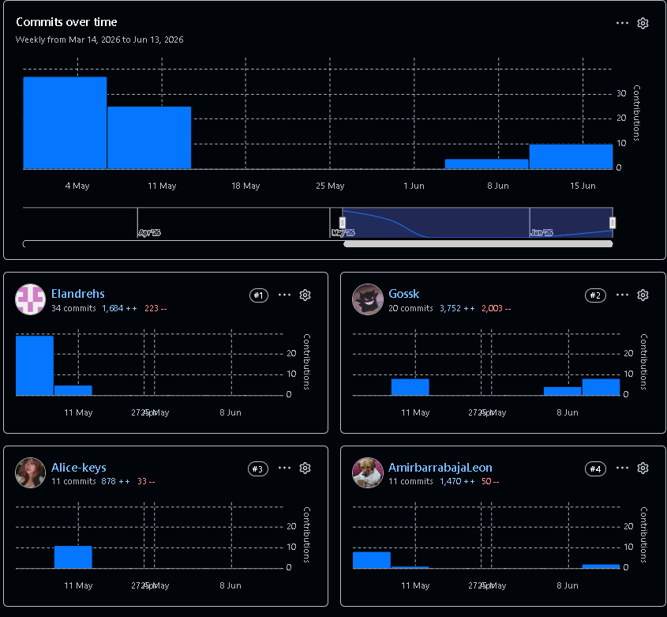

### Gráfico de red (network graph) de ramas en el repositorio de GitHub:


### Contribuciones de los integrantes:


---

# TP1

## Tareas asignadas

Para el desarrollo del TP1, cada integrante del equipo realizó las siguientes tareas:

| Integrante | Tareas asignadas |
|---|---|
| **Solis Chang, Santiago Valentino** | - Desarrollo de prácticas DevOps y configuración de CI/CD<br>- Integración de documentación técnica y automatización de despliegues |
| **Navarro Chang, Alicia Avril** | - Desarrollo de pruebas funcionales y validación de requisitos<br>- Elaboración de evidencias de testing y documentación QA |
| **Vidal Castro, Miguel Angel** | - Implementación y refinamiento de servicios backend<br>- Integración de APIs y optimización de arquitectura de microservicios |
| **Castro Sanchez, Amir Gabriel** | - Refinamiento del diseño UI/UX y experiencia de usuario<br>- Ajustes de interfaz, prototipos y validación visual del sistema |
| **Cruz Ibarra, Victor Andrés** | - Desarrollo de pruebas unitarias e integración<br>- Implementación de funcionalidades backend y validación de servicios<br>- Configuración de persistencia de datos y soporte de despliegue |

## GitHub Collaboration Insights

En GitHub se evidencia la colaboración continua del equipo mediante ramas de desarrollo independientes, merges periódicos y control de versiones centralizado.

### Gráfico de commits por integrante:


### Gráfico de red (network graph) de ramas en el repositorio de GitHub:


### Contribuciones de los integrantes:


<div style="page-break-after: always;"></div>

## Contenido

<<<<<<< HEAD
1. [INFORME DE TRABAJO FINAL](#informe-de-trabajo-final)
   1. [Carátula](#carátula)
   2. [Registro de Versiones del Informe](#registro-de-versiones-del-informe)
   3. [Project Report Collaboration Insights](#project-report-collaboration-insights)
   4. [Contenido](#contenido)
   5. [Student Outcome](#student-outcome)
2. [PARTE I: AS-IS SOFTWARE PROJECT](#parte-i-as-is-software-project)
   1. [Capítulo I: Introducción](#capítulo-i-introducción)
      1. [1.1. Startup Profile](#11-startup-profile)
         1. [1.1.1. Descripción de la Startup](#111-descripción-de-la-startup)
         2. [1.1.2. Perfiles de Integrantes del Equipo](#112-perfiles-de-integrantes-del-equipo)
      2. [1.2. Solution Profile](#12-solution-profile)
         1. [1.2.1. Antecedentes y Problemática](#121-antecedentes-y-problemática)
         2. [**Who (¿Quién?)**](#who-quién)
         3. [**What (¿Qué?)**](#what-qué)
         4. [**Where (¿Dónde?)**](#where-dónde)
         5. [**When (¿Cuándo?)**](#when-cuándo)
         6. [**Why (¿Por qué?)**](#why-por-qué)
         7. [**How (¿Cómo?)**](#how-cómo)
         8. [**How Much (¿Cuánto?)**](#how-much-cuánto)
         9. [1.2.2. Lean UX Process](#122-lean-ux-process)
            1. [1.2.2.1. Lean UX Problem Statements](#1221-lean-ux-problem-statements)
            2. [1.2.2.2. Lean UX Assumptions](#1222-lean-ux-assumptions)
      3. [**Business Assumptions**](#business-assumptions)
      4. [**User Assumptions**](#user-assumptions)
            1. [1.2.2.3. Lean UX Hypothesis Statements](#1223-lean-ux-hypothesis-statements)
      5. [**Hypothesis 01**](#hypothesis-01)
      6. [**Hypothesis 02**](#hypothesis-02)
      7. [**Hypothesis 03**](#hypothesis-03)
      8. [**Hypothesis 04**](#hypothesis-04)
            1. [1.2.2.4. Lean UX Canvas](#1224-lean-ux-canvas)
      9. [1.3. Segmentos Objetivo](#13-segmentos-objetivo)
      10. [**Segmento objetivo #1: Propietarios**](#segmento-objetivo-1-propietarios)
      11. [**Segmento objetivo #2: Mecánicos**](#segmento-objetivo-2-mecánicos)
   2. [Capítulo II: Requirements Elicitation \& Analysis](#capítulo-ii-requirements-elicitation--analysis)
      1. [2.1. Competidores](#21-competidores)
         1. [2.1.1. Análisis Competitivo](#211-análisis-competitivo)
         2. [2.1.2. Estrategias y Tácticas Frente a Competidores](#212-estrategias-y-tácticas-frente-a-competidores)
      2. [2.2. Entrevistas](#22-entrevistas)
         1. [2.2.1. Diseño de Entrevistas](#221-diseño-de-entrevistas)
         2. [2.2.2. Registro de Entrevistas](#222-registro-de-entrevistas)
         3. [2.2.3. Análisis de Entrevistas](#223-análisis-de-entrevistas)
      3. [2.3. Needfinding](#23-needfinding)
         1. [2.3.1. User Personas](#231-user-personas)
         2. [2.3.2. User Task Matrix](#232-user-task-matrix)
         3. [2.3.3. User Journey Mapping](#233-user-journey-mapping)
         4. [2.3.4. Empathy Mapping](#234-empathy-mapping)
         5. [2.3.5. As-is Scenario Mapping](#235-as-is-scenario-mapping)
      4. [2.4. Ubiquitous Language](#24-ubiquitous-language)
   3. [Capítulo III: Requirements Specification](#capítulo-iii-requirements-specification)
      1. [3.1. To-Be Scenario Mapping](#31-to-be-scenario-mapping)
      2. [3.2. User Stories](#32-user-stories)
      3. [3.3. Product Backlog](#33-product-backlog)
      4. [3.4. Impact Mapping](#34-impact-mapping)
   4. [Capítulo IV: Product Design](#capítulo-iv-product-design)
      1. [4.1. Style Guidelines](#41-style-guidelines)
         1. [4.1.1. General Style Guidelines](#411-general-style-guidelines)
         2. [4.1.2. Web Style Guidelines](#412-web-style-guidelines)
         3. [4.1.3. Mobile Style Guidelines](#413-mobile-style-guidelines)
            1. [4.1.3.1. iOS Mobile Style Guidelines](#4131-ios-mobile-style-guidelines)
            2. [4.1.3.2. Android Mobile Style Guidelines](#4132-android-mobile-style-guidelines)
      2. [4.2. Information Architecture](#42-information-architecture)
         1. [4.2.1. Organization Systems](#421-organization-systems)
         2. [4.2.2. Labeling Systems](#422-labeling-systems)
         3. [4.2.3. SEO Tags and Meta Tags](#423-seo-tags-and-meta-tags)
         4. [4.2.4. Searching Systems](#424-searching-systems)
         5. [4.2.5. Navigation Systems](#425-navigation-systems)
      3. [4.3. Landing Page UI Design](#43-landing-page-ui-design)
         1. [4.3.1. Landing Page Wireframe](#431-landing-page-wireframe)
         2. [4.3.2. Landing Page Mock-up](#432-landing-page-mock-up)
      4. [4.4. Mobile Applications UX/UI Design](#44-mobile-applications-uxui-design)
         1. [4.4.1. Mobile Applications Wireframes](#441-mobile-applications-wireframes)
         2. [4.4.2. Mobile Applications Wireflow Diagrams](#442-mobile-applications-wireflow-diagrams)
         3. [4.4.3. Mobile Applications Mock-ups](#443-mobile-applications-mock-ups)
         4. [4.4.4. Mobile Applications User Flow Diagrams](#444-mobile-applications-user-flow-diagrams)
      5. [4.5. Mobile Applications Prototyping](#45-mobile-applications-prototyping)
         1. [4.5.1. Android Mobile Applications Prototyping](#451-android-mobile-applications-prototyping)
         2. [4.5.2. iOS Mobile Applications Prototyping](#452-ios-mobile-applications-prototyping)
      6. [4.6. Web Applications UX/UI Design](#46-web-applications-uxui-design)
         1. [4.6.1. Web Applications Wireframes](#461-web-applications-wireframes)
         2. [4.6.2. Web Applications Wireflow Diagrams](#462-web-applications-wireflow-diagrams)
         3. [4.6.3. Web Applications Mock-ups](#463-web-applications-mock-ups)
         4. [4.6.4. Web Applications User Flow Diagrams](#464-web-applications-user-flow-diagrams)
      7. [4.7. Web Applications Prototyping](#47-web-applications-prototyping)
      8. [4.8. Domain-Driven Software Architecture](#48-domain-driven-software-architecture)
      9. [4.8.1. Event Storming](#481-event-storming)
         1. [4.8.1.1. Candidate Context Discovery](#4811-candidate-context-discovery)
         2. [4.8.1.2. Domain Message Flows Modeling](#4812-domain-message-flows-modeling)
         3. [4.8.1.3 Bounded Context Canvases](#4813-bounded-context-canvases)
      10. [4.8.2. Context Mapping](#482-context-mapping)
      11. [4.8.3. Software Architecture Context Diagram](#483-software-architecture-context-diagram)
      12. [4.8.4. Software Architecture Container Diagrams](#484-software-architecture-container-diagrams)
      13. [4.8.5. Software Architecture Components Diagrams](#485-software-architecture-components-diagrams)
      14. [4.9. Software Object-Oriented Design](#49-software-object-oriented-design)
          1. [4.9.1. Class Diagrams](#491-class-diagrams)
      15. [4.10. Database Design](#410-database-design)
          1. [4.10.1. Relational/Non-Relational Database Diagram](#4101-relationalnon-relational-database-diagram)
   5. [Capítulo V: Product Implementation](#capítulo-v-product-implementation)
      1. [5.1. Software Configuration Management](#51-software-configuration-management)
         1. [5.1.1. Software Development Environment Configuration](#511-software-development-environment-configuration)
         2. [5.1.2. Source Code Management](#512-source-code-management)
         3. [5.1.3. Source Code Style Guide \& Conventions](#513-source-code-style-guide--conventions)
         4. [5.1.4. Software Deployment Configuration](#514-software-deployment-configuration)
      2. [5.2. Product Implementation \& Deployment](#52-product-implementation--deployment)
         1. [5.2.1. Sprint Backlogs](#521-sprint-backlogs)
         2. [5.2.2. Implemented Landing Page Evidence](#522-implemented-landing-page-evidence)
         3. [5.2.3. Implemented Frontend-Web Application Evidence](#523-implemented-frontend-web-application-evidence)
         4. [5.2.4. Acuerdo de Servicio - SaaS](#524-acuerdo-de-servicio---saas)
         5. [5.2.5. Implemented Native-Mobile Application Evidence](#525-implemented-native-mobile-application-evidence)
         6. [5.2.6. Implemented RESTful API and/or Serverless Backend Evidence](#526-implemented-restful-api-andor-serverless-backend-evidence)
         7. [5.2.7. RESTful API Documentation](#527-restful-api-documentation)
         8. [5.2.8. Team Collaboration Insights](#528-team-collaboration-insights)
      3. [5.3. Video About-the-Product](#53-video-about-the-product)
3. [PARTE II: VERIFICATION, VALIDATION \& PIPELINE](#parte-ii-verification-validation--pipeline)
   1. [Capítulo VI: Product Verification \& Validation](#capítulo-vi-product-verification--validation)
      1. [6.1. Testing Suites \& Validation](#61-testing-suites--validation)
         1. [6.1.1. Core Entities Unit Tests](#611-core-entities-unit-tests)
         2. [6.1.2. Core Integration Tests](#612-core-integration-tests)
         3. [6.1.3. Core Behavior-Driven Development](#613-core-behavior-driven-development)
         4. [6.1.4. Core System Tests](#614-core-system-tests)
      2. [6.2. Static Testing \& Verification](#62-static-testing--verification)
         1. [6.2.1. Static Code Analysis](#621-static-code-analysis)
            1. [6.2.1.1. Coding Standard \& Code Conventions](#6211-coding-standard--code-conventions)
            2. [6.2.1.2. Code Quality \& Code Security](#6212-code-quality--code-security)
         2. [6.2.2. Reviews](#622-reviews)
      3. [6.3. Validation Interviews](#63-validation-interviews)
         1. [6.3.1. Diseño de Entrevistas](#631-diseño-de-entrevistas)
         2. [6.3.2. Registro de Entrevistas](#632-registro-de-entrevistas)
         3. [6.3.3. Evaluaciones Según Heurísticas](#633-evaluaciones-según-heurísticas)
      4. [6.4. Auditoría de Experiencias de Usuario](#64-auditoría-de-experiencias-de-usuario)
         1. [6.4.1. Auditoría Realizada](#641-auditoría-realizada)
            1. [6.4.1.1. Información del Grupo Auditado](#6411-información-del-grupo-auditado)
            2. [6.4.1.2. Cronograma de Auditoría Realizada](#6412-cronograma-de-auditoría-realizada)
            3. [6.4.1.3. Contenido de Auditoría Realizada](#6413-contenido-de-auditoría-realizada)
         2. [6.4.2. Auditoría Recibida](#642-auditoría-recibida)
            1. [6.4.2.1. Información del Grupo Auditor](#6421-información-del-grupo-auditor)
            2. [6.4.2.2. Cronograma de Auditoría Recibida](#6422-cronograma-de-auditoría-recibida)
            3. [6.4.2.3. Contenido de Auditoría Recibida](#6423-contenido-de-auditoría-recibida)
            4. [6.4.2.4. Resumen de Modificaciones para Subsanar Hallazgos](#6424-resumen-de-modificaciones-para-subsanar-hallazgos)
   2. [Capítulo VII: DevOps Practices](#capítulo-vii-devops-practices)
      1. [7.1. Continuous Integration](#71-continuous-integration)
         1. [7.1.1. Tools and Practices](#711-tools-and-practices)
         2. [7.1.2. Build \& Test Suite Pipeline Components](#712-build--test-suite-pipeline-components)
      2. [7.2. Continuous Delivery](#72-continuous-delivery)
         1. [7.2.1. Tools and Practices](#721-tools-and-practices)
         2. [7.2.2. Stages Deployment Pipeline Components](#722-stages-deployment-pipeline-components)
      3. [7.3. Continuous Deployment](#73-continuous-deployment)
         1. [7.3.1. Tools and Practices](#731-tools-and-practices)
         2. [7.3.2. Production Deployment Pipeline Components](#732-production-deployment-pipeline-components)
      4. [7.4. Continuous Monitoring](#74-continuous-monitoring)
         1. [7.4.1. Tools and Practices](#741-tools-and-practices)
         2. [7.4.2. Monitoring Pipeline Components](#742-monitoring-pipeline-components)
         3. [7.4.3. Alerting Pipeline Components](#743-alerting-pipeline-components)
         4. [7.4.4. Notification Pipeline Components](#744-notification-pipeline-components)
4. [PARTE III: EXPERIMENT-DRIVEN LIFECYCLE](#parte-iii-experiment-driven-lifecycle)
   1. [Capítulo VIII: Experiment-Driven Development](#capítulo-viii-experiment-driven-development)
      1. [8.1. Experiment Planning](#81-experiment-planning)
         1. [8.1.1. As-Is Summary](#811-as-is-summary)
         2. [8.1.2. Raw Material: Assumptions, Knowledge Gaps, Ideas, Claims](#812-raw-material-assumptions-knowledge-gaps-ideas-claims)
         3. [8.1.3. Experiment-Ready Questions](#813-experiment-ready-questions)
         4. [8.1.4. Question Backlog](#814-question-backlog)
         5. [8.1.5. Experiment Cards](#815-experiment-cards)
      2. [8.2. Experiment Design](#82-experiment-design)
         1. [8.2.1. Hypotheses](#821-hypotheses)
         2. [8.2.2. Domain Business Metrics](#822-domain-business-metrics)
         3. [8.2.3. Measures](#823-measures)
         4. [8.2.4. Conditions](#824-conditions)
         5. [8.2.5. Scale Calculations and Decisions](#825-scale-calculations-and-decisions)
         6. [8.2.6. Methods Selection](#826-methods-selection)
         7. [8.2.7. Data Analytics: Goals, KPIs and Metrics Selection](#827-data-analytics-goals-kpis-and-metrics-selection)
         8. [8.2.8. Web and Mobile Tracking Plan](#828-web-and-mobile-tracking-plan)
      3. [8.3. Experimentation](#83-experimentation)
         1. [8.3.1. To-Be User Stories](#831-to-be-user-stories)
         2. [8.3.2. To-Be Product Backlog](#832-to-be-product-backlog)
         3. [8.3.3. Pipeline-supported, Experiment-Driven To-Be Software Platform Lifecycle](#833-pipeline-supported-experiment-driven-to-be-software-platform-lifecycle)
            1. [8.3.3.1. To-Be Sprint Backlogs](#8331-to-be-sprint-backlogs)
            2. [8.3.3.2. Implemented To-Be Landing Page Evidence](#8332-implemented-to-be-landing-page-evidence)
            3. [8.3.3.3. Implemented To-Be Frontend-Web Application Evidence](#8333-implemented-to-be-frontend-web-application-evidence)
            4. [8.3.3.4. Implemented To-Be Native-Mobile Application Evidence](#8334-implemented-to-be-native-mobile-application-evidence)
            5. [8.3.3.5. Implemented To-Be RESTful API and/or Serverless Backend Evidence](#8335-implemented-to-be-restful-api-andor-serverless-backend-evidence)
            6. [8.3.3.6. Team Collaboration Insights](#8336-team-collaboration-insights)
         4. [8.3.4. To-Be Validation Interviews](#834-to-be-validation-interviews)
            1. [8.3.4.1. Diseño de Entrevistas](#8341-diseño-de-entrevistas)
            2. [8.3.4.2. Registro de Entrevistas](#8342-registro-de-entrevistas)
         5. [8.3.4. Experiment Aftermath \& Analysis](#834-experiment-aftermath--analysis)
      4. [8.4. Experiment Aftermath \& Analysis](#84-experiment-aftermath--analysis)
         1. [8.4.1. Analysis and Interpretation of Results](#841-analysis-and-interpretation-of-results)
         2. [8.4.2. Re-scored and Re-prioritized Question Backlog](#842-re-scored-and-re-prioritized-question-backlog)
      5. [8.5. Continuous Learning](#85-continuous-learning)
         1. [8.5.1. Shareback Session Artifacts: Learning Workflow](#851-shareback-session-artifacts-learning-workflow)
      6. [8.6. To-Be Software Platform Pre-launch](#86-to-be-software-platform-pre-launch)
         1. [8.6.1. About-the-Product Intro Video](#861-about-the-product-intro-video)
   2. [Conclusiones](#conclusiones)
      1. [Conclusiones y Recomendaciones](#conclusiones-y-recomendaciones)
      2. [Video App Validation](#video-app-validation)
      3. [Video About-the-Team](#video-about-the-team)
   3. [Bibliografía](#bibliografía)
   4. [Anexos](#anexos)
=======
- [INFORME DE TRABAJO FINAL](#informe-de-trabajo-final)
  - [Carátula](#carátula)
  - [Registro de Versiones del Informe](#registro-de-versiones-del-informe)
  - [Project Report Collaboration Insights](#project-report-collaboration-insights)
  - [Contenido](#contenido)
  - [Student Outcome](#student-outcome)
- [PARTE I: AS-IS SOFTWARE PROJECT](#parte-i-as-is-software-project)
  - [Capítulo I: Introducción](#capítulo-i-introducción)
    - [1.1. Startup Profile](#11-startup-profile)
      - [1.1.1. Descripción de la Startup](#111-descripción-de-la-startup)
      - [1.1.2. Perfiles de Integrantes del Equipo](#112-perfiles-de-integrantes-del-equipo)
    - [1.2. Solution Profile](#12-solution-profile)
      - [1.2.1. Antecedentes y Problemática](#121-antecedentes-y-problemática)
      - [**Who (¿Quién?)**](#who-quién)
      - [**What (¿Qué?)**](#what-qué)
      - [**Where (¿Dónde?)**](#where-dónde)
      - [**When (¿Cuándo?)**](#when-cuándo)
      - [**Why (¿Por qué?)**](#why-por-qué)
      - [**How (¿Cómo?)**](#how-cómo)
      - [**How Much (¿Cuánto?)**](#how-much-cuánto)
      - [1.2.2. Lean UX Process](#122-lean-ux-process)
        - [1.2.2.1. Lean UX Problem Statements](#1221-lean-ux-problem-statements)
        - [1.2.2.2. Lean UX Assumptions](#1222-lean-ux-assumptions)
    - [**Business Assumptions**](#business-assumptions)
    - [**User Assumptions**](#user-assumptions)
        - [1.2.2.3. Lean UX Hypothesis Statements](#1223-lean-ux-hypothesis-statements)
    - [**Hypothesis 01**](#hypothesis-01)
    - [**Hypothesis 02**](#hypothesis-02)
    - [**Hypothesis 03**](#hypothesis-03)
    - [**Hypothesis 04**](#hypothesis-04)
        - [1.2.2.4. Lean UX Canvas](#1224-lean-ux-canvas)
    - [1.3. Segmentos Objetivo](#13-segmentos-objetivo)
    - [**Segmento objetivo #1: Propietarios**](#segmento-objetivo-1-propietarios)
    - [**Segmento objetivo #2: Mecánicos**](#segmento-objetivo-2-mecánicos)
  - [Capítulo II: Requirements Elicitation \& Analysis](#capítulo-ii-requirements-elicitation--analysis)
    - [2.1. Competidores](#21-competidores)
      - [2.1.1. Análisis Competitivo](#211-análisis-competitivo)
      - [2.1.2. Estrategias y Tácticas Frente a Competidores](#212-estrategias-y-tácticas-frente-a-competidores)
    - [2.2. Entrevistas](#22-entrevistas)
      - [2.2.1. Diseño de Entrevistas](#221-diseño-de-entrevistas)
      - [2.2.2. Registro de Entrevistas](#222-registro-de-entrevistas)
      - [2.2.3. Análisis de Entrevistas](#223-análisis-de-entrevistas)
    - [2.3. Needfinding](#23-needfinding)
      - [2.3.1. User Personas](#231-user-personas)
      - [2.3.2. User Task Matrix](#232-user-task-matrix)
      - [2.3.3. User Journey Mapping](#233-user-journey-mapping)
      - [2.3.4. Empathy Mapping](#234-empathy-mapping)
      - [2.3.5. As-is Scenario Mapping](#235-as-is-scenario-mapping)
    - [2.4. Ubiquitous Language](#24-ubiquitous-language)
  - [Capítulo III: Requirements Specification](#capítulo-iii-requirements-specification)
    - [3.1. To-Be Scenario Mapping](#31-to-be-scenario-mapping)
    - [3.2. User Stories](#32-user-stories)
    - [3.3. Product Backlog](#33-product-backlog)
    - [3.4. Impact Mapping](#34-impact-mapping)
  - [Capítulo IV: Product Design](#capítulo-iv-product-design)
    - [4.1. Style Guidelines](#41-style-guidelines)
      - [4.1.1. General Style Guidelines](#411-general-style-guidelines)
      - [4.1.2. Web Style Guidelines](#412-web-style-guidelines)
      - [4.1.3. Mobile Style Guidelines](#413-mobile-style-guidelines)
        - [4.1.3.1. iOS Mobile Style Guidelines](#4131-ios-mobile-style-guidelines)
        - [4.1.3.2. Android Mobile Style Guidelines](#4132-android-mobile-style-guidelines)
    - [4.2. Information Architecture](#42-information-architecture)
      - [4.2.1. Organization Systems](#421-organization-systems)
      - [4.2.2. Labeling Systems](#422-labeling-systems)
      - [4.2.3. SEO Tags and Meta Tags](#423-seo-tags-and-meta-tags)
      - [4.2.4. Searching Systems](#424-searching-systems)
      - [4.2.5. Navigation Systems](#425-navigation-systems)
    - [4.3. Landing Page UI Design](#43-landing-page-ui-design)
      - [4.3.1. Landing Page Wireframe](#431-landing-page-wireframe)
      - [4.3.2. Landing Page Mock-up](#432-landing-page-mock-up)
    - [4.4. Mobile Applications UX/UI Design](#44-mobile-applications-uxui-design)
      - [4.4.1. Mobile Applications Wireframes](#441-mobile-applications-wireframes)
      - [4.4.2. Mobile Applications Wireflow Diagrams](#442-mobile-applications-wireflow-diagrams)
      - [4.4.3. Mobile Applications Mock-ups](#443-mobile-applications-mock-ups)
      - [4.4.4. Mobile Applications User Flow Diagrams](#444-mobile-applications-user-flow-diagrams)
    - [4.5. Mobile Applications Prototyping](#45-mobile-applications-prototyping)
      - [4.5.1. Android Mobile Applications Prototyping](#451-android-mobile-applications-prototyping)
      - [4.5.2. iOS Mobile Applications Prototyping](#452-ios-mobile-applications-prototyping)
    - [4.6. Web Applications UX/UI Design](#46-web-applications-uxui-design)
      - [4.6.1. Web Applications Wireframes](#461-web-applications-wireframes)
      - [4.6.2. Web Applications Wireflow Diagrams](#462-web-applications-wireflow-diagrams)
      - [4.6.3. Web Applications Mock-ups](#463-web-applications-mock-ups)
      - [4.6.4. Web Applications User Flow Diagrams](#464-web-applications-user-flow-diagrams)
    - [4.7. Web Applications Prototyping](#47-web-applications-prototyping)
    - [4.8. Domain-Driven Software Architecture](#48-domain-driven-software-architecture)
      - [4.8.1. Software Architecture Context Diagram](#481-software-architecture-context-diagram)
      - [4.8.2. Software Architecture Container Diagrams](#482-software-architecture-container-diagrams)
      - [4.8.3. Software Architecture Components Diagrams](#483-software-architecture-components-diagrams)
    - [4.9. Software Object-Oriented Design](#49-software-object-oriented-design)
      - [4.9.1. Class Diagrams](#491-class-diagrams)
      - [4.9.2. Class Dictionary](#492-class-dictionary)
    - [4.10. Database Design](#410-database-design)
      - [4.10.1. Relational/Non-Relational Database Diagram](#4101-relationalnon-relational-database-diagram)
- [Capítulo V: Product Implementation](#capítulo-v-product-implementation)
  - [5.1. Software Configuration Management](#51-software-configuration-management)
    - [5.1.1. Software Development Environment Configuration](#511-software-development-environment-configuration)
    - [5.1.2. Source Code Management](#512-source-code-management)
    - [5.1.3. Source Code Style Guide \& Conventions](#513-source-code-style-guide--conventions)
    - [5.1.4. Software Deployment Configuration](#514-software-deployment-configuration)
  - [5.2. Product Implementation \& Deployment](#52-product-implementation--deployment)
    - [5.2.1. Sprint Backlogs (Continuación)](#521-sprint-backlogs-continuación)
      - [Sprint 3](#sprint-3)
    - [5.2.5. Implemented Mobile Application Evidence (Sprint 3)](#525-implemented-mobile-application-evidence-sprint-3)
    - [5.2.6. Implemented RESTful API Evidence (Sprint 3)](#526-implemented-restful-api-evidence-sprint-3)
    - [5.2.7. RESTful API Documentation \& Deployment](#527-restful-api-documentation--deployment)
    - [5.2.8. Team Collaboration Insights](#528-team-collaboration-insights)
      - [Participación en Repositorios:](#participación-en-repositorios)
    - [Final Deployment Summary](#final-deployment-summary)
  - [5.3. Video About-the-Product](#53-video-about-the-product)
- [PARTE II: VERIFICATION, VALIDATION \& PIPELINE](#parte-ii-verification-validation--pipeline)
  - [Capítulo VI: Product Verification \& Validation](#capítulo-vi-product-verification--validation)
    - [6.1. Testing Suites \& Validation](#61-testing-suites--validation)
      - [6.1.1. Core Entities Unit Tests](#611-core-entities-unit-tests)
      - [6.1.2. Core Integration Tests](#612-core-integration-tests)
      - [6.1.3. Core Behavior-Driven Development](#613-core-behavior-driven-development)
      - [6.1.4. Core System Tests](#614-core-system-tests)
    - [6.2. Static Testing \& Verification](#62-static-testing--verification)
      - [6.2.1. Static Code Analysis](#621-static-code-analysis)
        - [6.2.1.1. Coding Standard \& Code Conventions](#6211-coding-standard--code-conventions)
        - [6.2.1.2. Code Quality \& Code Security](#6212-code-quality--code-security)
      - [6.2.2. Reviews](#622-reviews)
    - [6.3. Validation Interviews](#63-validation-interviews)
      - [6.3.1. Diseño de Entrevistas](#631-diseño-de-entrevistas)
      - [6.3.2. Registro de Entrevistas](#632-registro-de-entrevistas)
      - [6.3.3. Evaluaciones Según Heurísticas](#633-evaluaciones-según-heurísticas)
    - [6.4. Auditoría de Experiencias de Usuario](#64-auditoría-de-experiencias-de-usuario)
      - [6.4.1. Auditoría Realizada](#641-auditoría-realizada)
        - [6.4.1.1. Información del Grupo Auditado](#6411-información-del-grupo-auditado)
        - [6.4.1.2. Cronograma de Auditoría Realizada](#6412-cronograma-de-auditoría-realizada)
        - [6.4.1.3. Contenido de Auditoría Realizada](#6413-contenido-de-auditoría-realizada)
      - [6.4.2. Auditoría Recibida](#642-auditoría-recibida)
        - [6.4.2.1. Información del Grupo Auditor](#6421-información-del-grupo-auditor)
        - [6.4.2.2. Cronograma de Auditoría Recibida](#6422-cronograma-de-auditoría-recibida)
        - [6.4.2.3. Contenido de Auditoría Recibida](#6423-contenido-de-auditoría-recibida)
        - [6.4.2.4. Resumen de Modificaciones para Subsanar Hallazgos](#6424-resumen-de-modificaciones-para-subsanar-hallazgos)
  - [Capítulo VII: DevOps Practices](#capítulo-vii-devops-practices)
    - [7.1. Continuous Integration](#71-continuous-integration)
      - [7.1.1. Tools and Practices](#711-tools-and-practices)
      - [7.1.2. Build \& Test Suite Pipeline Components](#712-build--test-suite-pipeline-components)
    - [7.2. Continuous Delivery](#72-continuous-delivery)
      - [7.2.1. Tools and Practices](#721-tools-and-practices)
      - [7.2.2. Stages Deployment Pipeline Components](#722-stages-deployment-pipeline-components)
    - [7.3. Continuous Deployment](#73-continuous-deployment)
      - [7.3.1. Tools and Practices](#731-tools-and-practices)
      - [7.3.2. Production Deployment Pipeline Components](#732-production-deployment-pipeline-components)
    - [7.4. Continuous Monitoring](#74-continuous-monitoring)
      - [7.4.1. Tools and Practices](#741-tools-and-practices)
      - [7.4.2. Monitoring Pipeline Components](#742-monitoring-pipeline-components)
      - [7.4.3. Alerting Pipeline Components](#743-alerting-pipeline-components)
      - [7.4.4. Notification Pipeline Components](#744-notification-pipeline-components)
- [PARTE III: EXPERIMENT-DRIVEN LIFECYCLE](#parte-iii-experiment-driven-lifecycle)
  - [Capítulo VIII: Experiment-Driven Development](#capítulo-viii-experiment-driven-development)
    - [8.1. Experiment Planning](#81-experiment-planning)
      - [8.1.1. As-Is Summary](#811-as-is-summary)
      - [8.1.2. Raw Material: Assumptions, Knowledge Gaps, Ideas, Claims](#812-raw-material-assumptions-knowledge-gaps-ideas-claims)
      - [8.1.3. Experiment-Ready Questions](#813-experiment-ready-questions)
      - [8.1.4. Question Backlog](#814-question-backlog)
      - [8.1.5. Experiment Cards](#815-experiment-cards)
    - [8.2. Experiment Design](#82-experiment-design)
      - [8.2.1. Hypotheses](#821-hypotheses)
      - [8.2.2. Domain Business Metrics](#822-domain-business-metrics)
      - [8.2.3. Measures](#823-measures)
      - [8.2.4. Conditions](#824-conditions)
      - [8.2.5. Scale Calculations and Decisions](#825-scale-calculations-and-decisions)
      - [8.2.6. Methods Selection](#826-methods-selection)
      - [8.2.7. Data Analytics: Goals, KPIs and Metrics Selection](#827-data-analytics-goals-kpis-and-metrics-selection)
      - [8.2.8. Web and Mobile Tracking Plan](#828-web-and-mobile-tracking-plan)
    - [8.3. Experimentation](#83-experimentation)
      - [8.3.1. To-Be User Stories](#831-to-be-user-stories)
      - [8.3.2. To-Be Product Backlog](#832-to-be-product-backlog)
      - [8.3.3. Pipeline-supported, Experiment-Driven To-Be Software Platform Lifecycle](#833-pipeline-supported-experiment-driven-to-be-software-platform-lifecycle)
        - [8.3.3.1. To-Be Sprint Backlogs](#8331-to-be-sprint-backlogs)
        - [8.3.3.2. Implemented To-Be Landing Page Evidence](#8332-implemented-to-be-landing-page-evidence)
        - [8.3.3.3. Implemented To-Be Frontend-Web Application Evidence](#8333-implemented-to-be-frontend-web-application-evidence)
        - [8.3.3.4. Implemented To-Be Native-Mobile Application Evidence](#8334-implemented-to-be-native-mobile-application-evidence)
        - [8.3.3.5. Implemented To-Be RESTful API and/or Serverless Backend Evidence](#8335-implemented-to-be-restful-api-andor-serverless-backend-evidence)
        - [8.3.3.6. Team Collaboration Insights](#8336-team-collaboration-insights)
      - [8.3.4. To-Be Validation Interviews](#834-to-be-validation-interviews)
        - [8.3.4.1. Diseño de Entrevistas](#8341-diseño-de-entrevistas)
        - [8.3.4.2. Registro de Entrevistas](#8342-registro-de-entrevistas)
      - [8.3.4. Experiment Aftermath \& Analysis](#834-experiment-aftermath--analysis)
    - [8.4. Experiment Aftermath \& Analysis](#84-experiment-aftermath--analysis)
      - [8.4.1. Analysis and Interpretation of Results](#841-analysis-and-interpretation-of-results)
      - [8.4.2. Re-scored and Re-prioritized Question Backlog](#842-re-scored-and-re-prioritized-question-backlog)
    - [8.5. Continuous Learning](#85-continuous-learning)
      - [8.5.1. Shareback Session Artifacts: Learning Workflow](#851-shareback-session-artifacts-learning-workflow)
    - [8.6. To-Be Software Platform Pre-launch](#86-to-be-software-platform-pre-launch)
      - [8.6.1. About-the-Product Intro Video](#861-about-the-product-intro-video)
  - [Conclusiones](#conclusiones)
    - [Conclusiones y Recomendaciones](#conclusiones-y-recomendaciones)
    - [Video App Validation](#video-app-validation)
    - [Video About-the-Team](#video-about-the-team)
  - [Bibliografía](#bibliografía)
  - [Anexos](#anexos)
>>>>>>> 5793ca2 (docs: define SCM, branching strategy, style guides and deployment for chapter V)

<div style="page-break-after: always;"></div>

## Student Outcome

**ABET – EAC - Student Outcome 4**
**Criterio:** La capacidad de reconocer responsabilidades éticas y profesionales en situaciones de ingeniería y hacer juicios informados, que deben considerar el impacto de las soluciones de ingeniería en contextos globales, económicos, ambientales y sociales.

En el siguiente cuadro se describe las acciones realizadas y enunciados de conclusiones por parte del grupo, que permiten sustentar el haber alcanzado el logro del ABET – EAC - Student Outcome 4.

| Criterio específico                                                                                                                                          | Acciones realizadas                                                                                                                                                                                                                                                                                                                                                                                                                                                                                                                                                                                                                                                                                                                                                                                                                                                                                                                                                                                                                                                                                                                   | Conclusiones                                                                                                                                                                                              |
| ------------------------------------------------------------------------------------------------------------------------------------------------------------ | ------------------------------------------------------------------------------------------------------------------------------------------------------------------------------------------------------------------------------------------------------------------------------------------------------------------------------------------------------------------------------------------------------------------------------------------------------------------------------------------------------------------------------------------------------------------------------------------------------------------------------------------------------------------------------------------------------------------------------------------------------------------------------------------------------------------------------------------------------------------------------------------------------------------------------------------------------------------------------------------------------------------------------------------------------------------------------------------------------------------------------------- | --------------------------------------------------------------------------------------------------------------------------------------------------------------------------------------------------------- |
| 4.c.1 Reconoce responsabilidad ética y profesional en situaciones de ingeniería de software                                                                  | <i>Cruz Ibarra, Victor Andres</i><br><i>TB1</i><br>Participó en la definición del problema y el alcance inicial del proyecto.<br><i>TP1</i><br>Apoyó la validación de requerimientos y la documentación del avance.<br><br><i>Solis Chang, Santiago Valentino</i><br><i>TB1</i><br>Colaboró en el análisis inicial y en la redacción de artefactos base.<br><i>TP1</i><br>Apoyó la mejora de evidencias y la revisión de entregables.<br><br><i>Navarro Chang, Alicia Avril</i><br><i>TB1</i><br>Contribuyó con el levantamiento de información y la organización de materiales.<br><i>TP1</i><br>Participó en la actualización de contenidos y la consolidación de evidencias.<br><br><i>Vidal Castro, Miguel Angel</i><br><i>TB1</i><br>Apoyó la estructuración del informe y la revisión de secciones clave.<br><i>TP1</i><br>Colaboró en la integración de resultados y la verificación de avances.<br><br><i>Castro Sanchez, Amir Gabriel</i><br><i>TB1</i><br>Participó en la organización del contenido y en la síntesis de avances.<br><i>TP1</i><br>Apoyó la consolidación final de capítulos y la revisión de consistencia. | <i>TB1</i><br>El grupo mostró responsabilidad al organizar el trabajo y respetar criterios profesionales.<br><br><i>TP1</i><br>El grupo consolidó una ejecución más ordenada y ética del trabajo técnico. |
| 4.c.2 Emite juicios informados considerando el impacto de las soluciones de ingeniería de software en contextos globales, económicos, ambientales y sociales | <i>Cruz Ibarra, Victor Andres</i><br><i>TB1</i><br>Analizó el contexto de la startup y su impacto inicial en el entorno.<br><i>TP1</i><br>Participó en el análisis de mejoras con enfoque en valor, uso y viabilidad.<br><br><i>Solis Chang, Santiago Valentino</i><br><i>TB1</i><br>Apoyó la identificación de oportunidades y restricciones del proyecto.<br><i>TP1</i><br>Contribuyó a evaluar ajustes del producto según alcance y beneficio.<br><br><i>Navarro Chang, Alicia Avril</i><br><i>TB1</i><br>Revisó información del dominio para sustentar decisiones del equipo.<br><i>TP1</i><br>Colaboró en la valoración de entregables y mejoras del producto.<br><br><i>Vidal Castro, Miguel Angel</i><br><i>TB1</i><br>Apoyó el análisis de viabilidad y coherencia de los entregables.<br><i>TP1</i><br>Participó en la revisión de resultados y su impacto en la propuesta.<br><br><i>Castro Sanchez, Amir Gabriel</i><br><i>TB1</i><br>Sintetizó aportes para sustentar decisiones del informe.<br><i>TP1</i><br>Apoyó la evaluación final de coherencia entre solución y necesidades.                                      | <i>TB1</i><br>El grupo tomó decisiones considerando necesidades reales del negocio y del usuario.<br><br><i>TP1</i><br>El grupo hizo juicios más sólidos sobre el impacto de la solución propuesta.       |

<div style="page-break-after: always;"></div>

# PARTE I: AS-IS SOFTWARE PROJECT

<div style="page-break-after: always;"></div>

## Capítulo I: Introducción

### 1.1. Startup Profile

#### 1.1.1. Descripción de la Startup

Autonexo es una aplicación diseñada para conectar a los propietarios de vehículos con mecánicos especializados en todo tipo de mantenimiento vehicular, ya sea preventivo, correctivo o cualquier otro tipo de servicio automotriz. La aplicación actúa como un intermediario eficiente, proporcionando una solución integral que facilita la interacción entre los conductores y los profesionales del sector automotriz.

La plataforma permite a los propietarios acceder a un catálogo de mecánicos certificados y servicios disponibles, con la posibilidad de elegir en función de la especialización, reputación y proximidad del servicio. Por otro lado, los mecánicos tienen la oportunidad de promocionar sus servicios, gestionar su agenda de forma eficiente y recibir solicitudes de mantenimiento en tiempo real, lo que les permite maximizar su tiempo y la eficiencia de sus operaciones.

Según el estudio realizado por Innocar y Roshfrans (2022), solo el 23.5% de los talleres en América Latina utilizan software especializado para gestionar sus operaciones, lo que evidencia una escasa adopción tecnológica en el sector. Esta brecha tecnológica no solo limita la eficiencia interna de los talleres, sino que también reduce la calidad y transparencia percibida por los clientes..

La plataforma no solo mejora la accesibilidad al servicio automotriz, sino que también permite un registro detallado del historial de mantenimiento de cada vehículo, optimizando la gestión preventiva y reduciendo los costos a largo plazo para los conductores. Además, la capacidad de recibir atención personalizada y el acceso a mecánicos especializados en diversas áreas del mantenimiento incrementan la confianza y la satisfacción del usuario.

El objetivo de Autonexo es transformar la experiencia de mantenimiento vehicular, ofreciendo una solución accesible, transparente y efectiva tanto para los conductores como para los mecánicos. Al mismo tiempo, fomenta la adopción de la tecnología en un sector que históricamente ha dependido de métodos tradicionales y manuales, mejorando la eficiencia y el control sobre los costos de mantenimiento.

#### 1.1.2. Perfiles de Integrantes del Equipo

<table border="1">
  <tr>
      <td style="text-align:center;"></td>
      <td><strong>Victor Cruz - u202311053</strong><br>Mi nombre es Victor Cruz, tengo 20 años y estoy cursando mi 7to ciclo de la carrera de Ingeniería de Software en la UPC. Soy una persona entusiasta, creativa y comprometida con cada actividad que realizo. Estoy decidido a dar lo mejor de mí en este proyecto para lograr resultados de calidad.</td>
  </tr>
  <tr>
      <td style="text-align:center;"></td>
      <td><strong>Santiago Solis - u20231b475</strong><br>Mi nombre es Santiago Solis, soy estudiante de Ingeniería de Software en la UPC. Me apasiona la tecnología y todo lo relacionado con el desarrollo de software. En mi tiempo libre disfruto jugar videojuegos, practicar tenis. Me gusta enfrentarme a desafíos complejos y encontrar soluciones creativas. Estoy en constante aprendizaje, siempre buscando mejorar mis habilidades en programación web. Me considero una persona comprometida con mis proyectos y con ganas de crecer tanto profesionalmente como personalmente. Disfruto trabajar en equipo y siempre trato de aportar lo mejor de mí en todo lo que hago.</td>
  </tr>
  <tr>
      <td style="text-align:center;"></td>
      <td><strong>Alicia Navarro - u20231d637</strong><br>Mi nombre es Alicia Navarro, tengo 20 años y estoy cursando mi 7to ciclo de la carrera de Ingeniería de Software en la UPC. Soy una persona dedicada, analítica y con gran interés en el desarrollo de soluciones tecnológicas innovadoras. Me caracterizo por mi capacidad de trabajo en equipo y mi compromiso con la excelencia en cada proyecto que realizo. Estoy enfocado en aprender constantemente y aplicar mis conocimientos para crear aplicaciones que generen un impacto positivo en la sociedad.</td>
  </tr>
  <tr>
      <td style="text-align:center;"></td>
      <td><strong>Miguel Vidal - u202314186</strong><br>Mi nombre es Miguel Vidal, tengo 20 años y estoy cursando mi 7to ciclo de la carrera de Ingeniería de Software en la UPC. Soy una persona proactiva, creativa y con gran pasión por la tecnología. Me destaco por mi capacidad de resolver problemas de manera eficiente y mi habilidad para trabajar colaborativamente en proyectos complejos. Estoy comprometido con el aprendizaje continuo y siempre busco aplicar las mejores prácticas en el desarrollo de software. Mi objetivo es contribuir significativamente al éxito de este proyecto y crecer profesionalmente en el campo de la ingeniería de software.</td>
  </tr>
  <tr>
      <td style="text-align:center;"></td>
      <td><strong>Amir Castro - u202310680</strong><br>Mi nombre es Amir Castro, tengo 20 años y actualmente curso el 7to ciclo de la carrera de Ingeniería de Software en la UPC. Me considero una persona responsable con facilidad para adaptarme a distintos entornos y manejar varias tareas a la vez. Siempre doy lo mejor de mí en cada proyecto, aportando dedicación, esfuerzo y actitud positiva.</td>
  </tr>
</table>

### 1.2. Solution Profile

#### 1.2.1. Antecedentes y Problemática

#### **Who (¿Quién?)**

Afecta principalmente a **mecánicos y propietarios de vehículos**, quienes necesitan gestionar y acceder a servicios de mantenimiento de manera eficiente.

#### **What (¿Qué?)**

Actualmente, los mecánicos enfrentan dificultades para organizar, planificar y dar seguimiento a los mantenimientos de los vehículos. La ausencia de un registro centralizado y estandarizado provoca errores en el control de historial, retrasos en los servicios y decisiones poco informadas. Por su parte, los propietarios tienen dificultad para encontrar mecánicos confiables y servicios adecuados a sus necesidades, lo que genera desconfianza y pérdida de tiempo.

#### **Where (¿Dónde?)**

Esta problemática se observa en **talleres mecánicos tradicionales** y entre propietarios de vehículos que buscan servicios automotrices confiables, especialmente en entornos urbanos donde la demanda de mantenimiento es alta.

#### **When (¿Cuándo?)**

El problema es constante y se intensifica en periodos críticos, como fechas de mantenimiento preventivo recomendado, estaciones de alto uso del vehículo y ante situaciones donde un vehículo requiere reparación inmediata.

#### **Why (¿Por qué?)**

La raíz del problema es la **falta de digitalización y centralización** en la gestión de servicios automotrices. Muchos talleres dependen de métodos manuales como hojas de cálculo, cuadernos o aplicaciones genéricas que no están diseñadas para el sector automotriz. Esto provoca ineficiencia operativa, aumento de costos y baja satisfacción del cliente.

#### **How (¿Cómo?)**

**Autonexo** propone una solución mediante una **aplicación móvil y web** que conecta directamente a propietarios con mecánicos certificados. La app permite registrar vehículos, historial de mantenimiento y servicios solicitados, al mismo tiempo que los mecánicos pueden gestionar sus agendas y responder a solicitudes en tiempo real, optimizando tiempos y recursos.

#### **How Much (¿Cuánto?)**

Uno de los principales desafíos en el sector automotriz es la ineficiencia en la gestión del mantenimiento vehicular, lo que genera sobrecostos y pérdida de productividad. Según UpKeep (2023), el mantenimiento puede representar entre el 15 % y 40 % de los costos totales de producción, lo que evidencia su impacto directo en la sostenibilidad financiera de las organizaciones. De igual forma, Infraspeak (2024) señala que hasta un 50 % de los costos de mantenimiento corresponden a desperdicios, ya sea por trabajos innecesarios, duplicación de esfuerzos o falta de planificación estratégica.

#### 1.2.2. Lean UX Process

##### 1.2.2.1. Lean UX Problem Statements

Autonexo tiene como objetivo ofrecer a talleres mecánicos y propietarios de vehículos una **solución digital integral** que permita centralizar los procesos clave del mantenimiento vehicular, incluyendo el registro de unidades, la planificación de mantenimientos, el control de repuestos, el cálculo de presupuestos y el seguimiento histórico de intervenciones.

Actualmente, la mayoría de talleres y propietarios gestionan el mantenimiento de forma **manual, fragmentada y desorganizada**. Muchos dependen de hojas de Excel, cuadernos o herramientas genéricas que no están adaptadas a las necesidades específicas del sector automotriz. Esto provoca **fallas en el control de registros históricos, mayores costos por mantenimientos correctivos, retrasos en la atención de servicios y decisiones poco informadas** respecto al cuidado de los vehículos.

La falta de estandarización y centralización **limita la eficiencia de los talleres**, reduce la confianza de los propietarios y afecta la calidad del servicio. Además, genera **gastos imprevistos y tiempos muertos** tanto para mecánicos como para propietarios. La ausencia de un sistema unificado impide llevar un seguimiento transparente y ordenado del estado de cada vehículo, impactando negativamente en la productividad de los técnicos y en la satisfacción de los clientes.

**Pregunta clave de diseño:**

> ¿Cómo podríamos centralizar y digitalizar la gestión del mantenimiento vehicular de forma escalable y accesible, permitiendo a mecánicos y propietarios **ahorrar tiempo, reducir costos, mejorar la trazabilidad y asegurar un mantenimiento constante sin complicaciones**?

##### 1.2.2.2. Lean UX Assumptions

### **Business Assumptions**

1. Nuestros clientes necesitan una plataforma digital centralizada que les permita gestionar de manera integral el mantenimiento de sus vehículos y talleres, ya que actualmente dependen de métodos manuales que generan retrasos y errores, y buscan optimizar la eficiencia y control de sus operaciones.

2. Estas necesidades se pueden resolver mediante un software especializado que integre procesos clave como el registro de vehículos, historial de mantenimiento, planificación de servicios preventivos y correctivos, control de repuestos, cálculo de presupuestos y seguimiento de intervenciones en tiempo real, permitiendo centralizar toda la información y mejorar la trazabilidad de los servicios.

3. Los clientes iniciales serán propietarios de vehículos particulares y mecánicos independientes o de talleres pequeños que actualmente utilizan hojas de Excel, cuadernos o aplicaciones genéricas, y que requieren un sistema confiable para organizar sus mantenimientos y brindar un mejor servicio.

4. El valor más importante que buscan nuestros clientes es un control confiable, eficiente y accesible del mantenimiento vehicular y de los servicios del taller, reduciendo errores, retrasos y gastos innecesarios, mientras aumentan la confianza y satisfacción de los usuarios.

5. Adicionalmente, los usuarios pueden obtener beneficios tangibles como ahorro de tiempo y dinero en mantenimientos correctivos y preventivos, presupuestos claros y detallados para cada servicio, así como acceso a una red de mecánicos o propietarios disponibles en tiempo real según proximidad, especialización y reputación.

6. La adquisición de clientes se realizará mediante marketing digital en redes sociales como Facebook, Instagram y TikTok, campañas en Google Ads enfocadas en búsquedas de servicios automotrices, programas de referidos que incentiven la recomendación de la app, así como alianzas estratégicas con talleres automotrices para fomentar la adopción temprana.

7. El modelo de monetización será a través de suscripción mensual para mecánicos y talleres, otorgándoles acceso a herramientas avanzadas de gestión del taller, listado de propietarios y vehículos registrados en la plataforma, funcionalidades de planificación, presupuesto y seguimiento de historial.

8. La competencia principal incluye aplicaciones como Drivvo, Fleetio y otros softwares genéricos de gestión vehicular, pero nuestro diferencial radica en una interfaz amigable, localización precisa y funcionalidades adaptadas tanto para talleres como para propietarios, incluyendo búsqueda de mecánicos en tiempo real, historial completo y trazable de cada vehículo, y agenda optimizada para talleres.

9. Los venceremos gracias a nuestro enfoque local, la facilidad de uso de la plataforma y las funcionalidades específicas diseñadas para satisfacer tanto a propietarios individuales como a técnicos mecánicos, proporcionando eficiencia operativa y trazabilidad completa del mantenimiento vehicular.

10. El mayor riesgo es que los usuarios no adopten la plataforma debido a la preferencia por métodos tradicionales o a la falta de familiaridad con herramientas digitales, lo que podría limitar el crecimiento y uso del sistema.

11. Para mitigar este riesgo, se implementará una interfaz simple e intuitiva, acompañada de capacitaciones básicas y materiales de apoyo para mecánicos y propietarios, demostraciones gratuitas y pruebas piloto, así como testimonios de clientes satisfechos que incentiven la confianza y la adopción de la plataforma, asegurando que Autonexo cumpla con su objetivo de centralizar y digitalizar la gestión del mantenimiento vehicular de manera eficiente, accesible y confiable.

### **User Assumptions**

1. **¿Quién es el usuario?**

Nuestros usuarios son principalmente **propietarios de vehículos particulares** que buscan cuidar su inversión y optimizar los costos de mantenimiento, así como **mecánicos independientes o de talleres pequeños** que desean llevar un control digital eficiente de múltiples mantenimientos y agendas de servicio, ya que actualmente dependen de métodos manuales o herramientas poco integradas.

2. **¿Qué problema tiene nuestro producto que debe resolver?**

El problema principal que Autonexo debe resolver es la **desorganización y fragmentación en la gestión del mantenimiento vehicular**, que genera sobrecostos, retrasos, fallas mecánicas evitables y pérdida de tiempo en tareas repetitivas o manuales, afectando tanto la eficiencia de los talleres como la satisfacción de los propietarios.

3. **¿Qué características son importantes?**

Para cubrir estas necesidades, el producto debe ofrecer **registro integral de vehículos y usuarios**, una **plataforma de búsqueda de mecánico en tiempo real**, **cálculo de presupuestos de mantenimientos**, **historial detallado de intervenciones por vehículo** y **servicio de mensajería directa entre usuario y mecánico**, todo accesible desde dispositivos móviles para gestionar mantenimientos de manera centralizada y eficiente.

4. **¿Dónde encaja nuestro producto en su trabajo o vida?**

El producto encaja directamente en el **día a día de los propietarios y mecánicos**: los propietarios lo utilizan para planificar, registrar y dar seguimiento a los mantenimientos de sus vehículos, mientras que los mecánicos gestionan múltiples unidades y presupuestos desde un solo lugar, optimizando su tiempo y reduciendo errores operativos.

5. **¿Cuándo y cómo es usado nuestro producto?**

Autonexo será utilizado **cada vez que un usuario necesite planificar, registrar o dar seguimiento a un mantenimiento**, accediendo principalmente desde dispositivos móviles para garantizar flexibilidad, disponibilidad inmediata y control en tiempo real, sin importar si se encuentran en el taller, en ruta o en casa.

6. **¿Cómo debe verse nuestro producto y cómo debe comportarse?**

El diseño y comportamiento del producto deben reflejar un **diseño moderno, limpio y amigable**, con menús intuitivos y fáciles de navegar, garantizando que el sistema responda rápidamente, evite interrupciones y proporcione una **experiencia fluida y confiable**, apta tanto para usuarios con experiencia digital como para aquellos que prefieren soluciones sencillas y accesibles.

##### 1.2.2.3. Lean UX Hypothesis Statements

### **Hypothesis 01**

**Creemos que** al ofrecer una plataforma centralizada para registrar vehículos, usuarios y mantenimientos, ayudaremos a los usuarios a organizar sus procesos de mantenimiento de manera más eficiente y reducir errores o pérdidas de información.

**Sabremos que hemos tenido éxito**

**Cuando al menos** el 70% de los usuarios registre y mantenga actualizado el historial de sus vehículos y mantenimientos durante el primer mes de uso.

### **Hypothesis 02**

**Creemos que** al integrar herramientas de registro de mantenimiento y cálculo automático de presupuestos, facilitaremos la gestión operativa y financiera de los mecánicos y propietarios de vehículos, permitiéndoles planificar y ejecutar mantenimientos con mayor precisión.

**Sabremos que hemos tenido éxito**

**Cuando al menos** el 60% de los usuarios utilicen estas funciones para planificar o ejecutar mantenimientos dentro de la plataforma.

### **Hypothesis 03**

**Creemos que** al diseñar una interfaz móvil intuitiva, clara y accesible, incentivaremos el uso constante de Autonexo incluso por usuarios con poca experiencia digital.

**Sabremos que hemos tenido éxito**

**Cuando al menos** el 75% de los usuarios activos utilicen la plataforma semanalmente para gestionar sus vehículos.

### **Hypothesis 04**

**Creemos que** al permitir el acceso al historial completo de mantenimiento de cada vehículo, incrementaremos la confianza de los usuarios en sus decisiones de reparación, mantenimiento preventivo o venta de vehículos.

**Sabremos que hemos tenido éxito**

**Cuando al menos** el 50% de los usuarios consulten el historial como parte del proceso de evaluación del estado de sus vehículos.

##### 1.2.2.4. Lean UX Canvas

- Lean Ux Canvas
  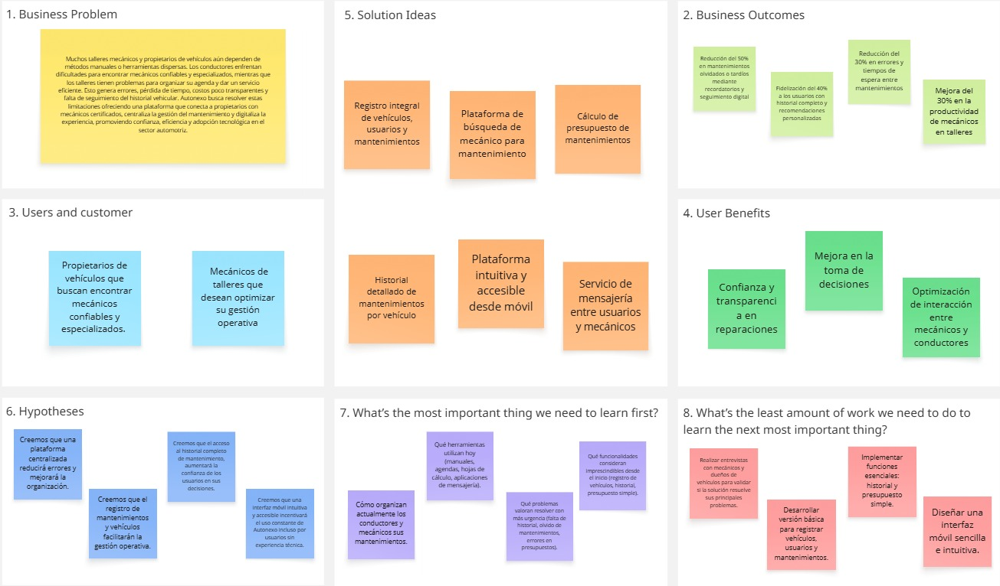

### 1.3. Segmentos Objetivo

Con el propósito de llegar de manera efectiva a posibles clientes, Autonexo ha definido dos segmentos principales como público objetivo.

---

### **Segmento objetivo #1: Propietarios**

Personas que poseen uno o más vehículos personales y desean gestionar de forma eficiente el mantenimiento, control de gastos y estado general de su unidad, evitando olvidos o problemas mecánicos por falta de seguimiento.

**Aspectos demográficos:**

Sexo: Masculino y femenino,

Rango de edad: 25–50 años,

Nivel socioeconómico: Clases B y C (media-alta y media).

**Aspectos geográficos:**

Nacionalidad: Perú,

Zona geográfica: Urbana (principalmente Lima Metropolitana y otras ciudades con alta concentración vehicular).

**Aspectos psicográficos:**

Intereses: Cuidado del vehículo, control financiero, tecnología práctica, seguridad vial, soluciones digitales simples,

Estilo de vida: Conducen regularmente, valoran la comodidad y buscan evitar gastos imprevistos o pérdidas de tiempo por fallas mecánicas,

Actitudes: Son conscientes de la importancia del mantenimiento vehicular y están abiertos a herramientas digitales que les faciliten llevar un control ordenado y accesible desde su celular.

**Necesidades clave:**

Recordatorios de mantenimiento, historial de mantenimiento accesible, planificación de servicios, reducción de costos por mantenimientos imprevistos.

**Comportamiento digital:**

Uso de apps móviles, notificaciones y alertas, búsqueda de información y servicios de manera digital y rápida.

---

### **Segmento objetivo #2: Mecánicos**

Profesionales que trabajan en talleres y desean gestionar mejor sus servicios y acceder a historiales de mantenimiento para brindar un mejor servicio a sus clientes.

**Aspectos demográficos:**

Sexo: Masculino (en su mayoría),

Rango de edad: 20–50 años,

Nivel socioeconómico: Clases C y D (media y media-baja).

**Aspectos geográficos:**

Nacionalidad: Perú,

Zona geográfica: Urbana (distritos con concentración de talleres y servicios automotrices).

**Aspectos psicográficos:**

Intereses: Reparación automotriz, optimización de tiempo, atención al cliente, soluciones digitales simples,

Estilo de vida: Profesionales prácticos, con un enfoque técnico, acostumbrados al trabajo manual, pero abiertos a soluciones tecnológicas si son simples y funcionales,

Actitudes: Desean mejorar la calidad de su servicio y organización interna, valoran plataformas que les permitan brindar un servicio más profesional sin complicaciones adicionales.

**Necesidades clave:**

Gestión eficiente de mantenimientos, acceso rápido a historiales de vehículos, reducción de errores en la planificación de servicios, optimización del tiempo de trabajo.

**Comportamiento digital:**

Familiaridad básica con smartphones, uso de aplicaciones simples y rápidas, disposición a digitalizar procesos si la herramienta es intuitiva y confiable.

<div style="page-break-after: always;"></div>

## Capítulo II: Requirements Elicitation & Analysis

### 2.1. Competidores

#### 2.1.1. Análisis Competitivo

<table border="1">
  <thead>
    <tr>
      <th colspan="7" style="text-align: center;"><b>Competitive Analysis Landscape</b></th>
    </tr>
  </thead>
  <tbody>
    <tr>
      <td colspan="2" align="center">¿Por qué llevar a cabo este análisis?</td>
      <td colspan="5" align="center">El objetivo es definir el posicionamiento de Autonexo frente a soluciones de gestión de flotas y mantenimiento vehicular, identificando diferenciadores de valor y riesgos competitivos para el mercado local.</td>
    </tr>
    <tr>
      <th></th>
      <th></th>
      <th>AutoNexo 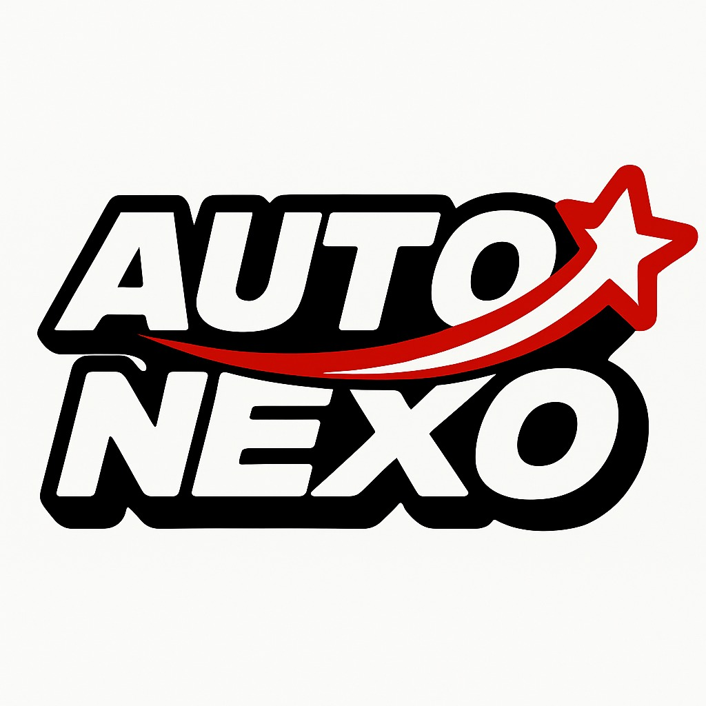</th>
      <th>Fleetio </th>
      <th>Drivvo 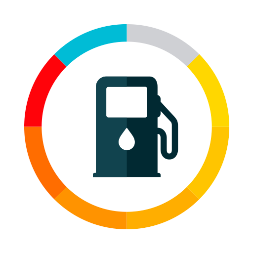</th>
      <th>Whip Around </th>
    </tr>
    <tr>
      <td><strong>Perfil</strong></td>
      <td>Overview</td>
      <td>Autonexo es una aplicación móvil que conecta propietarios de vehículos con mecánicos especializados, facilitando la gestión integral del mantenimiento vehicular mediante un sistema centralizado que incluye registro de vehículos, historial de mantenimientos, búsqueda de servicios y comunicación directa entre usuarios.</td>
      <td>Fleetio es una plataforma SaaS integral de gestión de flotas empresariales que ofrece herramientas avanzadas para el mantenimiento preventivo, seguimiento de combustible, gestión de activos, inspecciones digitales y análisis de datos para optimizar operaciones de flotas comerciales.</td>
      <td>Drivvo es una aplicación móvil orientada a conductores particulares y pequeñas empresas que permite registrar gastos de vehículo, programar recordatorios de mantenimiento, controlar consumo de combustible y generar reportes básicos de costos vehiculares de forma simple e intuitiva.</td>
      <td>Whip Around es una plataforma especializada en inspecciones digitales y mantenimiento para flotas comerciales, enfocada en cumplimiento regulatorio, inspecciones DVIR personalizables, gestión de órdenes de reparación y reporting para compliance con normas de seguridad vehicular.</td>
    </tr>
    <tr>
      <td></td>
      <td><strong>Ventaja competitiva – ¿Qué valor ofrece al cliente?</strong></td>
      <td>Digitaliza y automatiza el proceso de mantenimiento; conecta demanda (conductores) con oferta (mecánicos) y da trazabilidad del historial.</td>
      <td>Gestión centralizada y basada en datos para reducir costos (mantenimiento, combustible) y mejorar decisiones; módulos de inspección, órdenes de trabajo y fuel tracking.</td>
      <td>Accesibilidad y simplicidad móvil para controlar gastos y recordatorios de servicio; apta para usuarios individuales.</td>
      <td>Cumplimiento y seguridad: inspecciones digitalizadas y flujos mecánico–conductor para atender defectos rápido y cumplir normas (CSA/DOT).</td>
    </tr>
    <tr>
      <td><strong>Perfil de marketing</strong></td>
      <td><strong>Mercado objetivo</strong></td>
      <td>Dueños de flotas o conductores individuales y mecánicos/talleres.</td>
      <td>Gestores de flota en transporte, construcción, servicios y sector público.</td>
      <td>Conductores y pequeños negocios que desean controlar gastos/consumo del vehículo.</td>
      <td>Gerentes de flota, supervisores de operaciones y conductores en flotas comerciales.</td>
    </tr>
    <tr>
      <td></td>
      <td><strong>Estrategias de marketing</strong></td>
      <td>Performance en redes, programa de referidos y alianzas con talleres.</td>
      <td>Contenido y recursos para fleet managers (guías, plantillas, blog), demos y pruebas gratuitas.</td>
      <td>Web/app store pages + educación ligera (contenido de uso, ventajas).</td>
      <td>Campañas orientadas a cumplimiento y reducción de riesgos; trial/demo.</td>
    </tr>
    <tr>
      <td><strong>Perfil de producto</strong></td>
      <td><strong>Productos & servicios</strong></td>
      <td>Registro de vehículos/usuarios, planificación y seguimiento de mantenimientos, búsqueda de mecánico, mensajería y presupuestos.</td>
      <td>Gestión de activos, mantenimiento preventivo/WO, inspecciones, combustible, partes/inventario, reportes y mobile app Fleetio Go.</td>
      <td>Registro de gastos, combustible, recordatorios de servicio, reportes; opciones de Fleet para múltiples vehículos.</td>
      <td>Inspecciones DVIR personalizables, mantenimiento, órdenes de reparación y reporting para compliance.</td>
    </tr>
    <tr>
      <td></td>
      <td><strong>Precios & costos</strong></td>
      <td>Suscripción por plan (accesible) para talleres y mecánicos; conductor gratuito o incluido (definición interna).</td>
      <td>Suscripción mensual por plan (Essential/Professional) con usuarios ilimitados; add-ons por herramienta/activo; precios varían por tamaño.</td>
      <td>Gratis (básico) + in-app purchases para Pro; en App Store figuran opciones mensuales/anuales y tiers de flota.</td>
      <td>Suscripción por plan; mínimo mensual publicado: USD $120 (Standard) y $220 (Pro) en mes a mes; opciones "FixedUnlimited" para activos ilimitados.</td>
    </tr>
    <tr>
      <td></td>
      <td><strong>Canales de distribución</strong></td>
      <td>Web y app móvil.</td>
      <td>Web + app móvil; usuarios ilimitados incluidos.</td>
      <td>App móvil (iOS/Android); web principalmente informativa.</td>
      <td>Web y app móvil.</td>
    </tr>
    <tr>
      <td><strong>Análisis SWOT</strong></td>
      <td><strong>Fortalezas</strong></td>
      <td>Enfoque local, matching conductor–mecánico, trazabilidad del historial.</td>
      <td>Cobertura funcional amplia y ecosistema maduro; fuerte orientación a datos.</td>
      <td>Barrera de entrada baja y usabilidad móvil para usuario individual.</td>
      <td>Especialista en inspecciones y cumplimiento; valor claro para safety/compliance.</td>
    </tr>
    <tr>
      <td></td>
      <td><strong>Debilidades</strong></td>
      <td>Requiere onboarding/educación para talleres no digitalizados.</td>
      <td>Coste total puede crecer con activos/add-ons en flotas grandes.</td>
      <td>Menor cobertura "enterprise"; dependiente del móvil.</td>
      <td>Menor foco en gestión integral de costos/combustible vs. suites completas.</td>
    </tr>
    <tr>
      <td></td>
      <td><strong>Oportunidades</strong></td>
      <td>Digitalización del sector y integraciones (facturación, GPS).</td>
      <td>Creciente adopción SaaS en LATAM/SMBs.</td>
      <td>Extender funciones de flota ligera/pequeñas empresas.</td>
      <td>Integrarse con plataformas de gestión de flotas y TMS.</td>
    </tr>
    <tr>
      <td></td>
      <td><strong>Amenazas</strong></td>
      <td>UX inicial: si es compleja, podría afectar adopción temprana.</td>
      <td>Competidores de menor costo o suites verticales.</td>
      <td>Usuarios migran a soluciones más completas a medida que crecen.</td>
      <td>Cambios normativos que reduzcan inspecciones obligatorias.</td>
    </tr>
  </tbody>
</table>

#### 2.1.2. Estrategias y Tácticas Frente a Competidores

Para competir eficazmente frente a suites de gestión de flotas, apps personales de control vehicular y plataformas de inspecciones, Autonexo aplicará las siguientes estrategias y tácticas preliminares, considerando nuestras fortalezas (gestión integral del mantenimiento y conexión conductor–mecánico) y la oportunidad de mercado (demanda creciente de transparencia, trazabilidad y control).

### Diferenciación por enfoque especializado en mantenimiento 

**Estrategia:** Posicionar a Autonexo como la plataforma especializada en mantenimiento vehicular que conecta a conductores/flotas con mecánicos locales, y que centraliza historial, presupuestos y comunicación.

**Tácticas:**
- Desarrollar el buscador de mecánico con filtros por especialidad, SLA y calificación.
- Ofrecer historial técnico unificado (diagnóstico, OT, evidencias) compartible entre taller y conductor.
- Implementar mensajería in-app y cotizaciones rápidas con plantillas.

### Modelo de precios escalables y accesibles

**Estrategia:** Mantener un esquema competitivo con planes por taller/mecánico (nº de vehículos, módulos) y freemium para conductores, mejorando relación valor/precio frente a suites completas.

**Tácticas:**
- Prueba gratuita (n días) y descuento por anualidad; cupones por referidos.
- Add-ons (p. ej., inventario, analítica avanzada, multi-sede).
- Opción pay-per-lead para talleres en el marketplace.

### Mejora progresiva del producto y adaptabilidad 

**Estrategia:** Competir con un ritmo de entrega ágil y modular, priorizando feedback de talleres piloto.

**Tácticas:**
- Sprints mensuales con roadmap público y Beta Program.
- Importadores desde Excel/WhatsApp para acelerar onboarding.

### Seguridad, confianza y cumplimiento

**Estrategia:** Reducir la percepción de riesgo y aumentar la confianza desde etapas tempranas.

**Tácticas:**
- Cifrado en tránsito y en reposo, backups automáticos, control de accesos por roles.
- Auditoría básica externa y pruebas de penetración anuales.
- Bitácora de cambios en historiales y descarga de datos (portabilidad) para transparencia.

### Ecosistema e integraciones 

**Estrategia:** Construir un ecosistema digital que conecte mantenimiento y operaciones para optimizar decisiones con datos.

**Tácticas:**
- APIs RESTful para módulos internos; conectores con facturación, pasarelas de pago, GPS/telemática y WhatsApp Business.
- Alertas inteligentes (kilometraje/horas, tiempo, códigos OBD, garantías de repuesto).
- Dashboard de salud de flota y forecasts de mantenimiento.

### Alianzas estratégicas

**Estrategia:** Acelerar adquisición con presencia local y pruebas guiadas.

**Tácticas:**
- Alianzas con cadenas de talleres, aseguradoras/SOAT y escuelas de mecánica.
- Workshops "Digitaliza tu taller en 3 pasos con Autonexo" y casos de éxito locales.
- Programa de Embajadores de Taller (beneficios por referidos y feedback).

### Adquisición y retención por educación y valor continuo

**Estrategia:** Minimizar barreras de adopción en segmentos poco digitalizados.

**Tácticas:**
- Onboarding guiado y centro de ayuda con micro-videos.
- Plantillas de presupuestos, OT y checklist de inspección.
- NPS trimestral y cohortes de retención con playbooks de reactivación.

### 2.2. Entrevistas

#### 2.2.1. Diseño de Entrevistas

Se realizó investigación cualitativa mediante entrevistas a los segmentos objetivo del proyecto: mecánicos/talleres y conductores de vehículos. El objetivo fue comprender las herramientas, procesos y problemas actuales en su gestión de mantenimiento vehicular, y validar posibles soluciones digitales basadas en sus experiencias.

Se desarrollaron dos bloques de preguntas, diferenciados por el segmento objetivo. Las preguntas buscaron recopilar tanto información objetiva (contexto de trabajo, herramientas utilizadas) como información subjetiva (percepciones, frustraciones y expectativas respecto a posibles soluciones).

#### Segmento 1: Propietarios de vehículos

**Preguntas sobre la problemática**

1. ¿Cuáles son tus principales problemas al buscar o gestionar mantenimientos de tu vehículo?
2. ¿Cómo sueles pedir actualmente un mantenimiento y en qué parte del proceso se complica más?

**Preguntas sobre la solución**

1. ¿Cómo te gustaría crear la solicitud de mantenimiento en la app (voz, formulario, chat, llamada)?
2. ¿Qué información mínima debería incluir tu solicitud (placa, síntomas, fotos/video, ubicación, presupuesto)?
3. ¿Cómo preferirías ver y comparar mecánicos (lista, mapa, filtros) y qué criterios decidirían tu elección?
4. ¿Qué datos o preferencias te gustaría poder personalizar (mecánico favorito, horarios, precio máximo)?
5. ¿Qué formato de interfaz te resultaría más claro para revisar el estado del trabajo (checklist, porcentaje, fotos)?
6. ¿Qué información debería guardarse en el historial de tu vehículo y cómo te gustaría consultarla?
7. ¿Cómo prefieres realizar el pago de los servicios (Yape/Plin, tarjeta, efectivo) y en qué momento del proceso?
8. ¿Qué criterios usarías para calificar al mecánico después de un servicio (puntualidad, precio, confianza, claridad)?
9. Al abrir la app, ¿qué información te gustaría ver primero (urgencias, citas del día, presupuestos pendientes)?

#### Segmento 2: Mecánicos

**Preguntas sobre la problemática**

1. ¿Cuáles son los problemas más comunes que enfrentas al gestionar los mantenimientos de los vehículos?
2. ¿Qué dificultades actuales en el mantenimiento de vehículos crees que la app debería resolver primero para facilitar tu trabajo?

**Preguntas sobre la solución**

1. ¿Qué procesos consideras esenciales para que una app te ayude a administrar las solicitudes de mantenimiento?
2. ¿Cómo te gustaría que la app recibiera las solicitudes de mantenimiento y qué información debería incluir cada solicitud?
3. ¿Qué funcionalidades te gustaría que tuviera la app para organizar y asignar los trabajos de mantenimiento entre los mecánicos disponibles?
4. ¿Qué opciones de personalización debería ofrecer la app para adaptarse a tus necesidades específicas como mecánico?
5. ¿Qué tipo de interfaz te resultaría más fácil y eficiente para consultar el estado de un vehículo y las reparaciones necesarias?
6. ¿Cómo debería la app manejar el seguimiento de los trabajos realizados y el historial de mantenimiento de cada vehículo?
7. ¿Qué funcionalidades consideras necesarias para que los clientes puedan interactuar con la app de manera clara y efectiva?
8. ¿Qué tipo de alertas o notificaciones serían más útiles para recordarte mantenimientos programados o trabajos pendientes?
9. ¿Qué opciones de pago te gustaría que la app integrara para que el cobro de los servicios sea rápido y seguro?
10. ¿Qué información o herramientas adicionales (p. ej., apoyo a diagnóstico) te gustaría que la app incluyera para hacer diagnósticos más rápidos y sugerir mantenimientos precisos?
11. ¿Qué tipo de retroalimentación o valoraciones te gustaría que los clientes pudieran dejar sobre tu trabajo?
12. ¿Qué información debería mostrar la app al inicio para ayudarte a priorizar los mantenimientos más urgentes?
13. ¿Cómo debería la app ayudarte a coordinar trabajos entre varios mecánicos si un vehículo requiere más de un tipo de mantenimiento?

#### 2.2.2. Registro de Entrevistas

**Segmento 1: Propietarios de vehículos**

<table border="1">
  <tr>
    <th>Entrevista</th>
    <td>1</td>
    <th>Nombre</th>
    <td>Diego Ignacio Ricra Falla</td>
  </tr>
  <tr>
    <th>Edad</th>
    <td>20</td>
    <th>Distrito</th>
    <td>La molina </td>
  </tr>
  <tr>
    <th>Captura de la entrevista: </th>
    <td colspan="3">
        Diego Ricra, estudiante de 19 años, utiliza un CR-V 2012 y enfrenta problemas para encontrar talleres cercanos, confiables y con precios justos. Actualmente depende de un mecánico de confianza recomendado por terceros, pero valora la posibilidad de una app que le permita crear solicitudes personalizadas con fotos, ubicación y presupuesto. Prefiere comparar mecánicos por precio y cercanía, pagar con Yape/Plin o efectivo, y recibir actualizaciones constantes mediante fotos o checklist. Considera clave la confianza, la comunicación clara y las experiencias previas de otros usuarios. Espera que la app le brinde rapidez, transparencia y control en todo el proceso de mantenimiento
    </td>
  </tr>
  <tr>
    <th>URL de la grabación</th>
    <td colspan="3">
      <a href="https://upcedupe-my.sharepoint.com/:v:/g/personal/u202310210_upc_edu_pe/ERJ8Xb5H93hGrCMlwwGrXAoBQhQYCzamRvJsaONqWyGJLw?e=NDdOwH&nav=eyJyZWZlcnJhbEluZm8iOnsicmVmZXJyYWxBcHAiOiJTdHJlYW1XZWJBcHAiLCJyZWZlcnJhbFZpZXciOiJTaGFyZURpYWxvZy1MaW5rIiwicmVmZXJyYWxBcHBQbGF0Zm9ybSI6IldlYiIsInJlZmVycmFsTW9kZSI6InZpZXcifX0%3D">
        Ver grabación
      </a>
    </td>
  </tr>
  <tr>
   <th>Timing</th>
    <td colspan="3">
        00:00 -08:02
    </td>
  </tr>
</table>
<br>

<table border="1">
  <tr>
    <th>Entrevista</th>
    <td>2</td>
    <th>Nombre</th>
    <td>Freddy Fernandez Camacho</td>
  </tr>
  <tr>
    <th>Edad</th>
    <td>22</td>
    <th>Distrito</th>
    <td>Ate</td>
  </tr>
  <tr>
    <th>Captura de la entrevista: </th>
    <td colspan="3">
        Carlos Fredy Camayo, conductor de un Nissan Sunny 2001, enfrenta problemas al encontrar mecánicos confiables, ya que los precios varían y no tiene un taller de confianza. Actualmente se guía por referencias en Facebook, pero valora que una app le permita contactar rápidamente, comparar precios y acceder a soluciones rápidas para problemas comunes. Prefiere personalizar con mecánico favorito, historial de mantenimientos y comparador de repuestos. Pagaría con Yape/QR y espera funciones como buscador de repuestos, citas y soluciones rápidas. Considera esenciales las recomendaciones, precios justos y calificación simple con estrellas y etiquetas.
    </td>
  </tr>
  <tr>
    <th>URL de la grabación</th>
    <td colspan="3">
      <a href="https://upcedupe-my.sharepoint.com/:v:/g/personal/u202310210_upc_edu_pe/ERJ8Xb5H93hGrCMlwwGrXAoBQhQYCzamRvJsaONqWyGJLw?e=NDdOwH&nav=eyJyZWZlcnJhbEluZm8iOnsicmVmZXJyYWxBcHAiOiJTdHJlYW1XZWJBcHAiLCJyZWZlcnJhbFZpZXciOiJTaGFyZURpYWxvZy1MaW5rIiwicmVmZXJyYWxBcHBQbGF0Zm9ybSI6IldlYiIsInJlZmVycmFsTW9kZSI6InZpZXcifX0%3D">
        Ver grabación
      </a>
    </td>
  </tr>
  <tr>
   <th>Timing</th>
    <td colspan="3">
        08:07 - 14:58
    </td>
  </tr>
</table>
<br>


**Segmento 2: Mecánicos**

<table border="1">
  <tr>
    <th>Entrevista</th>
    <td>3</td>
    <th>Nombre</th>
    <td>José Angel Castillo Miranda</td>
  </tr>
  <tr>
    <th>Edad</th>
    <td>40</td>
    <th>Distrito</th>
    <td>San Luis</td>
  </tr>
  <tr>
    <th>Captura de la entrevista: </th>
    <td colspan="3">
        El entrevistado, ingeniero en mantenimiento mecánico, señaló como problemas principales la falta de planificación preventiva, la mala comunicación con los conductores y la ausencia de historial organizado de cada vehículo. Consideró esenciales procesos como registro de solicitudes, calendario de mantenimientos, alertas automáticas y reportes de avance. Prefiere interfaces visuales tipo panel con indicadores y acceso rápido al historial, así como notificaciones en tiempo real. También valoró funcionalidades de seguimiento de solicitudes, métodos de pago variados (digitales o tarjeta), retroalimentación clara mediante calificaciones y la posibilidad de organizar trabajos según especialidad y disponibilidad. 
    </td>
  </tr>
  <tr>
    <th>URL de la grabación</th>
    <td colspan="3">
      <a href="https://upcedupe-my.sharepoint.com/:v:/g/personal/u202310210_upc_edu_pe/ERJ8Xb5H93hGrCMlwwGrXAoBQhQYCzamRvJsaONqWyGJLw?e=NDdOwH&nav=eyJyZWZlcnJhbEluZm8iOnsicmVmZXJyYWxBcHAiOiJTdHJlYW1XZWJBcHAiLCJyZWZlcnJhbFZpZXciOiJTaGFyZURpYWxvZy1MaW5rIiwicmVmZXJyYWxBcHBQbGF0Zm9ybSI6IldlYiIsInJlZmVycmFsTW9kZSI6InZpZXcifX0%3D">
        Ver grabación
      </a>
    </td>
  </tr>
  <tr>
   <th>Timing</th>
    <td colspan="3">
        14:59 - 30:08
    </td>
  </tr>
</table>

<table border="1">
  <tr>
    <th>Entrevista</th>
    <td>4</td>
    <th>Nombre</th>
    <td>Rando Calero</td>
  </tr>
  <tr>
    <th>Edad</th>
    <td>45</td>
    <th>Distrito</th>
    <td>Suquillo</td>
  </tr>
  <tr>
    <th>Captura de la entrevista: </th>
    <td colspan="3">
        Rando Calero, mecánico especialista en la marca Scania y dueño de un taller con un año en el mercado, destacó que los principales problemas en la gestión del mantenimiento son la falta de planificación preventiva y la dependencia de recordatorios manuales o escáneres del vehículo. Actualmente utilizan WhatsApp y registros básicos para coordinar mantenimientos, pero considera que una app debería centralizar el historial por placa, facilitar la comunicación y agilizar el flujo de trabajo. También valoró que la aplicación sea sencilla, con lenguaje accesible, opciones de retroalimentación de clientes, alertas de mantenimientos próximos y reportes claros para dueños, conductores y talleres. Además, ve como oportunidad incluir funciones de promoción de talleres, estadísticas de satisfacción y un flujo automatizado que informe al cliente en cada etapa del servicio.
    </td>
  </tr>
  <tr>
    <th>URL de la grabación</th>
    <td colspan="3">
      <a href="https://upcedupe-my.sharepoint.com/:v:/g/personal/u202310210_upc_edu_pe/ERJ8Xb5H93hGrCMlwwGrXAoBQhQYCzamRvJsaONqWyGJLw?e=NDdOwH&nav=eyJyZWZlcnJhbEluZm8iOnsicmVmZXJyYWxBcHAiOiJTdHJlYW1XZWJBcHAiLCJyZWZlcnJhbFZpZXciOiJTaGFyZURpYWxvZy1MaW5rIiwicmVmZXJyYWxBcHBQbGF0Zm9ybSI6IldlYiIsInJlZmVycmFsTW9kZSI6InZpZXcifX0%3D">
        Ver grabación
      </a>
    </td>
  </tr>
  <tr>
   <th>Timing</th>
    <td colspan="3">
        30:09 - 40:34
    </td>
  </tr>
</table>


#### 2.2.3. Análisis de Entrevistas

Las entrevistas se realizaron entre el 5 y el 15 de septiembre de 2025 a un total de 4 participantes: dos conductores y dos mecánicos capacitados de Peru y Venezuela. El objetivo fue identificar patrones comunes en sus frustraciones, expectativas y criterios soluciones digitales en aplicaciones móviles.

**Segmento: Propietarios de vehículos**

**Total entrevistados**: 2

**Edades**: 19 y 21 años

**Distritos**: Ate y La Molina

**Universidad**: Estudiantes universitarios de la UPC

**Vehículos**: Honda CRV 2012 (familiar), Nissan Sunny 2001 (propio)

**Fechas**: Entre el 5 y 9 de septiembre

**Características objetivas**

• Tienen dificultades para encontrar mecánicos de confianza con precios justos: 2/2 (100%)

• Usan referencias de terceros / redes sociales (Facebook, recomendaciones boca a boca) para decidir mecánico: 2/2 (100%)

• Prefieren medios de pago digitales o efectivos (Yape, Plin, QR o efectivo): 2/2 (100%)

• Desean un historial digital de mantenimientos de su vehículo: 2/2 (100%)

• Consideran importante comparar precios antes de aceptar el servicio: 2/2 (100%)

• Valoran que la app permita personalizar opciones (mecánico favorito, horarios, precio máximo, repuestos): 2/2 (100%)

**Características subjetivas**

• Desconfianza hacia los talleres locales por precios inflados o falta de transparencia: 2/2 (100%)

• Consideran que la ubicación del mecánico es un factor clave al decidir (cercanía): 1/2 (50%)

• Priorizan la rapidez en la comunicación con el mecánico (chat, llamada, videollamada): 2/2 (100%)

• Prefieren ver el avance del trabajo con fotos o checklist para mayor control: 2/2 (100%)

• Desean que la plataforma incluya valoraciones y comentarios de otros usuarios como guía: 2/2 (100%)

• Muestran disposición a usar una app siempre que sea intuitiva y rápida: 2/2 (100%)

**Segmento: Mecánicos**

**Total entrevistados**: 2

**Edades**: 40 y 45 años

**Distritos**: San Luis  y Surquillo


**Experiencia**:
- José Castillo: Ingeniero en mantenimiento mecánico con experiencia en diagnósticos, mantenimientos preventivos y gestión operativa.
- Rando Calero: Mecánico especialista en Scania, dueño de taller con 1 año en el mercado.

**Fechas**: Entre el 13 y 15 de septiembre

**Características objetivas**

• Identifican la falta de planificación preventiva como el principal problema de gestión: 2/2 (100%)  
• Consideran esencial el historial digital de cada vehículo para diagnósticos más rápidos: 2/2 (100%)  
• Utilizan actualmente métodos básicos de comunicación (WhatsApp, llamadas): 2/2 (100%)  
• Valoran procesos como registro de solicitudes, seguimiento, alertas y reportes: 2/2 (100%)  
• Prefieren una interfaz clara e intuitiva, con indicadores y paneles visuales: 2/2 (100%)  
• Están abiertos a que los clientes dejen valoraciones y comentarios sobre el servicio: 2/2 (100%)  
• Usan o han considerado usar herramientas digitales complementarias (escáner de vehículos, páginas web, redes sociales): 2/2 (100%)

**Características subjetivas**

• Perciben que la mala comunicación con conductores aumenta costos y retrasa soluciones: 2/2 (100%)  
• Valoran la organización de solicitudes para evitar confusiones o duplicaciones: 2/2 (100%)  
• Consideran clave las notificaciones automáticas de mantenimientos: 2/2 (100%)  
• Desean que la app tenga lenguaje accesible y no excesivamente técnico, para facilitar la adopción: 1/2 (50%)  
• Piensan que la plataforma debe incluir flujo automatizado de trabajo (inicio, mantenimiento en proceso, finalización): 1/2 (50%)  
• Ven con buenos ojos la idea de un sistema de membresías o suscripción para cobros recurrentes: 1/2 (50%)  
• Reconocen que las reseñas negativas pueden dañar la reputación, pero aun así valoran su utilidad para mejorar: 1/2 (50%)

### 2.3. Needfinding

En el siguiente apartado, analizaremos a nuestros segmentos objetivos para identificar sus necesidades y en base a esto ofrecerles soluciones óptimas a sus problemas.

#### 2.3.1. User Personas

Las siguientes User Persona representan a los diferentes tipos de usuarios que interactúan con nuestra aplicación. Estos perfiles nos permiten comprender sus características, motivaciones, necesidades y comportamientos, lo que facilita identificar cómo se relacionan con la solución desde su contexto personal hasta el uso activo de la misma.
<br>

- User Persona de José Quispe (mecánico)
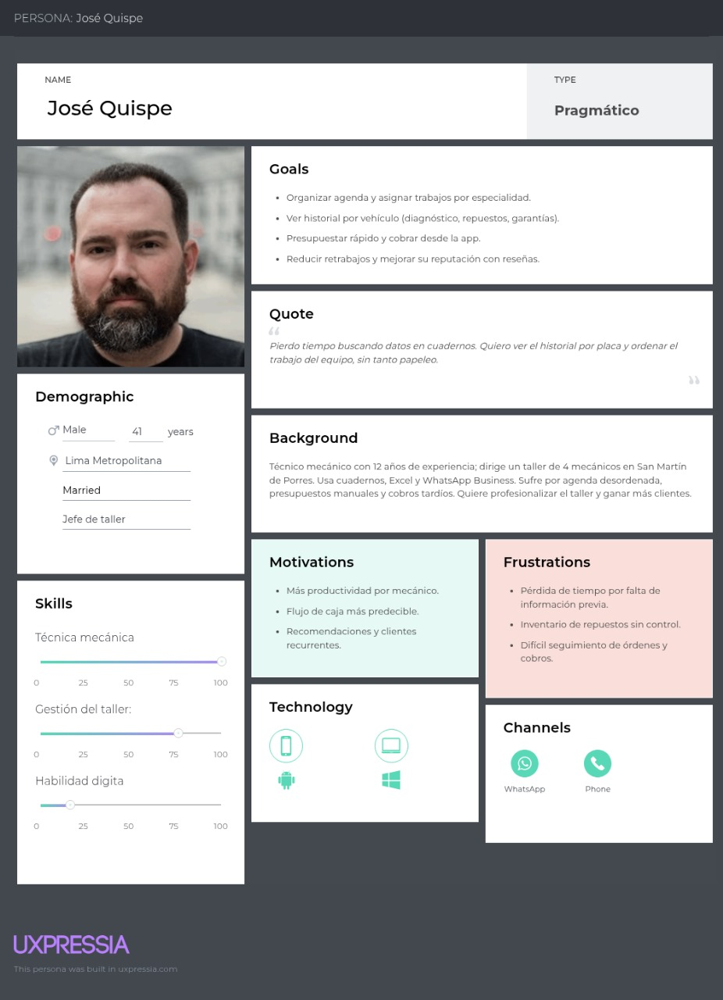

[Ver mapa user persona hecho en UxPressia guardado en Drive](https://drive.google.com/drive/folders/1Ng0UPewRqDezQuOSRunusah6vk5xM6lg?usp=sharing)

<br>

- User Persona de Marina Salinas (propietaria)
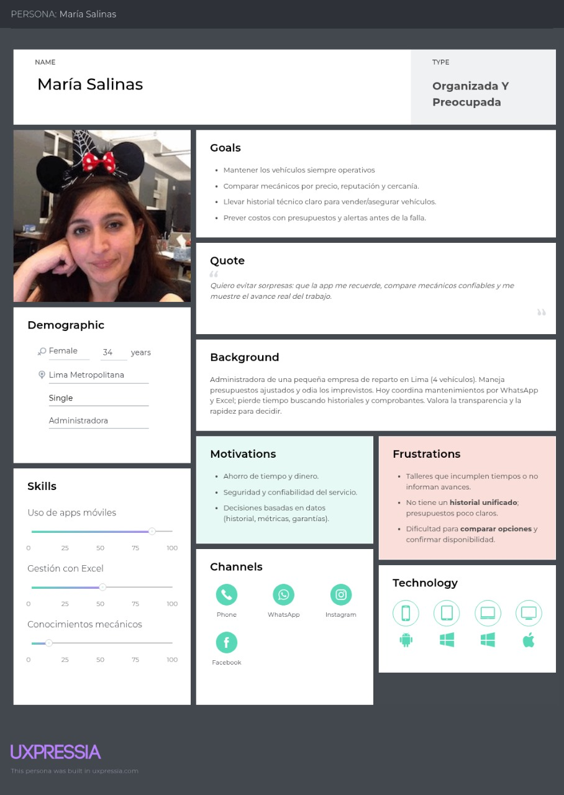

[Ver mapa user persona hecho en UxPressia guardado en Drive](https://drive.google.com/drive/folders/1Ng0UPewRqDezQuOSRunusah6vk5xM6lg?usp=sharing)


#### 2.3.2. User Task Matrix

<p>En esta sección se presenta el User Task Matrix, que concentra las tareas que los User Persona (que representan a cada segmento) realizan para cumplir sus objetivos. No confundir tareas (tasks) con opciones o características de software, pues las tareas deben ser realizadas por los segmentos independientemente de la existencia de su solución de software.</p>

<table border="1" cellpadding="6" cellspacing="0">
  <thead>
    <tr>
      <th rowspan="2">TASK</th>
      <th colspan="2">Propietario de vehículo</th>
      <th colspan="2">Mecánico</th>
    </tr>
    <tr>
      <th>Frecuencia</th>
      <th>Importancia</th>
      <th>Frecuencia</th>
      <th>Importancia</th>
    </tr>
  </thead>
  <tbody>
    <tr>
      <td>Iniciar sesión en la app</td>
      <td>Always</td>
      <td>High</td>
      <td>Always</td>
      <td>High</td>
    </tr>
    <tr>
      <td>Consultar historial de mantenimiento</td>
      <td>Often</td>
      <td>High</td>
      <td>Rarely</td>
      <td>Medium</td>
    </tr>
    <tr>
      <td>Solicitar cita de mantenimiento</td>
      <td>Always</td>
      <td>High</td>
      <td>Sometimes</td>
      <td>Medium</td>
    </tr>
    <tr>
      <td>Confirmar cita de mantenimiento</td>
      <td>Always</td>
      <td>High</td>
      <td>Always</td>
      <td>High</td>
    </tr>
    <tr>
      <td>Ver estado de mantenimiento</td>
      <td>Often</td>
      <td>High</td>
      <td>Always</td>
      <td>High</td>
    </tr>
    <tr>
      <td>Dejar reseña de taller</td>
      <td>Sometimes</td>
      <td>Medium</td>
      <td>Rarely</td>
      <td>Low</td>
    </tr>
    <tr>
      <td>Recibir notificación de avance de mantenimiento</td>
      <td>Always</td>
      <td>High</td>
      <td>Always</td>
      <td>High</td>
    </tr>
    <tr>
      <td>Consultar disponibilidad de mecánicos</td>
      <td>Always</td>
      <td>High</td>
      <td>Sometimes</td>
      <td>Medium</td>
    </tr>
    <tr>
      <td>Ver precios de servicios de taller</td>
      <td>Often</td>
      <td>High</td>
      <td>Sometimes</td>
      <td>Medium</td>
    </tr>
    <tr>
      <td>Recibir confirmación de cita</td>
      <td>Always</td>
      <td>High</td>
      <td>Always</td>
      <td>High</td>
    </tr>
    <tr>
      <td>Registrar un incidente o reclamo</td>
      <td>Sometimes</td>
      <td>High</td>
      <td>Sometimes</td>
      <td>High</td>
    </tr>
    <tr>
      <td>Consultar mapa de talleres cercanos</td>
      <td>Often</td>
      <td>Medium</td>
      <td>Rarely</td>
      <td>Low</td>
    </tr>
    <tr>
      <td>Ver promociones de talleres favoritos</td>
      <td>Sometimes</td>
      <td>Medium</td>
      <td>Rarely</td>
      <td>Low</td>
    </tr>
    <tr>
      <td>Confirmar disponibilidad de citas con mecánicos</td>
      <td>Never</td>
      <td>Low</td>
      <td>Always</td>
      <td>High</td>
    </tr>
    <tr>
      <td>Ver historial de calificaciones de talleres</td>
      <td>Often</td>
      <td>Medium</td>
      <td>Rarely</td>
      <td>Low</td>
    </tr>
    <tr>
      <td>Ver detalles del mantenimiento realizado</td>
      <td>Sometimes</td>
      <td>High</td>
      <td>Always</td>
      <td>High</td>
    </tr>
    <tr>
      <td>Comunicación con el propietario (mensaje/chat)</td>
      <td>Never</td>
      <td>Low</td>
      <td>Always</td>
      <td>High</td>
    </tr>
    <tr>
      <td>Consultar disponibilidad de mecánicos por ubicación geográfica</td>
      <td>Often</td>
      <td>High</td>
      <td>Sometimes</td>
      <td>Medium</td>
    </tr>
    <tr>
      <td>Recibir alertas de cambios en mantenimiento o citas</td>
      <td>Sometimes</td>
      <td>High</td>
      <td>Always</td>
      <td>High</td>
    </tr>
    <tr>
      <td>Ver estado de pagos y facturación</td>
      <td>Always</td>
      <td>High</td>
      <td>Never</td>
      <td>Low</td>
    </tr>
    <tr>
      <td>Actualizar datos personales (vehículo, dirección)</td>
      <td>Rarely</td>
      <td>Medium</td>
      <td>Never</td>
      <td>Low</td>
    </tr>
  </tbody>
</table>


#### 2.3.3. User Journey Mapping

Los siguientes User Journey Maps corresponden a cada User Persona. Estos diagramas nos ayudarán a identificar y comprender las dificultades que enfrentan en cada fase, desde el momento en que conocen nuestra aplicación hasta la etapa en la que comparten sus experiencias y opiniones sobre su uso.
<br>

- User Journey Map de José Quispe (mecánico)
<br>

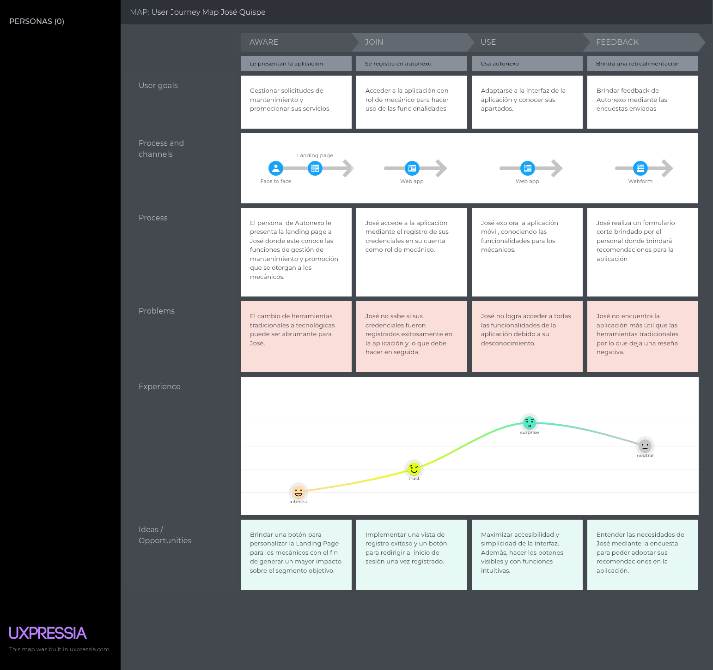

[Ver mapa completo hecho en UxPressia guardado en Drive](https://drive.google.com/drive/folders/10U-cHuHY3O-ueZ04tsT49D_9nUT28R7v?usp=drive_link)
<br>

- User Journey Map de Marina Salinas (propietaria)
<br>

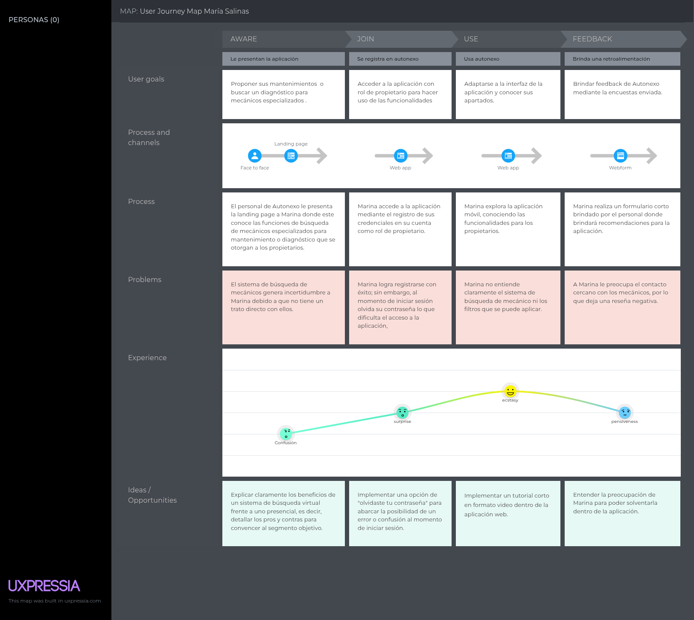

[Ver mapa completo hecho en UxPressia guardado en Drive](https://drive.google.com/drive/folders/10U-cHuHY3O-ueZ04tsT49D_9nUT28R7v?usp=drive_link)
<br>


#### 2.3.4. Empathy Mapping

En esta sección, se elaboró un Empathy Map para analizar a nuestros usuarios, comprendiendo completamente el entorno en el que se desenvuelven. Este proceso nos permitirá profundizar en sus necesidades y orientarnos hacia la oferta de servicios que realmente les sean útiles.
<br>

Para la construcción de los Empathy Maps, el equipo siguió los siguientes pasos:

1.-Preparación: Se revisó la ficha de cada User Persona creada previamente (José Quispe y María Salinas).

2.-Colocar al centro el User Persona: Cada mapa fue desarrollado teniendo al usuario en el centro del análisis, asegurando que sus características, contexto y metas guíen el proceso.

3.-Lluvia de ideas en equipo: Cada integrante compartió observaciones y percepciones sobre el comportamiento, necesidades y frustraciones de los usuarios.

4.-Distribución en secciones: En la herramienta de mapeo se organizaron los aportes respondiendo las preguntas clave:

- ¿Con quién estamos empatizando?
- ¿Qué necesita hacer?
- ¿Qué está diciendo?
- ¿Qué está viendo?
- ¿Qué está haciendo?
- ¿Qué está escuchando?
- ¿Cómo se siente y qué piensa?


5.-Identificación de Pains y Gains: Se clasificaron las preocupaciones, frustraciones y motivaciones que influyen en la experiencia del usuario.

6.-Síntesis: Se consolidaron los hallazgos en un mapa final para cada persona.

<br>

- Empathy Map de José Quispe (mecánico)
<br>

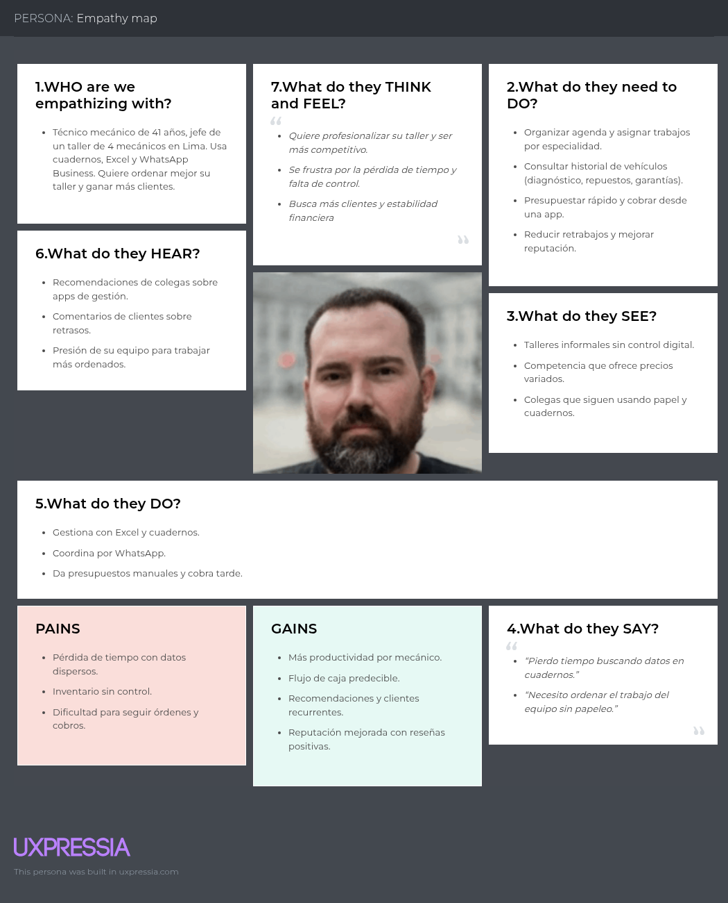

[Ver mapa completo hecho en UxPressia guardado en Drive](https://drive.google.com/drive/folders/1SIQ263bxvb-gNEhv7TxBklQGdferWbHq?usp=sharing)
<br>

- Empathy Map de Marina Salinas (propietaria)
<br>

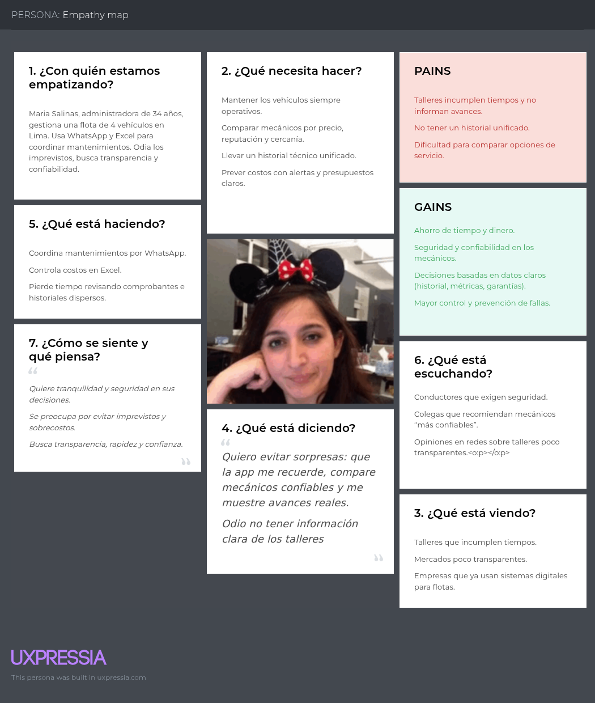

[Ver mapa completo hecho en UxPressia guardado en Drive](https://drive.google.com/drive/folders/1SIQ263bxvb-gNEhv7TxBklQGdferWbHq?usp=sharing)
<br>


#### 2.3.5. As-is Scenario Mapping

En esta sección se representan los escenarios actuales (“As-is”) de nuestros User Persona antes de utilizar la solución propuesta. Estos mapas permiten identificar cómo los usuarios realizan actualmente sus tareas relacionadas con el mantenimiento vehicular, así como las dificultades, frustraciones y limitaciones presentes en cada etapa del proceso. El análisis de estos escenarios nos ayuda a comprender con mayor profundidad los pain points de cada segmento y a justificar las funcionalidades planteadas para Autonexo.
<br>
- As-is Scenario Mapping de José Quispe (mecánico)
<br>
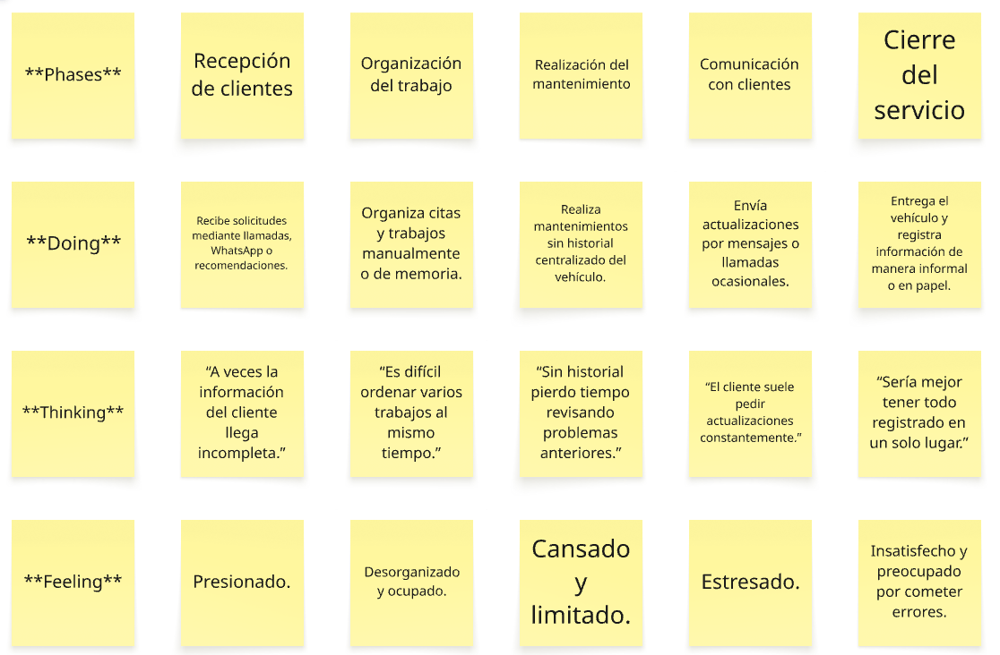
<br>
- As-is Scenario Mapping de Marina Salinas (propietaria)
<br>
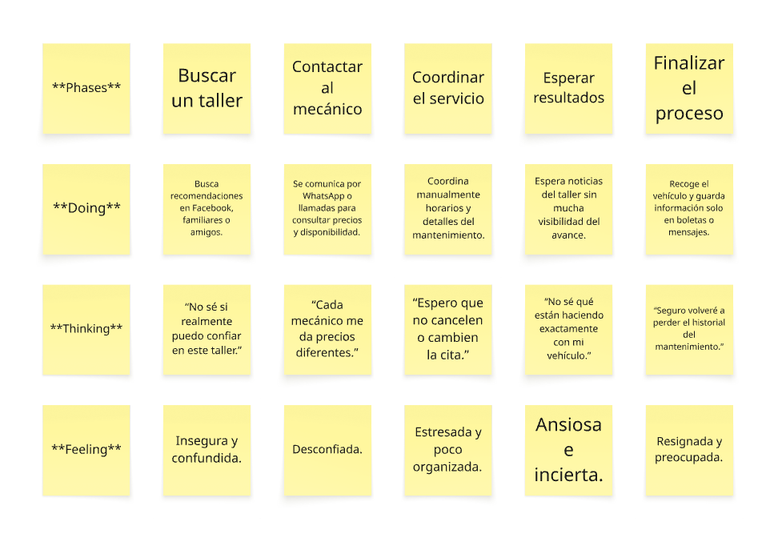
<br>

### 2.4. Ubiquitous Language

<br>
1. Matching & Booking Context

- Service Request (Solicitud de servicio): Pedido inicial que realiza un cliente para atender una necesidad de mantenimiento o reparación.

- Offer (Oferta): Propuesta realizada por un taller (workshop) para cubrir un Service Request, incluyendo condiciones de precio y tiempo.

- Booking (Reserva): Confirmación de una oferta aceptada por el cliente.

- Booking Confirmation (Confirmación de reserva): Estado en el que el cliente valida definitivamente la reserva y queda registrada en el sistema.

- Booking Reschedule (Reprogramación de reserva): Cambio de la fecha o franja horaria de una reserva existente.

2. Trust & Reputation Context

- Review (Reseña): Valoración escrita y numérica de un servicio recibido por parte de un cliente.

- Trust Score (Puntaje de confianza): Métrica compuesta que refleja la reputación de un taller, un cliente o un servicio específico, en base a reseñas y comportamientos.

- Reputation (Reputación): Percepción acumulada de la calidad y confiabilidad de un taller u oferente, basada en interacciones previas.

3. Workshop Context

- Workshop (Taller): Negocio o entidad que ofrece servicios de reparación y mantenimiento de vehículos.

- Workshop Schedule (Agenda del taller): Plan de disponibilidad de un taller para aceptar reservas.

- Service Order (Orden de servicio): Documento operativo que organiza y detalla el trabajo a realizar sobre un vehículo dentro de un taller.

- Service Item (Ítem de servicio): Actividad o tarea específica incluida dentro de una orden de servicio (ej. cambio de aceite, alineación de ruedas).

4. Vehicle & Maintenance Context

- Vehicle (Vehículo): Bien físico perteneciente a un cliente, sobre el cual se realizan operaciones de mantenimiento o reparación.

- Maintenance Record (Registro de mantenimiento): Histórico auditable de todas las intervenciones realizadas a un vehículo.

- Check-in (Ingreso): Momento en el cual un vehículo es recibido en el taller para iniciar un servicio.

- Check-out (Salida): Momento en el cual un vehículo es entregado de vuelta al cliente tras completar los servicios.

5. Payment & Subscription Context

- Subscription (Suscripción): Acuerdo recurrente mediante el cual un cliente paga para acceder a beneficios o servicios de la plataforma.

- Payment (Pago): Transacción monetaria realizada por un cliente para activar o renovar una suscripción.

- Invoice (Factura): Documento que refleja el detalle de un pago realizado por un cliente.

- Billing Cycle (Ciclo de facturación): Periodo de tiempo que define cuándo corresponde realizar un cobro por la suscripción.

6. IAM (Identity & Access Management) Context

- User (Usuario): Persona que accede a la plataforma con credenciales únicas.

- Role (Rol): Conjunto de permisos asignados a un usuario que define qué acciones puede realizar.

- Permission (Permiso): Autorización concreta para ejecutar una acción en el sistema.

- AuEntoncestication (Autenticación): Proceso de verificar la identidad de un usuario mediante credenciales.

- Authorization (Autorización): Proceso de validar que un usuario tiene permisos para acceder a un recurso o realizar una acción.

7. Notifications Context

- Notification (Notificación): Mensaje enviado a uno o más destinatarios para informar sobre un evento o recordatorio.

- Channel (Canal): Medio a través del cual se entrega una notificación (Push, Email, SMS).

- Template (Plantilla): Formato predefinido de un mensaje utilizado en las notificaciones.

- Reminder (Recordatorio): Tipo de notificación programada que recuerda al cliente un evento próximo (ej. revisión del vehículo).

- Transactional Notification (Notificación transaccional): Mensaje generado automáticamente por un evento del sistema (ej. confirmación de reserva).

<div style="page-break-after: always;"></div>

## Capítulo III: Requirements Specification

### 3.1. To-Be Scenario Mapping

En esta sección se presenta el desarrollo de los To-Be Scenario Mapping elaborados para los dos User Persona del proyecto Autonexo: el propietario de vehículo y el mecánico.

El objetivo de este análisis fue visualizar cómo será la experiencia futura de los usuarios al interactuar con la aplicación propuesta, identificando mejoras frente al escenario actual (As-Is), especialmente en aspectos como organización, confianza, rapidez y comunicación.

Para la elaboración de los mapas, el equipo realizó un proceso dividido en varias etapas. Primero, se revisaron las entrevistas, User Persona y hallazgos obtenidos durante la etapa de investigación. Luego, cada integrante realizó una lluvia de ideas individual sobre cómo debería ser la experiencia ideal del usuario utilizando la aplicación. Posteriormente, se revisaron y consolidaron las propuestas más relevantes, identificando las fases principales del recorrido del usuario y organizándolas como columnas dentro del mapa. Finalmente, se comparó el escenario futuro con el As-Is Scenario Mapping para reconocer mejoras potenciales y oportunidades de valor para los usuarios.

A diferencia del escenario actual, donde los usuarios dependen de recomendaciones informales, mensajes por WhatsApp y registros manuales, el To-Be plantea una experiencia centralizada, transparente y mucho más organizada mediante el uso de una aplicación móvil intuitiva.

#### To-Be Scenario Mapping – User Persona: Marina Salinas (Propietaria de vehículo)


**Cambios identificados respecto al As-Is**
- Mayor transparencia en precios y servicios.
- Reducción de la desconfianza hacia talleres.
- Mejor comunicación entre cliente y mecánico.
- Seguimiento en tiempo real del mantenimiento.
- Historial digital accesible desde cualquier momento.
- Menor dependencia de llamadas, mensajes informales o recomendaciones externas.

**Áreas positivas esperadas**
- Experiencia más rápida y simple.
- Mayor control sobre el mantenimiento del vehículo.
- Mejor organización de citas y pagos.
- Confianza gracias a reseñas y seguimiento visual.

**Blank Areas**
- Conocer qué tan seguido los usuarios revisarían el historial del vehículo.
- Identificar qué tipo de notificaciones consideran más útiles.
- Evaluar qué tan importante es integrar promociones o programas de fidelización.

#### To-Be Scenario Mapping – User Persona: José Quispe (Mecánico)


**Cambios identificados respecto al As-Is**
- Reducción de la desorganización en citas y mantenimientos.
- Menor dependencia de WhatsApp o registros manuales.
- Mejor comunicación con los clientes.
- Mayor profesionalismo y transparencia del taller.
- Historial digital que facilita diagnósticos futuros.
-Optimización del tiempo y priorización de trabajos.

**Áreas positivas esperadas**
- Mejor control de mantenimientos pendientes.
- Incremento de confianza y reputación del taller.
- Flujo de trabajo más ordenado.
- Mejor experiencia tanto para el mecánico como para el cliente.

**Blank Areas**
- Determinar qué métricas visuales serían más útiles para los talleres.
- Evaluar si los mecánicos prefieren alertas automáticas o manuales.
- Analizar qué funciones adicionales podrían ayudar en diagnósticos rápidos.


### 3.2. User Stories

Las historias de usuario constituyen una herramienta fundamental para traducir las necesidades detectadas en entrevistas con usuarios potenciales en especificaciones funcionales del sistema. Su adecuada formulación permite estructurar requisitos claros, priorizados y orientados al usuario final, facilitando así su interpretación por parte del equipo de desarrollo. Esta práctica no solo garantiza una mejor alineación entre las expectativas del cliente y las funcionalidades desarrolladas, sino que también mejora la planificación y asignación de tareas en el ciclo de vida del software. En el caso del proyecto TrackLab, se ha definido un conjunto estructurado de épicas e historias de usuario que sirven como base para el diseño de la landing page, el desarrollo de la aplicación web y la definición de los requerimientos técnicos asociados.


<table border="1">
    <thead>
        <tr>
            <th>Story ID</th>
            <th>Título</th>
            <th>Descripción</th>
            <th>Acceptance Criteria</th>
            <th>Linked ID</th>
        </tr>
    </thead>
    <tbody>  
    <tr>
      <td>US01</td>
      <td>Visualizar información y beneficios (Landing Page)</td>
      <td>Como visitante, quiero visualizar la información general de la aplicación y sus beneficios, para entender qué ofrece antes de registrarme.</td>
      <td>
        <p><strong>Scenario 1 — Landing informativa:</strong><br>
          • Dado que un visitante accede a la landing page<br>
          • Cuando navega por la sección de información<br>
          • Entonces el sistema (o la página) presenta claramente los beneficios, secciones y llamados a la acción con información completa sobre el servicio.
        </p>
      </td>
      <td>EP07</td>
    </tr>
    <tr>
      <td>US02</td>
      <td>Catálogo de servicios de taller</td>
      <td>Como taller, quiero publicar ofertas de mantenimiento (ej. cambio de aceite, frenos, afinamiento) con precio, duración y cobertura, para que los propietarios las encuentren y reserven.</td>
      <td>
        <p><strong>Scenario 1 — Publicación válida:</strong><br>
          • Dado que el taller proporciona título, descripción, precio, duración, categorías y compatibilidades mínimas<br>
          • Cuando solicita publicar la oferta<br>
          • Entonces el sistema guarda la oferta con estado publicada, registra timestamps y la hace visible en el catálogo.
        </p>
        <p><strong>Scenario 2 — Campos obligatorios incompletos:</strong><br>
          • Dado que el taller omite campos obligatorios (ej. precio o categoría)<br>
          • Cuando intenta publicar la oferta<br>
          • Entonces el sistema rechaza la publicación y devuelve la lista de campos obligatorios faltantes.
        </p>
        <p><strong>Scenario 3 — Imágenes/validación:</strong><br>
          • Dado que el taller adjunta imágenes que exceden límites permitidos<br>
          • Cuando intenta subir las imágenes<br>
          • Entonces el sistema rechaza las imágenes que exceden el tamaño y acepta las válidas.
        </p>
      </td>
      <td>EP02</td>
    </tr>
    <tr>
      <td>US03</td>
      <td>Explorar catálogo y búsqueda</td>
      <td>Como propietario, quiero explorar y buscar ofertas de mantenimiento por palabras clave y categorías, para comparar opciones.</td>
      <td>
        <p><strong>Scenario 1 — Búsqueda con resultados:</strong><br>
          • Dado que existen ofertas que coinciden con término o categoría<br>
          • Cuando el propietario busca por palabra clave, categoría o filtro<br>
          • Entonces el sistema devuelve una lista de ofertas coincidentes paginada y ordenable por distancia, precio, rating o relevancia.
        </p>
        <p><strong>Scenario 2 — Sin resultados:</strong><br>
          • Dado que no hay ofertas que coincidan con los criterios de búsqueda<br>
          • Cuando el propietario realiza la búsqueda<br>
          • Entonces el sistema devuelve una lista vacía y sugiere alternativas (otras categorías o ampliar rango).
        </p>
        <p><strong>Scenario 3 — Vista detalle:</strong><br>
          • Dado que el propietario solicita info de una oferta<br>
          • Cuando solicita ver el detalle de la oferta<br>
          • Entonces el sistema entrega la información completa de la oferta y los datos del taller (rating, ubicación, términos).
        </p>
      </td>
      <td>EP03</td>
    </tr>
    <tr>
      <td>US04</td>
      <td>Filtrar por servicio</td>
      <td>Como usuario, quiero filtrar por categorías de servicio (ej. cambio de aceite, frenos, afinamiento), para ver solo ofertas relevantes.</td>
      <td>
        <p><strong>Scenario 1 — Filtros básicos:</strong><br>
          • Dado que existen ofertas con distintas categorías<br>
          • Cuando el usuario aplica filtros por categoría o subcategoría<br>
          • Entonces el sistema devuelve únicamente las ofertas que cumplen los criterios seleccionados.
        </p>
        <p><strong>Scenario 2 — Filtros avanzados:</strong><br>
          • Dado que el usuario aplica filtros por compatibilidad (marca/motor/combustible)<br>
          • Cuando aplica dichos filtros<br>
          • Entonces el sistema muestra las ofertas compatibles y oculta las no compatibles.
        </p>
      </td>
      <td>EP03</td>
    </tr>
    <tr>
      <td>US05</td>
      <td>Recomendación por geolocalización</td>
      <td>Como propietario, quiero ver talleres cercanos según rango, para coordinar fácil.</td>
      <td>
        <p><strong>Scenario 1 — Talleres dentro del rango:</strong><br>
          • Dado que existen talleres disponibles dentro del rango definido por el propietario<br>
          • Cuando solicita ver talleres cercanos<br>
          • Entonces el sistema lista los talleres ordenados por distancia.
        </p>
        <p><strong>Scenario 2 — Fallback por código postal:</strong><br>
          • Dado que el propietario no permite ubicación por GPS o GPS falla<br>
          • Cuando el propietario suministra código postal o ciudad<br>
          • Entonces el sistema busca talleres dentro del área indicada y devuelve resultados.
        </p>
        <p><strong>Scenario 3 — Sin talleres en rango:</strong><br>
          • Dado que no hay talleres en el rango definido<br>
          • Cuando solicita buscar<br>
          • Entonces el sistema muestra un mensaje indicando ausencia de talleres en ese rango y sugiere ampliar búsqueda.
        </p>
      </td>
      <td>EP03</td>
    </tr>
    <!-- FASE 2: CONFIGURACIÓN BÁSICA -->
    <tr>
      <td>US06</td>
      <td>Registro de vehículo</td>
      <td>Como propietario, quiero registrar mi vehículo ingresando sus datos básicos, para que quede vinculado a mi perfil.</td>
      <td>
        <p><strong>Scenario 1 — Registro exitoso:</strong><br>
          • Dado que el propietario proporciona todos los datos requeridos del vehículo (marca, modelo, año, placa, etc.)<br>
          • Cuando solicita guardar el registro<br>
          • Entonces el sistema asocia y almacena el vehículo en el perfil del propietario.
        </p>
        <p><strong>Scenario 2 — Registro incompleto:</strong><br>
          • Dado que el propietario omite uno o más campos obligatorios<br>
          • Cuando intenta guardar el registro<br>
          • Entonces el sistema devuelve un error indicando los campos faltantes y no crea el registro.
        </p>
      </td>
      <td>EP01</td>
    </tr>
    <tr>
      <td>US07</td>
      <td>Adjuntar historial inicial</td>
      <td>Como propietario, quiero adjuntar el historial de mantenimiento de mi vehículo, para que el taller conozca trabajos previos.</td>
      <td>
        <p><strong>Scenario 1 — Historial adjuntado:</strong><br>
          • Dado que el propietario dispone de documentos o datos de mantenimientos previos<br>
          • Cuando incorpora la información o adjunta los documentos y confirma el registro del vehículo<br>
          • Entonces el sistema guarda el historial asociado al vehículo y lo marca como disponible para talleres autorizados.
        </p>
        <p><strong>Scenario 2 — Sin historial:</strong><br>
          • Dado que el propietario no tiene historial disponible<br>
          • Cuando finaliza el registro del vehículo<br>
          • Entonces el sistema crea el registro del vehículo sin historial asociado y lo deja marcado como “sin historial”.
        </p>
      </td>
      <td>EP01</td>
    </tr>
    <tr>
      <td>US08</td>
      <td>Visualizar historial de vehículo</td>
      <td>Como taller, quiero visualizar el historial de mantenimientos de un vehículo registrado, para conocer antecedentes y diagnósticos previos.</td>
      <td>
        <p><strong>Scenario 1 — Vehículo con historial:</strong><br>
          • Dado que el vehículo tiene registros previos de mantenimiento<br>
          • Cuando el taller solicita consultar el historial del vehículo<br>
          • Entonces el sistema entrega la lista de registros previos (fechas, tipo de servicio, taller, notas) de forma completa y ordenada.
        </p>
        <p><strong>Scenario 2 — Vehículo sin historial:</strong><br>
          • Dado que el vehículo no tiene registros previos<br>
          • Cuando el taller solicita el historial<br>
          • Entonces el sistema indica que no existen registros previos para ese vehículo.
        </p>
      </td>
      <td>EP01</td>
    </tr>
    <!-- FASE 3: COMUNICACIÓN Y COORDINACIÓN -->
    <tr>
      <td>US09</td>
      <td>Sistema de mensajería</td>
      <td>Como usuario, quiero contar con un chat integrado, para coordinar detalles del mantenimiento.</td>
      <td>
        <p><strong>Scenario 1 — Envío / recepción de mensajes:</strong><br>
          • Dado que dos usuarios (propietario y taller) desean comunicarse<br>
          • Cuando uno envía un mensaje<br>
          • Entonces el sistema entrega el mensaje al destinatario y registra la conversación.
        </p>
        <p><strong>Scenario 2 — Adjuntar fotos:</strong><br>
          • Dado que el remitente adjunta imágenes del vehículo<br>
          • Cuando envía el mensaje con adjuntos<br>
          • Entonces el sistema acepta imágenes dentro de los límites establecidos y las asocia a la conversación.
        </p>
        <p><strong>Scenario 3 — Notificación de nuevo mensaje:</strong><br>
          • Dado que llega un nuevo mensaje<br>
          • Cuando el destinatario está offline o en otra sección<br>
          • Entonces el sistema genera una notificación que informa la llegada del nuevo mensaje.
        </p>
        <p><strong>Scenario 4 — Reporte de abuso:</strong><br>
          • Dado que un usuario recibe mensajes inapropiados<br>
          • Cuando reporta la conversación por abuso<br>
          • Entonces el sistema registra la denuncia y marca la conversación para revisión.
        </p>
      </td>
      <td>EP04</td>
    </tr>
    <tr>
      <td>US10</td>
      <td>Coordinación de citas de mantenimiento</td>
      <td>Como usuario, quiero proponer/aceptar una cita con fecha/hora, para agendar el servicio.</td>
      <td>
        <p><strong>Scenario 1 — Proponer y aceptar cita:</strong><br>
          • Dado que el taller dispone de slots y el propietario solicita servicio<br>
          • Cuando el taller propone una fecha/hora y el propietario la acepta<br>
          • Entonces el sistema registra la cita en ambas agendas y la confirma a ambas partes.
        </p>
        <p><strong>Scenario 2 — Reprogramación:</strong><br>
          • Dado que existe una cita programada<br>
          • Cuando una de las partes solicita reprogramar y la otra acepta un nuevo slot disponible<br>
          • Entonces el sistema actualiza la cita y notifica los cambios.
        </p>
        <p><strong>Scenario 3 — Conflicto de agenda:</strong><br>
          • Dado que el slot propuesto ya está ocupado en la agenda del taller<br>
          • Cuando se intenta confirmar una cita que choca con otra<br>
          • Entonces el sistema rechaza la confirmación y solicita seleccionar otro slot.
        </p>
      </td>
      <td>EP04</td>
    </tr>
    <tr>
      <td>US11</td>
      <td>Notificaciones push</td>
      <td>Como usuario, quiero recibir notificaciones push, para estar informado de eventos relacionados con mis vehículos y mantenimientos.</td>
      <td>
        <p><strong>Scenario 1 — Mensaje nuevo:</strong><br>
          • Dado que llega un mensaje nuevo al usuario<br>
          • Cuando el mensaje es enviado por el remitente<br>
          • Entonces el sistema notifica al destinatario mediante notificación push.
        </p>
        <p><strong>Scenario 2 — Reserva confirmada:</strong><br>
          • Dado que una reserva o cita es confirmada<br>
          • Cuando la confirmación queda registrada<br>
          • Entonces el sistema notifica push a ambas partes.
        </p>
        <p><strong>Scenario 3 — Avance del mantenimiento:</strong><br>
          • Dado que el taller actualiza la checklist con un hito relevante<br>
          • Cuando el hito se marca como completado<br>
          • Entonces el sistema notifica al propietario el avance del servicio.
        </p>
      </td>
      <td>EP04</td>
    </tr>
    <tr>
      <td>US12</td>
      <td>Actualización de checklist en mantenimiento</td>
      <td>Como taller, quiero marcar tareas en la checklist de un mantenimiento en tiempo real, para registrar los avances del servicio.</td>
      <td>
        <p><strong>Scenario 1 — Actualización de tareas (taller):</strong><br>
          • Dado que el taller está realizando un mantenimiento y existe una checklist asociada<br>
          • Cuando el taller marca una o varias tareas como realizadas<br>
          • Entonces el sistema actualiza el estado del mantenimiento y registra la marcación en la trazabilidad del servicio, además notifica el cambio al propietario.
        </p>
      </td>
      <td>EP05</td>
    </tr>
    <tr>
      <td>US13</td>
      <td>Creación de mantenimiento confirmado</td>
      <td>Como taller, quiero crear un mantenimiento confirmado a partir de una reserva aceptada, para dar inicio al servicio.</td>
      <td>
        <p><strong>Scenario 1 — Creación desde reserva aceptada:</strong><br>
          • Dado que el propietario ha aceptado una propuesta o reserva<br>
          • Cuando el taller confirma el inicio del servicio<br>
          • Entonces el sistema crea el registro de mantenimiento pendiente, genera la checklist inicial y asocia la reserva al mantenimiento.
        </p>
        <p><strong>Scenario 2 — Validación de datos antes de crear:</strong><br>
          • Dado que el taller intenta crear un mantenimiento desde una reserva<br>
          • Cuando el sistema valida que la reserva esté en estado "aceptada" y que todos los datos requeridos estén completos<br>
          • Entonces el sistema verifica la validez de la reserva antes de proceder con la creación del mantenimiento.
        </p>
        <p><strong>Scenario 3 — Generación automática de checklist:</strong><br>
          • Dado que se está creando un mantenimiento confirmado<br>
          • Cuando el sistema genera la checklist inicial basada en el tipo de servicio solicitado<br>
          • Entonces el sistema crea automáticamente las tareas estándar para ese tipo de mantenimiento y las marca como pendientes.
        </p>
      </td>
      <td>EP05</td>
    </tr>
    <tr>
      <td>US14</td>
      <td>Visualización de mantenimientos pendientes</td>
      <td>Como usuario, quiero visualizar los mantenimientos pendientes, para dar seguimiento al servicio.</td>
      <td>
        <p><strong>Scenario 1 — Taller: lista de pendientes:</strong><br>
          • Dado que el taller tiene mantenimientos asignados<br>
          • Cuando consulta su listado de trabajos<br>
          • Entonces el sistema muestra la lista de servicios pendientes con su estado y prioridades.
        </p>
        <p><strong>Scenario 2 — Propietario: detalle de su mantenimiento:</strong><br>
          • Dado que el vehículo del propietario está en mantenimiento<br>
          • Cuando el propietario consulta el detalle del servicio en curso<br>
          • Entonces el sistema muestra el estado actual y la checklist asociada en tiempo real.
        </p>
      </td>
      <td>EP05</td>
    </tr>
    <tr>
      <td>US15</td>
      <td>Visualización de checklist en mantenimiento</td>
      <td>Como propietario, quiero visualizar en tiempo real el progreso de la checklist del mantenimiento, para conocer el avance del servicio.</td>
      <td>
        <p><strong>Scenario 1 — Visualización Completa de Checklist:</strong><br>
          • Dado que el vehículo está en mantenimiento y la checklist está completa<br>
          • Cuando el propietario solicita el detalle del servicio<br>
          • Entonces el sistema muestra todas las tareas completadas y las pendientes, con marcas temporales de cada avance, y resalta las tareas que han sido completadas.
        </p>
        <p><strong>Scenario 2 — Checklist en Progreso:</strong><br>
          • Dado que el vehículo está en mantenimiento y la checklist tiene tareas en progreso<br>
          • Cuando el propietario solicita el detalle del servicio<br>
          • Entonces el sistema muestra las tareas pendientes y las que están en progreso, con un indicador visual de progreso (por ejemplo, barra de progreso o porcentaje completado).
        </p>
        <p><strong>Scenario 3 — Actualización en Tiempo Real:</strong><br>
          • Dado que el vehículo está siendo atendido y las tareas de la checklist están siendo actualizadas<br>
          • Cuando el propietario visualiza la checklist<br>
          • Entonces el sistema actualiza la información en tiempo real, reflejando cualquier cambio en el estado de las tareas sin necesidad de recargar la página.
        </p>
      </td>
      <td>EP05</td>
    </tr>
    <tr>
      <td>US16</td>
      <td>Finalización de mantenimiento</td>
      <td>Como taller, quiero finalizar un mantenimiento y registrar los resultados, para cerrar correctamente el servicio.</td>
      <td>
        <p><strong>Scenario 1 — Confirmación de Finalización:</strong><br>
          • Dado que el taller ha completado todas las tareas de la checklist<br>
          • Cuando el taller marca el mantenimiento como finalizado<br>
          • Entonces el sistema solicita una confirmación de la finalización antes de cerrar el servicio, asegurando que no falten tareas.
        </p>
        <p><strong>Scenario 2 — Generación de Informe de Mantenimiento:</strong><br>
          • Dado que el mantenimiento ha sido finalizado y los resultados registrados<br>
          • Cuando el taller finaliza el servicio<br>
          • Entonces el sistema genera un informe final que incluye todos los detalles del mantenimiento (trabajos realizados, repuestos, observaciones, fechas) y lo guarda para su futura consulta en el historial del vehículo.
        </p>
      </td>
      <td>EP05</td>
    </tr>
    <!-- FASE 5: PERSONALIZACIÓN Y CONVENIENCIA -->
    <tr>
      <td>US17</td>
      <td>Taller favorito</td>
      <td>Como propietario, quiero marcar un taller como favorito, para priorizarlo en futuras reservas.</td>
      <td>
        <p><strong>Scenario 1 — Agregar a favoritos:</strong><br>
          • Dado que el propietario identifica un taller que desea priorizar<br>
          • Cuando añade el taller a su lista de favoritos<br>
          • Entonces el sistema almacena el taller en la lista de favoritos del propietario.
        </p>
        <p><strong>Scenario 2 — Quitar de favoritos:</strong><br>
          • Dado que el taller está en la lista de favoritos<br>
          • Cuando el propietario lo elimina<br>
          • Entonces el sistema lo retira de la lista de favoritos.
        </p>
      </td>
      <td>EP03</td>
    </tr>
    <tr>
      <td>US18</td>
      <td>Promociones de taller de confianza</td>
      <td>Como propietario, quiero ver promociones de mis talleres favoritos, para decidir antes que el resto.</td>
      <td>
        <p><strong>Scenario 1 — Promos disponibles de favoritos:</strong><br>
          • Dado que existen promociones activas de los talleres favoritos del propietario<br>
          • Cuando el propietario consulta el feed de promociones<br>
          • Entonces el sistema destaca las promociones de favoritos con datos de vigencia, cupos y precio promocional.
        </p>
        <p><strong>Scenario 2 — Mostrar condiciones de promo:</strong><br>
          • Dado que una promoción tiene condiciones (cupos limitados, vigencia)<br>
          • Cuando el propietario revisa la promo<br>
          • Entonces el sistema muestra las condiciones completas y la disponibilidad actual.
        </p>
      </td>
      <td>EP03</td>
    </tr>
    <tr>
      <td>US19</td>
      <td>Cancelar reserva de mantenimiento</td>
      <td>Como propietario, quiero cancelar una reserva de mantenimiento programada, para reprogramar si tengo un imprevisto.</td>
      <td>
        <p><strong>Scenario 1 — Cancelación dentro de ventana permitida:</strong><br>
          • Dado que la cancelación se realiza dentro de la ventana configurable (ej. >3h antes de la cita)<br>
          • Cuando el propietario solicita cancelar la reserva<br>
          • Entonces el sistema cambia el estado a cancelada, notifica al taller y aplica la política sin penalidad.
        </p>
        <p><strong>Scenario 2 — Cancelación fuera de ventana:</strong><br>
          • Dado que la cancelación se realiza fuera de la ventana permitida (ej. <3h antes)<br>
          • Cuando el propietario solicita cancelar<br>
          • Entonces el sistema rechaza o aplica la política de penalidad según reglas y notifica al taller.
        </p>
      </td>
      <td>EP02</td>
    </tr>
    <tr>
      <td>US20</td>
      <td>Actualización automática del historial</td>
      <td>Como taller, quiero que el historial del vehículo se actualice automáticamente al finalizar un mantenimiento, para mantener la información al día sin tener que hacerlo manualmente.</td>
      <td>
        <p><strong>Scenario 1 — Mantenimiento finalizado:</strong><br>
          • Dado que el taller marca un mantenimiento como finalizado y registra los resultados (servicios realizados, repuestos, observaciones)<br>
          • Cuando el registro de cierre queda confirmado<br>
          • Entonces el sistema añade automáticamente ese mantenimiento al historial del vehículo y lo hace visible en el historial.
        </p>
        <p><strong>Scenario 2 — Mantenimiento cancelado:</strong><br>
          • Cuando que un mantenimiento es cancelado antes de su finalización<br>
          • Cuando el taller registra la cancelación con motivo<br>
          • Entonces el sistema no añade el mantenimiento al historial y marca el evento como cancelado (sin entrada en historial de servicios realizados).
        </p>
      </td>
      <td>EP01</td>
    </tr>
    <!-- FASE 6: REGISTRO Y SOPORTE -->
    <tr>
      <td>US21</td>
      <td>Registro de usuario (propietario o taller)</td>
      <td>Como visitante, quiero registrarme como propietario o taller desde la landing page, para poder empezar a usar la aplicación.</td>
      <td>
        <p><strong>Scenario 1 — Registro exitoso:</strong><br>
          • Dado que el visitante proporciona los datos necesarios y usa un email único<br>
          • Cuando confirma el registro<br>
          • Entonces el sistema crea la cuenta, la asocia al rol elegido y envía confirmación por correo.
        </p>
        <p><strong>Scenario 2 — Email duplicado:</strong><br>
          • Dado que el email ya está registrado en el sistema<br>
          • Cuando el visitante intenta registrarse con ese email<br>
          • Entonces el sistema impide la duplicación y sugiere recuperar la cuenta o usar otro email.
        </p>
      </td>
      <td>EP07</td>
    </tr>
        <tr>
      <td>US22</td>
      <td>Preguntas frecuentes y soporte</td>
      <td>Como visitante, quiero consultar una sección de preguntas frecuentes y soporte, para resolver dudas comunes antes de usar la aplicación.</td>
      <td>
        <p><strong>Scenario 1 — Acceso a FAQ y contacto:</strong><br>
          • Dado que el visitante necesita información o tiene una duda común<br>
          • Cuando accede a la sección de FAQ o al enlace de soporte<br>
          • Entonces el sistema presenta respuestas categorizadas y ofrece un medio de contacto para soporte en caso de requerir atención personalizada.
        </p>
      </td>
      <td>EP07</td>
    </tr>
    <tr>
      <td>US23</td>
      <td>Contacto y descarga de la app</td>
      <td>Como visitante, quiero acceder a una sección de contacto y call to action para descargar la app, para comunicarme con el equipo o instalar la aplicación fácilmente.</td>
      <td>
        <p><strong>Scenario 1 — Contacto y CTA de descarga:</strong><br>
          • Dado que el visitante busca contactar al equipo o descargar la app<br>
          • Cuando consulta la sección de contacto y descarga<br>
          • Entonces el sistema (la landing) muestra un formulario de contacto funcional y enlaces claros para descargar la app en tiendas compatibles.
        </p>
        <p><strong>Scenario 2 — Envío de formulario de contacto:</strong><br>
          • Dado que el visitante completa el formulario de contacto con datos válidos<br>
          • Cuando envía el formulario<br>
          • Entonces el sistema procesa el mensaje, envía confirmación al visitante y notifica al equipo de soporte sobre la nueva consulta.
        </p>
        <p><strong>Scenario 3 — Descarga según dispositivo:</strong><br>
          • Dado que el visitante accede desde diferentes dispositivos (iOS, Android, desktop)<br>
          • Cuando hace clic en el enlace de descarga<br>
          • Entonces el sistema redirige automáticamente a la tienda de aplicaciones correspondiente (App Store, Google Play) o muestra opciones para ambos sistemas.
        </p>
      </td>
      <td>EP07</td>
    </tr>
    <tr>
      <td>US24</td>
      <td>Calificación de taller</td>
      <td>Como propietario, quiero calificar al taller después de un mantenimiento, para reflejar la calidad del servicio recibido.</td>
      <td>
        <p><strong>Scenario 1 — Calificación válida:</strong><br>
          • Dado que el mantenimiento está finalizado y el servicio está asociado al propietario<br>
          • Cuando el propietario registra una calificación (1–5) y un comentario para ese servicio<br>
          • Entonces el sistema guarda la reseña, la asocia al servicio y actualiza la calificación promedio del taller.
        </p>
        <p><strong>Scenario 2 — Restricción de una reseña por servicio:</strong><br>
          • Dado que el propietario ya calificó ese servicio<br>
          • Cuando intenta agregar una segunda reseña para el mismo servicio<br>
          • Entonces el sistema impide la duplicación y sugiere editar la reseña existente.
        </p>
      </td>
      <td>EP06</td>
    </tr>
    <tr>
      <td>US25</td>
      <td>Calificación de propietario</td>
      <td>Como taller, quiero calificar al propietario después de un mantenimiento, para reflejar mi experiencia trabajando con él.</td>
      <td>
        <p><strong>Scenario 1 — Calificación de propietario:</strong><br>
          • Dado que el mantenimiento fue finalizado y corresponde al taller que presta el servicio<br>
          • Cuando el taller registra una calificación y comentario sobre el propietario para ese servicio<br>
          • Entonces el sistema guarda la evaluación y la asocia al perfil del propietario, contribuyendo a su reputación.
        </p>
        <p><strong>Scenario 2 — Restricción de calificación duplicada:</strong><br>
          • Dado que el taller ya calificó al propietario para un servicio específico<br>
          • Cuando intenta calificar nuevamente al mismo propietario para el mismo servicio<br>
          • Entonces el sistema impide la calificación duplicada y sugiere editar la calificación existente.
        </p>
        <p><strong>Scenario 3 — Calificación con comentario opcional:</strong><br>
          • Dado que el taller desea calificar al propietario<br>
          • Cuando proporciona una calificación numérica (1-5) y opcionalmente un comentario<br>
          • Entonces el sistema acepta la calificación con o sin comentario y actualiza la reputación promedio del propietario.
        </p>
      </td>
      <td>EP06</td>
    </tr>
    <tr>
      <td>US26</td>
      <td>Consulta de reputación de taller</td>
      <td>Como propietario, quiero consultar la reputación de un taller antes de reservar, para decidir si es confiable.</td>
      <td>
        <p><strong>Scenario 1 — Consulta de reputación:</strong><br>
          • Dado que el taller tiene reseñas y calificaciones previas<br>
          • Cuando el propietario solicita la reputación del taller<br>
          • Entonces el sistema muestra calificación promedio, número de reseñas, comentarios recientes y total de servicios realizados, con opciones de ordenar/comparar.
        </p>
        <p><strong>Scenario 2 — Filtro por Rango de Calificación:</strong><br>
          • Dado que el propietario desea consultar talleres con cierta calificación<br>
          • Cuando el propietario aplica un filtro de calificación<br>
          • Entonces el sistema muestra únicamente los talleres que cumplen con el rango de calificación seleccionado (por ejemplo, calificación de 4 estrellas o más).
        </p>
      </td>
      <td>EP06</td>
    </tr>
    <tr>
      <td>US27</td>
      <td>Consulta de reputación de propietario</td>
      <td>Como taller, quiero consultar la reputación de un propietario antes de aceptar su reserva, para saber si es confiable.</td>
      <td>
        <p><strong>Scenario 1 — Consulta de reputación del propietario:</strong><br>
          • Dado que el propietario tiene calificaciones previas de otros talleres<br>
          • Cuando el taller solicita la reputación del propietario asociada a la reserva<br>
          • Entonces el sistema muestra la calificación promedio, comentarios y número de mantenimientos previos.
        </p>
        <p><strong>Scenario 2 — Propietario sin historial:</strong><br>
          • Dado que el propietario no tiene calificaciones previas en el sistema<br>
          • Cuando el taller consulta la reputación del propietario<br>
          • Entonces el sistema indica que es un usuario nuevo sin historial de calificaciones y muestra información básica del perfil.
        </p>
        <p><strong>Scenario 3 — Filtrado por tipo de servicio:</strong><br>
          • Dado que el propietario tiene calificaciones de diferentes tipos de servicios<br>
          • Cuando el taller consulta la reputación específica para el tipo de servicio solicitado<br>
          • Entonces el sistema muestra calificaciones relevantes al tipo de servicio y un promedio específico para esa categoría.
        </p>
      </td>
      <td>EP06</td>
    </tr>
    <tr>
      <td>US28</td>
      <td>Visualizar planes de pago para talleres (Landing Page)</td>
      <td>Como visitante interesado en registrar mi taller,
      quiero visualizar los planes de pago y beneficios disponibles en la landing page,
      para evaluar cuál se adapta mejor a las necesidades de mi negocio antes de registrarme.</td>
      <td>
        <p><strong>Scenario 1 — Visualización de planes disponibles:</strong><br>
          • Dado que un visitante accede a la landing page<br>
          • Cuando navega a la sección de “Planes”<br>
          • Entonces el sistema muestra una lista clara de planes (pro y premium) con precios, duración y beneficios detallados.
        </p>
        <p><strong>Scenario 2 — Acceso al registro desde un plan:</strong><br>
          • Dado que el visitante revisa un plan y desea contratarlo<br>
          • Cuando hace clic en el botón “Registrarme” o “Elegir este plan”<br>
          • Entonces el sistema redirige al formulario de registro preseleccionando el plan elegido.
        </p>
      </td>
      <td>EP07</td>
    </tr>
    <tr>
  <td>US29</td>
  <td>Seleccionar tipo de mecánico</td>
  <td>Como mecánico, quiero seleccionar si soy un mecánico independiente o un mecánico con taller, para configurar correctamente mi perfil dentro de la aplicación.</td>
  <td>
    <p><strong>Scenario 1 — Selección inicial:</strong><br>
      • Dado que el usuario ha iniciado sesión como mecánico por primera vez<br>
      • Cuando el sistema le solicita definir su tipo de cuenta<br>
      • Entonces el sistema muestra dos opciones: “Mecánico con taller” y “Mecánico que pertenece a un taller”.</p>
    <p><strong>Scenario 2 — Confirmación de selección:</strong><br>
      • Dado que el mecánico selecciona un tipo de cuenta<br>
      • Cuando confirma la selección<br>
      • Entonces el sistema guarda el tipo de perfil y redirige a la configuración correspondiente.</p>
  </td>
  <td>EP01</td>
</tr>
<tr>
  <td>US30</td>
  <td>Generar y compartir código de taller</td>
  <td>Como mecánico con taller, quiero generar un código único de invitación, para compartirlo con otros mecánicos y que puedan unirse a mi taller en la aplicación.</td>
  <td>
    <p><strong>Scenario 1 — Generación de código único:</strong><br>
      • Dado que el mecánico tiene un perfil de tipo “con taller”<br>
      • Cuando accede a la sección de administración del taller<br>
      • Entonces el sistema genera un código alfanumérico único que identifica su taller.</p>
    <p><strong>Scenario 2 — Compartir código:</strong><br>
      • Dado que el código fue generado exitosamente<br>
      • Cuando el mecánico selecciona la opción “Compartir código”<br>
      • Entonces el sistema permite copiar el código o enviarlo mediante enlace directo (por mensaje o correo).</p>
  </td>
  <td>EP01</td>
</tr>
<tr>
  <td>US31</td>
  <td>Unirse a un taller mediante código</td>
  <td>Como mecánico que pertenece a un taller, quiero ingresar el código único del taller, para vincular mi cuenta correctamente al grupo de trabajo.</td>
  <td>
    <p><strong>Scenario 1 — Código válido:</strong><br>
      • Dado que el mecánico tiene el código proporcionado por un taller<br>
      • Cuando ingresa el código en la aplicación y confirma<br>
      • Entonces el sistema valida el código y asocia el perfil del mecánico al taller correspondiente.</p>
    <p><strong>Scenario 2 — Código inválido o expirado:</strong><br>
      • Dado que el código ingresado no existe o ha expirado<br>
      • Cuando el mecánico intenta unirse<br>
      • Entonces el sistema muestra un mensaje de error indicando que el código no es válido y ofrece reintentar o solicitar un nuevo código.</p>
  </td>
  <td>EP01</td>
</tr>
<tr>
  <td>US32</td>
  <td>Navegación mediante barra de menú</td>
  <td>Como usuario, quiero navegar fácilmente entre las secciones principales de la aplicación mediante una barra de menú, para acceder rápidamente a las funciones que necesito.</td>
  <td>
    <p><strong>Scenario 1 — Acceso desde barra principal:</strong><br>
      • Dado que el usuario se encuentra dentro de la aplicación<br>
      • Cuando utiliza la barra de navegación inferior o lateral<br>
      • Entonces el sistema redirige correctamente a las secciones seleccionadas (Inicio, Taller, Mantenimientos, Perfil, etc.).</p>
    <p><strong>Scenario 2 — Indicador visual de sección activa:</strong><br>
      • Dado que el usuario cambia entre secciones<br>
      • Cuando selecciona una nueva opción en la barra<br>
      • Entonces el sistema actualiza el icono o color de la sección activa para indicar visualmente dónde se encuentra el usuario.</p>
  </td>
  <td>EP03</td>
</tr>
    <tr>
            <td>TS01</td>
            <td>Implementar endpoint para registrar y gestionar vehículos (POST, PUT, DELETE /vehicles)</td>
            <td>Como developer, quiero exponer endpoints para registrar, actualizar y eliminar vehículos, para que los propietarios puedan gestionar sus datos básicos.</td>
            <td>
                <p><strong>Scenario 1 — Registro exitoso:</strong><br>
                    • Dado que el cuerpo contiene datos válidos<br>
                    • Cuando se envía la solicitud<br>
                    • Entonces se responde con 201 Created y el vehículo queda vinculado al propietario.
                </p>
                <p><strong>Scenario 2 — Registro incompleto:</strong><br>
                    • Dado que faltan campos obligatorios<br>
                    • Cuando se envía la solicitud<br>
                    • Entonces se responde con 400 Bad Request indicando los campos faltantes.
                </p>
                <p><strong>Scenario 3 — Actualización exitosa:</strong><br>
                    • Dado que el ID del vehículo existe<br>
                    • Cuando se actualiza con datos válidos<br>
                    • Entonces se responde con 200 OK y los datos se reflejan.
                </p>
                <p><strong>Scenario 4 — Eliminación exitosa:</strong><br>
                    • Dado que el ID existe<br>
                    • Cuando se solicita eliminar<br>
                    • Entonces se responde con 204 No Content.
                </p>
                <p><strong>Scenario 5 — ID no encontrado:</strong><br>
                    • Dado que el vehículo no existe<br>
                    • Cuando se intenta actualizar o eliminar<br>
                    • Entonces se responde con 404 Not Found.
                </p>
            </td>
            <td>EP08</td>
        </tr>
        <tr>
            <td>TS02</td>
            <td>Implementar endpoint para adjuntar y consultar historial de mantenimiento (POST, GET /vehicles/{id}/history)</td>
            <td>Como developer, quiero exponer endpoints para adjuntar y consultar historiales, para que talleres y propietarios accedan a información previa de mantenimientos.</td>
            <td>
                <p><strong>Scenario 1 — Historial adjuntado exitosamente:</strong><br>
                    • Dado que el cuerpo tiene documentos válidos<br>
                    • Cuando se envía la solicitud<br>
                    • Entonces se responde con 201 Created y se vincula al vehículo.
                </p>
                <p><strong>Scenario 2 — Consulta de historial existente:</strong><br>
                    • Dado que el vehículo tiene historial<br>
                    • Cuando se consulta el endpoint<br>
                    • Entonces se responde con 200 OK y la lista de mantenimientos.
                </p>
                <p><strong>Scenario 3 — Vehículo sin historial:</strong><br>
                    • Dado que no hay registros previos<br>
                    • Cuando se consulta el historial<br>
                    • Entonces se responde con 204 No Content.
                </p>
                <p><strong>Scenario 4 — Vehículo no encontrado:</strong><br>
                    • Dado que el ID no existe<br>
                    • Cuando se consulta el historial<br>
                    • Entonces se responde con 404 Not Found.
                </p>
            </td>
            <td>EP08</td>
        </tr>
        <tr>
            <td>TS03</td>
            <td>Implementar endpoint para catálogo de servicios de taller (POST, PUT, DELETE, GET /services)</td>
            <td>Como developer, quiero exponer endpoints para publicar, actualizar, eliminar y listar servicios de los talleres, para que los propietarios puedan explorarlos.</td>
            <td>
                <p><strong>Scenario 1 — Publicación válida:</strong><br>
                    • Dado que los datos requeridos son completos<br>
                    • Cuando se publica el servicio<br>
                    • Entonces se responde con 201 Created.
                </p>
                <p><strong>Scenario 2 — Campos incompletos:</strong><br>
                    • Dado que faltan datos obligatorios<br>
                    • Cuando se envía la solicitud<br>
                    • Entonces se responde con 400 Bad Request.
                </p>
                <p><strong>Scenario 3 — Actualización exitosa:</strong><br>
                    • Dado que el servicio existe<br>
                    • Cuando se actualiza con datos válidos<br>
                    • Entonces se responde con 200 OK.
                </p>
                <p><strong>Scenario 4 — Eliminación exitosa:</strong><br>
                    • Dado que el servicio existe<br>
                    • Cuando se solicita eliminar<br>
                    • Entonces se responde con 204 No Content.
                </p>
                <p><strong>Scenario 5 — ID no encontrado:</strong><br>
                    • Dado que el servicio no existe<br>
                    • Cuando se intenta actualizar o eliminar<br>
                    • Entonces se responde con 404 Not Found.
                </p>
            </td>
            <td>EP08</td>
        </tr>
        <tr>
            <td>TS04</td>
            <td>Implementar endpoint para gestión de reservas de mantenimiento (POST, PUT, DELETE, GET /reservations)</td>
            <td>Como developer, quiero exponer endpoints para crear, actualizar, cancelar y consultar reservas, para que talleres y propietarios puedan coordinar mantenimientos.</td>
            <td>
                <p><strong>Scenario 1 — Reserva creada exitosamente:</strong><br>
                    • Dado que los datos son válidos<br>
                    • Cuando se crea una reserva<br>
                    • Entonces se responde con 201 Created.
                </p>
                <p><strong>Scenario 2 — Cancelación dentro de ventana permitida:</strong><br>
                    • Dado que la cancelación cumple las reglas<br>
                    • Cuando se solicita cancelar la reserva<br>
                    • Entonces se responde con 200 OK y estado “cancelada”.
                </p>
                <p><strong>Scenario 3 — Cancelación fuera de ventana:</strong><br>
                    • Dado que la cancelación no cumple la política<br>
                    • Cuando se solicita cancelar<br>
                    • Entonces se responde con 409 Conflict o la política definida.
                </p>
                <p><strong>Scenario 4 — Reserva no encontrada:</strong><br>
                    • Dado que el ID no existe<br>
                    • Cuando se consulta o cancela la reserva<br>
                    • Entonces se responde con 404 Not Found.
                </p>
            </td>
            <td>EP08</td>
        </tr>
        <tr>
            <td>TS05</td>
            <td>Implementar endpoint para sistema de mensajería (POST, GET /messages)</td>
            <td>Como developer, quiero exponer endpoints para enviar y consultar mensajes, para que propietarios y talleres puedan coordinarse vía chat.</td>
            <td>
                <p><strong>Scenario 1 — Envío exitoso:</strong><br>
                    • Dado que el cuerpo es válido<br>
                    • Cuando se envía un mensaje<br>
                    • Entonces se responde con 201 Created y se almacena la conversación.
                </p>
                <p><strong>Scenario 2 — Adjuntar imágenes:</strong><br>
                    • Dado que se adjuntan imágenes dentro de límites permitidos<br>
                    • Cuando se envía el mensaje<br>
                    • Entonces se responde con 201 Created y archivos asociados.
                </p>
                <p><strong>Scenario 3 — Consulta de mensajes:</strong><br>
                    • Dado que existen mensajes previos<br>
                    • Cuando se consulta la conversación<br>
                    • Entonces se responde con 200 OK y la lista.
                </p>
                <p><strong>Scenario 4 — Conversación inexistente:</strong><br>
                    • Dado que no hay mensajes<br>
                    • Cuando se consulta la conversación<br>
                    • Entonces se responde con 204 No Content.
                </p>
            </td>
            <td>EP08</td>
        </tr>
        <tr>
            <td>TS06</td>
            <td>Implementar endpoint para calificaciones y reputación (POST, GET /ratings)</td>
            <td>Como developer, quiero exponer endpoints para registrar calificaciones y consultar reputaciones de talleres/propietarios, para fomentar confianza en el sistema.</td>
            <td>
                <p><strong>Scenario 1 — Calificación registrada exitosamente:</strong><br>
                    • Dado que los datos son válidos<br>
                    • Cuando se registra la reseña<br>
                    • Entonces se responde con 201 Created.
                </p>
                <p><strong>Scenario 2 — Calificación duplicada:</strong><br>
                    • Dado que ya existe una reseña para el mismo servicio<br>
                    • Cuando se intenta registrar otra<br>
                    • Entonces se responde con 409 Conflict.
                </p>
                <p><strong>Scenario 3 — Consulta de reputación existente:</strong><br>
                    • Dado que el taller o propietario tiene reseñas<br>
                    • Cuando se consulta la reputación<br>
                    • Entonces se responde con 200 OK con estadísticas.
                </p>
                <p><strong>Scenario 4 — Sin calificaciones previas:</strong><br>
                    • Dado que no existen reseñas<br>
                    • Cuando se consulta la reputación<br>
                    • Entonces se responde con 204 No Content.
                </p>
            </td>
            <td>EP08</td>
        </tr>
        <tr>
            <td>TS07</td>
            <td>Implementar endpoint para exploración y búsqueda de servicios (GET /services?filters=)</td>
            <td>Como developer, quiero exponer un endpoint que permita buscar y filtrar servicios por palabras clave, categorías, compatibilidad y orden, para que los propietarios encuentren opciones fácilmente.</td>
            <td>
                <p><strong>Scenario 1 — Búsqueda con resultados:</strong><br>
                    • Dado que existen servicios que coinciden con los filtros<br>
                    • Cuando se consulta el endpoint<br>
                    • Entonces se responde con 200 OK con arreglo de servicios.
                </p>
                <p><strong>Scenario 2 — Sin resultados:</strong><br>
                    • Dado que no existen coincidencias<br>
                    • Cuando se consulta el endpoint<br>
                    • Entonces se responde con 200 OK con un arreglo vacío y sugerencias.
                </p>
                <p><strong>Scenario 3 — Vista detalle de servicio:</strong><br>
                    • Dado que se solicita ver un servicio específico<br>
                    • Cuando se consulta el detalle<br>
                    • Entonces se responde con 200 OK con la información completa.
                </p>
            </td>
            <td>EP08</td>
        </tr>
            <tr>
      <td>TS08</td>
      <td>Implementar endpoint para filtros y geolocalización de talleres (GET /workshops?location=)</td>
      <td>Como developer, quiero exponer un endpoint para filtrar talleres por servicio, ubicación (GPS/código postal) y compatibilidad, para que los propietarios tengan resultados relevantes.</td>
      <td>
        <p><strong>Scenario 1 — Talleres dentro del rango:</strong><br>
            • Dado que existen talleres en el rango definido<br>
            • Cuando se consulta el endpoint<br>
            • Entonces se responde con 200 OK con lista ordenada por distancia.
        </p>
        <p><strong>Scenario 2 — GPS no disponible:</strong><br>
            • Dado que no se puede usar la ubicación por GPS<br>
            • Cuando se consulta con código postal<br>
            • Entonces se responde con 200 OK con talleres en esa zona.
        </p>
        <p><strong>Scenario 3 — Sin talleres:</strong><br>
            • Dado que no hay talleres disponibles<br>
            • Cuando se realiza la búsqueda<br>
            • Entonces se responde con 200 OK con un arreglo vacío y sugerencia de ampliar rango.
        </p>
      </td>
      <td>EP08</td>
    </tr>
    <tr>
      <td>TS09</td>
      <td>Implementar endpoint para gestión de favoritos (POST, DELETE, GET /favorites)</td>
      <td>Como developer, quiero exponer endpoints para agregar, eliminar y listar talleres favoritos, para que los propietarios puedan priorizarlos.</td>
      <td>
        <p><strong>Scenario 1 — Agregar taller a favoritos:</strong><br>
            • Dado que el taller existe<br>
            • Cuando se envía la solicitud de agregar<br>
            • Entonces se responde con 201 Created.
        </p>
        <p><strong>Scenario 2 — Quitar de favoritos:</strong><br>
            • Dado que el taller está en la lista de favoritos<br>
            • Cuando se envía la solicitud de eliminar<br>
            • Entonces se responde con 204 No Content.
        </p>
        <p><strong>Scenario 3 — Listar favoritos:</strong><br>
            • Dado que el usuario tiene talleres favoritos<br>
            • Cuando se consulta el endpoint<br>
            • Entonces se responde con 200 OK con la lista.
        </p>
        <p><strong>Scenario 4 — Taller no encontrado:</strong><br>
            • Dado que el taller no existe<br>
            • Cuando se consulta o elimina<br>
            • Entonces se responde con 404 Not Found.
        </p>
      </td>
      <td>EP08</td>
    </tr>
    <tr>
      <td>TS10</td>
      <td>Implementar endpoint para promociones de talleres (GET /promotions)</td>
      <td>Como developer, quiero exponer un endpoint para listar promociones de talleres, con especial énfasis en los favoritos del propietario.</td>
      <td>
        <p><strong>Scenario 1 — Promociones disponibles:</strong><br>
            • Dado que existen promociones activas<br>
            • Cuando se consulta el endpoint<br>
            • Entonces se responde con 200 OK con condiciones.
        </p>
        <p><strong>Scenario 2 — Sin promociones activas:</strong><br>
            • Dado que no existen promociones<br>
            • Cuando se consulta el endpoint<br>
            • Entonces se responde con 204 No Content.
        </p>
      </td>
      <td>EP08</td>
    </tr>
    <tr>
      <td>TS11</td>
      <td>Implementar endpoint para coordinación de citas (POST, PUT /appointments)</td>
      <td>Como developer, quiero exponer endpoints para proponer, aceptar y reprogramar citas de mantenimiento, para sincronizar agendas.</td>
      <td>
        <p><strong>Scenario 1 — Cita propuesta y aceptada:</strong><br>
            • Dado que el taller propone una cita y el propietario la acepta<br>
            • Cuando se confirma la solicitud<br>
            • Entonces se responde con 201 Created.
        </p>
        <p><strong>Scenario 2 — Reprogramación exitosa:</strong><br>
            • Dado que existe una cita programada<br>
            • Cuando se solicita reprogramar con un nuevo slot válido<br>
            • Entonces se responde con 200 OK.
        </p>
        <p><strong>Scenario 3 — Conflicto de agenda:</strong><br>
            • Dado que el slot ya está ocupado<br>
            • Cuando se intenta confirmar<br>
            • Entonces se responde con 409 Conflict.
        </p>
      </td>
      <td>EP08</td>
    </tr>
    <tr>
      <td>TS12</td>
      <td>Implementar endpoint para notificaciones push (POST /notifications)</td>
      <td>Como developer, quiero exponer un endpoint que dispare notificaciones push al móvil/web, para informar sobre mensajes, reservas y mantenimientos.</td>
      <td>
        <p><strong>Scenario 1 — Mensaje nuevo:</strong><br>
            • Dado que un usuario recibe un mensaje<br>
            • Cuando el sistema lo registra<br>
            • Entonces se envía una notificación push.
        </p>
        <p><strong>Scenario 2 — Reserva confirmada:</strong><br>
            • Dado que se confirma una reserva<br>
            • Cuando el sistema guarda la confirmación<br>
            • Entonces se envía una notificación push a ambas partes.
        </p>
        <p><strong>Scenario 3 — Avance checklist:</strong><br>
            • Dado que el taller actualiza un hito de la checklist<br>
            • Cuando el cambio se guarda<br>
            • Entonces se envía una notificación push al propietario.
        </p>
      </td>
      <td>EP08</td>
    </tr>
    <tr>
      <td>TS13</td>
      <td>Implementar endpoint para gestión de mantenimientos (POST, PUT, GET, DELETE /maintenances)</td>
      <td>Como developer, quiero exponer endpoints para crear, listar, actualizar (checklist, estado) y finalizar mantenimientos, para garantizar trazabilidad.</td>
      <td>
        <p><strong>Scenario 1 — Creación desde reserva:</strong><br>
            • Dado que existe una reserva aceptada<br>
            • Cuando el taller confirma el inicio<br>
            • Entonces se responde con 201 Created.
        </p>
        <p><strong>Scenario 2 — Actualización de checklist:</strong><br>
            • Dado que existe un mantenimiento activo<br>
            • Cuando se marcan tareas como realizadas<br>
            • Entonces se responde con 200 OK.
        </p>
        <p><strong>Scenario 3 — Visualizar mantenimientos pendientes:</strong><br>
            • Dado que existen mantenimientos activos<br>
            • Cuando se consulta la lista<br>
            • Entonces se responde con 200 OK.
        </p>
        <p><strong>Scenario 4 — Finalización:</strong><br>
            • Dado que todas las tareas están completadas<br>
            • Cuando se marca como finalizado<br>
            • Entonces se responde con 200 OK con registro completo.
        </p>
        <p><strong>Scenario 5 — ID no encontrado:</strong><br>
            • Dado que el mantenimiento no existe<br>
            • Cuando se consulta o actualiza<br>
            • Entonces se responde con 404 Not Found.
        </p>
      </td>
      <td>EP08</td>
    </tr>
    <tr>
      <td>TS14</td>
      <td>Implementar endpoint para landing page y registro de usuarios (POST, GET /users)</td>
      <td>Como developer, quiero exponer endpoints para registrar propietarios/talleres desde la landing y obtener datos de usuarios, para iniciar la experiencia digital.</td>
      <td>
        <p><strong>Scenario 1 — Registro exitoso:</strong><br>
            • Dado que el visitante proporciona datos válidos<br>
            • Cuando se envía la solicitud<br>
            • Entonces se responde con 201 Created con rol asignado.
        </p>
        <p><strong>Scenario 2 — Email duplicado:</strong><br>
            • Dado que el email ya está registrado<br>
            • Cuando se intenta registrar<br>
            • Entonces se responde con 409 Conflict.
        </p>
        <p><strong>Scenario 3 — Consulta de usuario existente:</strong><br>
            • Dado que el usuario existe<br>
            • Cuando se consulta su información<br>
            • Entonces se responde con 200 OK.
        </p>
        <p><strong>Scenario 4 — Usuario no encontrado:</strong><br>
            • Dado que el usuario no existe<br>
            • Cuando se consulta el endpoint<br>
            • Entonces se responde con 404 Not Found.
        </p>
      </td>
      <td>EP08</td>
    </tr>
    <tr>
  <td>TS15</td>
  <td>Implementar endpoint para soporte, FAQ y contacto (GET /faq, POST /support, POST /contact)</td>
  <td>Como developer, quiero exponer endpoints que devuelvan FAQ, gestionen tickets de soporte y permitan contacto, para resolver dudas de visitantes.</td>
  <td>
    <p><strong>Scenario 1 — FAQ con registros:</strong><br>
        • Dado que existen entradas en la FAQ<br>
        • Cuando se consulta el endpoint<br>
        • Entonces se responde con 200 OK con la lista.
    </p>
    <p><strong>Scenario 2 — FAQ vacío:</strong><br>
        • Dado que no hay registros en FAQ<br>
        • Cuando se consulta el endpoint<br>
        • Entonces se responde con 204 No Content.
    </p>
    <p><strong>Scenario 3 — Ticket de soporte creado:</strong><br>
        • Dado que un visitante envía un ticket válido<br>
        • Cuando se procesa la solicitud<br>
        • Entonces se responde con 201 Created.
    </p>
    <p><strong>Scenario 4 — Contacto enviado:</strong><br>
        • Dado que un visitante completa el formulario de contacto<br>
        • Cuando se envía la solicitud<br>
        • Entonces se responde con 201 Created.
    </p>
  </td>
  <td>EP08</td>

  <tr>
  <td>SP-01</td>
  <td>Investigación de la Integración de Stripe para el Procesamiento de Pagos</td>
  <td>Como equipo de desarrollo, queremos investigar cómo integrar Stripe para el procesamiento de pagos en la plataforma Autonexo, para asegurarnos de que sea una solución adecuada para manejar pagos de manera segura y eficiente.</td>
  <td>
    <p><strong>Scenario 1 — Revisión de documentación Stripe:</strong><br>• Dado acceso a la documentación de la API de Stripe<br>• Cuando se revisan las opciones disponibles para el procesamiento de pagos (Payments, Checkout, Mobile SDKs, Stripe.js)<br>• Entonces se debe definir si Stripe es adecuado para la integración en Autonexo.</p>
    <p><strong>Scenario 2 — Comparación de tarifas:</strong><br>• Dado las tarifas de Stripe<br>• Cuando se comparan los costos con otros sistemas de pagos en el mercado<br>• Entonces se debe decidir si Stripe es la opción más económica para Autonexo.</p>
    <p><strong>Scenario 3 — Validación de suscripciones:</strong><br>• Dado las opciones de suscripción de Stripe<br>• Cuando se determina si la plataforma de Autonexo requiere un modelo de suscripción mensual<br>• Entonces se debe confirmar que Stripe es compatible con este modelo.</p>
    <p><strong>Scenario 4 — Integración móvil:</strong><br>• Dado las capacidades de integración de Stripe con plataformas móviles (iOS/Android)<br>• Cuando se verifica la documentación de integración con Mobile SDKs<br>• Entonces se debe confirmar que Stripe es fácil de integrar con las aplicaciones móviles de Autonexo.</p>
    <p><strong>Scenario 5 — Prueba de pago en entorno sandbox:</strong><br>• Dado que la integración de Stripe se prueba en un entorno de pruebas<br>• Cuando se realiza una transacción de pago utilizando un flujo de pago de prueba<br>• Entonces se debe verificar que el pago se procese correctamente y que la información de pago se guarde de manera segura.</p>
    <p><strong>Scenario 6 — Cumplimiento de normativas:</strong><br>• Dado que el procesamiento de pagos debe ser seguro<br>• Cuando se revisa el cumplimiento de normativas (PCI-DSS, tokenización)<br>• Entonces se debe garantizar que Stripe cumpla con los estándares de seguridad necesarios.</p>
    <p><strong>Scenario 7 — Compatibilidad con backend:</strong><br>• Dado que la integración afecta frontend y backend<br>• Cuando se verifica la compatibilidad de Stripe con el backend (Spring Boot)<br>• Entonces se debe asegurar que endpoints RESTful y webhooks funcionen correctamente.</p>
    <p><strong>Scenario 8 — Prueba de carga:</strong><br>• Dado que Autonexo podría tener alto volumen de transacciones<br>• Cuando se realizan pruebas de carga<br>• Entonces se debe asegurar que Stripe maneje gran volumen de pagos sin afectar rendimiento.</p>
    <p><strong>Scenario 9 — Tiempo de procesamiento:</strong><br>• Dado que el procesamiento debe ser rápido<br>• Cuando se miden los tiempos de latencia<br>• Entonces los pagos no deben exceder los 3 segundos.</p>
    <p><strong>Scenario 10 — Documentación de integración:</strong><br>• Dado que la integración requiere documentación<br>• Cuando se documentan los pasos de integración<br>• Entonces se debe crear un informe detallado con problemas y soluciones.</p>
    <p><strong>Scenario 11 — Usabilidad del flujo de pago:</strong><br>• Dado que el flujo de pago debe ser fácil de usar<br>• Cuando se prueba con usuarios simulados en entorno de pruebas<br>• Entonces se debe asegurar que la experiencia sea intuitiva, rápida y sin errores.</p>
    <p><strong>Definition of Done (DoD)</strong><br>• Se documentan los pasos necesarios para integrar Stripe en la plataforma.<br>• El código de prueba (PoC) se sube a una rama del repositorio.<br>• Se presenta un breve informe con conclusiones técnicas y viabilidad.<br>• Los hallazgos se discuten en una sesión de refinamiento del backlog.<br>• El Spike está limitado a 20–24 horas y se completa dentro del sprint.</p>
  </td>
  <td>No corresponde</td>
</tr>
<tr>
  <td>SP-02</td>
  <td>Investigación de Google Maps para la Localización de Mecánicos</td>
  <td>Como equipo de desarrollo, quiero investigar la integración de Google Maps para la localización de mecánicos, para ofrecer a los conductores la capacidad de encontrar mecánicos cercanos de manera rápida y eficiente.</td>
  <td>
    <p><strong>Scenario 1 — Revisión de documentación:</strong><br>• Dado que el equipo tiene acceso a la documentación de la API de Google Maps<br>• Cuando el equipo investigue las opciones para implementar mapas interactivos y localización<br>• Entonces deberán determinar si la Google Maps API es adecuada para la integración en Autonexo.</p>
    <p><strong>Scenario 2 — Análisis de costos:</strong><br>• Dado que el equipo ha analizado los costos asociados a Google Maps API<br>• Cuando comparen los costos con los beneficios que aportará la integración de la localización<br>• Entonces deberán decidir si Google Maps es económicamente viable para la plataforma.</p>
    <p><strong>Scenario 3 — Pruebas de localización:</strong><br>• Dado que el equipo ha implementado la API de Google Maps para la localización<br>• Cuando realicen pruebas con la función de búsqueda de mecánicos<br>• Entonces deberán asegurarse de que los resultados sean rápidos y precisos.</p>
    <p><strong>Scenario 4 — Pruebas de rendimiento:</strong><br>• Dado que se ha integrado la Google Maps API<br>• Cuando realicen pruebas de rendimiento en la carga del mapa y los resultados de búsqueda<br>• Entonces deberán garantizar que el sistema cargue los resultados en menos de 3 segundos.</p>
    <p><strong>Scenario 5 — Precisión en la ubicación:</strong><br>• Dado que la API de Google Maps está implementada<br>• Cuando un usuario busque mecánicos cercanos<br>• Entonces deberán asegurarse de que la ubicación del mecánico sea precisa en el mapa.</p>
    <p><strong>Scenario 6 — Compatibilidad móvil:</strong><br>• Dado que Autonexo debe ser compatible con dispositivos móviles<br>• Cuando el equipo prueba la integración en dispositivos móviles (iOS/Android)<br>• Entonces deberán garantizar que la localización funcione correctamente en ambas plataformas.</p>
    <p><strong>Scenario 7 — Usabilidad de la interfaz:</strong><br>• Dado que la experiencia del usuario es crucial<br>• Cuando implementen la funcionalidad de localización en las aplicaciones móviles y web<br>• Entonces deberán asegurarse de que la interfaz de usuario sea fácil de usar y eficiente.</p>
    <p><strong>Scenario 8 — Integración backend:</strong><br>• Dado que la integración de Google Maps debe trabajar con el backend<br>• Cuando el equipo verifique la comunicación entre la API de Google Maps y el backend de Autonexo<br>• Entonces deberán asegurarse de que los datos de ubicación se sincronicen correctamente en tiempo real.</p>
    <p><strong>Definition of Done (DoD)</strong><br>• Se elabora una prueba de concepto funcional con la API de Google Maps.<br>• Se documentan los pasos de integración y requisitos de credenciales.<br>• El informe de hallazgos se comparte con el equipo para evaluación.<br>• Los resultados se utilizan para crear o ajustar historias de usuario futuras.<br>• El Spike está limitado a 16 horas y se completa dentro del sprint.</p>
  </td>
  <td>No corresponde</td>
</tr>
<tr>
  <td>SP-03</td>
  <td>Evaluación de Sistemas de Notificaciones Push</td>
  <td>Como equipo de desarrollo, quiero investigar los sistemas de notificaciones push para enviar alertas de mantenimientos próximos a los usuarios, para mejorar la experiencia del usuario y asegurarnos de que nunca se olviden de los mantenimientos.</td>
  <td>
    <p><strong>Scenario 1 — Comparación de opciones:</strong><br>• Dado que el equipo ha identificado varias opciones de sistemas de notificaciones push como Firebase y OneSignal<br>• Cuando investiguen las características y capacidades de cada uno<br>• Entonces deberán decidir cuál es el más adecuado para la plataforma Autonexo.</p>
    <p><strong>Scenario 2 — Prueba con Firebase:</strong><br>• Dado que el equipo ha probado la implementación de Firebase Cloud Messaging<br>• Cuando envíen una notificación push de prueba<br>• Entonces deberán confirmar que la notificación se recibe correctamente en dispositivos iOS y Android.</p>
    <p><strong>Scenario 3 — Facilidad de integración:</strong><br>• Dado que el equipo ha implementado Firebase Cloud Messaging<br>• Cuando evalúen la facilidad de integración en el frontend y backend<br>• Entonces deberán determinar si la integración es sencilla y eficiente para la plataforma.</p>
    <p><strong>Scenario 4 — Calidad de la notificación:</strong><br>• Dado que el equipo ha implementado la función de notificaciones push<br>• Cuando un usuario reciba una notificación sobre un mantenimiento próximo<br>• Entonces deberán asegurarse de que la notificación sea clara, visible y llegue sin demoras.</p>
    <p><strong>Scenario 5 — Notificaciones programadas:</strong><br>• Dado que el equipo ha implementado la funcionalidad de notificaciones programadas<br>• Cuando se configure una notificación para ser enviada 24 horas antes de un mantenimiento<br>• Entonces se deberá verificar que la notificación se envíe correctamente en el momento programado.</p>
    <p><strong>Scenario 6 — Evaluación de OneSignal:</strong><br>• Dado que se han considerado otras opciones de notificaciones push como OneSignal<br>• Cuando se investiguen sus características y ventajas comparativas<br>• Entonces deberán decidir si OneSignal es una alternativa viable a Firebase para la plataforma.</p>
    <p><strong>Scenario 7 — Personalización:</strong><br>• Dado que el equipo ha implementado la función de notificaciones push<br>• Cuando se personaliza el contenido de las notificaciones (como texto, imágenes, botones)<br>• Entonces deberán asegurar que las notificaciones sean personalizables según las necesidades del usuario.</p>
    <p><strong>Scenario 8 — Escalabilidad:</strong><br>• Dado que la plataforma Autonexo puede crecer en número de usuarios<br>• Cuando se evalúe la capacidad de Firebase y otras opciones para manejar un gran volumen de notificaciones<br>• Entonces deberán determinar si el sistema puede escalar eficientemente sin afectar el rendimiento.</p>
    <p><strong>Scenario 9 — Seguridad:</strong><br>• Dado que la seguridad de las notificaciones es crucial<br>• Cuando se revisa la seguridad en el envío de las notificaciones (como autenticación, encriptación)<br>• Entonces deberán garantizar que el sistema de notificaciones cumpla con los estándares de seguridad necesarios.</p>
    <p><strong>Definition of Done (DoD)</strong><br>• Se implementa un PoC con al menos una tecnología de notificaciones push.<br>• Se documentan ventajas, limitaciones y requisitos de integración.<br>• El informe se presenta y discute en reunión del equipo.<br>• Se derivan historias técnicas para la implementación final.<br>• El Spike está limitado a 12–14 horas y se completa dentro del sprint.</p>
  </td>
  <td>No corresponde</td>
</tr>
<tr>
  <td>SP-04</td>
  <td>Investigación de Herramientas de Reportes de Mantenimiento</td>
  <td>Como equipo de desarrollo, quiero investigar herramientas como Power BI o Tableau para generar informes detallados sobre el mantenimiento de los vehículos, para mejorar la toma de decisiones y dar a los usuarios acceso a datos importantes.</td>
  <td>
    <p><strong>Scenario 1 — Comparación de herramientas:</strong><br>• Dado que el equipo ha identificado herramientas como Power BI y Tableau<br>• Cuando investiguen las características y capacidades de cada herramienta<br>• Entonces deberán seleccionar la herramienta que mejor se adapte a las necesidades de informes de mantenimiento de Autonexo.</p>
    <p><strong>Scenario 2 — Prueba con Power BI:</strong><br>• Dado que el equipo ha probado Power BI con datos de prueba<br>• Cuando creen un reporte básico<br>• Entonces deberán evaluar si la herramienta proporciona visualizaciones claras y útiles para los usuarios.</p>
    <p><strong>Scenario 3 — Prueba con Tableau:</strong><br>• Dado que el equipo ha probado Tableau para la creación de reportes<br>• Cuando realicen un análisis de desempeño<br>• Entonces deberán asegurar que Tableau sea capaz de manejar grandes volúmenes de datos de manera eficiente.</p>
    <p><strong>Scenario 4 — Facilidad de uso:</strong><br>• Dado que Power BI y Tableau tienen interfaces diferentes<br>• Cuando se comparen la facilidad de uso de ambas herramientas<br>• Entonces deberán elegir la herramienta más fácil de usar para el equipo de desarrollo y los usuarios finales.</p>
    <p><strong>Scenario 5 — Costos:</strong><br>• Dado que ambas herramientas tienen modelos de precios distintos<br>• Cuando se comparen los costos de uso de Power BI y Tableau<br>• Entonces deberán decidir cuál herramienta ofrece la mejor relación calidad-precio para Autonexo.</p>
    <p><strong>Scenario 6 — Personalización:</strong><br>• Dado que los informes deben adaptarse a diferentes necesidades<br>• Cuando el equipo personalice los informes en Power BI y Tableau<br>• Entonces deberán garantizar que las herramientas permitan una amplia personalización de los informes, incluyendo gráficos, tablas y filtros.</p>
    <p><strong>Scenario 7 — Visualización:</strong><br>• Dado que se requiere una visualización clara de los datos de mantenimiento<br>• Cuando se comparen las capacidades de visualización de Power BI y Tableau<br>• Entonces deberán decidir cuál herramienta ofrece las mejores opciones de visualización para facilitar la toma de decisiones.</p>
    <p><strong>Scenario 8 — Integración con base de datos:</strong><br>• Dado que los datos de mantenimiento de Autonexo están almacenados en una base de datos<br>• Cuando el equipo integre Power BI y Tableau con los datos<br>• Entonces deberán asegurar que ambas herramientas puedan acceder a los datos de manera eficiente y sin errores.</p>
    <p><strong>Scenario 9 — Escalabilidad:</strong><br>• Dado que la plataforma Autonexo puede crecer en volumen de datos<br>• Cuando el equipo evalúe la escalabilidad de Power BI y Tableau<br>• Entonces deberán determinar si ambas herramientas pueden manejar el crecimiento futuro de los datos sin afectar el rendimiento.</p>
    <p><strong>Definition of Done (DoD)</strong><br>• Se realiza una comparación entre al menos dos herramientas de reportes (p. ej. Power BI, Tableau).<br>• Se genera un documento con ventajas, costos y compatibilidad con la plataforma.<br>• El equipo revisa los hallazgos en una sesión técnica o de refinamiento.<br>• Se definen historias de implementación basadas en los resultados.<br>• El Spike está limitado a 10–12 horas y se completa dentro del sprint.</p>
  </td>
  <td>No corresponde</td>
</tr>
<tr>
  <td>SP-05</td>
  <td>Investigación de Técnicas de Caching para Mejorar el Rendimiento</td>
  <td>Como equipo de desarrollo, quiero investigar técnicas de caching como Redis o Memcached, para mejorar el rendimiento de la plataforma y reducir los tiempos de carga.</td>
  <td>
    <p><strong>Scenario 1 — Comparación de opciones:</strong><br>• Dado que el equipo ha considerado opciones como Redis y Memcached<br>• Cuando investiguen las características y ventajas de cada uno<br>• Entonces deberán seleccionar la opción que mejor se adapte a las necesidades de Autonexo.</p>
    <p><strong>Scenario 2 — Prueba con Redis:</strong><br>• Dado que el equipo ha implementado una solución de caching en Redis<br>• Cuando realicen pruebas de rendimiento en una función crítica<br>• Entonces deberán verificar si el tiempo de respuesta mejora significativamente.</p>
    <p><strong>Scenario 3 — Prueba con Memcached:</strong><br>• Dado que el equipo ha probado el caching de Memcached<br>• Cuando comparen los tiempos de respuesta en diferentes pruebas de carga<br>• Entonces deberán decidir si Memcached es adecuado para el uso en Autonexo.</p>
    <p><strong>Scenario 4 — Facilidad de integración:</strong><br>• Dado que Redis y Memcached tienen implementaciones y configuraciones distintas<br>• Cuando el equipo evalúe la facilidad de integración de cada sistema en la arquitectura de Autonexo<br>• Entonces deberán determinar cuál es más sencillo de implementar y mantener.</p>
    <p><strong>Scenario 5 — Escalabilidad:</strong><br>• Dado que Autonexo puede crecer en volumen de usuarios y datos<br>• Cuando se evalúe la escalabilidad de Redis y Memcached<br>• Entonces deberán garantizar que la opción seleccionada pueda manejar un crecimiento significativo sin afectar el rendimiento.</p>
    <p><strong>Scenario 6 — Seguridad:</strong><br>• Dado que la seguridad es un factor crítico en la integración de caching<br>• Cuando se revisen las medidas de seguridad de Redis y Memcached (como la encriptación de datos)<br>• Entonces deberán confirmar que la solución de caching cumple con los requisitos de seguridad necesarios.</p>
    <p><strong>Scenario 7 — Consumo de recursos:</strong><br>• Dado que las soluciones de caching deben ser eficientes en el uso de recursos<br>• Cuando se mida el consumo de CPU y memoria al implementar Redis o Memcached<br>• Entonces deberán asegurar que la solución elegida no afecte negativamente los recursos de Autonexo.</p>
    <p><strong>Scenario 8 — Alta disponibilidad:</strong><br>• Dado que la alta disponibilidad es crucial para el sistema de caching<br>• Cuando se simulen fallos en Redis o Memcached<br>• Entonces deberán verificar que la solución seleccionada pueda recuperarse correctamente sin perder datos importantes.</p>
    <p><strong>Definition of Done (DoD)</strong><br>• Se desarrolla un PoC que evalúe al menos una técnica de caching (Redis, Memcached).<br>• Se documentan resultados de pruebas de rendimiento y configuración básica.<br>• El informe se comparte con el equipo para toma de decisiones técnicas.<br>• Se actualiza el backlog con historias derivadas de los hallazgos.<br>• El Spike está limitado a 14–16 horas y se completa dentro del sprint.</p>
  </td>
  <td>No corresponde</td>
</tr>
<tr>
  <td>SP-06</td>
  <td>Evaluación de Herramientas de Seguridad para la Plataforma</td>
  <td>Como equipo de seguridad, quiero investigar herramientas de seguridad como OWASP ZAP o Burp Suite para realizar pruebas de penetración y asegurarnos de que la plataforma esté segura.</td>
  <td>
    <p><strong>Scenario 1 — Comparación de herramientas:</strong><br>• Dado que el equipo ha considerado herramientas como OWASP ZAP y Burp Suite<br>• Cuando investiguen las características de cada una<br>• Entonces deberán decidir cuál es la mejor herramienta para realizar pruebas de seguridad en Autonexo.</p>
    <p><strong>Scenario 2 — Escaneo de vulnerabilidades con OWASP ZAP:</strong><br>• Dado que el equipo ha implementado una prueba de seguridad con OWASP ZAP<br>• Cuando realicen un escaneo de vulnerabilidades<br>• Entonces deberán identificar todas las posibles brechas de seguridad en el sistema.</p>
    <p><strong>Scenario 3 — Prueba de penetración con Burp Suite:</strong><br>• Dado que el equipo ha implementado Burp Suite para pruebas de seguridad<br>• Cuando realicen pruebas de penetración<br>• Entonces deberán asegurarse de que la plataforma esté segura contra ataques comunes.</p>
    <p><strong>Scenario 4 — Facilidad de uso:</strong><br>• Dado que OWASP ZAP y Burp Suite tienen interfaces y configuraciones distintas<br>• Cuando el equipo evalúe la facilidad de uso de ambas herramientas<br>• Entonces deberán decidir cuál herramienta es más fácil de integrar y utilizar en el flujo de trabajo de Autonexo.</p>
    <p><strong>Scenario 5 — Detección de vulnerabilidades críticas:</strong><br>• Dado que el objetivo es detectar vulnerabilidades críticas en la plataforma<br>• Cuando el equipo pruebe las capacidades de detección de vulnerabilidades de OWASP ZAP y Burp Suite<br>• Entonces deberán asegurarse de que ambas herramientas detecten las vulnerabilidades clave en Autonexo.</p>
    <p><strong>Scenario 6 — Configuraciones de seguridad:</strong><br>• Dado que las configuraciones de seguridad son esenciales en las pruebas de penetración<br>• Cuando el equipo evalúe las configuraciones de seguridad de OWASP ZAP y Burp Suite<br>• Entonces deberán determinar si las herramientas permiten una configuración detallada y personalizada según las necesidades de Autonexo.</p>
    <p><strong>Scenario 7 — Integración en el flujo de desarrollo:</strong><br>• Dado que las pruebas de seguridad deben integrarse con el flujo de desarrollo de Autonexo<br>• Cuando el equipo evalúe cómo OWASP ZAP y Burp Suite se integran con las herramientas y procesos de desarrollo existentes<br>• Entonces deberán garantizar que las herramientas se integren sin interrumpir el flujo de trabajo de desarrollo.</p>
    <p><strong>Scenario 8 — Informes de seguridad:</strong><br>• Dado que los informes de seguridad son cruciales para la corrección de vulnerabilidades<br>• Cuando el equipo revise los informes generados por OWASP ZAP y Burp Suite<br>• Entonces deberán asegurarse de que los informes sean claros, detallados y proporcionen las recomendaciones necesarias para corregir las vulnerabilidades encontradas.</p>
    <p><strong>Definition of Done (DoD)</strong><br>• Se ejecutan pruebas exploratorias con al menos una herramienta de seguridad (OWASP ZAP, Burp Suite).<br>• Se documentan vulnerabilidades o áreas de mejora detectadas.<br>• Se presenta el informe de resultados en una reunión del equipo.<br>• Se generan historias técnicas para abordar los hallazgos.<br>• El Spike está limitado a 20 horas y se completa dentro del sprint.</p>
  </td>
  <td>No corresponde</td>
</tr>
<tr>
  <td>SP-07</td>
  <td>Investigación de Plataforma para Gestión de Suscripciones</td>
  <td>Como equipo de desarrollo, quiero investigar plataformas como Recurly o Stripe Billing para gestionar suscripciones y automatizar el proceso de pagos recurrentes en la plataforma.</td>
  <td>
    <p><strong>Scenario 1 — Comparación de plataformas:</strong><br>• Dado que el equipo ha considerado plataformas como Recurly y Stripe Billing<br>• Cuando investiguen las funcionalidades y capacidades de cada plataforma<br>• Entonces deberán seleccionar la plataforma más adecuada para gestionar las suscripciones de Autonexo.</p>
    <p><strong>Scenario 2 — Prueba con Recurly:</strong><br>• Dado que el equipo ha probado la implementación de Recurly con datos de prueba<br>• Cuando creen un ciclo de suscripción y realicen un pago de prueba<br>• Entonces deberán verificar que la plataforma maneje correctamente los pagos recurrentes.</p>
    <p><strong>Scenario 3 — Prueba con Stripe Billing:</strong><br>• Dado que el equipo ha probado Stripe Billing para gestionar suscripciones<br>• Cuando realicen una prueba de suscripción con Stripe Billing<br>• Entonces deberán asegurarse de que la plataforma maneje correctamente los pagos recurrentes.</p>
    <p><strong>Scenario 4 — Comparación de costos:</strong><br>• Dado que ambas plataformas tienen estructuras de precios diferentes<br>• Cuando se comparen los costos de Recurly y Stripe Billing<br>• Entonces deberán decidir cuál plataforma ofrece la mejor relación calidad-precio para Autonexo.</p>
    <p><strong>Scenario 5 — Integración con backend:</strong><br>• Dado que la plataforma de suscripciones debe integrarse con el backend de Autonexo<br>• Cuando el equipo evalúe la facilidad de integración de Recurly y Stripe Billing con el backend (Spring Boot)<br>• Entonces deberán garantizar que ambas plataformas se integren de manera sencilla y eficiente.</p>
    <p><strong>Scenario 6 — Seguridad en pagos:</strong><br>• Dado que la seguridad es fundamental en los pagos recurrentes<br>• Cuando el equipo revise las medidas de seguridad de Recurly y Stripe Billing<br>• Entonces deberán garantizar que ambas plataformas cumplan con los estándares de seguridad necesarios, como PCI-DSS.</p>
    <p><strong>Scenario 7 — Reportes de suscripciones:</strong><br>• Dado que es necesario gestionar los datos de clientes y suscripciones<br>• Cuando se utilicen las herramientas de reportes de Recurly y Stripe Billing<br>• Entonces deberán asegurarse de que las plataformas generen informes detallados y fáciles de usar sobre las suscripciones.</p>
    <p><strong>Definition of Done (DoD)</strong><br>• Se revisa la documentación de Stripe Billing u otras plataformas similares.<br>• Se elabora una prueba de concepto básica para pagos recurrentes o membresías.<br>• Se documentan conclusiones y recomendaciones técnicas.<br>• Se comparte el informe en una sesión de refinamiento o revisión del backlog.<br>• El Spike está limitado a 12–14 horas y se completa dentro del sprint.</p>
  </td>
  <td>No corresponde</td>
</tr>
  </tbody>
</table>
  </tbody>
</table>


<table border="1">
    <thead>
        <tr>
            <th>Story ID</th>
            <th>Título</th>
            <th>Descripción</th>
            <th>Acceptance Criteria</th>
            <th>Linked ID</th>
        </tr>
    </thead>
    <tbody>
            <tr>
            <td>EP01</td>
            <td>Registro y organización inicial</td>
            <td>Como propietario y taller, quiero registrar vehículos e historiales, para organizar la información base de mantenimiento.</td>
            <td>No corresponde</td>
            <td>US06, US07, US08, US20, US29, US30, US31</td>
        </tr>
        <tr>
            <td>EP02</td>
            <td>Gestión de servicios y reservas</td>
            <td>Como taller y propietario, quiero gestionar ofertas de mantenimiento y reservas, para asegurar que las tareas se coordinen en tiempo y forma.</td>
            <td>No corresponde</td>
            <td>US02, US19</td>
        </tr>
        <tr>
            <td>EP03</td>
            <td>Descubrimiento y personalización</td>
            <td>Como propietario, quiero encontrar talleres y servicios mediante filtros, ubicación y promociones, para elegir la mejor opción.</td>
            <td>No corresponde</td>
            <td>US03, US04, US05, US17, US18, US32</td>
        </tr>
        <tr>
            <td>EP04</td>
            <td>Comunicación y coordinación</td>
            <td>Como usuario, quiero comunicarme y coordinar con el taller en tiempo real, para asegurar un servicio claro y sin errores.</td>
            <td>No corresponde</td>
            <td>US09, US10, US11</td>
        </tr>
        <tr>
            <td>EP05</td>
            <td>Gestión de mantenimientos</td>
            <td>Como usuario, quiero gestionar los mantenimientos desde la creación hasta la finalización, para asegurar el control y trazabilidad de cada servicio.</td>
            <td>No corresponde</td>
            <td>US12, US13, US14, US15, US16</td>
        </tr>
        <tr>
            <td>EP06</td>
            <td>Calificaciones y reputación</td>
            <td>Como usuarios (propietario y taller), queremos calificarnos mutuamente y consultar reputaciones, para fomentar confianza y calidad en el servicio.</td>
            <td>No corresponde</td>
            <td>US24, US25, US26, US27</td>
        </tr>
        <tr>
            <td>EP07</td>
            <td>Landing Page (visitantes)</td>
            <td>Como visitante, quiero acceder a información, registro y soporte desde la landing page, para conocer y empezar a usar la aplicación.</td>
            <td>No corresponde</td>
            <td>US01, US21, US22, US23, US28</td>
        </tr>
           <tr>
            <td>EP08</td>
            <td>Servicios técnicos y APIs REST</td>
            <td>Como equipo de desarrollo, quiero exponer endpoints REST bien documentados y seguros, para facilitar la integración, el mantenimiento y la escalabilidad del sistema.</td>
            <td>No corresponde</td>
            <td>TS01, TS02, TS03, TS04, TS05, TS06, TS07, TS08, TS09, TS10, TS11, TS12, TS13, TS14, TS15</td>
        </tr>
  </tbody>
</table>
  </tbody>
</table>

### 3.3. Product Backlog

<table border="1">
  <thead>
    <tr>
      <th>Orden</th>
      <th>User Story ID</th>
      <th>Título</th>
      <th>Story Points</th>
    </tr>
  </thead>
  <tbody>
    <tr><td>1</td><td>US01</td><td>Visualizar información y beneficios (Landing Page)</td><td>2</td></tr>
    <tr><td>2</td><td>US02</td><td>Catálogo de servicios de taller</td><td>5</td></tr>
    <tr><td>3</td><td>US03</td><td>Explorar catálogo y búsqueda</td><td>5</td></tr>
    <tr><td>4</td><td>US04</td><td>Filtrar por servicio</td><td>3</td></tr>
    <tr><td>5</td><td>US05</td><td>Recomendación por geolocalización</td><td>5</td></tr>
    <tr><td>6</td><td>US06</td><td>Registro de vehículo</td><td>3</td></tr>
    <tr><td>7</td><td>US07</td><td>Adjuntar historial inicial</td><td>2</td></tr>
    <tr><td>8</td><td>US08</td><td>Visualizar historial de vehículo</td><td>3</td></tr>
    <tr><td>9</td><td>US09</td><td>Sistema de mensajería</td><td>5</td></tr>
    <tr><td>10</td><td>US10</td><td>Coordinación de citas de mantenimiento</td><td>5</td></tr>
    <tr><td>11</td><td>US11</td><td>Notificaciones push</td><td>3</td></tr>
    <tr><td>12</td><td>US12</td><td>Actualización de checklist en mantenimiento</td><td>3</td></tr>
    <tr><td>13</td><td>US13</td><td>Creación de mantenimiento confirmado</td><td>3</td></tr>
    <tr><td>14</td><td>US14</td><td>Visualización de mantenimientos pendientes</td><td>3</td></tr>
    <tr><td>15</td><td>US15</td><td>Visualización de checklist en mantenimiento</td><td>2</td></tr>
    <tr><td>16</td><td>US16</td><td>Finalización de mantenimiento</td><td>3</td></tr>
    <tr><td>17</td><td>US17</td><td>Taller favorito</td><td>2</td></tr>
    <tr><td>18</td><td>US18</td><td>Promociones de taller de confianza</td><td>3</td></tr>
    <tr><td>19</td><td>US19</td><td>Cancelar reserva de mantenimiento</td><td>3</td></tr>
    <tr><td>20</td><td>US20</td><td>Actualización automática del historial</td><td>3</td></tr>
    <tr><td>21</td><td>US21</td><td>Registro de usuario (propietario o taller)</td><td>3</td></tr>
    <tr><td>22</td><td>US22</td><td>Preguntas frecuentes y soporte</td><td>2</td></tr>
    <tr><td>23</td><td>US23</td><td>Contacto y descarga de la app</td><td>2</td></tr>
    <tr><td>24</td><td>US24</td><td>Calificación de taller</td><td>2</td></tr>
    <tr><td>25</td><td>US25</td><td>Calificación de propietario</td><td>2</td></tr>
    <tr><td>26</td><td>US26</td><td>Consulta de reputación de taller</td><td>2</td></tr>
    <tr><td>27</td><td>US27</td><td>Consulta de reputación de propietario</td><td>2</td></tr>
    <tr><td>28</td><td>US28</td><td>Visualizar planes de pago para talleres (Landing Page)</td><td>2</td></tr>
    <tr><td>29</td><td>US29</td><td>Seleccionar tipo de mecánico</td><td>3</td></tr>
    <tr><td>30</td><td>US30</td><td>Generar y compartir código de taller</td><td>3</td></tr>
    <tr><td>31</td><td>US31</td><td>Unirse a un taller mediante código</td><td>3</td></tr>
    <tr><td>32</td><td>US32</td><td>Navegación mediante barra de menú</td><td>2</td></tr>
    <tr><td>33</td><td>TS01</td><td>Implementar endpoint para registrar y gestionar vehículos (/vehicles)</td><td>5</td></tr>
    <tr><td>34</td><td>TS02</td><td>Implementar endpoint para adjuntar y consultar historial (/vehicles/{id}/history)</td><td>5</td></tr>
    <tr><td>35</td><td>TS03</td><td>Implementar endpoint para catálogo de servicios de taller (/services)</td><td>5</td></tr>
    <tr><td>36</td><td>TS04</td><td>Implementar endpoint para gestión de reservas de mantenimiento (/reservations)</td><td>5</td></tr>
    <tr><td>37</td><td>TS05</td><td>Implementar endpoint para sistema de mensajería (/messages)</td><td>5</td></tr>
    <tr><td>38</td><td>TS06</td><td>Implementar endpoint para calificaciones y reputación (/ratings)</td><td>3</td></tr>
    <tr><td>39</td><td>TS07</td><td>Implementar endpoint para exploración y búsqueda de servicios (/services?filters=)</td><td>5</td></tr>
    <tr><td>40</td><td>TS08</td><td>Implementar endpoint para filtros y geolocalización de talleres (/workshops?location=)</td><td>5</td></tr>
    <tr><td>41</td><td>TS09</td><td>Implementar endpoint para gestión de favoritos (/favorites)</td><td>3</td></tr>
    <tr><td>42</td><td>TS10</td><td>Implementar endpoint para promociones de talleres (/promotions)</td><td>2</td></tr>
    <tr><td>43</td><td>TS11</td><td>Implementar endpoint para coordinación de citas (/appointments)</td><td>5</td></tr>
    <tr><td>44</td><td>TS12</td><td>Implementar endpoint para notificaciones push (/notifications)</td><td>3</td></tr>
    <tr><td>45</td><td>TS13</td><td>Implementar endpoint para gestión de mantenimientos (/maintenances)</td><td>5</td></tr>
    <tr><td>46</td><td>TS14</td><td>Implementar endpoint para landing page y registro de usuarios (/users)</td><td>3</td></tr>
    <tr><td>47</td><td>TS15</td><td>Implementar endpoint para soporte, FAQ y contacto (/faq, /support, /contact)</td><td>2</td></tr>
    <tr><td>48</td><td>SP-01</td><td>Investigación de la Integración de Stripe para el Procesamiento de Pagos</td><td>3</td></tr>
    <tr><td>49</td><td>SP-02</td><td>Investigación de Google Maps para la Localización de Mecánicos</td><td>3</td></tr>
    <tr><td>50</td><td>SP-03</td><td>Evaluación de Sistemas de Notificaciones Push</td><td>3</td></tr>
    <tr><td>51</td><td>SP-04</td><td>Investigación de Herramientas de Reportes de Mantenimiento</td><td>3</td></tr>
    <tr><td>52</td><td>SP-06</td><td>Investigación de Técnicas de Caching para Mejorar el Rendimiento</td><td>3</td></tr>
    <tr><td>53</td><td>SP-07</td><td>Evaluación de Herramientas de Seguridad para la Plataforma</td><td>3</td></tr>
    <tr><td>54</td><td>SP-08</td><td>Investigación de Plataforma para Gestión de Suscripciones</td><td>3</td></tr>
    <tr><td>55</td><td>SP-09</td><td>Investigación de API de Localización para Mejorar la Búsqueda de Mecánicos</td><td>3</td></tr>
  </tbody>
</table>

### 3.4. Impact Mapping

<br>


[Ver mapa completo hecho en UxPressia guardado en Drive](https://drive.google.com/file/d/1v3L6OcPESk6r_FUhPRhijSQP3rokYtJJ/view?usp=sharing)

<br>

<div style="page-break-after: always;"></div>

## Capítulo IV: Product Design

### 4.1. Style Guidelines

#### 4.1.1. General Style Guidelines

Un “style guideline” o guía de estilo es un conjunto de reglas y pautas que establecen la forma en que se deben diseñar, redactar y presentar los elementos visuales y funcionales de un proyecto digital. Estas guías garantizan consistencia, coherencia y una identidad sólida a lo largo de todas las interfaces y materiales del producto.

A continuación, se detallan los parámetros implementados en la estructura visual y conceptual del proyecto AutoNexo, una aplicación móvil desarrollada por el equipo ATG, como parte de una iniciativa tecnológica orientada a optimizar la gestión y conexión entre talleres mecánicos y propietarios de vehículos.

**Branding**

Brand Overview

AutoNexo es una aplicación móvil desarrollada por el equipo ATG, enfocada en conectar talleres mecánicos, técnicos independientes y propietarios de vehículos dentro de un ecosistema digital integral. Su propósito principal es optimizar la gestión, comunicación y trazabilidad de los servicios automotrices, ofreciendo una experiencia más eficiente tanto para los clientes como para los talleres.

La aplicación permite administrar servicios, citas, historial de mantenimiento, inventario y facturación, todo desde una misma plataforma. A través de sus módulos, los talleres pueden organizar el flujo de trabajo, comunicarse directamente con los propietarios y analizar su rendimiento operativo mediante reportes visuales.

Una de las principales fortalezas de AutoNexo es su capacidad de adaptación a distintos tipos de talleres y mecánicos, integrando tecnologías móviles y notificaciones inteligentes para mejorar la atención al cliente. Además, su diseño modular facilita la expansión a nuevas funciones como recordatorios automáticos, integración con seguros y análisis de desempeño.

**Misión**

Digitalizar y optimizar la gestión de servicios automotrices mediante una plataforma móvil inteligente que conecte talleres, técnicos y propietarios, garantizando eficiencia, transparencia y satisfacción del cliente.

**Visión**

Convertirse en la aplicación líder en gestión automotriz en Latinoamérica, ofreciendo soluciones tecnológicas que impulsen la productividad de los talleres y fortalezcan la confianza entre clientes y mecánicos.

**Logo de ATG**

El logotipo de ATG representa innovación, colaboración y tecnología aplicada al sector automotriz. Sus elementos visuales refuerzan la idea de conexión y dinamismo, pilares fundamentales de la identidad de AutoNexo.

<p align="center">
  
</p>

**Brand Name**

El nombre AutoNexo combina los términos “Auto” (vehículo) y “Nexo” (conexión, enlace), simbolizando su función principal como punto de unión digital entre los actores del ecosistema automotriz. Representa agilidad, confianza y control sobre los procesos de mantenimiento y servicio.

El nombre refleja también su visión de comunidad, en la que cada interacción entre taller, técnico y cliente contribuye a un sistema más inteligente, ordenado y conectado.

<p align="center">
  
</p>

**Colores**

La identidad visual de AutoNexo se fundamenta en una paleta cromática que transmite confianza, tecnología y conexión. Cada color ha sido seleccionado para reflejar la esencia de la marca: profesionalismo, precisión y cercanía con el usuario.

El azul primario (#202D36) simboliza solidez y tecnología, siendo el color principal de la interfaz y de los elementos de navegación. Este tono refuerza la percepción de confianza y modernidad que caracteriza a la aplicación.

El blanco primario (#FFFFFF) proporciona equilibrio y claridad visual, garantizando una lectura limpia y una experiencia de usuario fluida.

Los colores secundarios complementan la identidad principal con acentos de energía y contraste. El crimson (#800C1F) y el dark red (#3C0007) representan fuerza, determinación y energía mecánica, ideales para destacar alertas o secciones relacionadas con acciones importantes.

Por su parte, los tonos metálicos como el steel blue y el light blue-gray aportan una sensación de modernidad industrial, evocando el entorno técnico de los talleres y la conexión digital entre sistemas. (Nota: falta definir sus códigos HEX exactos.)

En los prototipos y wireframes, se emplean tonos neutros que garantizan jerarquía visual sin distraer al usuario: gris claro (#D9D9D9) para contenedores, gris medio (#8E8E8E) para texto auxiliar, y negro (#282828) para íconos y tipografía principal sobre fondos claros.

Los colores de texto mantienen un alto contraste para asegurar legibilidad: negro (#000000) sobre fondos claros y blanco grisáceo (#D9D9D9) sobre fondos oscuros.

En conjunto, esta paleta cromática refuerza la identidad moderna, confiable y funcional de AutoNexo, creando una experiencia visual coherente con su propósito tecnológico y su enfoque en la eficiencia del servicio automotriz.

<p align="center">
  
</p>

<section id="typography">
  <h2>Tipografía</h2>
  <p>
    La tipografía seleccionada para <strong>AutoNexo</strong> es <strong>Inter</strong>, en sus variantes <em>Medium</em> y <em>Bold</em>. 
    Esta fuente <em>sans-serif</em> fue elegida por su modernidad, claridad visual y excelente legibilidad en pantallas móviles, 
    características esenciales para una experiencia de usuario fluida y profesional.
  </p>
  <p>
    Su estructura geométrica y balanceada refuerza la identidad tecnológica y confiable de la aplicación, 
    manteniendo coherencia en todos los componentes de la interfaz.
  </p>

  <p>Se aplica de forma jerarquizada en los siguientes niveles:</p>

  <table border="1" cellspacing="0" cellpadding="8">
    <thead>
      <tr>
        <th>Nivel</th>
        <th>Uso principal</th>
        <th>Estilo</th>
        <th>Tamaño</th>
        <th>Line Height</th>
      </tr>
    </thead>
    <tbody>
      <tr>
        <td>Heading 01</td>
        <td>Títulos principales, encabezados generales</td>
        <td>Roboto Flex</td>
        <td>70 px</td>
        <td>84 px</td>
      </tr>
      <tr>
        <td>Heading 02</td>
        <td>Secciones destacadas y subtítulos</td>
        <td>Roboto Flex</td>
        <td>40 px</td>
        <td>52 px</td>
      </tr>
      <tr>
        <td>Heading 03</td>
        <td>Bloques de contenido intermedio</td>
        <td>Roboto Flex</td>
        <td>25 px</td>
        <td>34 px</td>
      </tr>
      <tr>
        <td>Large Text Bold</td>
        <td>Textos de énfasis o botones principales</td>
        <td>Roboto</td>
        <td>25 px</td>
        <td>34 px</td>
      </tr>
      <tr>
        <td>Medium Text Bold</td>
        <td>Subtítulos o texto destacado secundario</td>
        <td>Roboto</td>
        <td>18 px</td>
        <td>30 px</td>
      </tr>
      <tr>
        <td>Normal Text Bold</td>
        <td>Texto informativo o párrafos breves</td>
        <td>Roboto</td>
        <td>16 px</td>
        <td>24 px</td>
      </tr>
      <tr>
        <td>Small Text Bold</td>
        <td>Etiquetas, menús o elementos de interfaz compactos</td>
        <td>Roboto</td>
        <td>14 px</td>
        <td>21 px</td>
      </tr>
    </tbody>
  </table>

<p align="center">
  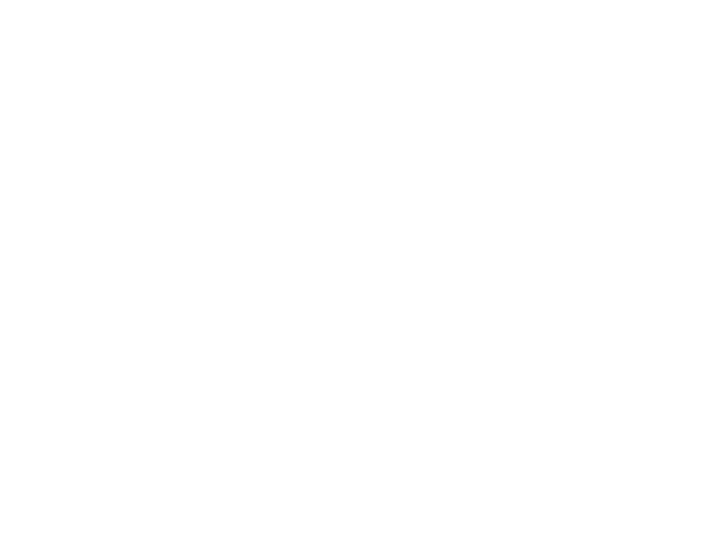
</p>

  <p>
    La jerarquía tipográfica de <strong>AutoNexo</strong> busca mantener consistencia visual y equilibrio, 
    permitiendo una lectura fluida y una clara diferenciación entre niveles de información.
  </p>
  <p>
    De este modo, la aplicación proyecta una imagen moderna, estructurada y profesional, 
    coherente con su enfoque tecnológico y su propósito de conectar digitalmente a talleres y propietarios de vehículos.
  </p>
</section>

#### 4.1.2. Web Style Guidelines

[Guías de estilo para web]

#### 4.1.3. Mobile Style Guidelines

##### 4.1.3.1. iOS Mobile Style Guidelines

[Guías de estilo iOS]

##### 4.1.3.2. Android Mobile Style Guidelines

[Guías de estilo Android]

### 4.2. Information Architecture

#### 4.2.1. Organization Systems

El sistema de navegación de AutoNexo está diseñado para ofrecer una experiencia intuitiva, fluida y centrada en la usabilidad móvil, asegurando que tanto mecánicos como propietarios puedan acceder fácilmente a las funciones principales sin perder el contexto de su actividad.

**Estructura de Navegación Principal**

En la pantalla Home, la navegación parte de una estructura principal de barra inferior (bottom navigation bar) que contiene los accesos directos a las secciones más utilizadas:

- **Home**: Vista principal con el estado actual de citas y agenda, proporcionando una visión general del día y las actividades pendientes.

- **Request**: Permite gestionar solicitudes de servicio de los clientes, facilitando la comunicación bidireccional entre taller y propietarios.

- **Offer**: Muestra promociones o servicios destacados del taller, permitiendo a los mecánicos promocionar sus especialidades.

- **Workshop**: Acceso directo al perfil del taller y a las funciones administrativas, incluyendo gestión de inventario y configuración.

- **Service**: Historial y seguimiento de servicios realizados, proporcionando trazabilidad completa de las intervenciones.

Cada icono cuenta con una etiqueta breve y un color activo que destaca la sección seleccionada, reforzando la claridad del recorrido visual y manteniendo al usuario orientado en todo momento.

**Navegación Superior y Menú Lateral**

En la parte superior de la interfaz se ubica una barra de encabezado (App Bar) con el nombre del usuario, ícono de notificaciones y un menú lateral desplegable (hamburger menu). Este último ofrece accesos secundarios organizados en categorías lógicas:

**Gestión de Perfil:**

- Profile
- Support and Assistance

**Configuración y Legal:**

- Terms of Use
- Privacy Policy
- Logout

**Personalización:**

- Cambio de idioma (Español / English)
- Modo de tema (oscuro o claro)

Esta estructura brinda al usuario flexibilidad y control sobre su experiencia de uso, manteniendo las opciones de configuración accesibles pero no intrusivas.

**Navegación Contextual en Pantallas de Detalle**

En las pantallas de detalle, como la vista de Workshop, la navegación mantiene la misma coherencia visual y funcional. El encabezado superior permite regresar a la vista anterior mediante una flecha de retroceso (Back Arrow), mientras que los botones inferiores ("Generate Code", "Edit Workshop") proporcionan acceso directo a las acciones específicas de gestión.

**Principios de Usabilidad**

Cada transición entre pantallas es suave y contextual, evitando recargar al usuario con demasiada información. Se prioriza la simplicidad y la eficiencia: los usuarios pueden moverse entre módulos con un número mínimo de toques, manteniendo siempre visibles los elementos de navegación principales.

**Consistencia y Accesibilidad**

En conjunto, este sistema de navegación garantiza que AutoNexo mantenga una experiencia uniforme, clara y accesible, adaptada tanto a la operatividad técnica del mecánico como a la practicidad del usuario final. La organización de la información sigue principios de jerarquía visual, agrupación lógica y feedback inmediato, asegurando que cada usuario pueda encontrar rápidamente lo que necesita.

#### 4.2.2. Labeling Systems

El sistema de etiquetado de AutoNexo está diseñado para proporcionar claridad, consistencia y comprensión inmediata de las funciones y contenidos de la aplicación. Cada etiqueta ha sido cuidadosamente seleccionada para reflejar la terminología del sector automotriz mientras mantiene accesibilidad para usuarios de diferentes niveles técnicos.

**Principios de Etiquetado**

**Claridad y Precisión:**

- Cada etiqueta comunica exactamente su función sin ambigüedad
- Se evita jerga técnica innecesaria que pueda confundir a usuarios no especializados
- Se utilizan términos familiares del contexto automotriz cuando es apropiado

**Consistencia Terminológica:**

- Mismo término para la misma función en toda la aplicación
- Vocabulario unificado entre mecánicos y propietarios de vehículos
- Mantenimiento de convenciones establecidas en la industria

**Jerarquía Visual:**

- Etiquetas principales en tipografía más prominente
- Etiquetas secundarias con menor peso visual
- Uso de colores y tamaños para establecer prioridad informativa

**Estructura de Etiquetado por Módulos**

**Navegación Principal:**

- **Home**: Término universalmente reconocido para la pantalla principal
- **Request**: Indica claramente la gestión de solicitudes de servicio
- **Offer**: Comunica promociones y ofertas especiales
- **Workshop**: Identifica el perfil y gestión del taller
- **Service**: Refiere al historial y seguimiento de servicios

**Gestión de Servicios:**

- **Schedule Appointment**: Programar cita de manera clara y directa
- **Service History**: Historial de servicios con terminología estándar
- **Maintenance Reminder**: Recordatorio de mantenimiento
- **Quote Request**: Solicitud de cotización
- **Service Status**: Estado del servicio en tiempo real

**Perfil y Configuración:**

- **Profile Settings**: Configuración de perfil
- **Workshop Information**: Información del taller
- **Notification Preferences**: Preferencias de notificaciones
- **Language Settings**: Configuración de idioma
- **Theme Selection**: Selección de tema visual

**Comunicación y Soporte:**

- **Contact Support**: Contactar soporte
- **Help Center**: Centro de ayuda
- **FAQ**: Preguntas frecuentes
- **Report Issue**: Reportar problema
- **Feedback**: Retroalimentación

**Estados y Acciones:**

- **Pending**: Pendiente
- **In Progress**: En progreso
- **Completed**: Completado
- **Cancelled**: Cancelado
- **Rescheduled**: Reprogramado

**Etiquetado de Formularios**

**Campos de Entrada:**

- **Vehicle Make**: Marca del vehículo
- **Vehicle Model**: Modelo del vehículo
- **Year**: Año
- **License Plate**: Placa de matrícula
- **VIN Number**: Número de VIN
- **Service Type**: Tipo de servicio
- **Estimated Duration**: Duración estimada
- **Service Description**: Descripción del servicio

**Botones de Acción:**

- **Save**: Guardar
- **Cancel**: Cancelar
- **Submit**: Enviar
- **Edit**: Editar
- **Delete**: Eliminar
- **Confirm**: Confirmar
- **Back**: Atrás
- **Next**: Siguiente

**Mensajes y Alertas:**

- **Success**: Éxito
- **Warning**: Advertencia
- **Error**: Error
- **Information**: Información
- **Confirmation Required**: Confirmación requerida

**Localización y Accesibilidad**

**Soporte Multilingüe:**

- Etiquetas disponibles en español e inglés
- Adaptación cultural de términos técnicos
- Mantenimiento de consistencia entre idiomas

**Accesibilidad:**

- Etiquetas descriptivas para lectores de pantalla
- Texto alternativo para iconos y elementos gráficos
- Contraste adecuado para legibilidad
- Tamaños de fuente accesibles

**Convenciones de Nomenclatura**

**CamelCase para IDs técnicos:**

- `serviceHistory`
- `workshopProfile`
- `maintenanceReminder`

**kebab-case para URLs:**

- `/service-history`
- `/workshop-profile`
- `/maintenance-reminder`

**PascalCase para componentes:**

- `ServiceCard`
- `WorkshopProfile`
- `MaintenanceReminder`

Este sistema de etiquetado asegura que AutoNexo mantenga una comunicación clara y efectiva con sus usuarios, facilitando la adopción de la aplicación y reduciendo la curva de aprendizaje tanto para mecánicos como para propietarios de vehículos.

#### 4.2.3. SEO Tags and Meta Tags

La estrategia de SEO y Meta Tags para AutoNexo está diseñada para optimizar la visibilidad en motores de búsqueda y mejorar la experiencia del usuario tanto en la Landing Page como en la Web Application. Además, se incluyen elementos de ASO (App Store Optimization) para maximizar la descarga y adopción de la aplicación móvil.

**Landing Page - SEO Tags y Meta Tags**

**Página Principal:**

```html
<title>
  AutoNexo - Servicio Rápido de Mecánicos Especializados | Reserva Instantánea
</title>
<meta
  name="description"
  content="Conectamos mecánicos certificados con propietarios de vehículos de manera rápida y confiable. Reserva tu servicio de mantenimiento o reparación en minutos. Servicio automotriz completo con reserva instantánea."
/>
<meta
  name="keywords"
  content="servicio rápido, mecánicos certificados, reserva instantánea, mantenimiento vehicular, reparación automotriz, AutoNexo, servicio automotriz completo, mecánicos especializados, citas automotrices"
/>
<meta name="author" content="ATG - AutoNexo Team" />
<meta name="robots" content="index, follow" />
<meta name="viewport" content="width=device-width, initial-scale=1.0" />
<meta
  property="og:title"
  content="AutoNexo - Servicio Rápido de Mecánicos Especializados"
/>
<meta
  property="og:description"
  content="Conectamos mecánicos certificados con propietarios de vehículos. Reserva tu servicio de mantenimiento o reparación en minutos con nuestro sistema de reserva instantánea."
/>
<meta property="og:type" content="website" />
<meta property="og:url" content="https://autonexo.com" />
<meta property="og:image" content="https://autonexo.com/assets/og-image.jpg" />
<meta name="twitter:card" content="summary_large_image" />
<meta name="twitter:title" content="AutoNexo - Servicio Rápido de Mecánicos" />
<meta
  name="twitter:description"
  content="Reserva instantánea de servicios automotrices con mecánicos certificados. Servicio rápido y confiable."
/>
```

**Página de Características:**

```html
<title>
  Características - AutoNexo | Todo para Servicio Automotriz Completo
</title>
<meta
  name="description"
  content="Descubre todas las características de AutoNexo. Reserva instantánea, servicio automotriz completo, conexión con mecánicos certificados y más funcionalidades."
/>
<meta
  name="keywords"
  content="características AutoNexo, reserva instantánea, servicio automotriz completo, funcionalidades, mecánicos certificados, sistema automático"
/>
<meta name="author" content="ATG - AutoNexo Team" />
```

**Página de Precios:**

```html
<title>Precios - AutoNexo | Planes Básico y Pro para Mecánicos</title>
<meta
  name="description"
  content="Elige tu plan en AutoNexo. Plan Básico $10/mes para comenzar o Plan Pro $30/mes para profesionales. Actualiza cuando tus necesidades crezcan."
/>
<meta
  name="keywords"
  content="precios AutoNexo, plan básico, plan pro, planes mensuales, profesionales mecánicos, actualización planes"
/>
<meta name="author" content="ATG - AutoNexo Team" />
```

**Página de Testimonios:**

```html
<title>Testimonios - AutoNexo | Lo que Dicen Nuestros Usuarios</title>
<meta
  name="description"
  content="Lee testimonios reales de usuarios de AutoNexo. Descubre cómo nuestra app se ha convertido en herramienta esencial para usuarios alrededor del mundo."
/>
<meta
  name="keywords"
  content="testimonios AutoNexo, opiniones usuarios, reseñas, experiencia usuarios, herramienta esencial, usuarios mundo"
/>
<meta name="author" content="ATG - AutoNexo Team" />
```

**Página de Equipo:**

```html
<title>Equipo - AutoNexo | Conoce a los Creadores del Proyecto</title>
<meta
  name="description"
  content="Conoce al equipo ATG creador de AutoNexo. Profesionales dedicados y adaptables que aportan dedicación y actitud positiva al proyecto."
/>
<meta
  name="keywords"
  content="equipo AutoNexo, creadores proyecto, equipo ATG, profesionales dedicados, actitud positiva, desarrolladores"
/>
<meta name="author" content="ATG - AutoNexo Team" />
```

**Página de Contacto:**

```html
<title>Contacto - AutoNexo | ¿Necesitas Ayuda? Estamos Aquí</title>
<meta
  name="description"
  content="¿Necesitas ayuda? Contacta con AutoNexo. Estamos aquí para ayudarte con cualquier pregunta o problema. Teléfono, email y dirección disponibles."
/>
<meta
  name="keywords"
  content="contacto AutoNexo, ayuda, soporte, preguntas, problemas, teléfono, email, dirección, atención al cliente"
/>
<meta name="author" content="ATG - AutoNexo Team" />
```

**Web Application - SEO Tags y Meta Tags**

**Dashboard Principal:**

```html
<title>Dashboard - AutoNexo | Panel de Control</title>
<meta
  name="description"
  content="Panel de control de AutoNexo. Gestiona tus citas, servicios y comunicación con mecánicos especializados."
/>
<meta
  name="keywords"
  content="dashboard AutoNexo, panel de control, gestión automotriz, citas programadas"
/>
<meta name="author" content="ATG - AutoNexo Team" />
<meta name="robots" content="noindex, nofollow" />
```

**Perfil de Usuario:**

```html
<title>Mi Perfil - AutoNexo | Configuración de Cuenta</title>
<meta
  name="description"
  content="Gestiona tu perfil en AutoNexo. Configura tus datos, preferencias y configuración de cuenta."
/>
<meta
  name="keywords"
  content="perfil usuario, configuración cuenta, AutoNexo, datos personales"
/>
<meta name="author" content="ATG - AutoNexo Team" />
<meta name="robots" content="noindex, nofollow" />
```

**Historial de Servicios:**

```html
<title>Historial de Servicios - AutoNexo | Registro de Mantenimiento</title>
<meta
  name="description"
  content="Consulta tu historial completo de servicios automotrices en AutoNexo. Mantén un registro detallado de todos los mantenimientos realizados."
/>
<meta
  name="keywords"
  content="historial servicios, registro mantenimiento, AutoNexo, servicios automotrices"
/>
<meta name="author" content="ATG - AutoNexo Team" />
<meta name="robots" content="noindex, nofollow" />
```

**App Store Optimization (ASO) - Elementos para Aplicación Móvil**

**Google Play Store:**

**App Title:**

```
AutoNexo - Mecánicos y Talleres
```

**App Subtitle:**

```
Conecta con mecánicos especializados y gestiona el mantenimiento de tu vehículo
```

**App Description:**

```
AutoNexo es la aplicación móvil que revoluciona la gestión automotriz, conectando propietarios de vehículos con mecánicos especializados y talleres certificados.

 FUNCIONALIDADES PRINCIPALES:
• Conecta con mecánicos especializados en tu zona
• Programa citas de mantenimiento de forma fácil
• Gestiona el historial completo de tu vehículo
• Recibe recordatorios de mantenimiento automático
• Comunícate directamente con tu taller
• Accede a promociones y ofertas especiales
• Sistema de calificaciones y reseñas

 PARA MECÁNICOS Y TALLERES:
• Gestiona tu agenda de citas
• Administra tu perfil y servicios
• Comunícate con clientes
• Genera reportes de servicios
• Accede a herramientas de gestión

 BENEFICIOS:
• Ahorro de tiempo en la gestión de citas
• Transparencia en precios y servicios
• Historial completo de mantenimiento
• Acceso a mecánicos certificados
• Comunicación directa y eficiente

Descarga AutoNexo y transforma tu experiencia automotriz. Disponible para propietarios de vehículos y profesionales del sector automotriz.

Desarrollado por el equipo ATG.
```

**App Keywords:**

```
mecánico, taller automotriz, mantenimiento vehicular, citas automotrices, servicios automotrices, reparación automotriz, gestión de vehículos, AutoNexo, taller mecánico, mantenimiento preventivo, diagnóstico automotriz, mecánicos especializados, talleres cerca, servicios de reparación, gestión automotriz, app automotriz, citas programadas, historial vehicular, recordatorios mantenimiento, comunicación taller
```

**Apple App Store:**

**App Title:**

```
AutoNexo - Mecánicos y Talleres
```

**App Subtitle:**

```
Conecta con mecánicos especializados
```

**App Description:**

```
AutoNexo conecta propietarios de vehículos con mecánicos especializados, ofreciendo una plataforma integral para la gestión automotriz.

CARACTERÍSTICAS:
• Conexión directa con mecánicos certificados
• Programación de citas simplificada
• Historial completo de mantenimiento
• Recordatorios automáticos de servicio
• Comunicación en tiempo real
• Sistema de calificaciones
• Promociones y ofertas especiales

PARA MECÁNICOS:
• Gestión de agenda y citas
• Administración de perfil
• Comunicación con clientes
• Herramientas de gestión

Transforma tu experiencia automotriz con AutoNexo.

Desarrollado por ATG.
```

**App Keywords:**

```
mecánico, taller, automotriz, mantenimiento, citas, servicios, reparación, vehículo, AutoNexo, diagnóstico, especializado, gestión, app, móvil
```

**Estrategia de Keywords y Posicionamiento**

**Keywords Primarias:**

- AutoNexo
- servicio rápido mecánicos
- reserva instantánea
- mecánicos certificados
- servicio automotriz completo

**Keywords Secundarias:**

- mantenimiento vehicular
- planes básico pro
- testimonios usuarios
- equipo ATG

**Keywords de Cola Larga:**

- "reserva instantánea servicios automotrices"
- "servicio rápido mecánicos certificados"
- "planes básico pro AutoNexo"
- "testimonios usuarios AutoNexo"
- "equipo creadores proyecto AutoNexo"
- "características servicio automotriz completo"
- "conecta mecánicos propietarios vehículos"

Esta estrategia de SEO y ASO asegura que AutoNexo sea fácilmente encontrable tanto en motores de búsqueda como en las tiendas de aplicaciones, maximizando la visibilidad y adopción de la plataforma.

#### 4.2.4. Searching Systems

El sistema de búsqueda de AutoNexo está diseñado para proporcionar a los usuarios herramientas eficientes y precisas para encontrar mecánicos, talleres y servicios específicos, evitando que se sientan perdidos entre el volumen de información disponible. El sistema combina búsqueda textual, filtros avanzados y navegación por tags para optimizar la experiencia de descubrimiento.

**Opciones de Búsqueda Disponibles**

**Búsqueda por Texto Libre:**

- **Campo de búsqueda principal:** Permite a los usuarios escribir términos relacionados con servicios, ubicaciones o nombres de talleres
- **Búsqueda inteligente:** Sistema que sugiere autocompletado basado en servicios populares, ubicaciones y talleres registrados
- **Búsqueda por voz:** Opción de dictado para facilitar la búsqueda en dispositivos móviles

**Búsqueda por Ubicación:**

- **Búsqueda geográfica:** Filtro por ciudad, distrito o proximidad (radio en kilómetros)
- **Detección automática:** Utiliza GPS para sugerir talleres cercanos automáticamente
- **Mapa interactivo:** Visualización de talleres disponibles en un mapa con marcadores

**Búsqueda por Servicios Específicos:**

- **Tags de servicios:** Sistema de etiquetas como "Tire change", "Oil change", "Gas System", "Car wash"
- **Categorías principales:** Mantenimiento preventivo, reparaciones, diagnósticos, servicios especializados
- **Búsqueda por marca/modelo:** Filtros específicos para vehículos (Ford, Toyota, etc.)

**Filtros Avanzados Disponibles**

**Filtros por Calificación y Reputación:**

- **Rating mínimo:** Filtro por calificación de talleres (ej: 4.0 ★ o superior)
- **Número de reseñas:** Filtrar por talleres con mínimo de reseñas para mayor confiabilidad
- **Certificaciones:** Mostrar solo talleres con certificaciones específicas

**Filtros por Disponibilidad:**

- **Horarios de atención:** Filtrar por talleres abiertos en horario específico
- **Disponibilidad inmediata:** Mostrar talleres con disponibilidad para el mismo día
- **Citas programadas:** Filtro por fechas específicas disponibles

**Filtros por Precio y Servicios:**

- **Rango de precios:** Filtro por presupuesto estimado
- **Servicios incluidos:** Selección múltiple de servicios requeridos
- **Tipo de servicio:** Urgente, programado, mantenimiento preventivo

**Filtros por Características del Taller:**

- **Tamaño del taller:** Individual, pequeño, mediano, grande
- **Especialización:** General, especializado en marca específica, servicios premium
- **Facilidades:** Estacionamiento, sala de espera, Wi-Fi, café

**Sistema de Tags y Etiquetado**

**Tags de Servicios (Filtros Rápidos):**

- **Mantenimiento Básico:** "Oil change", "Filter change", "Brake check"
- **Reparaciones:** "Engine repair", "Transmission", "Electrical system"
- **Servicios Especializados:** "Tire change", "Gas System", "Car wash", "Diagnostics"
- **Emergencias:** "24/7 service", "Roadside assistance", "Emergency repair"

**Tags de Ubicación:**

- **Distritos:** "Surco", "Miraflores", "San Isidro", "La Molina"
- **Ciudades:** "Lima", "Arequipa", "Cusco", "Trujillo"
- **Zonas comerciales:** "Centro", "Zona residencial", "Zona industrial"

**Tags de Características:**

- **Horarios:** "24/7", "Fines de semana", "Solo citas"
- **Certificaciones:** "Certificado", "Especializado", "Premium"
- **Facilidades:** "Estacionamiento", "Sala de espera", "Wi-Fi"

**Presentación de Resultados de Búsqueda**

**Vista de Lista (Resultados Principales):**

- **Tarjeta de taller:** Nombre del taller, calificación (4.0 ★), ubicación (Surco, Lima)
- **Servicios destacados:** Tags de servicios más relevantes para la búsqueda
- **Información clave:** Dirección, horarios, disponibilidad inmediata
- **Acciones rápidas:** "Ver perfil", "Contactar", "Agendar cita"

**Vista de Mapa:**

- **Marcadores interactivos:** Ubicación exacta de cada taller
- **Clusters:** Agrupación de talleres cercanos para mejor visualización
- **Información emergente:** Vista previa al hacer clic en marcador

**Vista de Detalle del Taller:**

- **Información completa:** Nombre, calificación, dirección específica (Av. Arequipa 1234)
- **Galería de imágenes:** Fotos del taller, equipos y vehículos en servicio
- **Servicios disponibles:** Lista completa con tags clickeables
- **Personal del taller:** Mecánicos disponibles con roles (Workshop owner, Workshop member)
- **Reseñas y testimonios:** Opiniones de clientes anteriores

**Funcionalidades de Búsqueda Avanzada**

**Búsqueda Combinada:**

- **Múltiples filtros simultáneos:** Combinar ubicación + servicios + precio + disponibilidad
- **Búsqueda guardada:** Permitir guardar combinaciones de filtros frecuentes
- **Historial de búsquedas:** Recordar búsquedas anteriores para facilitar repetición

**Resultados Inteligentes:**

- **Relevancia personalizada:** Priorizar resultados basados en historial del usuario
- **Sugerencias contextuales:** Recomendar servicios complementarios
- **Alertas de disponibilidad:** Notificar cuando talleres favoritos tengan disponibilidad

**Herramientas de Comparación:**

- **Comparar talleres:** Selección múltiple para comparar precios, servicios y calificaciones
- **Tabla comparativa:** Vista lado a lado de características principales
- **Recomendación inteligente:** Sugerir el mejor taller basado en criterios del usuario

Este sistema de búsqueda integral asegura que los usuarios de AutoNexo puedan encontrar rápidamente el taller y los servicios que necesitan, proporcionando múltiples vías de descubrimiento y filtrado para optimizar su experiencia de búsqueda.

#### 4.2.5. Navigation Systems

El sistema de navegación de AutoNexo está diseñado para guiar eficientemente a los usuarios a través de la Landing Page y las aplicaciones móviles, permitiéndoles cumplir sus objetivos de manera intuitiva y satisfactoria. La navegación se estructura en múltiples niveles para adaptarse a diferentes contextos de uso y necesidades del usuario.

**Navegación de Landing Page**

**Header Navigation (Navegación Superior):**

- **Logo AutoNexo:** Elemento principal que lleva siempre al inicio de la página
- **Menú de navegación horizontal:** "Valores", "Características", "Precios", "Testimonios", "Preguntas", "Equipo"
- **Botones de acción:** "REGISTRARSE" (destacado en rojo) y selector de idioma "ES"
- **Comportamiento:** Menú fijo que permanece visible durante el scroll para acceso constante

**Navegación por Secciones:**

- **Scroll suave:** Transiciones fluidas entre secciones sin recargas de página
- **Enlaces de ancla:** Cada elemento del menú superior lleva directamente a la sección correspondiente
- **Indicadores visuales:** Resaltado del elemento activo en el menú según la sección visible

**Navegación de Contenido:**

- **Hero Section:** Botón "Comenzar" que lleva a registro o descarga de app
- **Sección Valores:** Navegación por cards con información de confiabilidad
- **Sección Características:** Cards interactivos que expanden información al hover
- **Sección Precios:** Botones de selección de planes que llevan a proceso de registro
- **Sección Testimonios:** Carrusel de testimonios con navegación por puntos
- **Sección Equipo:** Tarjetas de perfil con información expandible
- **Sección Contacto:** Formulario directo con validación en tiempo real

**Navegación de Aplicación Móvil**

**Bottom Navigation Bar (Navegación Inferior):**

- **Home:** Vista principal con dashboard de citas y agenda del día
- **Request:** Gestión de solicitudes de servicio y comunicación con clientes
- **Offer:** Promociones, ofertas especiales y servicios destacados
- **Workshop:** Perfil del taller, configuración y herramientas administrativas
- **Service:** Historial completo de servicios y seguimiento de intervenciones

**Top Navigation (App Bar):**

- **Flecha de retroceso:** Navegación hacia atrás contextual
- **Título de sección:** Indica ubicación actual en la aplicación
- **Icono de notificaciones:** Acceso directo a alertas y mensajes
- **Menú hamburguesa:** Acceso a funciones secundarias y configuración

**Menú Lateral (Drawer Navigation):**

- **Perfil de usuario:** Acceso a configuración personal y datos del taller
- **Soporte y asistencia:** Centro de ayuda y contacto técnico
- **Términos de uso:** Información legal y políticas
- **Política de privacidad:** Documentación de protección de datos
- **Configuración de idioma:** Cambio entre español e inglés
- **Selección de tema:** Modo claro u oscuro
- **Cerrar sesión:** Logout seguro de la aplicación

**Navegación Contextual**

**Navegación por Breadcrumbs:**

- **Ruta de navegación:** Indica la ubicación actual dentro de la jerarquía
- **Navegación rápida:** Permite regresar a niveles superiores con un toque
- **Ejemplo:** Home > Workshop > Adonz Automotive > Mechanics

**Navegación por Gestos:**

- **Swipe horizontal:** Navegación entre pestañas en la misma pantalla
- **Swipe vertical:** Scroll en listas y contenido extenso
- **Pinch to zoom:** Ampliación de imágenes en galerías de talleres
- **Pull to refresh:** Actualización de contenido en listas y feeds

**Navegación por Acciones:**

**Botones de Acción Primaria:**

- **"Comenzar":** Inicio del proceso de registro o descarga
- **"Registrarse":** Acceso directo al formulario de creación de cuenta
- **"Generate Code":** Generación de código para compartir taller
- **"Edit Workshop":** Edición de información del taller

**Botones de Acción Secundaria:**

- **"Ver perfil":** Acceso al detalle completo del taller
- **"Contactar":** Inicio de comunicación directa
- **"Agendar cita":** Programación de servicios
- **"Copy to Clipboard":** Copia de información para compartir

**Flujos de Navegación Principales**

**Flujo de Registro:**

1. Landing Page → Botón "Comenzar"
2. Formulario de registro → Validación
3. Verificación de email → Confirmación
4. Onboarding → Configuración inicial
5. Dashboard principal → Primera experiencia

**Flujo de Búsqueda de Taller:**

1. Home → Búsqueda o filtros
2. Lista de resultados → Vista previa
3. Detalle del taller → Información completa
4. Contacto o agendado → Acción final

**Flujo de Gestión de Taller:**

1. Workshop → Perfil del taller
2. Edición → Modificación de datos
3. Servicios → Gestión de ofertas
4. Mecánicos → Administración de personal
5. Guardar cambios → Confirmación

**Principios de Navegación**

**Consistencia:**

- Mismos patrones de navegación en toda la aplicación
- Iconografía uniforme y reconocible
- Colores y tipografías consistentes

**Accesibilidad:**

- Navegación por teclado en web
- Lectores de pantalla compatibles
- Contraste adecuado para visibilidad
- Tamaños de toque apropiados (mínimo 44px)

**Feedback Visual:**

- Estados hover y active claramente definidos
- Animaciones suaves en transiciones
- Indicadores de carga durante procesos
- Confirmaciones visuales de acciones

**Eficiencia:**

- Acceso directo a funciones principales
- Número mínimo de toques para tareas comunes
- Navegación contextual basada en el flujo de trabajo
- Búsqueda rápida y filtros accesibles

**Recuperación de Errores:**

- Botones de retroceso siempre disponibles
- Mensajes de error claros y accionables
- Opciones de cancelación en procesos largos
- Historial de navegación para regresar fácilmente

Este sistema de navegación integral asegura que los usuarios puedan moverse de manera intuitiva y eficiente a través de AutoNexo, cumpliendo sus objetivos sin fricción y manteniendo una experiencia satisfactoria tanto en la Landing Page como en las aplicaciones móviles.

### 4.3. Landing Page UI Design

#### 4.3.1. Landing Page Wireframe

<section id="wireframes-landing-autonexo">
  <h2>Wireframes del Landing Page (Desktop & Mobile) – AutoNexo</h2>
  <p>
    Esta sección presenta y explica los <strong>wireframes</strong> del Landing Page para
    <em>Desktop Web Browser</em> y <em>Mobile Web Browser</em>, evidenciando la aplicación de
    <strong>principios de diseño</strong>, <strong>elementos de diseño</strong>, 
    <strong>diseño inclusivo</strong> y <strong>arquitectura de información</strong>.
  </p>

  <!-- Resumen estructural -->
  <h3>Resumen estructural</h3>
  <ul>
    <li><strong>Header fijo:</strong> logo, menú (Inicio, Características, Beneficios, Equipo, Testimonios, Contacto), selector ES/EN y CTA “Solicitar Demo”.</li>
    <li><strong>Hero:</strong> eslogan + párrafo de valor + botón primario (CTA) y visual del producto.</li>
    <li><strong>Características:</strong> 3–6 tarjetas con icono, título y texto breve.</li>
    <li><strong>Beneficios:</strong> grid de tarjetas con evidencia/valor.</li>
    <li><strong>Equipo (ATG):</strong> fotos/íconos, rol y breve bio.</li>
    <li><strong>Testimonios/Partners:</strong> carrusel o grid de logos/opiniones.</li>
    <li><strong>Formulario de contacto/solicitud de demo:</strong> campos básicos y confirmación.</li>
    <li><strong>Footer:</strong> Términos, Privacidad, Soporte y redes.</li>
  </ul>

  <!-- Diferencias Desktop vs Mobile -->
  <h3>Wireframes · Desktop vs Mobile</h3>
  <ul>
    <li><strong>Desktop:</strong> secciones en <em>grid</em> (2–3 columnas); texto e imagen en paralelo; navegación superior visible siempre.</li>
    <li><strong>Mobile:</strong> disposición <em>vertical</em> y apilada; bloques con mayor separación; CTAs centrados; navegación accesible desde el menú.</li>
  </ul>

  <!-- Principios de diseño -->
  <h3>Principios de diseño aplicados</h3>
  <ul>
    <li><strong>Jerarquía visual:</strong> títulos Inter/Medium (H1&gt;H2&gt;H3), CTA destacado, uso consistente de tamaños (70/40/25 px).</li>
    <li><strong>Contraste y énfasis:</strong> primario #202D36 vs fondos #FFFFFF; CTAs con acento (crimson #800C1F).</li>
    <li><strong>Alineación y ritmo:</strong> rejilla base de 8 px; alineación izquierda para texto, centrado para CTAs.</li>
    <li><strong>Proximidad y repetición:</strong> tarjetas con patrón consistente (icono &gt; título &gt; texto &gt; CTA).</li>
    <li><strong>Equilibrio:</strong> distribución homogénea de texto/imagen para evitar sobrecarga cognitiva.</li>
  </ul>

  <!-- Elementos de diseño -->
  <h3>Elementos de diseño evidenciados</h3>
  <ul>
    <li><strong>Tipografía:</strong> Inter (Medium/Bold) por legibilidad y coherencia móvil.</li>
    <li><strong>Color:</strong> primario #202D36, fondo #FFFFFF, grises #D9D9D9/#8E8E8E; acentos #800C1F/#3C0007.</li>
    <li><strong>Espacio:</strong> márgenes/padding 16–24 px; white space para escaneabilidad.</li>
    <li><strong>Iconografía:</strong> pictogramas simples y consistentes para features/beneficios.</li>
    <li><strong>Tamaño/Disposición:</strong> tarjetas modulares; imágenes responsivas (max-width:100%).</li>
  </ul>

  <!-- Diseño inclusivo / Accesibilidad -->
  <h3>Diseño inclusivo y accesibilidad</h3>
  <ul>
    <li><strong>Contraste:</strong> texto oscuro sobre claro y viceversa; metas AA para cuerpo (≥4.5:1) y títulos grandes (≥3:1).</li>
    <li><strong>Legibilidad:</strong> tamaños base 16–18 px; line-height 1.5–1.6; párrafos breves.</li>
    <li><strong>Interacción:</strong> blancos táctiles ≥44×44 px; estados de foco/hover/active visibles.</li>
    <li><strong>Lenguaje claro:</strong> microcopys directos en CTAs (“Solicitar Demo”, “Ver más”).</li>
    <li><strong>Internacionalización:</strong> selector ES/EN desde el header; textos preparados para longitud variable.</li>
    <li><strong>Responsive first:</strong> breakpoints típicos (≤480, ≤768, ≤1024, &gt;=1280); contenido refluye sin pérdida.</li>
  </ul>

  <!-- Arquitectura de información -->
  <h3>Arquitectura de información</h3>
  <ul>
    <li><strong>Organización:</strong> estructura jerárquica por secciones (hero → features → benefits → trust → form → footer).</li>
    <li><strong>Navegación:</strong> menú superior con anclas; CTA persistente en hero; breadcrumb implícito por orden lineal.</li>
    <li><strong>Etiquetado:</strong> nombres claros y consistentes (“Características”, “Beneficios”, “Equipo”, “Contacto”).</li>
    <li><strong>Flujo:</strong> descubrimiento (hero) → valor (features/benefits) → prueba social (testimonios/partners) → conversión (formulario).</li>
  </ul>

  <!-- Criterios de aceptación (concreto) -->
  <h3>Criterios de aceptación (cumplimiento)</h3>
  <ol>
    <li>El header muestra logo, menú y selector ES/EN en Desktop; en Mobile, menú accesible y CTA visible en el primer pantallazo.</li>
    <li>Todos los CTAs tienen tamaño mínimo táctil, contraste suficiente y texto accionable.</li>
    <li>La misma jerarquía se conserva en Mobile con bloques apilados y espaciado adecuado.</li>
    <li>Tarjetas de características y beneficios mantienen patrón visual y lectura en Z/F.</li>
    <li>El formulario captura nombre, correo, mensaje y confirma envío; campos con etiquetas visibles y validación básica.</li>
    <li>Footer incluye Términos, Privacidad, Soporte y redes; accesible en ambas vistas.</li>
  </ol>

  <!-- Nota final -->
  <p><em>
    Con lo anterior, los wireframes del Landing Page demuestran aplicación de principios visuales, elementos de diseño,
    criterios de inclusión/accesibilidad y una arquitectura de información clara que guía hacia la conversión (“Solicitar Demo”).
  </em></p>
</section>

<div>
  <p align="center"></p>
</div>

#### 4.3.2. Landing Page Mock-up

<section id="landing-mockups-autonexo">
  <h2>Landing Page Mock-up (Desktop & Mobile) – AutoNexo</h2>
  <p>
    Esta sección presenta los <strong>mock-ups</strong> finales del Landing Page para
    <em>Desktop Web Browser</em> y <em>Mobile Web Browser</em>. La propuesta evidencia la aplicación de
    <strong>principios y elementos de diseño</strong>, <strong>diseño inclusivo</strong>,
    <strong>arquitectura de información</strong> y la alineación con el <strong>Design System</strong> de AutoNexo.
  </p>

  <!-- Resumen visual -->
  <h3>Resumen visual</h3>
  <ul>
    <li><strong>Hero</strong> con eslogan, párrafo de valor y CTA primario “Solicitar demo”.</li>
    <li><strong>Valores</strong> y <strong>Características</strong> en tarjetas con icono + título + texto.</li>
    <li><strong>Precios/Planes</strong> con comparación Básico vs. Pro.</li>
    <li><strong>Testimonios</strong> en tarjetas compactas de una sola línea.</li>
    <li><strong>FAQs</strong> con acordeones (+) expandibles.</li>
    <li><strong>Equipo (ATG)</strong> con fichas de miembros.</li>
    <li><strong>Contacto</strong> con formulario y datos directos.</li>
    <li><strong>Footer</strong> con Términos, Privacidad, Soporte y redes sociales.</li>
  </ul>

  <!-- Desktop vs Mobile -->
  <h3>Distribución · Desktop vs Mobile</h3>
  <ul>
    <li><strong>Desktop:</strong> secciones en grid (2–3 columnas), pares texto/imagen en paralelo, navegación fija en header.</li>
    <li><strong>Mobile:</strong> flujo vertical apilado; CTAs centrados; tarjetas a 1 columna; acordeones ocupan ancho completo.</li>
  </ul>

  <!-- Principios y elementos -->
  <h3>Principios y elementos de diseño aplicados</h3>
  <ul>
    <li><strong>Jerarquía visual:</strong> Inter Medium para H1/H2/H3 (70/40/25 px); contraste de CTAs para énfasis.</li>
    <li><strong>Contraste:</strong> primario <code>#202D36</code> sobre fondos claros <code>#FFFFFF</code>; acentos <code>#800C1F</code>/<code>#3C0007</code>.</li>
    <li><strong>Alineación y ritmo:</strong> rejilla base de 8 px; alineación izquierda para texto, centrado para acciones.</li>
    <li><strong>Proximidad/repetición:</strong> patrón consistente de tarjeta (icono &gt; título &gt; texto &gt; acción).</li>
    <li><strong>Espacio en blanco:</strong> márgenes/padding 16–24 px para escaneabilidad sin sobrecarga.</li>
  </ul>

  <!-- Inclusión / Accesibilidad -->
  <h3>Diseño inclusivo y accesibilidad</h3>
  <ul>
    <li><strong>Contraste AA:</strong> texto normal ≥ 4.5:1; títulos grandes ≥ 3:1.</li>
    <li><strong>Tipografía legible:</strong> base 16–18 px, line-height 1.5–1.6.</li>
    <li><strong>Targets táctiles:</strong> mínimos de 44×44 px; estados <em>hover/focus/active</em> visibles.</li>
    <li><strong>Lenguaje claro:</strong> microcopys directos (p. ej., “Solicitar demo”, “Ver detalles”).</li>
    <li><strong>Internacionalización:</strong> selector ES/EN en header; textos preparados para distinta longitud.</li>
    <li><strong>Responsive first:</strong> breakpoints ≤480, ≤768, ≤1024, ≥1280; imágenes fluidas (max-width:100%).</li>
  </ul>

  <!-- Arquitectura de Información -->
  <h3>Arquitectura de información (mapeo de secciones)</h3>
  <ol>
    <li><strong>Hero</strong> → Descubrimiento y CTA principal.</li>
    <li><strong>Valores</strong> → Principios de marca que guían el servicio.</li>
    <li><strong>Características</strong> → Qué hace el producto (evidencia funcional).</li>
    <li><strong>Precios/Planes</strong> → Decisión informada (Básico vs Pro).</li>
    <li><strong>Testimonios</strong> → Prueba social y confianza.</li>
    <li><strong>FAQs</strong> → Objeciones comunes y soporte inmediato.</li>
    <li><strong>Equipo</strong> → Credibilidad del grupo ATG.</li>
    <li><strong>Contacto</strong> → Conversión secundaria (formulario y datos directos).</li>
    <li><strong>Footer</strong> → Enlaces legales y canales de soporte.</li>
  </ol>

  <!-- Design System -->
  <h3>Alineación con el Design System de AutoNexo</h3>
  <ul>
    <li><strong>Colores:</strong> Primary Blue <code>#202D36</code>, Primary White <code>#FFFFFF</code>, Grays <code>#D9D9D9</code>/<code>#8E8E8E</code>, Acentos <code>#800C1F</code>/<code>#3C0007</code>.</li>
    <li><strong>Tipografía:</strong> Inter (Medium/Bold) con escalas 70/40/25 y 16–18 px para cuerpo.</li>
    <li><strong>Componentes:</strong> botones primarios/secundarios, tarjetas, acordeones, chips, formularios, navbar y footer.</li>
    <li><strong>Tokens:</strong> espaciado 8 px, radios 10–12 px, sombras sutiles para elevación de tarjetas.</li>
  </ul>

  <!-- Criterios de aceptación -->
  <h3>Criterios de aceptación</h3>
  <ol>
    <li>Header con logo, navegación y selector ES/EN en Desktop; menú accesible en Mobile.</li>
    <li>CTA “Solicitar demo” visible en el primer pantallazo (ambas vistas) y con contraste AA.</li>
    <li>Tarjetas de características/beneficios mantienen patrón y ritmo vertical/columnas según viewport.</li>
    <li>Sección de planes presenta comparación clara (precio, beneficios, acción).</li>
    <li>FAQs con acordeones expandibles; foco/teclado navegable.</li>
    <li>Formulario con validación básica y confirmación de envío; campos etiquetados.</li>
    <li>Footer con Términos, Privacidad, Soporte y redes sociales.</li>
  </ol>

  <p><em>
    Los mock-ups consolidan la propuesta visual y funcional del Landing Page de AutoNexo, demostrando consistencia con el Design System,
    cumplimiento de accesibilidad y una arquitectura de información orientada a la conversión.
  </em></p>
</section>

<div>
  <p align="center"></p>
</div>

### 4.4. Mobile Applications UX/UI Design

#### 4.4.1. Mobile Applications Wireframes

**Register Mechanic**

<div>
  <p align="center"></p>
</div>

**Recover password**

<div>
  <p align="center"></p>
</div>

**Register Workshop**

<div>
  <p align="center"></p>
</div>

**Home Mechanic**

<div>
  <p align="center"></p>
</div>

**Profile Mechanic and Edit**

<div>
  <p align="center"></p>
</div>

**Support and Assistance Mechanic**

<div>
  <p align="center"></p>
</div>

**Request Mechanic**

<div>
  <p align="center"></p>
</div>

**Offer Mechanic**

<div>
  <p align="center"></p>
</div>

**Service Mechanic**

<div>
  <p align="center"></p>
</div>

**Payment Mechanic**

<div>
  <p align="center"></p>
</div>

<!--__Subscription payment__

<div>
  <p align="center"></p>
</div>
-->

**Register Owner**

<div>
  <p align="center"></p>
</div>

**Recover Password Owner**

<div>
  <p align="center"></p>
</div>

**Profile and Edit Owner**

<div>
  <p align="center"></p>
</div>

**Support and Assistance Owner**

<div>
  <p align="center"></p>
</div>

**Home Owner**

<div>
  <p align="center"></p>
</div>

**Vehicles**

<div>
  <p align="center"></p>
</div>

**Register Vehicle**

<div>
  <p align="center"></p>
</div>

**Edit Vehicle**

<div>
  <p align="center"></p>
</div>

**Maintenance Log**

<div>
  <p align="center"></p>
</div>

**Add Maintenance**

<div>
  <p align="center"></p>
</div>

**Edit Maintenance**

<div>
  <p align="center"></p>
</div>

**Workshop Details Owner**

<div>
  <p align="center"></p>
</div>

**Offer Owner**

<div>
  <p align="center"></p>
</div>

**Request Owner**

<div>
  <p align="center"></p>
</div>

**Payment Owner**

<div>
  <p align="center"></p>
</div>

#### 4.4.2. Mobile Applications Wireflow Diagrams

**User goal: Iniciar sesión y acceder al panel principal**

**User persona: Mecánico o jefe de taller**

El usuario inicia en la pantalla Login, donde introduce su correo electrónico y contraseña. En caso de error, el sistema muestra un mensaje de validación ("Invalid credentials").
Al presionar "Login", se redirige al Home, que muestra las citas programadas, solicitudes pendientes y accesos rápidos a los módulos principales (Request, Offer, Workshop y Service).
El flujo contempla el acceso al menú lateral mediante el ícono "hamburguesa", desde el cual se pueden abrir secciones secundarias como Profile, Payment, Support and Assistance o Logout.

<p align="center">
  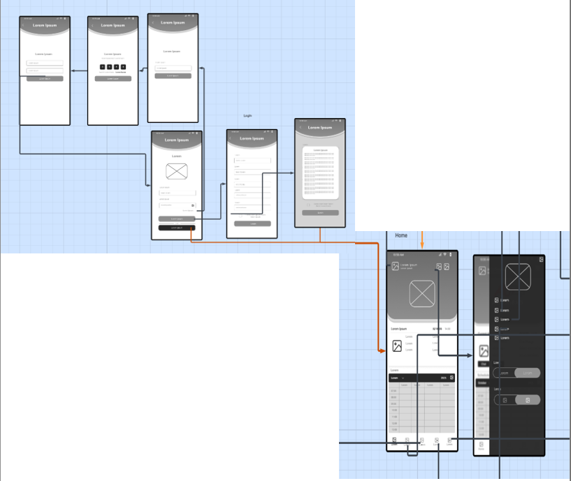
</p>

**User goal: Crear una nueva solicitud de servicio**

**User persona: Propietario de vehículo**

Desde la pantalla principal Home, el usuario selecciona la pestaña Request, accediendo al formulario de solicitud.
Debe ingresar los datos del vehículo, seleccionar el tipo de servicio (Oil change, Brake check, Tire replacement, etc.) y añadir una breve descripción.
Al presionar "Send Request", la solicitud se registra y aparece una pantalla de confirmación con el mensaje "Request sent successfully".
Desde ahí, el flujo continúa hacia el estado Pending, donde el usuario puede visualizar el estado de respuesta de los talleres.

<p align="center">
  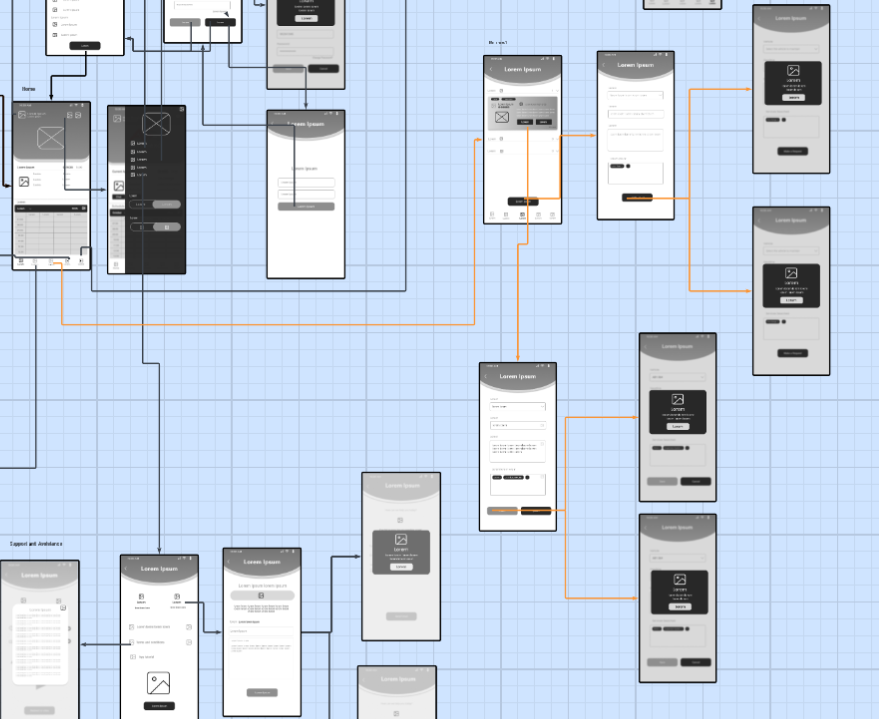
</p>

**User goal: Enviar una oferta de servicio**

**User persona: Mecánico o jefe de taller**

En la pestaña Request, el mecánico visualiza todas las solicitudes recibidas.
Al seleccionar una, accede al detalle del vehículo y presiona "Make an Offer".
El sistema muestra un formulario donde ingresa el precio estimado, fecha y hora de cita, y observaciones adicionales.
Finalmente, al presionar "Send Offer", aparece la confirmación "Offer sent successfully" y el flujo retorna a la lista de solicitudes actualizada.

<p align="center">
  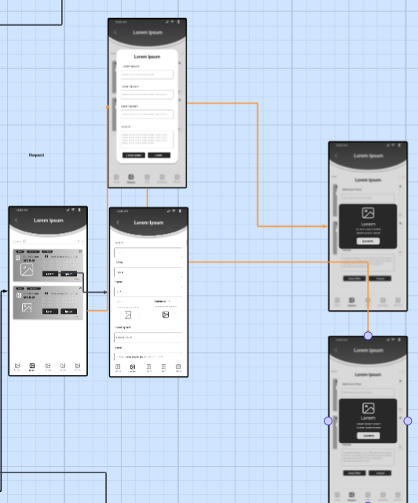
</p>

**User goal: Registrar mantenimiento completado**

**User persona: Mecánico o jefe de taller**

Desde la pantalla Service, el usuario selecciona "Register Service Order", visualizando un formulario con los campos del vehículo, tipo de mantenimiento, costo y observaciones.
Tras completar los datos y presionar "Register", el flujo conduce a una pantalla de validación con el mensaje "Service successfully registered".
Posteriormente, el servicio aparece en la lista de Done, permitiendo revisar los detalles del trabajo finalizado.

<p align="center">
  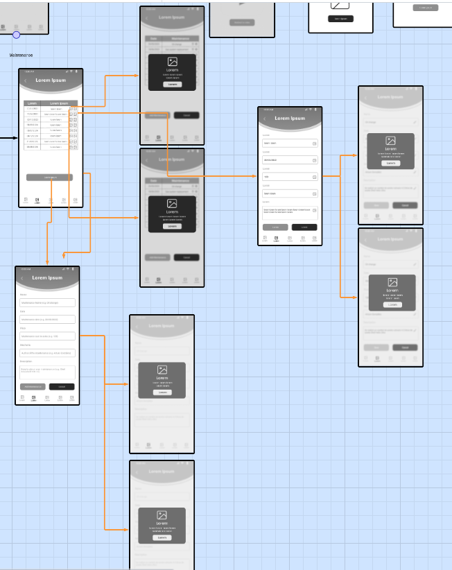
</p>

**User goal: Consultar historial de mantenimiento**

**User persona: Propietario de vehículo**

El usuario accede desde el menú inferior a la pestaña Service, donde se muestra el historial de mantenimientos realizados.
Cada tarjeta contiene información resumida del servicio (fecha, taller, costo y estado).
Al seleccionar una tarjeta, se despliega la vista Service Detail, con datos completos y la opción "Add Maintenance" para registrar nuevas intervenciones.
El flujo cierra con una confirmación visual ("Maintenance added successfully") y regresa a la vista principal del historial.

<p align="center">
  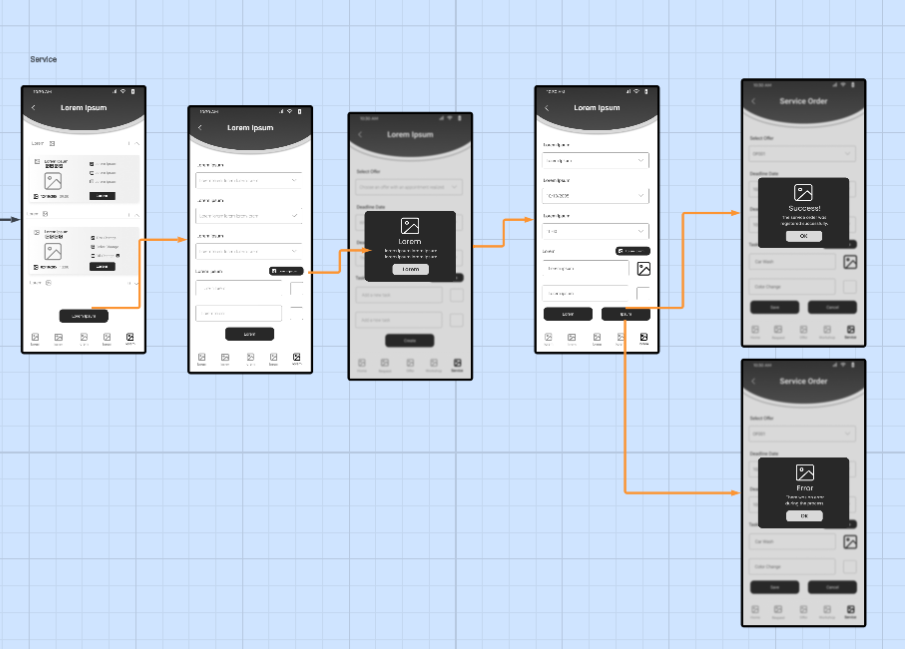
</p>

**User goal: Gestionar perfil de usuario y taller**

**User persona: Mecánico o jefe de taller**

Desde el menú lateral, el usuario ingresa a Profile, donde puede editar sus datos personales, cambiar contraseña o acceder a la configuración del taller (Workshop Information).
En la vista Edit Profile, el wireflow incluye las acciones "Save" y "Cancel", que redirigen respectivamente al perfil actualizado o al estado anterior.
Si selecciona "Edit Workshop", se despliega el formulario de información comercial y servicios disponibles.
Al guardar, el flujo muestra el mensaje "Workshop updated successfully", completando la iteración de configuración.

<p align="center">
  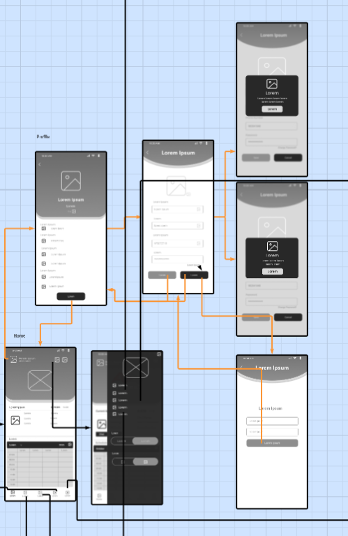
</p>

#### 4.4.3. Mobile Applications Mock-ups

**Register Mechanic**

<div>
  <p align="center"></p>
</div>

**Recover password**

<div>
  <p align="center"></p>
</div>

**Register Workshop**

<div>
  <p align="center"></p>
</div>

**Home Mechanic**

<div>
  <p align="center"></p>
</div>

**Profile Mechanic and Edit**

<div>
  <p align="center"></p>
</div>

**Support and Assitance Mechanic**

<div>
  <p align="center"></p>
</div>

**Request Mechanic**

<div>
  <p align="center"></p>
</div>

**Offer Mechanic**

<div>
  <p align="center"></p>
</div>

**Service Mechanic**

<div>
  <p align="center"></p>
</div>

**Payment Mechanic**

<div>
  <p align="center"></p>
</div>

<!--__Subscription payment__

<div>
  <p align="center"></p>
</div>
-->

**Register Owner**

<div>
  <p align="center"></p>
</div>

**Recover Password Owner**

<div>
  <p align="center"></p>
</div>

**Profile and Edit Owner**

<div>
  <p align="center"></p>
</div>

**Support and Assistance Owner**

<div>
  <p align="center"></p>
</div>

**Home Owner**

<div>
  <p align="center"></p>
</div>

**Vehicles**

<div>
  <p align="center">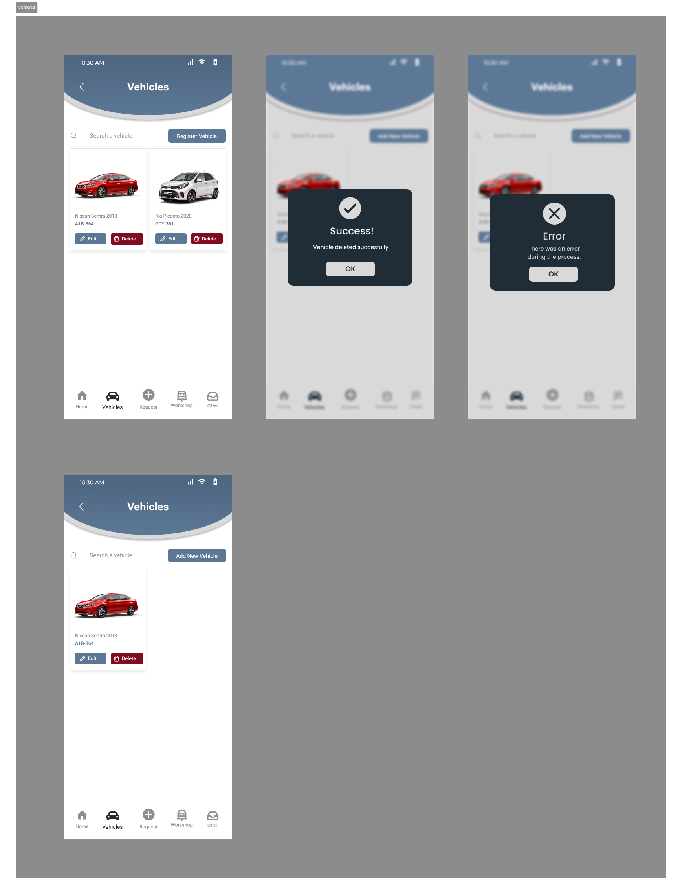</p>
</div>

**Register Vehicle**

<div>
  <p align="center"></p>
</div>

**Edit Vehicle**

<div>
  <p align="center"></p>
</div>

**Maintenance Log**

<div>
  <p align="center"></p>
</div>

**Add Maintenance**

<div>
  <p align="center"></p>
</div>

**Edit Maintenance**

<div>
  <p align="center"></p>
</div>

**Workshop Details Owner**

<div>
  <p align="center"></p>
</div>

**Offer Owner**

<div>
  <p align="center"></p>
</div>

**Request Owner**

<div>
  <p align="center"></p>
</div>

**Payment Owner**

<div>
  <p align="center"></p>
</div>

#### 4.4.4. Mobile Applications User Flow Diagrams

**User goal: Registrarse como nuevo usuario**

**User persona: Mecánico o jefe de taller**

Al ingresar a la aplicación móvil, los usuarios pueden acceder con su correo y contraseña desde la pantalla Login. Si no tienen una cuenta, pueden seleccionar “Register”, pasando a la pantalla de Registro, donde deberán ingresar su nombre, correo, número de teléfono y contraseña.

De manera opcional, pueden incluir un Workshop Code para asociarse a un taller existente. Si no saben qué es, pueden consultar la opción “What’s this?”, que muestra una breve explicación visual.

Antes de finalizar, los usuarios deben aceptar los Términos y Condiciones y luego presionar “Register” para completar su registro. Una vez creado el usuario, la aplicación los redirige a su pantalla principal Home.

<p align="center">
  
</p>

**User goal: Recuperar contraseña**

**User persona: Mecánico o jefe de taller**

Al ingresar a la aplicación, el usuario puede seleccionar la opción “Forgot Password?” desde la pantalla de Login. Luego, se le solicita ingresar su número de teléfono registrado para recibir un código de verificación (OTP).

En la pantalla de OTP Verification, el usuario ingresa el código recibido por mensaje y selecciona “Verify & Proceed”. Una vez validado, pasa a la pantalla donde podrá establecer una nueva contraseña, confirmarla y presionar “Submit” para completar el proceso.

Finalmente, el sistema confirma el cambio y redirige al usuario nuevamente a la pantalla de Login para acceder con sus nuevas credenciales.

<p align="center">
  
</p>

**User goal: Iniciar sesión y acceder al panel principal**

**User persona: Mecánico o Jefe de taller**

Al ingresar a la aplicación, el usuario visualiza la pantalla de Login, donde puede acceder ingresando su correo y contraseña. Una vez autenticado, la aplicación lo redirige a la pantalla principal Home, donde se muestra su nombre, próximas citas y el calendario de trabajo con las solicitudes programadas.

Desde el ícono de menú, el usuario puede abrir el panel lateral y acceder a diferentes secciones como Profile, Payment, Support and Assistance, Terms of use, Privacy Policy o Logout, además de cambiar el idioma y el tema de la aplicación.

<p align="center">
  
</p>

**User goal: Registrar y configurar un taller**

**User persona: Mecánico o Jefe de taller**

Al ingresar a la sección Workshop, el usuario puede registrar la información de su taller completando los campos de nombre comercial, RUC, distrito, ciudad y dirección. También puede añadir el logo, una imagen representativa y los servicios disponibles.

En la siguiente pantalla, el usuario define los horarios de atención para cada día de la semana y, si lo desea, marca los días libres o la opción de atención las 24 horas.

Finalmente, al presionar “Save”, la aplicación guarda la información y registra el taller correctamente dentro del sistema, quedando listo para ser visualizado o editado posteriormente.

<p align="center">
  
</p>

**User goal: Visualizar y compartir el código del taller**

**User persona: Propietario o jefe de taller**

Desde la pantalla principal Home, el usuario puede acceder a la sección Workshop, donde visualiza la información completa de su taller, incluyendo nombre, ubicación, servicios y miembros del equipo.

En esta vista, el usuario puede seleccionar la opción “Generate Code” para crear un Workshop Code, el cual se muestra en una ventana emergente con la opción de copiarlo para compartirlo con nuevos mecánicos que deseen unirse al taller.

Una vez generado, el código puede ser utilizado por un solo usuario y posteriormente caduca. El propietario también puede editar los datos del taller seleccionando “Edit Workshop”.

<p align="center">
  
</p>

**User goal: Visualizar y editar perfil de usuario**

**User persona: Propietario o jefe de taller**

Desde el menú lateral, el usuario puede acceder a la sección Profile, donde visualiza su información personal, como nombre, correo, número de teléfono y taller actual. También puede gestionar las notificaciones de mensajes y ofertas.

Al seleccionar el ícono de edición, el usuario ingresa a la pantalla Edit Profile, donde puede actualizar sus datos personales o modificar su contraseña seleccionando la opción “Change Password”.

En la pantalla New Password, debe ingresar y confirmar la nueva contraseña. Finalmente, al presionar “Save”, los cambios se guardan y el usuario regresa a su perfil actualizado.

<p align="center">
  
</p>

**User goal: Contactar con soporte técnico**

**User persona: Propietario o jefe de taller**

Desde el menú lateral, el usuario puede acceder a la sección Support and Assistance, donde se presentan distintas opciones de ayuda como Call Us, Mail Us, Frequently Asked Questions, Terms and Conditions y un tutorial en video.

Al seleccionar Mail Us, se abre la pantalla Contact us via Gmail, donde el usuario puede escribir el asunto y el mensaje dirigido al equipo de soporte de Autonexo.

Finalmente, al presionar “Send Email”, aparece una ventana de confirmación con el mensaje “Success!”, indicando que el correo fue enviado correctamente.

<p align="center">
  
</p>

**User goal: Enviar una oferta al propietario del vehículo**

**User persona: Propietario o jefe de taller**

Desde la pantalla principal Home, el usuario puede ingresar a la sección Request, donde se muestran las solicitudes de mantenimiento enviadas por los propietarios de vehículos.

Al seleccionar Offer en una solicitud, el mecánico puede revisar los detalles del vehículo y completar el formulario Make an Offer, indicando el precio estimado, fecha y hora de cita, además de observaciones adicionales sobre el servicio.

Finalmente, al presionar “Send Offer”, aparece una ventana emergente con el mensaje “Success!”, confirmando que la oferta fue enviada exitosamente al cliente.

<p align="center">
  
</p>

**User goal: Visualizar ofertas pendientes y realizadas**

**User persona: Mecánico o jefe de taller**

Desde la pantalla principal Home, el usuario puede acceder a la sección Offer, donde se muestran las ofertas enviadas a los propietarios de vehículos.

En esta pantalla, las ofertas se organizan en dos categorías: Pending, que agrupa las propuestas aún no respondidas, y Realized, que muestra las ofertas aceptadas o completadas.

De esta forma, el usuario puede realizar un seguimiento de sus propuestas y gestionar de manera eficiente sus servicios dentro de la plataforma.

<p align="center">
  
</p>

**User goal: Registrar y gestionar órdenes de servicio**

**User persona: Mecánico o jefe de taller**

Desde la pantalla principal Home, el usuario puede ingresar a la sección Service, donde se muestran las órdenes de servicio clasificadas como In progress, Done o Canceled.

Al seleccionar Register Service Order, el mecánico puede crear una nueva orden, eligiendo la oferta asociada, la fecha y hora de entrega, y agregando las tareas específicas del mantenimiento.

Finalmente, al presionar “Register”, la orden se guarda en el sistema y queda disponible para seguimiento dentro del listado de servicios activos.

<p align="center">
  
</p>

**User goal: Suscribirse a un plan de pago**

**User persona: Mecánico o jefe de taller**

Desde el menú lateral, el usuario puede acceder a la sección Payment, donde visualiza los planes disponibles (Monthly y Annual) con sus respectivos precios y beneficios.

Tras seleccionar el plan deseado, se muestra la pantalla Billing address, donde el usuario completa los datos de facturación. Luego, pasa a la pantalla Add Payment, en la que debe ingresar la información de su tarjeta o método de pago preferido.

Finalmente, al presionar “Pay”, aparece una ventana de confirmación con el mensaje “Success!”, indicando que la suscripción se realizó correctamente.

<p align="center">
  
</p>

**User goal: Registrarse como propietario de vehículo**

**User persona: Propietario de vehículo**

Al ingresar a la aplicación, el usuario propietario accede a la pantalla Login, donde puede iniciar sesión con su correo y contraseña. Si no tiene una cuenta, puede seleccionar la opción “Register” para continuar con el proceso de registro.

En la pantalla Registration, el usuario debe completar los campos con su nombre, correo electrónico, número de teléfono y contraseña, la cual debe ser confirmada. Antes de finalizar, debe aceptar los Términos y Condiciones mostrados en una ventana emergente.

Finalmente, al presionar “Register”, su cuenta se crea exitosamente, quedando listo para acceder a las funciones principales de la aplicación.

<p align="center">
  
</p>

**User goal: Recuperar contraseña**

**User persona: Propietario de vehículo**

Desde la pantalla Login, el usuario selecciona la opción “Forgot Password?”, lo que lo dirige a una pantalla donde debe ingresar su número de teléfono registrado.

A continuación, recibe un código de verificación (OTP) que debe ingresar en la pantalla OTP Verification para validar su identidad. Una vez verificado, se habilita la pantalla para establecer una nueva contraseña, la cual debe ser confirmada antes de presionar “Submit”.

Finalmente, el sistema confirma la actualización de la contraseña, permitiendo al usuario volver al inicio de sesión con sus nuevas credenciales.

<p align="center">
  
</p>

**User goal: Iniciar sesión y acceder al panel principal**

**User persona: Propietario de vehículo**

Al ingresar a la aplicación, el usuario visualiza la pantalla Login, donde puede acceder ingresando su correo electrónico y contraseña. Una vez autenticado, es redirigido al Home, donde se muestra la información de su cita actual, el taller asignado y el mecánico encargado.

Desde el menú lateral, el usuario puede acceder a secciones como Profile, Payment, Support and Assistance, Terms of use, Privacy Policy y Logout, además de cambiar el idioma y el tema de la aplicación.

<p align="center">
  
</p>

**User goal: Visualizar y editar perfil de usuario**

**User persona: Propietario de vehículo**

Desde el menú lateral, el usuario accede a la sección Profile, donde puede visualizar su información personal, como nombre, correo electrónico, número de teléfono, talleres favoritos y configuración de notificaciones.

Al presionar el ícono de edición, se abre la pantalla Edit Profile, que permite modificar los datos personales o cambiar la contraseña seleccionando “Change Password”.

En la pantalla New Password, el usuario ingresa y confirma su nueva contraseña. Finalmente, al presionar “Save”, los cambios se guardan correctamente, actualizando su perfil.

<p align="center">
  
</p>

**User goal: Contactar con soporte técnico**

**User persona: Propietario de vehículo**

Desde el menú lateral, el usuario puede acceder a la sección Support and Assistance, donde se muestran opciones de ayuda como Call Us, Mail Us, Frequently Asked Questions, Terms and Conditions y un tutorial en video.

Al seleccionar Mail Us, se abre la pantalla Contact us via Gmail, donde el usuario puede escribir el asunto y el mensaje para comunicarse con el equipo de soporte.

Finalmente, al presionar “Send Email”, aparece una ventana de confirmación con el mensaje “Success!”, indicando que el correo fue enviado correctamente.

<p align="center">
  
</p>

**User goal: Eliminar un vehículo registrado**

**User persona: Propietario de vehículo**

Desde el Home, el usuario selecciona la pestaña Vehicles, donde puede visualizar todos los vehículos registrados en su cuenta. Cada vehículo muestra las opciones Edit y Delete.

Al presionar Delete, se muestra un mensaje de confirmación indicando “Success! Vehicle deleted successfully”, confirmando que la eliminación del vehículo se realizó correctamente.

Este flujo permite mantener actualizada la información de los vehículos asociados a la cuenta del usuario, brindando un control fácil y rápido desde la aplicación.

<p align="center">
  
</p>

**User goal: Registrar un nuevo vehículo**

**User persona: Propietario de vehículo**

Desde la sección Vehicles, el usuario selecciona la opción Add New Vehicle para registrar un nuevo automóvil.
En la pantalla Register Vehicle, ingresa la información del vehículo, incluyendo marca, modelo, año, placa, fotografía, y una breve descripción del estado o características del vehículo.

Tras completar los campos requeridos, el usuario presiona Register, y el sistema confirma la operación con el mensaje:
“Success! Vehicle registered successfully”, indicando que el vehículo se añadió correctamente a su cuenta.

<p align="center">
  
</p>

**User goal: Editar la información de un vehículo registrado**

**User persona: Propietario de vehículo**

Desde la sección Vehicles, el usuario selecciona la opción Edit en el vehículo que desea actualizar.
En la pantalla Edit Vehicle, puede modificar los campos disponibles como marca, modelo, año, fotografía, placa y descripción.

Una vez realizados los cambios, el usuario presiona Save, y el sistema muestra el mensaje de confirmación:
“Success! Vehicle edited successfully”, indicando que la información fue actualizada correctamente.

<p align="center">
  
</p>

**User goal: Registrar o editar un mantenimiento del vehículo**

**User persona: Propietario de vehículo**

Desde la pantalla Maintenance Log, el usuario puede visualizar el historial de mantenimientos realizados a su vehículo, con información como fecha y tipo de servicio.

Al seleccionar Add Maintenance, se abre la pantalla Maintenance, donde el usuario puede ingresar o actualizar los datos del mantenimiento: nombre del servicio, fecha, costo, mecánico responsable y una breve descripción.

Tras guardar los cambios con el botón Add Maintenance, el sistema muestra el mensaje de confirmación:
“Success! Maintenance edited successfully”, indicando que el registro fue actualizado correctamente.

<p align="center">
  
</p>

**User goal: Buscar y visualizar información de talleres**

**User persona: Propietario de vehículo**

Desde la pantalla principal, el usuario selecciona la opción Workshop en la barra de navegación inferior.
En la pantalla Workshop, puede aplicar filtros por departamento, provincia y distrito para visualizar los talleres disponibles cercanos a su ubicación.

Al seleccionar un taller, se muestra la pantalla con su información detallada: nombre, dirección, teléfono, servicios ofrecidos, calificación promedio y la lista de mecánicos asociados.

De esta manera, el usuario puede elegir el taller más conveniente antes de realizar una solicitud de servicio.

<p align="center">
  
</p>

### 4.5. Mobile Applications Prototyping

#### 4.5.1. Android Mobile Applications Prototyping

[Mechanic Prototype](https://upcedupe-my.sharepoint.com/:v:/g/personal/u202311064_upc_edu_pe/EUX747Y09zxIpXmVbkCaNYoBnK8niDY1xkbvNpeWkuXdHQ?e=sJjhMF&nav=eyJyZWZlcnJhbEluZm8iOnsicmVmZXJyYWxBcHAiOiJTdHJlYW1XZWJBcHAiLCJyZWZlcnJhbFZpZXciOiJTaGFyZURpYWxvZy1MaW5rIiwicmVmZXJyYWxBcHBQbGF0Zm9ybSI6IldlYiIsInJlZmVycmFsTW9kZSI6InZpZXcifX0%3D)

<p align="center">
  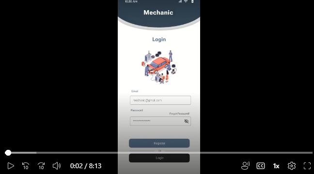
</p>

[Owner Prototype](https://upcedupe-my.sharepoint.com/:v:/g/personal/u202311064_upc_edu_pe/EbKcPfyzVzVEjt88tIi2edYBGt9elB7THGxPFwt44bkgxg?e=W0wZ8G&nav=eyJyZWZlcnJhbEluZm8iOnsicmVmZXJyYWxBcHAiOiJTdHJlYW1XZWJBcHAiLCJyZWZlcnJhbFZpZXciOiJTaGFyZURpYWxvZy1MaW5rIiwicmVmZXJyYWxBcHBQbGF0Zm9ybSI6IldlYiIsInJlZmVycmFsTW9kZSI6InZpZXcifX0%3D)

<p align="center">
  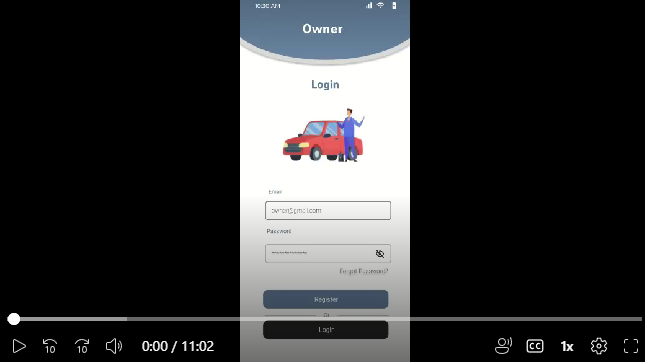
</p>

#### 4.5.2. iOS Mobile Applications Prototyping

[Prototipos iOS]

### 4.6. Web Applications UX/UI Design


#### 4.6.1. Web Applications Wireframes


#### 4.6.2. Web Applications Wireflow Diagrams


#### 4.6.3. Web Applications Mock-ups


#### 4.6.4. Web Applications User Flow Diagrams


### 4.7. Web Applications Prototyping


### 4.8. Domain-Driven Software Architecture

### 4.8.1. Event Storming

El objetivo de la sesión de EventStorming fue realizar una exploración amplia y colaborativa del dominio del problema de Autonexo. Mediante esta técnica buscamos representar de manera visual y comprensible los distintos eventos que ocurren dentro del flujo de interacción entre usuarios (propietarios de vehículos) y mecánicos, con el fin de identificar oportunidades de mejora, puntos críticos y posibles cambios de estado en el sistema.
<br>

- Step 1 – Unstructured Exploration: El equipo colocó en Miro todos los eventos relevantes sin ningún orden, con el fin de vaciar conocimiento y asegurar que ninguna parte del dominio quedara fuera.


<br>

- Step 2 – Timelines: Los eventos fueron organizados en una línea de tiempo, lo que permitió identificar la secuencia lógica de las acciones


<br>

- Step 3 – Pain Points: Se marcaron las dificultades que enfrentan los usuarios, como la demora en la asignación de mecánicos o la falta de transparencia en los precios.


<br>

- Step 4 – Pivotal Points: Finalmente, se destacaron los eventos clave que generan cambios de estado.
  <br>


<br>
<br>

Esta dinámica permitió al equipo obtener una visión compartida del proceso, detectar problemas reales y reconocer eventos centrales que posteriormente servirían para delimitar los bounded contexts.
<br>

#### 4.8.1.1. Candidate Context Discovery

El objetivo de la sesión de Candidate Context Discovery fue identificar y delimitar los bounded contexts del dominio a partir del EventStorming, con el fin de proponer una primera aproximación modular al sistema. Esto asegura que cada parte del dominio tenga responsabilidades claras, evitando la complejidad innecesaria y permitiendo un diseño más mantenible y escalable.
<br>

Se partió del resultado del EventStorming y se aplicó la técnica Look-for-pivotal-events, donde se tomaron como referencia los eventos clave mediante lineas secantes en los post-its (“Service request submitted”, “Offer accepted”, “Service completed”, etc) para determinar los límites naturales entre contextos.


<br>

A partir de esto, se definieron los bounded contexts:

- IAM Context: Abarca la lógica de registro/autenticación de usuario
- Subscription context: Hace referencia al sistema de suscripción para acceder a las funcionalidades, mediante el cual la aplicación generará ingresos.
- Workshop Context: Engloba la lógica de los mecánicos dentro de las talleres.
- Trust: Hace referencia al sistema de calificación a los usuarios.
- Maintenance: Engloba la lógica acerca de los vehículos y sus mantenimientos.
- Booking Context: Engloba el proceso de búsqueda, booking y ejecución del servicio.
- Notifications: Hace referencia a las notificaciones del sistema.

#### 4.8.1.2. Domain Message Flows Modeling

**Scenario 1**

<br> <br>

**Scenario 2**

<br> <br>

**Scenario 3**

<br> <br>

**Scenario 4**

<br> <br>

#### 4.8.1.3 Bounded Context Canvases

**IAM bounded context canvas**


<br> <br>

**Booking bounded context canvas**


<br> <br>
 
**Notifications bounded context canvas**


<br> <br>

**Payment bounded context canvas**


<br> <br>

**Trust bounded context canvas**


<br> <br>

**Maintenance bounded context canvas**


<br> <br>

**Workshop bounded context canvas**


<br> <br>

### 4.8.2. Context Mapping

El Context Mapping en Domain-Driven Design (DDD) representa explícitamente cómo interactúan los bounded contexts entre sí, definiendo contratos, direcciones de influencia (upstream/downstream) y patrones de integración. Este mapeo permite identificar qué contextos requieren estandarización, cuáles deben protegerse mediante traducción (Anti-Corruption Layer), y dónde preservar independencia para asegurar que cada contexto pueda evolucionar de forma predecible y segura.

En Autonexo, los contexts se organizaron considerando los siguientes patrones:

**Context Map Patterns**

**1. Open Host Service (OHS)**
Un contexto upstream expone servicios mediante contratos estables (APIs, endpoints o eventos), de forma que múltiples consumidores downstream pueden integrarse sin conocer su modelo interno.

Uso en Autonexo:
El IAM Context actúa como OHS, proveyendo autenticación, autorización y gestión de roles. Todos los contexts (Matching & Booking, Vehicle & Maintenance, Workshop, Subscription, Trust & Reputation, Notification) consumen estos servicios para validar identidad y permisos.


**2. Customer/Supplier (C/S)**
Relación proveedor–cliente entre contextos. El Supplier prioriza parte de su backlog en función de las necesidades del Customer, adaptando sus capacidades para habilitar los objetivos del cliente.

Uso en Autonexo:
Matching & Booking (Customer) – Workshop (Supplier): el Workshop Context provee disponibilidad de agenda y catálogo de servicios, mientras el Booking Context depende de esos datos para confirmar reservas de manera confiable.

Subscription (Customer) – Workshop (Supplier): las suscripciones otorgan beneficios como prioridad de agenda o descuentos, los cuales dependen de la configuración y condiciones publicadas por los talleres en el Workshop Context.


**3. Shared Kernel (SK)**
Dos contexts comparten un submodelo común, usualmente entidades o identificadores críticos, que deben mantenerse consistentes para evitar duplicación y divergencia.

Uso en Autonexo:
El Matching & Booking Context y el Vehicle & Maintenance Context comparten identificadores de vehículos y mantenimientos confirmados, de modo que ambos contexts operan sobre la misma referencia, garantizando consistencia y evitando duplicación de datos.


**4. Conformist (CF)**
El downstream adopta el modelo del upstream sin traducción, lo que facilita una integración rápida, pero sacrifica independencia, ya que hereda sus decisiones de diseño.

Uso en Autonexo:
El Subscription Context se adapta directamente al modelo de Matching and Booking Context (ejemplo: estados de reserva como activa, cancelada, finalizada) sin redefinirlos ni transformarlos. Esto agiliza la integración, pero obliga a Subscription a depender de los cambios en Booking.


**5. Publisher/Subscriber (Event-Driven)**
Un contexto upstream publica eventos que otros contextos downstream consumen de manera asíncrona, desacoplando la integración. Esto permite que el publisher no dependa de los consumidores y que múltiples contexts reaccionen a un mismo evento.

Uso en Autonexo:
El Notification Context actúa como subscriber de eventos generados por otros contexts:
-Matching and Booking Context → publica el evento Reserva Creada.
-Vehicle and Maintenance Context → publica el evento Mantenimiento Finalizado.
-Trust and Reputation Context → publica el evento Calificación Registrada.

El Notification Context escucha estos eventos y envía notificaciones push a los usuarios afectados.


### 4.8.3. Software Architecture Context Diagram

El siguiente diagrama muestra de manera general Autonexo conectado con los sistemas externos y los usuarios que intervienen
<br>


### 4.8.4. Software Architecture Container Diagrams

El diagrama C2 profundiza en el sistema y representa la arquitectura general del software, destacando las principales tecnologías empleadas y la manera en que estas se interconectan.
<br>


### 4.8.5. Software Architecture Components Diagrams

El siguiente diagrama muestra los contenedores del sistema Autonexo desplegados en el entorno de desarrollo y producción. Además, se muestran los servicios externos, la base de datos y el storage.
<br>

- Sistema en entorno de desarrollo:
  <br>
  

<br>

- Sistema en entorno de producción:
  <br>
  

### 4.9. Software Object-Oriented Design

#### 4.9.1. Class Diagrams

**IAM:**

- Context Class Diagram:


- Context DB Diagram:


**Matching:**

- Context Class Diagram:
  

- Context DB Diagram:
  

**Notification:**

- Context Class Diagram:
  

- Context DB Diagram:
  

**Payment:**

- Context Class Diagram:
  

- Context DB Diagram:
  

**Trusting:**

- Context Class Diagram:
  

- Context DB Diagram:
  

**Vehicle:**

- Context Class Diagram:
  

- Context DB Diagram:
  

**Workshop:**

- Context Class Diagram:
  

- Context DB Diagram:
  

### 4.10. Database Design

#### 4.10.1. Relational/Non-Relational Database Diagram

<div>
  <p align="center">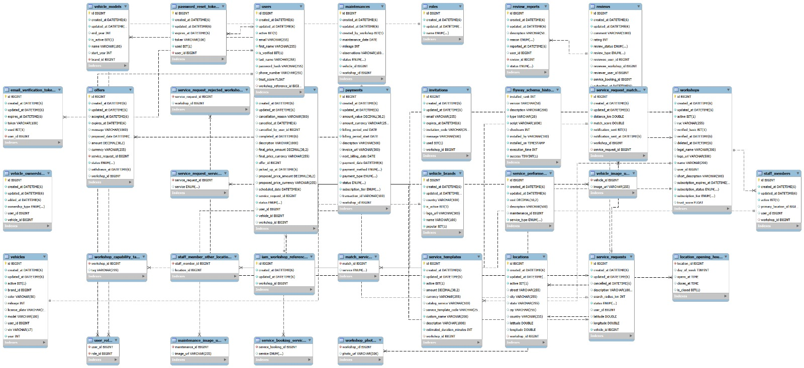</p>
</div>

<div style="page-break-after: always;"></div>

# Capítulo V: Product Implementation

## 5.1. Software Configuration Management

El equipo ha establecido un ecosistema de desarrollo estandarizado para garantizar la trazabilidad, colaboración y calidad del software. Se detallan a continuación las herramientas y normativas que rigen el ciclo de vida del producto.

### 5.1.1. Software Development Environment Configuration

Se han seleccionado herramientas líderes en la industria para cubrir cada etapa del desarrollo del producto:

*   **Project Management:** **Trello** para la gestión ágil de tareas y **Discord** como eje central de comunicación técnica y coordinación en tiempo real.
*   **Product UX/UI Design:** **Figma** para el prototipado interactivo y **UXPressia** para el mapeo de la experiencia de usuario (User Personas y Journey Maps).
*   **Software Development:** **Android Studio** como IDE principal para la construcción y depuración de la aplicación móvil nativa.
*   **Software Testing:** **Gherkin** (Cucumber) para la definición de criterios de aceptación bajo el enfoque BDD, asegurando que las funcionalidades cumplan con los requerimientos de negocio.

### 5.1.2. Source Code Management

El proyecto implementa el modelo **GitFlow** para gestionar el flujo de trabajo en los repositorios de la organización [DisExpGrupo](https://github.com/DisExpGrupo).

**Repositorios del Proyecto:**
*   **Landing Page:** [AutoNexo-Landing-Page](https://github.com/DisExpGrupo/AutoNexo-Landing-Page)
*   **Frontend Mobile:** [AutoNexo-Android](https://github.com/DisExpGrupo/AutoNexo-Android)
*   **Backend Service:** [AutoNexo-Backend](https://github.com/DisExpGrupo/AutoNexo-Backend)

**Estrategia de Ramificación:**
1.  **Main:** Contiene el código productivo y versiones estables.
2.  **Develop:** Base de integración para nuevas funcionalidades validadas.
3.  **Feature branches:** Ramas temporales para el desarrollo de tareas específicas (derivadas de `develop`).
4.  **Release branches:** Preparación y ajuste de versiones previas al despliegue final.
5.  **Hotfix branches:** Correcciones urgentes aplicadas directamente sobre `main`.

**Versionamiento y Commits:**
*   **Semantic Versioning 2.0.0:** Uso del estándar `MAJOR.MINOR.PATCH`.
*   **Conventional Commits:** Formato obligatorio `type(scope): description` para mantener un historial legible.

### 5.1.3. Source Code Style Guide & Conventions

Para asegurar un código limpio, mantenible y profesional, se siguen las siguientes directrices:

*   **Kotlin/Java (Android):**
    *   Uso de `camelCase` para variables/métodos y `PascalCase` para clases.
    *   Indentación de 4 espacios y límite de 100 caracteres por línea.
    *   Recursos XML (layouts, drawables) nombrados en `snake_case` (ej. `item_user_profile.xml`).
    *   Arquitectura basada en separación de responsabilidades: `ui/`, `data/`, y `domain/`.
*   **Gherkin:** Redacción estandarizada mediante `Given/When/Then` para asegurar que los escenarios de prueba sean comprensibles tanto para desarrolladores como para stakeholders.

### 5.1.4. Software Deployment Configuration

La estrategia de despliegue se divide según el componente del sistema para maximizar la disponibilidad:

*   **Landing Page:** Desplegada a través de **GitHub Pages**. El flujo de publicación se automatiza desde la carpeta `/docs` de la rama `main`.
*   **Backend:** Alojado en la plataforma nube **Azure**, utilizando **App Services** para la ejecución de la API y **Azure SQL** para la gestión de la base de datos, garantizando escalabilidad y seguridad.

## 5.2. Product Implementation & Deployment

### 5.2.1. Sprint Backlogs (Continuación)

#### Sprint 3
*   **Sprint Goal:** Finalizar los Bounded Contexts críticos (Offer, Request, Booking, Payment), alcanzar la fidelidad visual total en Android y establecer la paridad funcional multiplataforma con Flutter.
*   **Velocity:** 42 story points.

**Sprint Backlog Table:**
| ID | Title | Estimation (h) | Assigned To | Status | Story Points |
|----|-------|----------------|-------------|--------|--------------|
| US04 | Bounded Context: Offer Management | 5 | Victor Cruz | Done | 5 |
| US05 | Bounded Context: Service Requests | 5 | Santiago Solis | Done | 5 |
| US11 | Bounded Context: Service Booking | 6 | Amir Castro | Done | 8 |
| US15 | Payment & Subscription System | 5 | Miguel Vidal | Done | 5 |
| US17 | Workshop Management (Employees/Invites) | 6 | Alicia Navarro | Done | 8 |
| US18 | UI/UX Final: Auth & Profile (Android) | 4 | Victor Cruz | Done | 5 |
| US19 | Dashboard & Navigation UI (Android) | 3 | Santiago Solis | Done | 3 |
| US20 | Request-Offer Matching Engine | 4 | Amir Castro | Done | 5 |
| FL01 | Flutter Core Implementation | 8 | Miguel Vidal | Done | 8 |

---

### 5.2.5. Implemented Mobile Application Evidence (Sprint 3)

En esta fase, la aplicación alcanzó su estado operativo final, integrando pasarelas de pago y el sistema de matching.

| Funcionalidad | Descripción | Evidencia Visual |
|---------------|-------------|------------------|
| **Autenticación Final** | Flujo de acceso y registro con diseño pulido y validaciones. | 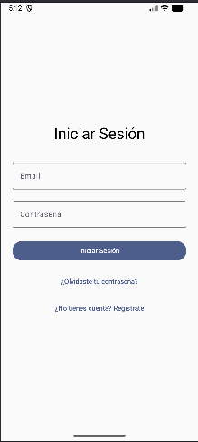 |
| **Dashboard Principal** | Centro de control con navegación optimizada para el usuario. | 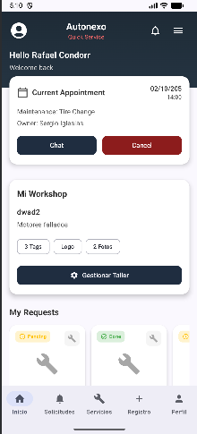 |
| **Gestión de Perfil** | Configuración completa de datos de usuario y taller. | 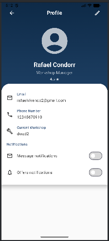 |
| **Módulo de Pagos** | Sistema de suscripciones para talleres y gestión de pagos. | 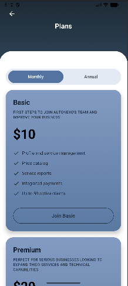 |

*   **Video de Demostración Final:** [AutoNexo Sprint 3 Demo](https://drive.google.com/drive/folders/1rQoI7fwtVrntl1jeGQ1cc_cXpP7fWdzK?usp=sharing)

---

### 5.2.6. Implemented RESTful API Evidence (Sprint 3)

Se expandió el backend para soportar la lógica de negocio avanzada del ecosistema.

*   **OfferController:** Gestión de presupuestos y propuestas comerciales de talleres.
*   **RequestController:** Centralización de solicitudes de mantenimiento de conductores.
*   **BookingController:** Orquestación de citas y reservas de servicios.
*   **PaymentController:** Procesamiento de transacciones y membresías.
*   **Workshop (Extended):** Control de empleados, activaciones y códigos de invitación.

---

### 5.2.7. RESTful API Documentation & Deployment

La documentación técnica fue actualizada para reflejar los nuevos Bounded Contexts y asegurar la integración con los clientes Android y Flutter.

*   **URL de Swagger UI:** [AutoNexo API Documentation](https://autonexo-backend-zcy7.onrender.com/swagger-ui/index.html#/)
*   **Entorno de Producción:** Render (Oregon. US West).

**Evidencia de Documentación:**
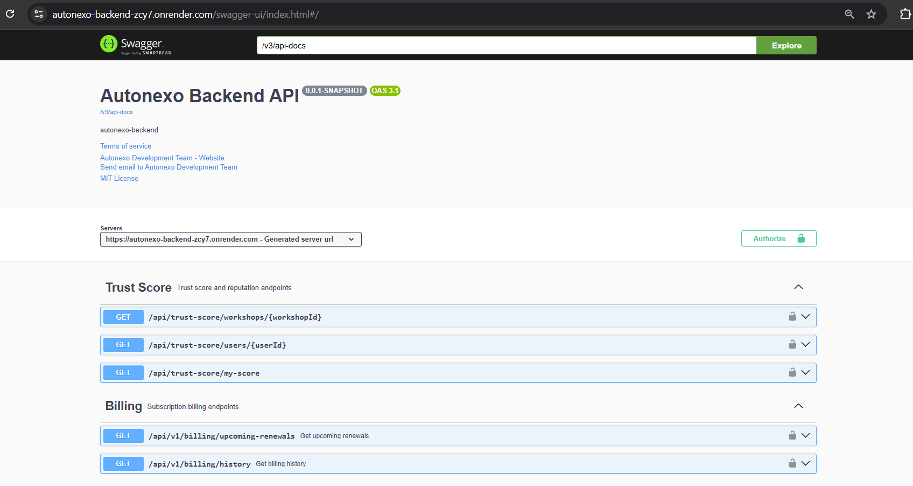

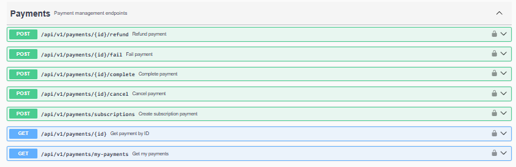

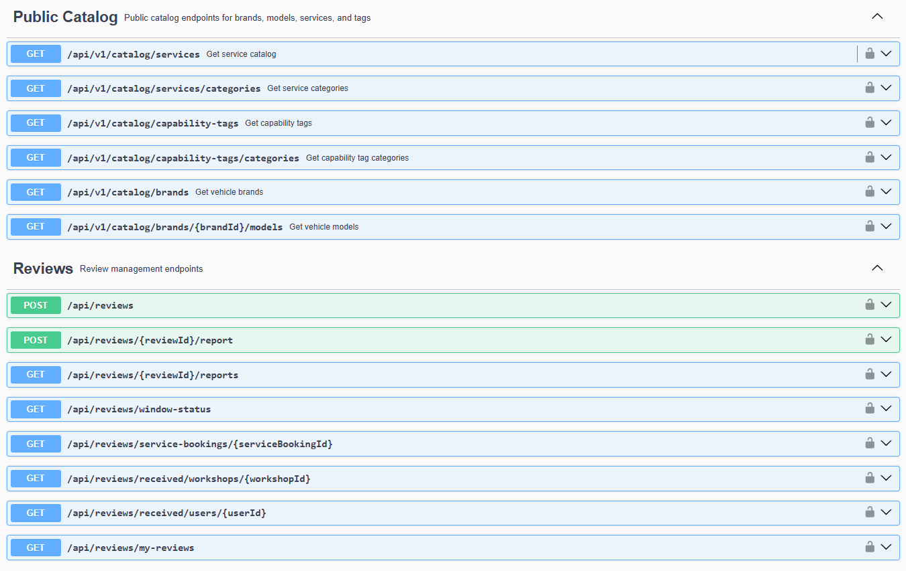

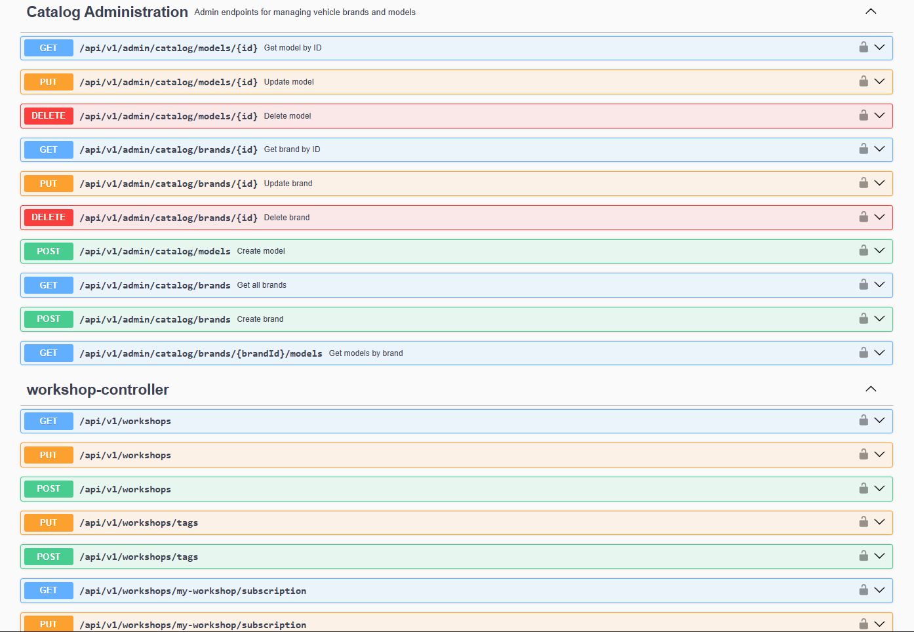

---

### 5.2.8. Team Collaboration Insights

El equipo operó en un modelo de desarrollo paralelo para cubrir tres frentes: Backend, Android Nativo y Flutter.

*   **Victor Cruz:** Lideró la implementación de **Offer Context** y el diseño de alta fidelidad para los flujos de identidad en Android.
*   **Santiago Solis:** Responsable del **Request Context** y la arquitectura de navegación central de la aplicación móvil.
*   **Alicia Navarro:** Especialista en **Workshop Operations**, desarrollando la lógica de gestión de personal y seguridad de invitaciones.
*   **Miguel Vidal:** Encargado del **Payment Engine** y la implementación de la base de código multiplataforma en Flutter.
*   **Amir Castro:** Desarrolló el **Matching System**, permitiendo la conexión inteligente entre necesidades del usuario y ofertas de talleres.

#### Participación en Repositorios:
| Repositorio | Evidencia de Contribución |
|-------------|---------------------------|
| **Backend** | 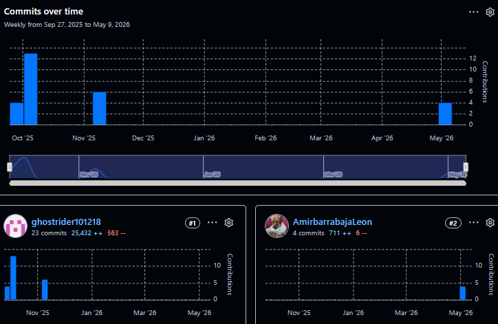 |
| **Android** | 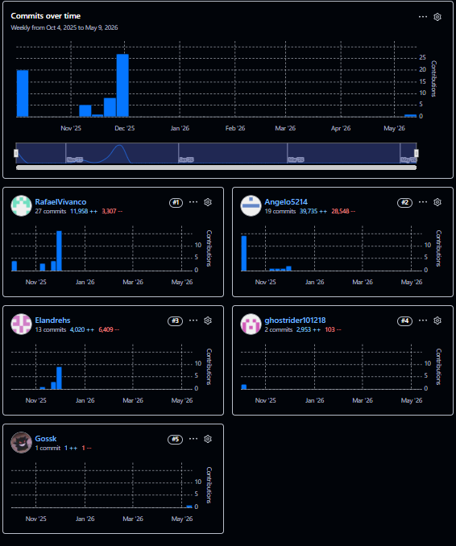 |
| **Flutter** | 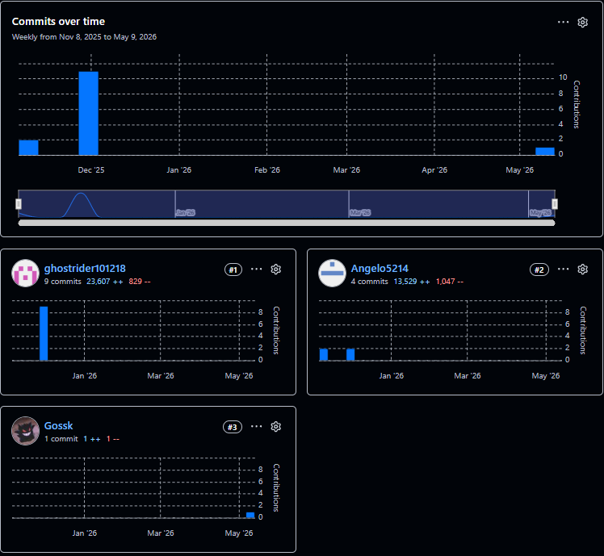 |

---

### Final Deployment Summary

El proyecto se encuentra desplegado y operativo en los siguientes puntos de acceso:

1.  **API Backend:** [Render](https://autonexo-backend-zcy7.onrender.com/swagger-ui/index.html#/)
2.  **Landing Page:** [Netlify App](https://splendorous-mooncake-980604.netlify.app/)
3.  **App Distribution:** Firebase App Distribution para pruebas Alpha/Beta.

---

## 5.3. Video About-the-Product

**Enlace al video:** [About the Product: https://drive.google.com/file/d/1jgXDsMEV_bvpwjJ2y6HXbz6BG4oDxSfh/view?usp=sharing](https://drive.google.com/file/d/1jgXDsMEV_bvpwjJ2y6HXbz6BG4oDxSfh/view?usp=sharing)

<div style="page-break-after: always;"></div>

# PARTE II: VERIFICATION, VALIDATION & PIPELINE

<div style="page-break-after: always;"></div>

## Capítulo VI: Product Verification & Validation

### 6.1. Testing Suites & Validation

## 6.1.1 Core Entities Unit Tests

En esta sección se documentan las pruebas unitarias del bounded context Workshop, implementadas en la clase `WorkshopDomainUnitTest`. Estas pruebas validan el comportamiento de los aggregates, entities y value objects del dominio de forma aislada, sin depender de base de datos, red ni ningún sistema externo. Cada prueba ejercita directamente las reglas de negocio codificadas en los objetos de dominio.

### Relación de Unit Tests

| Clase bajo prueba | Método de prueba | Comportamiento validado |
|---|---|---|
| Workshop | `createWorkshop_WhenOwnerUserIdIsNull_ShouldThrowIllegalArgumentException` | Se rechaza la creación de un taller si el identificador del propietario es null |
| Workshop | `createWorkshop_WhenNameIsNullOrBlank_ShouldThrowIllegalArgumentException` | Se rechaza la creación si el nombre es null, vacío o solo contiene espacios/tabulaciones (4 casos vía @ParameterizedTest) |
| Workshop | `createWorkshop_WithValidData_ShouldCreateActiveWorkshopWithExpectedInitialState` | Un taller creado con datos válidos arranca activo, sin fotos, sin staff, con estado TRIAL y tier FREE |
| Workshop | `addPhoto_WhenExceedingTenPhotoLimit_ShouldThrowIllegalStateException` | Se rechaza agregar una undécima foto y el contador permanece en 10 |
| Workshop | `isSubscriptionActive_WhenStatusIsTerminated_ShouldReturnFalse` | Una suscripción CANCELLED o EXPIRED se evalúa como inactiva aunque la fecha de vencimiento sea futura (2 casos vía @ParameterizedTest) |
| Workshop | `isSubscriptionActive_WhenExpirationDateHasPassed_ShouldReturnFalse` | Una suscripción con fecha de vencimiento en el pasado se evalúa como inactiva aunque el estado sea ACTIVE |
| Workshop | `isSubscriptionActive_WhenStatusIsActiveWithNoExpiry_ShouldReturnTrue` | Una suscripción ACTIVE sin fecha de vencimiento se evalúa correctamente como activa |
| Workshop | `canAccessPremiumFeatures_WhenTierIsFreeAndSubscriptionIsActive_ShouldReturnFalse` | El tier FREE no concede acceso a funciones premium, aun con suscripción activa |
| Workshop | `canAccessPremiumFeatures_WhenTierIsBasicOrPremiumAndActive_ShouldReturnTrue` | Los tiers BASIC y PREMIUM con suscripción activa conceden acceso a funciones premium (2 casos vía @ParameterizedTest) |
| Workshop | `removeLocation_WhenLocationDoesNotExist_ShouldThrowLocationNotFoundException` | Intentar eliminar una sucursal con ID inexistente lanza LocationNotFoundException |
| Invitation | `markAsUsed_WhenInvitationAlreadyUsed_ShouldThrowIllegalStateException` | Una invitación ya utilizada no puede marcarse como usada por segunda vez |
| Invitation | `markAsUsed_WhenInvitationIsExpired_ShouldThrowIllegalStateException` | Una invitación con fecha de expiración pasada no puede marcarse como usada |
| Invitation | `isForEmail_WhenEmailDiffersByCase_ShouldMatchCaseInsensitively` | La comparación de email en la invitación es insensible a mayúsculas/minúsculas |
| ServiceTemplate | `createServiceTemplate_WhenDurationIsNotPositive_ShouldThrowIllegalArgumentException` | Se rechaza crear una plantilla de servicio con duración 0, negativa o Integer.MIN_VALUE (4 casos vía @ParameterizedTest) |
| BusinessRegistration | `createBusinessRegistration_WhenRucIsInvalid_ShouldThrowIllegalArgumentException` | Se rechazan RUCs null, vacíos, con menos de 11 dígitos, con más de 11 dígitos o con caracteres no numéricos (5 casos vía @ParameterizedTest) |
| OpeningHours | `createOpeningHours_WhenOpeningTimeIsAfterClosingTime_ShouldThrowIllegalArgumentException` | Se rechaza un horario donde la hora de apertura es posterior a la de cierre |
| OpeningHours | `createOpeningHours_WhenOpeningTimeEqualsClosingTime_ShouldThrowIllegalArgumentException` | Se rechaza un horario donde la hora de apertura es igual a la de cierre |

### Evidencia de ejecución

Panel de resultados de `WorkshopDomainUnitTest` mostrando **29 tests passed** con árbol de pruebas expandido. Se aprecia la clase `Workshop BC — Domain Unit Tests` con todos los métodos en verde y el paquete `com.atg.autonexo.backend.workshop.domain` en la barra inferior.

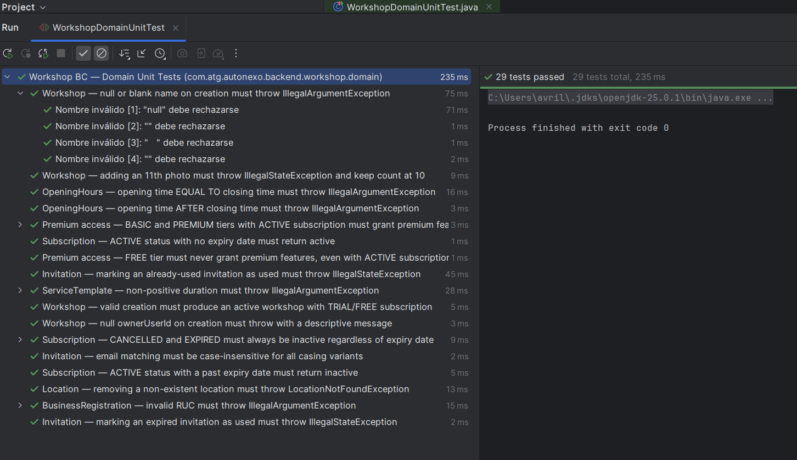

Árbol expandido mostrando los tests paramétricos desplegados — parte superior. Se aprecian los 4 sub-casos de `createWorkshop_WhenNameIsNullOrBlank` con sus valores: null, "", "   " y "". También se muestran los 2 sub-casos de `canAccessPremiumFeatures_WhenTierIsBasicOrPremium` con Tier BASIC y Tier PREMIUM.

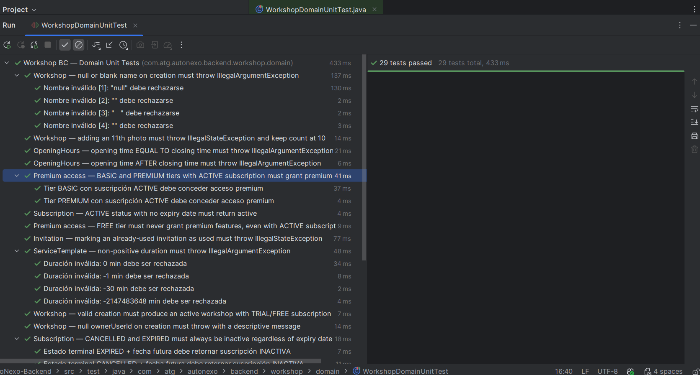

Árbol expandido mostrando los tests paramétricos desplegados — parte inferior. Se aprecian los 5 sub-casos de `createBusinessRegistration_WhenRucIsInvalid` con valores: "null", "12345", "123456789012", "ABCDE678901" y "".

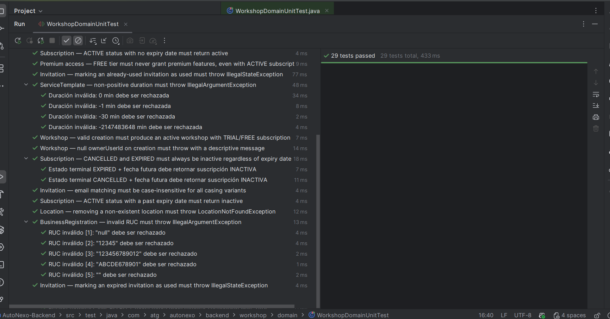

Código fuente de `WorkshopDomainUnitTest.java` con el método `setUp()` anotado con `@BeforeEach` visible, junto con los comentarios `ES: Riesgo cubierto` y `EN: Risk covered` del primer test. Se aprecia la ruta del archivo en la barra superior del editor.

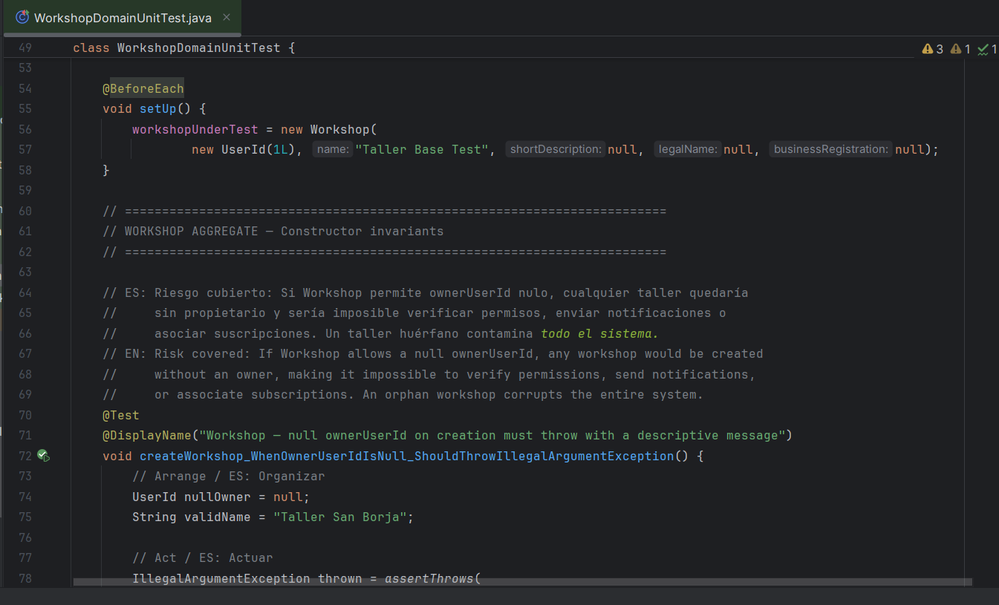

### Testing Suite Evidence for Sprint Review

| Repository | Branch | Commit Id | Commit Message | Commit Message Body | Commited on |
|---|---|---|---|---|---|
| AutoNexo-Backend | feature/workshop-testing | 082c906 | test(workshop): add unit and integration tests for Workshop bounded context | — | 2026-05-11 |

---

## 6.1.2 Core Integration Tests

En esta sección se documentan las pruebas de integración del bounded context Workshop, implementadas en la clase `WorkshopApplicationIntegrationTest`. A diferencia de las pruebas unitarias, estas validan que los servicios de aplicación (`WorkshopCommandServiceImpl` e `InvitationCommandServiceImpl`) orquestan correctamente la lógica de dominio con las dependencias de infraestructura. Los repositorios, el facade ACL y los servicios externos son sustituidos por mocks de Mockito, permitiendo verificar los flujos completos sin base de datos ni red.

### Relación de Integration Tests

| Servicio bajo prueba | Método de prueba | Comportamiento validado |
|---|---|---|
| WorkshopCommandServiceImpl | `handle_CreateWorkshopCommand_WhenValidNewOwner_ShouldSaveWorkshopAndAssociateUserInAcl` | La creación exitosa de un taller persiste el aggregate en el repositorio y dispara la asociación en el ACL del contexto IAM |
| WorkshopCommandServiceImpl | `handle_CreateWorkshopCommand_WhenOwnerAlreadyHasWorkshop_ShouldThrowAndNeverSave` | Si el propietario ya tiene un taller registrado, se lanza WorkshopAlreadyExistsException sin persistir ni llamar al ACL |
| WorkshopCommandServiceImpl | `handle_CreateWorkshopCommand_WhenAclAssociationFails_ShouldRollbackByDeletingWorkshop` | Si el ACL falla después de persistir el taller, el servicio ejecuta rollback eliminando el taller del repositorio |
| InvitationCommandServiceImpl | `handle_AcceptInvitationCommand_WhenInvitationIsExpired_ShouldThrowIllegalStateException` | El servicio delega en el aggregate Invitation real la verificación de expiración y propaga correctamente la excepción, sin persistir nada |
| InvitationCommandServiceImpl | `handle_AcceptInvitationCommand_WhenValidInvitation_ShouldCreateStaffMemberAndMarkInvitationUsed` | La aceptación de una invitación válida crea un StaffMember en el aggregate Workshop, marca la Invitation como usada y persiste ambos aggregates |

### Evidencia de ejecución

Panel de resultados de `WorkshopApplicationIntegrationTest` mostrando **5 tests passed** en 3 seg 8 ms. Se aprecia el árbol con los 5 métodos de integración con check verde bajo `Workshop BC — Application Integration Tests` y `Process finished with exit code 0` en la consola.

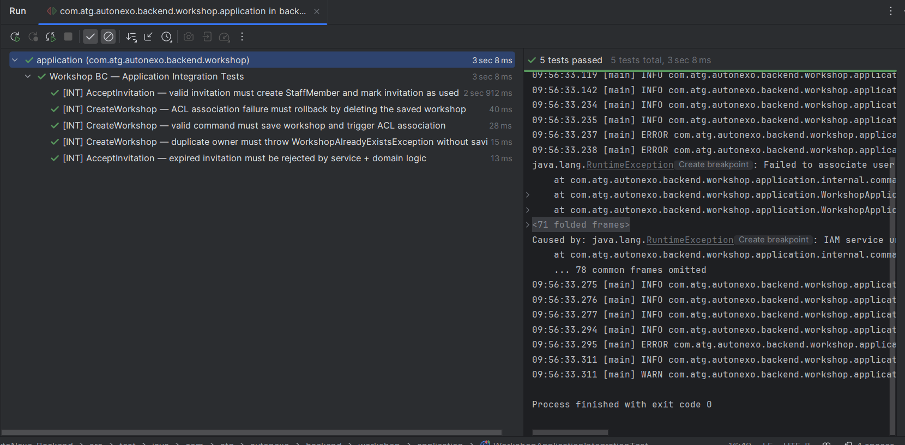

Ejecución conjunta de todo el bounded context Workshop mostrando **34 tests passed** — vista con árbol completo expandido. Se aprecian ambas clases: `Workshop BC — Application Integration Tests` (5 pruebas) y `Workshop BC — Domain Unit Tests` (29 pruebas), todas en verde.

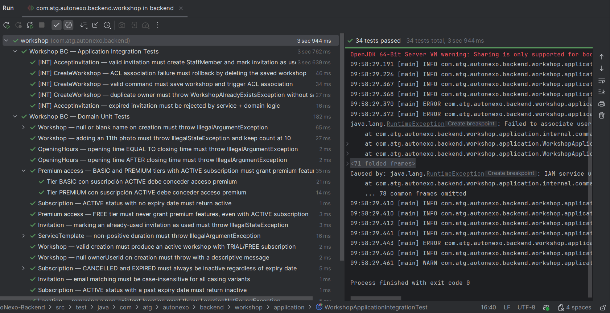

Ejecución conjunta de todo el bounded context Workshop mostrando **34 tests passed** — vista con consola de ejecución visible. Se aprecia el `Process finished with exit code 0` confirmando que todas las pruebas pasaron correctamente.

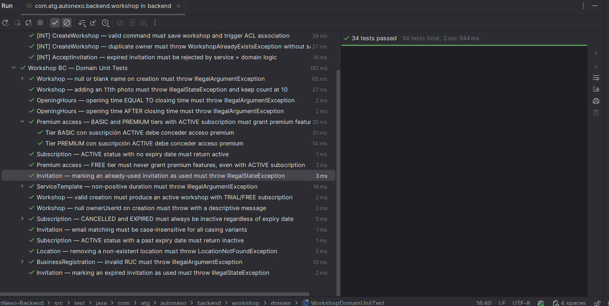

Código fuente de `WorkshopApplicationIntegrationTest.java` mostrando las anotaciones `@Mock` de los repositorios e infraestructura (`WorkshopRepository`, `WorkshopContextFacade`, `InvitationRepository`, `NotificationService`, `UserRepository`, `WorkshopReferenceRepository`) y el método `setUp()` con `@BeforeEach` realizando la inyección manual de dependencias via constructor.

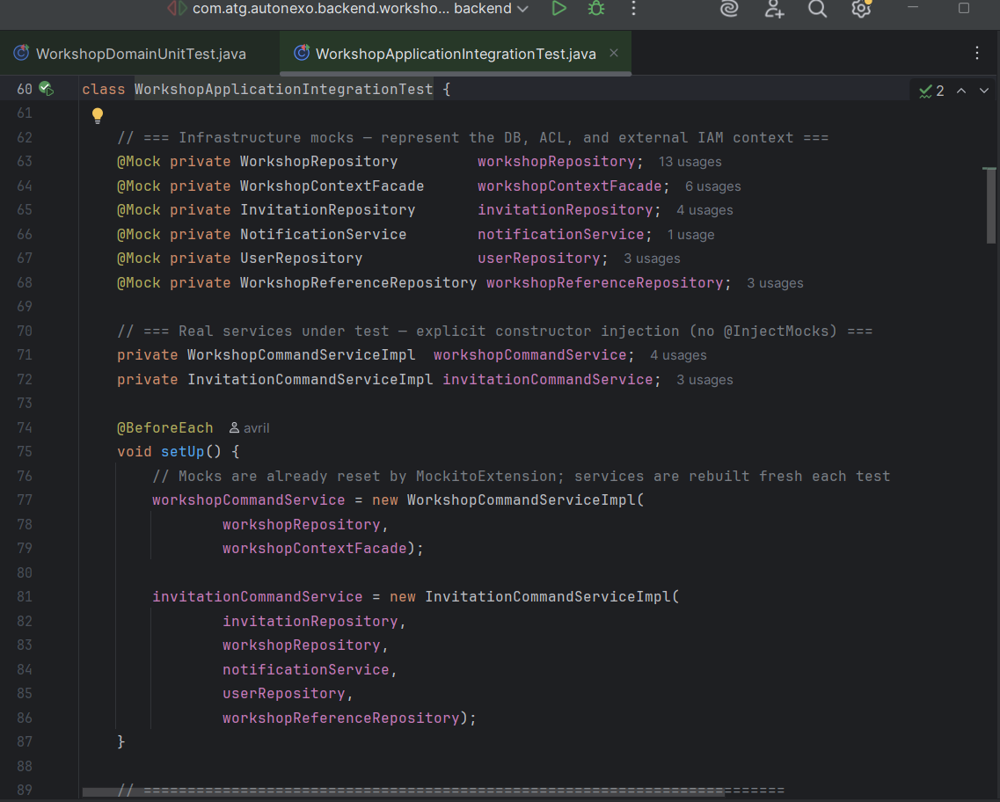

### Testing Suite Evidence for Sprint Review

| Repository | Branch | Commit Id | Commit Message | Commit Message Body | Commited on |
|---|---|---|---|---|---|
| AutoNexo-Backend | feature/workshop-testing | 082c906 | test(workshop): add unit and integration tests for Workshop bounded context | — | 2026-05-11 |


#### 6.1.3. Core Behavior-Driven Development

[Pruebas BDD]

#### 6.1.4. Core System Tests

[Pruebas de sistema]

### 6.2. Static Testing & Verification

#### 6.2.1. Static Code Analysis

##### 6.2.1.1. Coding Standard & Code Conventions

[Estándares de codificación]

##### 6.2.1.2. Code Quality & Code Security

[Calidad y seguridad de código]

#### 6.2.2. Reviews

[Revisiones de código]

### 6.3. Validation Interviews

#### 6.3.1. Diseño de Entrevistas

[Diseño de entrevistas de validación]

#### 6.3.2. Registro de Entrevistas

[Registro de entrevistas]

#### 6.3.3. Evaluaciones Según Heurísticas

[Evaluaciones heurísticas]

### 6.4. Auditoría de Experiencias de Usuario

#### 6.4.1. Auditoría Realizada

##### 6.4.1.1. Información del Grupo Auditado

[Información del grupo]

##### 6.4.1.2. Cronograma de Auditoría Realizada

[Cronograma]

##### 6.4.1.3. Contenido de Auditoría Realizada

[Contenido de auditoría]

#### 6.4.2. Auditoría Recibida

##### 6.4.2.1. Información del Grupo Auditor

[Información del auditor]

##### 6.4.2.2. Cronograma de Auditoría Recibida

[Cronograma recibido]

##### 6.4.2.3. Contenido de Auditoría Recibida

[Contenido recibido]

##### 6.4.2.4. Resumen de Modificaciones para Subsanar Hallazgos

[Resumen de cambios]

<div style="page-break-after: always;"></div>

## Capítulo VII: DevOps Practices

### 7.1. Continuous Integration

#### 7.1.1. Tools and Practices

La Integración Continua (Continuous Integration - CI) es una práctica de desarrollo de software que permite integrar cambios de código de manera frecuente en un repositorio compartido. Cada integración es verificada automáticamente mediante procesos de compilación, ejecución de pruebas y validaciones, con el objetivo de detectar errores tempranamente y garantizar la estabilidad del sistema.

En el desarrollo del proyecto se emplearon diversas herramientas y metodologías que permitieron automatizar el proceso de construcción y validación del software, mejorando la calidad del código y facilitando el trabajo colaborativo del equipo.

Asimismo, se aplicaron prácticas de Desarrollo Orientado por Comportamiento (BDD) y  Desarrollo Orientado por Pruebas (TDD) y pruebas automatizadas para asegurar que los componentes implementados funcionen correctamente antes de integrarse al entorno principal del proyecto.


<br>


#### 7.1.2. Build & Test Suite Pipeline Components

[Componentes de pipeline]

### 7.2. Continuous Delivery

La Entrega Continua (Continuous Delivery - CD) tiene como objetivo automatizar el proceso de preparación y validación del software para que siempre se encuentre en un estado listo para ser desplegado. Esta práctica permite reducir errores durante las entregas y agilizar la publicación de nuevas funcionalidades, manteniendo un flujo constante y controlado de integración y validación del código.

En el proyecto se implementaron herramientas y prácticas que permitieron automatizar procesos de compilación, pruebas y validaciones previas al despliegue, asegurando la estabilidad del sistema antes de su publicación en entornos de producción.

#### 7.2.1. Tools and Practices

| Herramienta    | Tipo                 | Descripción                                                                                                          | Propósito                                                                                   |
| -------------- | -------------------- | -------------------------------------------------------------------------------------------------------------------- | ------------------------------------------------------------------------------------------- |
| GitHub Actions | Automatización CI/CD | Plataforma utilizada para automatizar procesos de compilación, pruebas y validación del proyecto mediante workflows. | Preparar automáticamente el sistema para su despliegue luego de cada integración de código. |
| GitHub         | Control de versiones | Plataforma utilizada para gestionar ramas, pull requests y colaboración entre integrantes del equipo.                | Mantener control y trazabilidad sobre los cambios realizados en el proyecto.                |
| Docker         | Contenedorización    | Herramienta utilizada para empaquetar la aplicación junto con sus dependencias en contenedores portables.            | Garantizar consistencia entre entornos de desarrollo, pruebas y despliegue.                 |
| Trello         | Gestión de proyecto  | Herramienta utilizada para organizar tareas, seguimiento de avances y control del flujo de trabajo.                  | Coordinar aprobaciones y seguimiento del proceso de despliegue.                             |


### Prácticas Implementadas
#### Feature Branching y Pull Requests

Las nuevas funcionalidades y correcciones fueron desarrolladas en ramas independientes, permitiendo trabajar de manera aislada sin afectar la estabilidad de la rama principal. Posteriormente, los cambios eran integrados mediante Pull Requests luego de superar validaciones automáticas y revisiones del equipo.

#### Pipeline de Validación

Cada vez que se realizaba un commit o merge request, el pipeline ejecutaba automáticamente procesos de compilación y pruebas, verificando que el sistema se mantuviera estable y libre de errores antes de continuar con el flujo de entrega.

#### Validación en Entornos de Staging

Antes de un despliegue final, la aplicación podía ser validada en entornos similares a producción, permitiendo realizar pruebas funcionales, revisiones manuales y verificaciones adicionales del comportamiento del sistema.

#### Despliegue Semiautomático

El pipeline automatizaba la preparación del despliegue, incluyendo compilación, validación y generación de artefactos. Sin embargo, el despliegue final requería aprobación manual del equipo responsable, asegurando mayor control sobre las versiones publicadas.

#### Rollback Controlado

En caso de detectar errores críticos posteriores a una actualización, el equipo podía revertir manualmente la versión desplegada para restaurar la estabilidad del sistema.

#### 7.2.2. Stages Deployment Pipeline Components

El pipeline de Continuous Delivery estuvo compuesto por diversas etapas automatizadas que permitieron validar y preparar la aplicación antes de su despliegue.

| Etapa                   | Descripción                                                          | Objetivo                                                     |
| ----------------------- | -------------------------------------------------------------------- | ------------------------------------------------------------ |
| Source Control          | Gestión del código mediante ramas y repositorios Git.                | Facilitar el trabajo colaborativo y el control de versiones. |
| Build Stage             | Compilación automática del proyecto luego de cada integración.       | Detectar errores de compilación tempranamente.               |
| Automated Testing       | Ejecución de pruebas unitarias y pruebas automatizadas.              | Validar el correcto funcionamiento del sistema.              |
| Staging Validation      | Validación del sistema en un entorno similar a producción.           | Realizar pruebas finales antes del despliegue.               |
| Deployment Approval     | Aprobación manual previa al despliegue final.                        | Asegurar control y supervisión sobre las entregas.           |
| Deployment Preparation  | Generación y empaquetado de artefactos desplegables.                 | Mantener la aplicación lista para producción.                |
| Monitoring and Feedback | Supervisión básica del comportamiento del sistema tras validaciones. | Detectar posibles errores o problemas de rendimiento.        |


### 7.3. Continuous Deployment

El Despliegue Continuo (Continuous Deployment) permite automatizar la publicación de nuevas versiones del sistema hacia producción una vez que las validaciones y pruebas han sido superadas satisfactoriamente. Esta práctica reduce la intervención manual durante el despliegue, mejora la rapidez de entrega y disminuye la probabilidad de errores humanos.

En el proyecto se implementaron diversas herramientas y prácticas orientadas a automatizar el despliegue del backend, frontend y servicios asociados, asegurando estabilidad, disponibilidad y consistencia entre entornos.

#### 7.3.1. Tools and Practices

| Herramienta      | Tipo                            | Descripción                                                                                               | Propósito                                                                           |
| ---------------- | ------------------------------- | --------------------------------------------------------------------------------------------------------- | ----------------------------------------------------------------------------------- |
| GitHub Actions   | Automatización CI/CD            | Plataforma utilizada para ejecutar workflows automáticos de integración, pruebas y despliegue.            | Automatizar el pipeline completo de construcción y despliegue del sistema.          |
| Docker           | Contenedorización               | Herramienta utilizada para empaquetar la aplicación backend junto con sus dependencias.                   | Garantizar consistencia entre entornos de desarrollo y producción.                  |
| Railway          | Plataforma de base de datos     | Servicio utilizado para alojar y gestionar la base de datos MySQL del proyecto.                           | Facilitar migraciones, backups y disponibilidad del servicio de base de datos.      |
| Render           | Hosting backend                 | Plataforma utilizada para desplegar automáticamente el backend desarrollado con Spring Boot.              | Gestionar el despliegue y monitoreo continuo del backend.                           |
| Firebase Hosting | Hosting frontend                | Servicio utilizado para desplegar la aplicación frontend y distribuir contenido de forma segura y rápida. | Automatizar la publicación de la aplicación web en producción.                      |
| Netlify          | Hosting frontend y landing page | Plataforma utilizada para desplegar la landing page del proyecto.                                         | Facilitar despliegues rápidos y automatizados de la página informativa del sistema. |

### Prácticas Implementadas
#### Feature Branching

El equipo utilizó una estrategia de ramas basada en Git, donde cada funcionalidad o corrección era desarrollada en ramas independientes. Posteriormente, los cambios eran integrados a ramas principales mediante procesos de revisión y validación.

#### Commit-Based Deployment

Cada vez que se realizaba un commit o merge hacia la rama principal de integración, el pipeline CI/CD se ejecutaba automáticamente, iniciando procesos de compilación, pruebas y despliegue del sistema.

#### Despliegue Automatizado

Una vez superadas las pruebas automáticas, las plataformas de hosting desplegaban automáticamente las nuevas versiones del backend y frontend, reduciendo tiempos de entrega y errores manuales.

#### Rollback Controlado

En caso de detectarse errores críticos posteriores al despliegue, el sistema permitía restaurar versiones previas de manera controlada para garantizar la continuidad del servicio.

#### Monitoreo Posterior al Despliegue

Después de cada despliegue, las plataformas utilizadas proporcionaban herramientas de monitoreo y verificación para detectar posibles fallos de rendimiento o disponibilidad.

#### 7.3.2. Production Deployment Pipeline Components

El pipeline de despliegue en producción estuvo compuesto por distintos componentes encargados de automatizar la actualización del backend, frontend y base de datos del sistema.

#### Componentes del Pipeline de Base de Datos (Railway)

| Componente                 | Descripción                                                                                                                         |
| -------------------------- | ----------------------------------------------------------------------------------------------------------------------------------- |
| Gestión de Migraciones     | Spring Boot gestionaba automáticamente las migraciones y sincronización de entidades con la base de datos MySQL alojada en Railway. |
| Backup Automático          | Railway realizaba copias de seguridad automáticas antes de aplicar cambios críticos en la base de datos.                            |
| Monitoreo de Base de Datos | La plataforma permitía supervisar el estado y rendimiento de la base de datos en tiempo real.                                       |
| Validación de Esquema      | Se verificaba que las migraciones aplicadas mantuvieran correctamente la estructura y relaciones de la base de datos.               |
| Actualización Continua     | Los cambios aprobados eran reflejados automáticamente en el entorno de producción.                                                  |


#### Componentes del Pipeline del Backend (Render + Spring Boot)

| Componente            | Descripción                                                                              |
| --------------------- | ---------------------------------------------------------------------------------------- |
| Integración Continua  | Render obtenía automáticamente el código actualizado desde el repositorio remoto.        |
| Build del Backend     | El proyecto Spring Boot era compilado utilizando Maven.                                  |
| Construcción Docker   | Se generaba automáticamente una imagen Docker del backend con todas sus dependencias.    |
| Despliegue Automático | Render desplegaba la nueva versión del backend en producción.                            |
| Monitoreo y Alertas   | La plataforma supervisaba el estado del servicio y notificaba posibles errores o caídas. |


#### Componentes del Pipeline del Frontend (Firebase Hosting)

| Componente            | Descripción                                                                                          |
| --------------------- | ---------------------------------------------------------------------------------------------------- |
| Compilación Frontend  | La aplicación Angular era compilada automáticamente en modo producción.                              |
| Ejecución de Pruebas  | Se ejecutaban pruebas automatizadas para validar el correcto funcionamiento de la interfaz.          |
| Despliegue Automático | Firebase Hosting publicaba automáticamente la nueva versión del frontend.                            |
| Distribución CDN      | El contenido era distribuido mediante una red CDN para mejorar el rendimiento global.                |
| Invalidación de Caché | Firebase actualizaba automáticamente la caché para garantizar acceso a la última versión disponible. |


#### Componentes del Pipeline de Landing Page (Netlify)

| Componente          | Descripción                                                                                    |
| ------------------- | ---------------------------------------------------------------------------------------------- |
| Build Automático    | Netlify compilaba automáticamente la landing page luego de detectar cambios en el repositorio. |
| Despliegue Continuo | La landing page era publicada automáticamente en producción.                                   |
| CDN Global          | Netlify distribuía el contenido mediante una red CDN para optimizar tiempos de carga.          |
| Monitoreo Básico    | La plataforma permitía verificar el estado y disponibilidad de la página desplegada.           |


### 7.4. Continuous Monitoring

El Monitoreo Continuo (Continuous Monitoring) permite supervisar constantemente el comportamiento y rendimiento de la aplicación luego de su despliegue. Su objetivo principal es detectar errores, degradaciones de rendimiento o problemas de disponibilidad de manera temprana, garantizando una experiencia estable y confiable para los usuarios.

Para el desarrollo del proyecto se emplearon diversas herramientas y prácticas orientadas al análisis del rendimiento, supervisión de servicios, monitoreo de experiencia de usuario y generación de alertas automáticas.

#### 7.4.1. Tools and Practices

Con el fin de mantener un monitoreo eficiente de la aplicación y de sus distintos componentes, se utilizaron herramientas especializadas para análisis de rendimiento, supervisión de APIs y evaluación de experiencia de usuario.

| Herramienta       | Tipo                               | Descripción                                                                                     | Propósito                                                                  |
| ----------------- | ---------------------------------- | ----------------------------------------------------------------------------------------------- | -------------------------------------------------------------------------- |
| Apache JMeter     | Pruebas de carga y estrés          | Herramienta utilizada para simular múltiples usuarios y escenarios de alta demanda.             | Evaluar la estabilidad y rendimiento del sistema bajo cargas elevadas.     |
| Google Analytics  | Analítica y experiencia de usuario | Plataforma utilizada para recopilar métricas de navegación e interacción de usuarios.           | Analizar el comportamiento de usuarios y mejorar la experiencia de uso.    |
| Datadog           | Monitoreo de rendimiento           | Servicio de monitoreo en tiempo real que permite supervisar métricas de rendimiento y latencia. | Detectar problemas de rendimiento y monitorear la experiencia del usuario. |
| Postman           | Supervisión de APIs                | Herramienta utilizada para validar y monitorear endpoints y servicios REST.                     | Verificar disponibilidad y correcto funcionamiento de APIs.                |
| Pingdom           | Monitoreo de disponibilidad        | Plataforma utilizada para monitorear tiempos de respuesta y disponibilidad del sistema.         | Detectar interrupciones o degradaciones del servicio.                      |
| Google Lighthouse | Auditoría de calidad web           | Herramienta utilizada para evaluar rendimiento, accesibilidad y buenas prácticas web.           | Mejorar la calidad general y optimización de la aplicación web.            |
| Catchpoint        | Monitoreo de experiencia digital   | Plataforma enfocada en medir experiencia de usuario desde distintas ubicaciones y dispositivos. | Analizar rendimiento y disponibilidad en diferentes entornos.              |


#### 7.4.2. Monitoring Pipeline Components

El pipeline de monitoreo implementado estuvo conformado por diferentes etapas orientadas a recopilar, analizar y visualizar información relacionada con el estado y rendimiento del sistema.

| Componente                          | Descripción                                                                                          |
| ----------------------------------- | ---------------------------------------------------------------------------------------------------- |
| Recolección de Métricas             | Obtención automática de datos de rendimiento, tiempos de respuesta y uso de recursos.                |
| Monitoreo de Experiencia de Usuario | Supervisión del comportamiento de navegación y tiempos de carga experimentados por usuarios finales. |
| Supervisión de APIs                 | Verificación continua de disponibilidad y funcionamiento de servicios y endpoints REST.              |
| Auditoría de Calidad Web            | Evaluación de rendimiento, accesibilidad, SEO y buenas prácticas de la aplicación web.               |
| Visualización de Datos              | Presentación de métricas y estadísticas mediante paneles de monitoreo en tiempo real.                |
| Detección de Problemas              | Identificación temprana de errores, cuellos de botella y degradaciones de rendimiento.               |

Además, herramientas como Google Lighthouse permitieron realizar auditorías periódicas para evaluar la optimización de la interfaz web, mientras que Catchpoint proporcionó monitoreo desde diferentes ubicaciones geográficas y dispositivos para garantizar una experiencia consistente para los usuarios.

#### 7.4.3. Alerting Pipeline Components

El sistema de alertas constituye un componente fundamental dentro del monitoreo continuo, ya que permite detectar incidentes y notificar al equipo de desarrollo de manera inmediata ante posibles fallos o anomalías.

Para la implementación de alertas automáticas se consideraron herramientas especializadas de monitoreo y visualización.

| Herramienta  | Funcionalidad                                                             |
| ------------ | ------------------------------------------------------------------------- |
| Prometheus   | Recolección y almacenamiento de métricas de rendimiento en tiempo real.   |
| Alertmanager | Gestión, agrupamiento y distribución de alertas generadas por Prometheus. |
| Grafana      | Visualización avanzada de métricas y configuración de alertas visuales.   |

El sistema de alertas fue configurado para detectar situaciones críticas como:

- Alto consumo de CPU o memoria.
- Incremento excesivo de latencia.
- Caídas de servicios o APIs.
- Fallos durante despliegues o ejecuciones automáticas.
- Problemas de disponibilidad del sistema.

Asimismo, las alertas podían ser enviadas mediante distintos canales de comunicación para permitir una respuesta rápida ante incidentes y reducir tiempos de inactividad.

#### 7.4.4. Notification Pipeline Components

El pipeline de notificaciones permitió informar automáticamente al equipo sobre el estado de las ejecuciones del pipeline, resultados de pruebas y eventos importantes relacionados con la calidad del software.

| Componente              | Descripción                                                               |
| ----------------------- | ------------------------------------------------------------------------- |
| Notificaciones de Build | Avisos automáticos sobre éxito o fallo de compilaciones.                  |
| Reportes de Ejecución   | Generación de resúmenes con resultados de pruebas y validaciones.         |
| Alertas de Incidentes   | Notificaciones relacionadas con errores críticos o fallos de despliegue.  |
| Seguimiento de Pipeline | Supervisión continua del estado de workflows y tareas automatizadas.      |
| Comunicación del Equipo | Distribución de información relevante hacia los integrantes del proyecto. |

Herramientas como Jenkins permitieron automatizar el envío de notificaciones luego de cada ejecución del pipeline, proporcionando información detallada sobre errores detectados, tiempos de ejecución y estado general de las pruebas.

De esta manera, el equipo pudo responder rápidamente ante incidentes y mantener un seguimiento continuo de la calidad y estabilidad del sistema.


<div style="page-break-after: always;"></div>

# PARTE III: EXPERIMENT-DRIVEN LIFECYCLE

<div style="page-break-after: always;"></div>

## Capítulo VIII: Experiment-Driven Development

### 8.1. Experiment Planning

#### 8.1.1. As-Is Summary

[Resumen del estado actual]

#### 8.1.2. Raw Material: Assumptions, Knowledge Gaps, Ideas, Claims

[Material bruto: supuestos, brechas de conocimiento, ideas, afirmaciones]

#### 8.1.3. Experiment-Ready Questions

[Preguntas listas para experimento]

#### 8.1.4. Question Backlog

[Backlog de preguntas]

#### 8.1.5. Experiment Cards

[Tarjetas de experimento]

### 8.2. Experiment Design

#### 8.2.1. Hypotheses

[Hipótesis]

#### 8.2.2. Domain Business Metrics

[Métricas de negocio del dominio]

#### 8.2.3. Measures

[Medidas]

#### 8.2.4. Conditions

[Condiciones]

#### 8.2.5. Scale Calculations and Decisions

[Cálculos y decisiones de escala]

#### 8.2.6. Methods Selection

[Selección de métodos]

#### 8.2.7. Data Analytics: Goals, KPIs and Metrics Selection

[Análisis de datos: objetivos, KPIs y métricas]

#### 8.2.8. Web and Mobile Tracking Plan

[Plan de seguimiento web y móvil]

### 8.3. Experimentation

#### 8.3.1. To-Be User Stories

[User stories deseadas]

#### 8.3.2. To-Be Product Backlog

[Backlog de producto deseado]

#### 8.3.3. Pipeline-supported, Experiment-Driven To-Be Software Platform Lifecycle

[Ciclo de vida de plataforma de software dirigida por experimentos]

##### 8.3.3.1. To-Be Sprint Backlogs

[Backlogs de sprints]

##### 8.3.3.2. Implemented To-Be Landing Page Evidence

[Evidencia de landing page implementada]

##### 8.3.3.3. Implemented To-Be Frontend-Web Application Evidence

[Evidencia de aplicación web frontend]

##### 8.3.3.4. Implemented To-Be Native-Mobile Application Evidence

[Evidencia de aplicación móvil nativa]

##### 8.3.3.5. Implemented To-Be RESTful API and/or Serverless Backend Evidence

[Evidencia de API RESTful y backend]

##### 8.3.3.6. Team Collaboration Insights

[Insights de colaboración del equipo]

#### 8.3.4. To-Be Validation Interviews

[Entrevistas de validación]

##### 8.3.4.1. Diseño de Entrevistas

[Diseño de entrevistas]

##### 8.3.4.2. Registro de Entrevistas

[Registro de entrevistas]

#### 8.3.4. Experiment Aftermath & Analysis

[Análisis posterior al experimento]

### 8.4. Experiment Aftermath & Analysis

#### 8.4.1. Analysis and Interpretation of Results

[Análisis e interpretación de resultados]

#### 8.4.2. Re-scored and Re-prioritized Question Backlog

[Backlog de preguntas re-puntuado y re-priorizado]

### 8.5. Continuous Learning

#### 8.5.1. Shareback Session Artifacts: Learning Workflow

[Artefactos de sesión de aprendizaje compartido]

### 8.6. To-Be Software Platform Pre-launch

#### 8.6.1. About-the-Product Intro Video

[Video introductorio del producto]

<div style="page-break-after: always;"></div>

## Conclusiones

### Conclusiones y Recomendaciones

[Conclusiones del proyecto]

### Video App Validation

[Enlace o descripción del video de validación]

### Video About-the-Team

[Enlace o descripción del video del equipo]

<div style="page-break-after: always;"></div>

## Bibliografía

[Referencias bibliográficas]

<div style="page-break-after: always;"></div>

## Anexos

[Documentos anexos]
